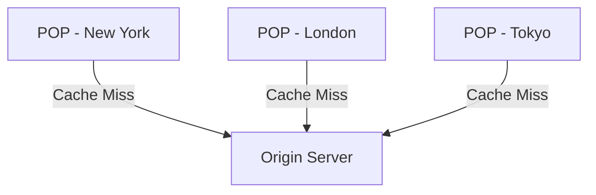
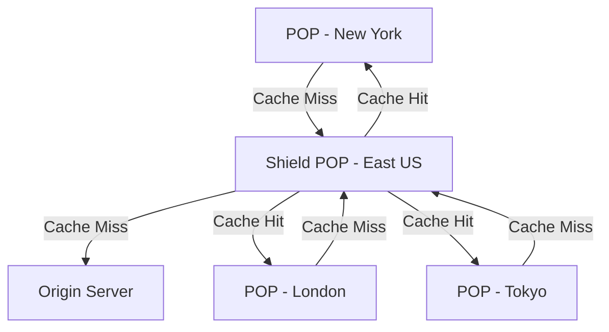

# How to Set Up Azure CDN Endpoint with Origin Shielding

Author: [nawazdhandala](https://www.github.com/nawazdhandala)

Tags: Azure, CDN, Origin Shielding, Caching, Performance, Content Delivery, Networking

Description: Learn how to configure Azure CDN with origin shielding to reduce origin load by adding a mid-tier caching layer between edge POPs and your origin server.

---

Azure CDN distributes content from edge Points of Presence (POPs) around the world. When a cache miss occurs at an edge POP, it fetches content from your origin server. Without origin shielding, every POP with a cache miss makes its own request to your origin. If your content expires from cache across 50 POPs simultaneously, your origin gets 50 requests for the same content at once.

Origin shielding adds a middle caching layer between the edge POPs and your origin. Instead of each POP going directly to the origin on a cache miss, they go to a designated shield POP first. If the shield already has the content, it serves it. If not, only the shield makes the request to the origin.

The result: your origin gets far fewer requests, especially for content that is requested globally.

## How Origin Shielding Works

Without origin shielding:



With origin shielding:



The shield POP absorbs cache misses from all edge POPs. Your origin only sees requests from the shield, dramatically reducing load.

## When to Use Origin Shielding

Origin shielding is especially valuable when:

- **Your origin has limited capacity.** Small servers or serverless origins that can be overwhelmed by concurrent requests.
- **Content has global reach.** Content requested from many POPs worldwide means many potential cache misses reaching the origin.
- **Cache TTLs are short.** Short TTLs mean frequent cache expiration and more origin requests.
- **Origin is expensive to call.** Dynamic content generation (image resizing, API aggregation) where each origin request is computationally expensive.

## Prerequisites

- An Azure CDN profile (Standard from Microsoft, Standard from Verizon, Premium from Verizon, or Azure Front Door)
- An origin server hosting your content
- Understanding of where most of your users are located (to choose the optimal shield location)

## Step 1: Create a CDN Profile and Endpoint

If you do not have one already, create a CDN profile:

```bash
# Create a CDN profile (using Microsoft Standard tier)
az cdn profile create \
  --resource-group myResourceGroup \
  --name myCDNProfile \
  --sku Standard_Microsoft \
  --location global

# Create a CDN endpoint pointing to your origin
az cdn endpoint create \
  --resource-group myResourceGroup \
  --profile-name myCDNProfile \
  --name myEndpoint \
  --origin myorigin.azurewebsites.net \
  --origin-host-header myorigin.azurewebsites.net
```

## Step 2: Enable Origin Shielding

Enable origin shielding on the origin, specifying the shield region:

```bash
# Enable origin shielding with East US as the shield region
az cdn origin update \
  --resource-group myResourceGroup \
  --profile-name myCDNProfile \
  --endpoint-name myEndpoint \
  --name myorigin-azurewebsites-net \
  --private-link-approval-message "" \
  --http-port 80 \
  --https-port 443 \
  --origin-host-header myorigin.azurewebsites.net
```

For Azure CDN from Verizon or Front Door profiles, you can specify origin shielding directly:

```bash
# For Azure Front Door Standard/Premium - enable origin shielding
az afd origin update \
  --resource-group myResourceGroup \
  --profile-name myFrontDoor \
  --origin-group-name myOriginGroup \
  --origin-name myOrigin \
  --enable-private-link false \
  --origin-host-header myorigin.azurewebsites.net \
  --http-port 80 \
  --https-port 443
```

When using Azure Front Door Standard/Premium, origin shielding is configured at the origin group level:

```bash
# Enable origin shielding on the origin group
az afd origin-group update \
  --resource-group myResourceGroup \
  --profile-name myFrontDoor \
  --origin-group-name myOriginGroup \
  --probe-protocol Https \
  --probe-path "/health" \
  --additional-latency-in-milliseconds 50
```

## Choosing the Shield Region

The shield region should be close to your origin server. If your origin is in East US, set the shield to East US. The idea is to minimize latency between the shield and origin since every cache miss at the shield results in a request to the origin.

Choosing a shield far from your origin adds unnecessary latency to every cache miss without any benefit.

Here are common shield region choices based on origin location:

| Origin Location | Recommended Shield Region |
|----------------|--------------------------|
| East US | East US |
| West Europe | West Europe |
| Southeast Asia | Southeast Asia |
| Central US | Central US |
| East Asia | East Asia |

## Configuring Caching Rules with Origin Shielding

Origin shielding works best when your caching rules are well-configured. Longer cache TTLs mean fewer cache misses reaching the shield, and fewer still reaching the origin.

```bash
# Set caching rules on the endpoint
az cdn endpoint rule add \
  --resource-group myResourceGroup \
  --profile-name myCDNProfile \
  --endpoint-name myEndpoint \
  --order 1 \
  --rule-name cacheImages \
  --match-variable UrlFileExtension \
  --operator Equal \
  --match-values "jpg" "png" "gif" "webp" "svg" \
  --action-name CacheExpiration \
  --cache-behavior Override \
  --cache-duration "7.00:00:00"
```

With a 7-day cache for images:
1. Edge POP gets request, has cache miss
2. Goes to shield POP, shield has cache miss
3. Shield goes to origin, gets the image
4. Shield caches for 7 days, serves to edge POP
5. Edge POP caches for 7 days
6. Next request to the same edge POP: served from edge cache
7. Request to a different edge POP: served from shield cache (no origin hit)

## Monitoring Origin Shielding Effectiveness

Track the impact of origin shielding by monitoring origin request counts and cache hit ratios:

Key metrics to watch:

- **Origin Request Count** - Should decrease after enabling origin shielding
- **Cache Hit Ratio** - Should increase (both edge and shield hits count)
- **Bandwidth** - Origin bandwidth consumption should drop

```bash
# Check CDN endpoint metrics
az monitor metrics list \
  --resource "/subscriptions/<sub-id>/resourceGroups/myResourceGroup/providers/Microsoft.Cdn/profiles/myCDNProfile/endpoints/myEndpoint" \
  --metric "RequestCount" \
  --interval PT1H \
  --aggregation Total \
  --output table
```

A healthy origin shielding setup shows a high edge cache hit ratio plus a significant reduction in origin requests compared to before shielding was enabled.

## Cost Considerations

Origin shielding adds an extra hop for cache misses, which means:

- Slightly higher latency for the first request (edge -> shield -> origin instead of edge -> origin)
- Additional data transfer between the shield POP and edge POPs
- But significantly reduced origin bandwidth and compute costs

For most workloads, the cost savings from reduced origin load outweigh the additional CDN data transfer costs. The math works especially well when your origin is expensive to operate (like dynamically generating content).

## Origin Shielding vs. Multiple Origins

Some teams try to reduce origin load by deploying multiple origin servers in different regions. This works but adds operational complexity. Origin shielding achieves similar results without additional origin infrastructure:

- **Multiple origins:** More servers to manage, content synchronization needed, higher infrastructure cost
- **Origin shielding:** Single origin, CDN handles the load reduction, simpler architecture

You can combine both approaches for maximum resilience: multiple origins behind the shield for failover, with origin shielding reducing the load on all of them.

## Best Practices

**Place the shield close to the origin.** Shield-to-origin latency affects every cache miss.

**Use appropriate cache TTLs.** Longer TTLs mean the shield and edge POPs serve more requests without going to the origin. Balance freshness requirements against origin load.

**Honor origin cache headers.** If your origin sets `Cache-Control: max-age=3600`, both the shield and edge POPs will respect it.

**Monitor cache hit ratios at both layers.** A low shield cache hit ratio might indicate that your content is too diverse to benefit from shielding, or your TTLs are too short.

**Purge carefully.** When you purge content, it is removed from both edge and shield caches, causing a burst of origin requests as content is re-fetched.

## Limitations

- Origin shielding adds latency for cache misses (one extra hop)
- Not all CDN SKUs support origin shielding - check your tier
- The shield itself can become a bottleneck for extremely high-traffic scenarios (rare, but possible)
- You cannot configure multiple shield regions per origin group

## Summary

Origin shielding is a straightforward way to reduce origin load by adding a mid-tier cache between edge POPs and your origin server. Enable it on your CDN endpoint, choose a shield region close to your origin, and pair it with sensible caching rules. Monitor origin request counts to verify the reduction. For content with global reach and moderate to short cache TTLs, origin shielding can reduce origin requests by 50-80%, leading to significant cost savings and better origin stability.
