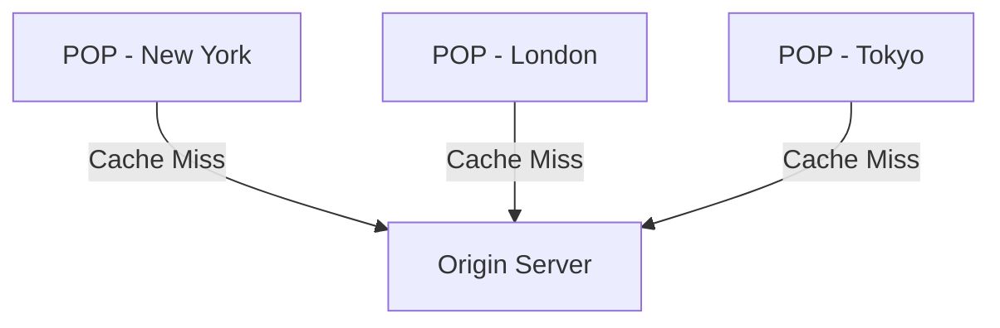
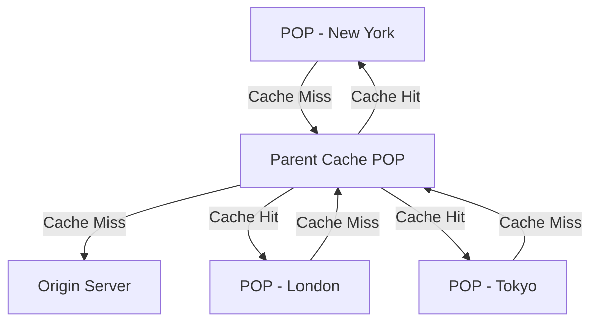

# How to Set Up Azure CDN Endpoint with Origin Shielding

Author: [nawazdhandala](https://www.github.com/nawazdhandala)

Tags: Azure, CDN, Origin Shielding, Caching, Performance, Content Delivery, Networking

Description: Learn how to configure Azure CDN with origin shielding to reduce origin load by adding a mid-tier caching layer between edge POPs and your origin server.

---

Azure Front Door distributes content from edge Points of Presence (POPs) around the world. When a cache miss occurs at an edge POP, it fetches content from your origin server. Without origin shielding, every POP with a cache miss makes its own request to your origin. If your content expires from cache across 50 POPs simultaneously, your origin can get many requests for the same content at once.

Origin shielding adds a middle caching layer between the edge POPs and your origin. Instead of each POP going directly to the origin on a cache miss, Azure Front Door can use parent cache POPs that communicate with origin servers and reduce origin load. If the parent cache already has the content, it serves it. If not, the request continues to the origin.

The result: your origin gets far fewer requests, especially for content that is requested globally.

## How Origin Shielding Works

Without origin shielding:


```mermaid
graph TD
    A[POP - New York] -->|Cache Miss| D[Origin Server]
    B[POP - London] -->|Cache Miss| D
    C[POP - Tokyo] -->|Cache Miss| D
```

With origin shielding:


```mermaid
graph TD
    A[POP - New York] -->|Cache Miss| E[Parent Cache POP]
    B[POP - London] -->|Cache Miss| E
    C[POP - Tokyo] -->|Cache Miss| E
    E -->|Cache Miss| D[Origin Server]
    E -->|Cache Hit| A
    E -->|Cache Hit| B
    E -->|Cache Hit| C
```

The parent cache POP absorbs some cache misses from edge POPs. Your origin sees fewer requests when the parent cache can satisfy them.

## When to Use Origin Shielding

Origin shielding is especially valuable when:

- **Your origin has limited capacity.** Small servers or serverless origins that can be overwhelmed by concurrent requests.
- **Content has global reach.** Content requested from many POPs worldwide means many potential cache misses reaching the origin.
- **Cache TTLs are short.** Short TTLs mean frequent cache expiration and more origin requests.
- **Origin is expensive to call.** Dynamic content generation (image resizing, API aggregation) where each origin request is computationally expensive.

## Prerequisites

- An Azure Front Door Standard or Premium profile
- An origin server hosting your content
- Cacheable content, such as static files or public responses with appropriate cache headers

## Step 1: Create a Front Door Profile and Endpoint

If you do not have one already, create an Azure Front Door profile, endpoint, origin group, origin, and route:

```bash
# Create a Front Door profile
az afd profile create \
  --resource-group myResourceGroup \
  --profile-name myFrontDoorProfile \
  --sku Standard_AzureFrontDoor

# Create a Front Door endpoint
az afd endpoint create \
  --resource-group myResourceGroup \
  --profile-name myFrontDoorProfile \
  --endpoint-name myEndpoint \
  --enabled-state Enabled

# Create an origin group
az afd origin-group create \
  --resource-group myResourceGroup \
  --profile-name myFrontDoorProfile \
  --origin-group-name myOriginGroup \
  --probe-request-type HEAD \
  --probe-protocol Https \
  --probe-path "/" \
  --probe-interval-in-seconds 60 \
  --sample-size 4 \
  --successful-samples-required 3 \
  --additional-latency-in-milliseconds 50

# Add your origin
az afd origin create \
  --resource-group myResourceGroup \
  --profile-name myFrontDoorProfile \
  --origin-group-name myOriginGroup \
  --origin-name myOrigin \
  --host-name myorigin.azurewebsites.net \
  --origin-host-header myorigin.azurewebsites.net \
  --priority 1 \
  --weight 1000 \
  --enabled-state Enabled \
  --http-port 80 \
  --https-port 443

# Create a cached route to the origin group
az afd route create \
  --resource-group myResourceGroup \
  --profile-name myFrontDoorProfile \
  --endpoint-name myEndpoint \
  --route-name defaultRoute \
  --origin-group myOriginGroup \
  --supported-protocols Http Https \
  --patterns-to-match "/*" \
  --forwarding-protocol MatchRequest \
  --https-redirect Enabled \
  --link-to-default-domain Enabled \
  --enable-caching true \
  --query-string-caching-behavior IgnoreQueryString
```

## Step 2: Enable Caching

Azure Front Door origin shield is not a separate setting that you enable on an origin, and you do not choose a shield region. Origin shield behavior depends on Azure Front Door caching. Make sure caching is enabled on the route:

```bash
# Enable caching on an existing route
az afd route update \
  --resource-group myResourceGroup \
  --profile-name myFrontDoorProfile \
  --endpoint-name myEndpoint \
  --route-name defaultRoute \
  --enable-caching true \
  --query-string-caching-behavior IgnoreQueryString
```

You can also confirm that the origin itself is enabled and using the expected host header:

```bash
# Update origin host settings
az afd origin update \
  --resource-group myResourceGroup \
  --profile-name myFrontDoorProfile \
  --origin-group-name myOriginGroup \
  --origin-name myOrigin \
  --origin-host-header myorigin.azurewebsites.net \
  --http-port 80 \
  --https-port 443 \
  --enabled-state Enabled
```

Origin group settings control health probes and load-balancing behavior, not origin shielding. Keep those settings tuned for your origin:

```bash
# Update health probe and load-balancing settings
az afd origin-group update \
  --resource-group myResourceGroup \
  --profile-name myFrontDoorProfile \
  --origin-group-name myOriginGroup \
  --probe-protocol Https \
  --probe-path "/health" \
  --additional-latency-in-milliseconds 50
```

## Choosing the Origin Location

Azure Front Door does not expose a setting to choose the origin shield region. Instead, place your origin where it can be reached reliably from Azure Front Door and keep origin latency low. Every miss that is not served from an edge or parent cache still results in a request to the origin.

Choosing an origin far from the users and Front Door POPs that miss cache adds unnecessary latency to cache misses without any benefit.

Here are common origin placement choices based on workload location:

| Workload Location | Recommended Origin Region |
|------------------|---------------------------|
| Eastern United States | East US |
| Western Europe | West Europe |
| Southeast Asia | Southeast Asia |
| Central United States | Central US |
| East Asia | East Asia |

## Configuring Caching Rules with Origin Shielding

Origin shielding works best when your caching rules are well-configured. Longer cache TTLs mean fewer cache misses reaching the parent cache, and fewer still reaching the origin.

```bash
# Enable caching and compression on the route
az afd route update \
  --resource-group myResourceGroup \
  --profile-name myFrontDoorProfile \
  --endpoint-name myEndpoint \
  --route-name defaultRoute \
  --enable-caching true \
  --enable-compression true \
  --query-string-caching-behavior IgnoreQueryString
```

With cacheable images that return a long `Cache-Control` TTL:
1. Edge POP gets request, has cache miss
2. Goes to parent cache POP, parent cache has cache miss
3. Parent cache goes to origin, gets the image
4. Parent cache stores the image and serves it to edge POP
5. Edge POP caches the image
6. Next request to the same edge POP: served from edge cache
7. Request to a different edge POP: may be served from parent cache (no origin hit)

## Monitoring Origin Shielding Effectiveness

Track the impact of origin shielding by monitoring origin request counts, cache hit ratios, and Front Door access logs:

Key metrics to watch:

- **Origin Request Count** - Should decrease after caching becomes effective
- **Cache Hit Ratio** - Should increase
- **Access logs** - Requests served by origin shield have `isReceivedFromClient` set to `false`
- **Bandwidth** - Origin bandwidth consumption should drop

```bash
# Check Front Door request metrics
az monitor metrics list \
  --resource "/subscriptions/<sub-id>/resourceGroups/myResourceGroup/providers/Microsoft.Cdn/profiles/myFrontDoorProfile" \
  --metric "RequestCount" \
  --interval PT1H \
  --aggregation Total \
  --output table
```

In Log Analytics, you can filter Front Door access logs to compare client-facing edge entries and origin shield entries:

```kusto
AzureDiagnostics
| where Category == "FrontdoorAccessLog"
| summarize Requests=count() by isReceivedFromClient_b, cacheStatus_s
```

A healthy origin shielding setup shows a high cache hit ratio plus a significant reduction in origin requests compared to before caching was enabled.

## Cost Considerations

Origin shielding adds an extra hop for cache misses, which means:

- Slightly higher latency for the first request (edge -> parent cache -> origin instead of edge -> origin)
- But significantly reduced origin bandwidth and compute costs

For many cacheable workloads, the cost savings from reduced origin load outweigh the added cache layer. The math works especially well when your origin is expensive to operate (like dynamically generating content).

## Origin Shielding vs. Multiple Origins

Some teams try to reduce origin load by deploying multiple origin servers in different regions. This works but adds operational complexity. Origin shielding achieves similar results without additional origin infrastructure:

- **Multiple origins:** More servers to manage, content synchronization needed, higher infrastructure cost
- **Origin shielding:** Single origin, Azure Front Door handles the load reduction, simpler architecture

You can combine both approaches for maximum resilience: multiple origins in an origin group for failover, with caching and origin shielding reducing the load on them.

## Best Practices

**Place the origin thoughtfully.** Origin latency affects every cache miss that is not served from an edge or parent cache.

**Use appropriate cache TTLs.** Longer TTLs mean the parent cache and edge POPs serve more requests without going to the origin. Balance freshness requirements against origin load.

**Honor origin cache headers.** If your origin sets `Cache-Control: max-age=3600`, Front Door uses it when caching is enabled. Front Door also honors `private`, `no-cache`, and `no-store` by not caching those responses.

**Monitor cache status in access logs.** A low parent-cache hit ratio might indicate that your content is too diverse to benefit from shielding, or your TTLs are too short.

**Purge carefully.** When you purge content, it is removed from edge and parent caches, causing a burst of origin requests as content is re-fetched.

## Limitations

- Origin shielding adds latency for some cache misses (one extra hop)
- Origin shield is not a user-configurable region setting in Azure Front Door
- Cached content can be evicted before its TTL if it is not frequently used
- Only cacheable requests and responses benefit from the caching layer

## Summary

Origin shielding is a straightforward way to reduce origin load by adding a mid-tier cache between edge POPs and your origin server. Use Azure Front Door Standard or Premium, enable caching on your route, and pair it with sensible cache headers. Monitor origin request counts, cache status, and `isReceivedFromClient` values in access logs to verify the reduction. For cacheable content with global reach, origin shielding can lead to significant cost savings and better origin stability.
