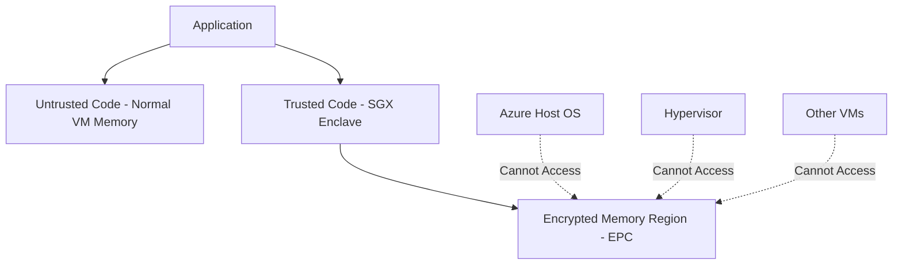

# How to Set Up Azure Confidential Computing with DCsv3 Virtual Machines for Data-in-Use Protection

Author: [nawazdhandala](https://www.github.com/nawazdhandala)

Tags: Azure Confidential Computing, DCsv3, Intel SGX, Data Protection, Encryption, Trusted Execution, Security

Description: Step-by-step guide to deploying DCsv3 confidential computing VMs in Azure with Intel SGX enclaves for protecting data while it is being processed.

---

Encryption at rest and encryption in transit are standard practices. But what about data while it is being processed? When your application loads sensitive data into memory for computation, it is typically available in plaintext. Anyone with access to the host machine - whether a rogue administrator, a compromised hypervisor, or a sophisticated attacker - could potentially read that data from memory.

Azure Confidential Computing addresses this gap by running your workloads inside hardware-based Trusted Execution Environments (TEEs). The DCsv3 series virtual machines use Intel Software Guard Extensions (SGX) to create isolated memory regions called enclaves. Data inside an enclave is encrypted in memory and can only be decrypted by code running inside that enclave. Not even Azure operators or the hypervisor can read it.

This guide covers how to deploy DCsv3 VMs, develop enclave applications, and verify the integrity of your confidential computing environment.

## Understanding the DCsv3 Architecture

DCsv3 VMs are based on 3rd Generation Intel Xeon Scalable processors with Intel SGX support. The key component is the Enclave Page Cache (EPC), which is a dedicated region of encrypted memory that the CPU manages.



The CPU encrypts data as it enters the EPC and decrypts it only when the enclave code accesses it. This hardware-level isolation means that even if someone dumps the physical memory of the server, they will only see encrypted data for the enclave region.

## DCsv3 VM Sizes

The DCsv3 series offers multiple sizes with varying amounts of EPC memory.

| Size | vCPUs | Memory (GiB) | EPC Memory (GiB) | Use Case |
|---|---|---|---|---|
| Standard_DC1s_v3 | 1 | 8 | 4 | Development and testing |
| Standard_DC2s_v3 | 2 | 16 | 8 | Small workloads |
| Standard_DC4s_v3 | 4 | 32 | 16 | Medium workloads |
| Standard_DC8s_v3 | 8 | 64 | 32 | Data analytics |
| Standard_DC16s_v3 | 16 | 128 | 64 | Large databases |
| Standard_DC32s_v3 | 32 | 256 | 128 | Enterprise workloads |

The EPC memory is the critical factor. Your enclave application's sensitive data and code must fit within the EPC. If it exceeds the EPC size, performance degrades significantly due to EPC paging.

## Prerequisites

- An Azure subscription with access to confidential computing VM sizes (available in specific regions like East US, West Europe, and UK South)
- Familiarity with Linux (DCsv3 VMs run best with Ubuntu 20.04 or 22.04)
- Basic understanding of C/C++ development (SGX development uses these languages, though higher-level frameworks are available)

## Step 1: Deploy a DCsv3 Virtual Machine

Create a DCsv3 VM using the Azure CLI. Use an Ubuntu image that has the SGX drivers pre-installed.

```bash
# Create a resource group in a region that supports confidential computing
az group create \
  --name confidential-rg \
  --location eastus

# Deploy a DCsv3 VM with Ubuntu 22.04
az vm create \
  --resource-group confidential-rg \
  --name confidential-vm \
  --size Standard_DC4s_v3 \
  --image Canonical:0001-com-ubuntu-confidential-vm-jammy:22_04-lts-cvm:latest \
  --admin-username azureuser \
  --generate-ssh-keys \
  --security-type ConfidentialVM \
  --os-disk-security-encryption-type VMGuestStateOnly \
  --public-ip-sku Standard
```

After the VM is created, SSH into it and verify SGX support.

```bash
# SSH into the VM
ssh azureuser@<public-ip>

# Check if SGX is available
dmesg | grep -i sgx

# Verify the SGX driver is loaded
ls -la /dev/sgx*
```

You should see `/dev/sgx_enclave` and `/dev/sgx_provision` devices, confirming that SGX is available.

## Step 2: Install the SGX SDK and Development Tools

Install the Intel SGX SDK, which provides the tools and libraries needed to develop enclave applications.

```bash
# Add the Intel SGX repository
echo 'deb [arch=amd64] https://download.01.org/intel-sgx/sgx_repo/ubuntu jammy main' | \
    sudo tee /etc/apt/sources.list.d/intel-sgx.list

# Add the Intel GPG key
wget -qO - https://download.01.org/intel-sgx/sgx_repo/ubuntu/intel-sgx-deb.key | \
    sudo apt-key add -

# Update and install the SGX packages
sudo apt-get update
sudo apt-get install -y \
    libsgx-enclave-common \
    libsgx-dcap-ql \
    libsgx-dcap-ql-dev \
    libsgx-dcap-default-qpl \
    libsgx-urts \
    sgx-aesm-service \
    libsgx-aesm-launch-plugin

# Install the Intel SGX SDK
wget https://download.01.org/intel-sgx/latest/linux-latest/distro/ubuntu22.04-server/sgx_linux_x64_sdk_2.22.100.3.bin
chmod +x sgx_linux_x64_sdk_2.22.100.3.bin
sudo ./sgx_linux_x64_sdk_2.22.100.3.bin --prefix=/opt/intel

# Source the SDK environment
source /opt/intel/sgxsdk/environment
```

## Step 3: Build a Simple Enclave Application

An SGX application has two parts: the untrusted part (runs in normal memory) and the trusted part (runs inside the enclave). Communication between them happens through defined interfaces called ECALLs (calls into the enclave) and OCALLs (calls out of the enclave).

Here is a simple example that processes sensitive data inside an enclave.

Create the enclave definition file that specifies the interface.

```c
/* Enclave.edl - Enclave Definition Language file */
/* Defines the interface between trusted and untrusted code */
enclave {
    trusted {
        /* ECALL: Process sensitive data inside the enclave */
        public int process_sensitive_data(
            [in, size=data_len] const uint8_t* encrypted_data,
            size_t data_len,
            [out, size=result_len] uint8_t* result,
            size_t result_len
        );
    };

    untrusted {
        /* OCALL: Write results to a file (outside the enclave) */
        void write_result_to_file(
            [in, string] const char* filename,
            [in, size=data_len] const uint8_t* data,
            size_t data_len
        );
    };
};
```

Now implement the trusted enclave code.

```c
/* Enclave.c - Trusted code that runs inside the SGX enclave */
#include "Enclave_t.h"  /* Auto-generated from the EDL file */
#include <string.h>
#include <sgx_tcrypto.h>

/* This function runs inside the encrypted enclave memory */
int process_sensitive_data(const uint8_t* encrypted_data, size_t data_len,
                           uint8_t* result, size_t result_len) {
    /* Decrypt the input data using a key that only the enclave knows */
    uint8_t decrypted[1024];
    sgx_aes_gcm_128bit_key_t key = {0}; /* In production, derive from sealed data */

    /* Process the decrypted data - this is where your business logic goes */
    /* The decrypted data never leaves the enclave memory */

    /* Prepare the result (encrypted before leaving the enclave) */
    memset(result, 0, result_len);

    return 0; /* Success */
}
```

And the untrusted host application.

```c
/* App.c - Untrusted code that manages the enclave lifecycle */
#include <stdio.h>
#include <sgx_urts.h>
#include "Enclave_u.h"  /* Auto-generated from the EDL file */

#define ENCLAVE_FILE "enclave.signed.so"

int main() {
    sgx_enclave_id_t enclave_id;
    sgx_status_t ret;

    /* Create (initialize) the enclave */
    ret = sgx_create_enclave(ENCLAVE_FILE, SGX_DEBUG_FLAG, NULL, NULL, &enclave_id, NULL);
    if (ret != SGX_SUCCESS) {
        printf("Failed to create enclave: 0x%x\n", ret);
        return 1;
    }
    printf("Enclave created successfully (ID: %lu)\n", enclave_id);

    /* Prepare sensitive data to send into the enclave */
    uint8_t sensitive_data[] = "Credit card: 4111-1111-1111-1111";
    uint8_t result[256] = {0};
    int ecall_return;

    /* Call into the enclave to process the data */
    ret = process_sensitive_data(enclave_id, &ecall_return,
                                 sensitive_data, sizeof(sensitive_data),
                                 result, sizeof(result));

    if (ret == SGX_SUCCESS && ecall_return == 0) {
        printf("Data processed successfully inside enclave\n");
    }

    /* Destroy the enclave when done */
    sgx_destroy_enclave(enclave_id);
    return 0;
}
```

## Step 4: Use Open Enclave SDK for Simplified Development

The Intel SGX SDK is powerful but low-level. For many use cases, the Open Enclave SDK provides a simpler development experience and supports multiple TEE technologies.

```bash
# Install the Open Enclave SDK
sudo apt-get install -y open-enclave

# Verify the installation
/opt/openenclave/bin/oeedger8r --version
```

Open Enclave also supports higher-level languages through frameworks like EGo (for Go) and Gramine (for running unmodified Linux applications in enclaves).

## Step 5: Remote Attestation

Attestation is how you verify that your code is actually running inside a genuine SGX enclave on real hardware. Without attestation, there is no way to prove that the enclave has not been tampered with.

Azure provides the Microsoft Azure Attestation (MAA) service for this purpose.

```bash
# Create an Azure Attestation provider
az attestation create \
  --resource-group confidential-rg \
  --name contosoattestation \
  --location eastus

# Get the attestation endpoint
az attestation show \
  --resource-group confidential-rg \
  --name contosoattestation \
  --query 'attestUri'
```

Your enclave application generates a quote (a hardware-signed report of its identity) and sends it to MAA for verification. MAA validates the quote against Intel's attestation infrastructure and returns a signed token confirming that the enclave is legitimate.

```python
# Python example of remote attestation verification
import requests

# The enclave generates a quote and sends it to the client
# The client submits the quote to Azure Attestation for verification
attestation_url = "https://contosoattestation.eus.attest.azure.net"

response = requests.post(
    f"{attestation_url}/attest/SgxEnclave?api-version=2022-08-01",
    json={
        "quote": enclave_quote_base64,  # Base64-encoded SGX quote
        "runtimeData": {
            "data": runtime_data_base64,  # Application-specific data
            "dataType": "Binary"
        }
    },
    headers={"Content-Type": "application/json"}
)

# The response contains a signed JWT with the attestation result
attestation_token = response.json().get("token")
print(f"Attestation result: {attestation_token}")
```

## Step 6: Confidential Containers Alternative

If you prefer containers over VMs, Azure also supports confidential containers on AKS with Intel SGX support. This lets you run enclave workloads without managing VMs directly.

```bash
# Create an AKS cluster with confidential computing node pool
az aks create \
  --resource-group confidential-rg \
  --name confidential-aks \
  --node-count 1 \
  --generate-ssh-keys

# Add a confidential computing node pool with DCsv3 VMs
az aks nodepool add \
  --resource-group confidential-rg \
  --cluster-name confidential-aks \
  --name sgxpool \
  --node-vm-size Standard_DC4s_v3 \
  --node-count 2
```

## Wrapping Up

Azure Confidential Computing with DCsv3 VMs closes the last gap in data protection by encrypting data while it is being processed. The SGX enclaves provide hardware-level isolation that prevents even privileged users and the cloud platform itself from accessing your sensitive data. Start with a DCsv3 VM, install the SGX SDK, build a simple enclave application, and use Azure Attestation to verify its integrity. For organizations handling highly regulated data - financial transactions, healthcare records, or classified information - confidential computing provides a level of protection that no software-only solution can match.
