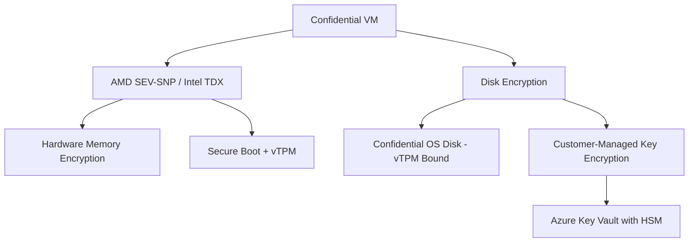

# How to Set Up Azure Confidential VMs with Customer-Managed Keys for Full Disk Encryption

Author: [nawazdhandala](https://www.github.com/nawazdhandala)

Tags: Azure, Confidential Computing, Confidential VMs, Customer-Managed Keys, Disk Encryption, Key Vault, Security

Description: Step-by-step guide to deploying Azure Confidential VMs with customer-managed keys for full disk encryption, ensuring your data is protected even from the cloud provider.

---

Azure Confidential VMs take data protection to a level that was not possible with traditional cloud VMs. They use hardware-based trusted execution environments (AMD SEV-SNP or Intel TDX) to encrypt the entire VM's memory and state, protecting your workload not just from external attackers but also from the cloud infrastructure operator. When you add customer-managed keys (CMK) for disk encryption on top of this, you get a complete encryption story where you control the keys and the hardware protects the runtime.

In this post, I will walk through deploying a Confidential VM with customer-managed keys for the OS disk and data disks, covering the Key Vault setup, disk encryption set, and VM deployment.

## What Makes Confidential VMs Different

Standard Azure VMs encrypt disks at rest using platform-managed or customer-managed keys, but the data is decrypted in memory during processing. Anyone with access to the host infrastructure could theoretically read the VM's memory.

Confidential VMs add hardware-level memory encryption. The processor encrypts the VM's memory with keys that are unique to the VM and inaccessible to the hypervisor, host OS, and Azure operators. Combined with Secure Boot and vTPM (virtual Trusted Platform Module), you get:

- **Memory encryption** - VM memory is encrypted by the CPU. The hypervisor cannot read it.
- **Secure Boot** - Verifies the boot chain to prevent tampering with the OS.
- **vTPM** - Provides a hardware root of trust for measured boot and key sealing.
- **Confidential disk encryption** - OS disk is encrypted with keys tied to the vTPM, so the disk can only be decrypted on that specific VM.



## Step 1: Set Up the Key Vault with HSM-Backed Keys

For Confidential VMs, the customer-managed key should be stored in a Key Vault with the Premium SKU (which uses HSM-backed keys) or in an Azure Key Vault Managed HSM.

This creates a Key Vault with HSM-backed key support and purge protection:

```bash
# Create a resource group for the confidential VM resources
RG="rg-confidential-vms"
LOCATION="eastus"
az group create --name $RG --location $LOCATION

# Create a Key Vault with Premium SKU for HSM-backed keys
# Purge protection is required for disk encryption scenarios
az keyvault create \
  --name kv-confidential-cmk \
  --resource-group $RG \
  --location $LOCATION \
  --sku Premium \
  --enable-rbac-authorization true \
  --enable-purge-protection true \
  --retention-days 90

# Get the Key Vault resource ID for later use
KV_ID=$(az keyvault show \
  --name kv-confidential-cmk \
  --resource-group $RG \
  --query id -o tsv)
```

## Step 2: Create the Customer-Managed Encryption Key

Create an RSA key in the Key Vault that will be used for disk encryption. For Confidential VM disk encryption, you need a specific key type.

This creates an RSA-HSM key for confidential disk encryption:

```bash
# Create an RSA-HSM key for disk encryption
# The key size must be 3072 or 4096 for confidential disk encryption
az keyvault key create \
  --vault-name kv-confidential-cmk \
  --name cvm-disk-encryption-key \
  --kty RSA-HSM \
  --size 4096 \
  --ops wrapKey unwrapKey

# Get the key URL (versioned) for the disk encryption set
KEY_URL=$(az keyvault key show \
  --vault-name kv-confidential-cmk \
  --name cvm-disk-encryption-key \
  --query "key.kid" -o tsv)

echo "Key URL: $KEY_URL"
```

## Step 3: Create the Disk Encryption Set

A Disk Encryption Set (DES) links the encryption key in Key Vault to the disks that will use it. For Confidential VMs, you need a specific encryption type.

This creates a Disk Encryption Set configured for confidential disk encryption:

```bash
# Create a Disk Encryption Set with ConfidentialVmEncryptedWithCustomerKey type
az disk-encryption-set create \
  --name des-confidential-cmk \
  --resource-group $RG \
  --location $LOCATION \
  --key-url "$KEY_URL" \
  --source-vault "$KV_ID" \
  --encryption-type ConfidentialVmEncryptedWithCustomerKey

# Get the DES resource ID and identity
DES_ID=$(az disk-encryption-set show \
  --name des-confidential-cmk \
  --resource-group $RG \
  --query id -o tsv)

DES_IDENTITY=$(az disk-encryption-set show \
  --name des-confidential-cmk \
  --resource-group $RG \
  --query "identity.principalId" -o tsv)

echo "DES ID: $DES_ID"
echo "DES Identity: $DES_IDENTITY"
```

## Step 4: Grant Key Vault Access to the Disk Encryption Set

The Disk Encryption Set's managed identity needs permission to use the encryption key in Key Vault.

This grants the necessary Key Vault permissions:

```bash
# Grant the DES managed identity the Crypto Service Encryption User role
# This allows it to wrap and unwrap keys for disk encryption
az role assignment create \
  --assignee-object-id "$DES_IDENTITY" \
  --assignee-principal-type ServicePrincipal \
  --role "Key Vault Crypto Service Encryption User" \
  --scope "$KV_ID"

# Alternatively, if using access policies instead of RBAC:
# az keyvault set-policy \
#   --name kv-confidential-cmk \
#   --object-id "$DES_IDENTITY" \
#   --key-permissions wrapKey unwrapKey get
```

## Step 5: Deploy the Confidential VM

Now deploy the Confidential VM with the disk encryption set. You need to use a Confidential VM-capable VM size (like the DCasv5 or ECasv5 series) and a supported OS image.

This creates a Confidential VM with confidential OS disk encryption using the customer-managed key:

```bash
# Deploy the Confidential VM
# Using DCas_v5 series which supports AMD SEV-SNP
az vm create \
  --name cvm-production-01 \
  --resource-group $RG \
  --location $LOCATION \
  --size Standard_DC4as_v5 \
  --image "Canonical:0001-com-ubuntu-confidential-vm-jammy:22_04-lts-cvm:latest" \
  --admin-username azureadmin \
  --generate-ssh-keys \
  --os-disk-encryption-set "$DES_ID" \
  --os-disk-security-encryption-type DiskWithVMGuestState \
  --security-type ConfidentialVM \
  --enable-secure-boot true \
  --enable-vtpm true \
  --public-ip-sku Standard

echo "Confidential VM deployed successfully"
```

Let me break down the key parameters:

- `--size Standard_DC4as_v5` - A Confidential VM-capable size with AMD SEV-SNP.
- `--os-disk-encryption-set` - Links the OS disk to our customer-managed key.
- `--os-disk-security-encryption-type DiskWithVMGuestState` - Encrypts both the disk content and the VM guest state (vTPM state, UEFI variables).
- `--security-type ConfidentialVM` - Enables the confidential computing features.
- `--enable-secure-boot true` - Enables UEFI Secure Boot.
- `--enable-vtpm true` - Enables the virtual TPM.

## Step 6: Add Encrypted Data Disks

If your workload needs additional data disks, add them with the same encryption configuration.

This creates and attaches an encrypted data disk:

```bash
# Create an encrypted managed disk
az disk create \
  --name disk-data-01 \
  --resource-group $RG \
  --location $LOCATION \
  --size-gb 256 \
  --sku Premium_LRS \
  --disk-encryption-set "$DES_ID" \
  --security-type ConfidentialVM_DiskEncryptedWithCustomerKey \
  --hyper-v-generation V2

# Attach the data disk to the VM
az vm disk attach \
  --vm-name cvm-production-01 \
  --resource-group $RG \
  --name disk-data-01 \
  --lun 0
```

## Step 7: Verify the Confidential VM Configuration

After deployment, verify that all the security features are correctly configured.

This script checks the VM's security settings:

```bash
# Verify the VM's security profile
az vm show \
  --name cvm-production-01 \
  --resource-group $RG \
  --query "{
    securityType: securityProfile.securityType,
    secureBoot: securityProfile.uefiSettings.secureBootEnabled,
    vTPM: securityProfile.uefiSettings.vTpmEnabled,
    encryptionAtHost: securityProfile.encryptionAtHost
  }" -o json

# Check the OS disk encryption configuration
az vm show \
  --name cvm-production-01 \
  --resource-group $RG \
  --query "{
    osDiskEncryptionSet: storageProfile.osDisk.managedDisk.diskEncryptionSet.id,
    securityEncryptionType: storageProfile.osDisk.managedDisk.securityProfile.securityEncryptionType
  }" -o json
```

You can also verify the attestation from inside the VM. SSH into the VM and use the attestation client:

```bash
# Inside the Confidential VM, request an attestation report
# This proves the VM is running in a genuine confidential computing environment
curl -H "Metadata: true" \
  "http://169.254.169.254/metadata/THIM/amd/certification" \
  -s | python3 -m json.tool
```

## Step 8: Set Up Key Rotation

Customer-managed keys should be rotated periodically. When you rotate the key in Key Vault, the Disk Encryption Set needs to be updated to use the new key version.

This creates a new key version and updates the DES:

```bash
# Create a new version of the encryption key
NEW_KEY_URL=$(az keyvault key create \
  --vault-name kv-confidential-cmk \
  --name cvm-disk-encryption-key \
  --kty RSA-HSM \
  --size 4096 \
  --ops wrapKey unwrapKey \
  --query "key.kid" -o tsv)

# Update the Disk Encryption Set to use the new key version
az disk-encryption-set update \
  --name des-confidential-cmk \
  --resource-group $RG \
  --key-url "$NEW_KEY_URL"

echo "Key rotated. Disks will re-encrypt with the new key version."
```

The re-encryption happens in the background and does not require VM downtime. The old key version remains needed until the re-encryption completes, so do not delete it from Key Vault.

You can also enable automatic key rotation on the DES:

```bash
# Enable automatic key rotation
az disk-encryption-set update \
  --name des-confidential-cmk \
  --resource-group $RG \
  --enable-auto-key-rotation true
```

## Available VM Sizes for Confidential VMs

Not all VM sizes support confidential computing. Here are the main families:

- **DCasv5 / DCadsv5** - AMD SEV-SNP, general purpose. Good for most workloads.
- **ECasv5 / ECadsv5** - AMD SEV-SNP, memory-optimized. Good for databases and in-memory analytics.
- **DCesv5 / DCedsv5** - Intel TDX, general purpose.
- **ECesv5 / ECedsv5** - Intel TDX, memory-optimized.

Check availability in your target region:

```bash
# List available Confidential VM sizes in a region
az vm list-sizes \
  --location eastus \
  --query "[?contains(name,'DC') || contains(name,'EC')].{name:name, cores:numberOfCores, memoryGB:memoryInMB}" \
  -o table
```

## Cost Considerations

Confidential VMs are priced at a premium compared to standard VMs of similar size. The premium varies but is typically 10-30% higher. Additionally:

- Premium Key Vault (HSM-backed keys) costs more than Standard Key Vault.
- Managed HSM is even more expensive if you choose that option for key storage.
- The disk encryption set itself is free, but the encrypted disks may have slightly higher I/O latency.

For workloads that genuinely require confidential computing (processing sensitive financial data, healthcare records, personally identifiable information, or running multi-party computation), the premium is justified by the additional security guarantees.

## Wrapping Up

Azure Confidential VMs with customer-managed keys give you the strongest possible encryption posture in the public cloud. The hardware encrypts the VM's memory, Secure Boot verifies the boot chain, the vTPM provides a hardware root of trust, and your customer-managed key ensures you control the disk encryption. This means your data is protected at rest, in transit, and - critically - in use, even from the cloud provider's infrastructure. The setup involves a few more steps than a standard VM deployment, but for workloads that handle your most sensitive data, it is the right approach.
