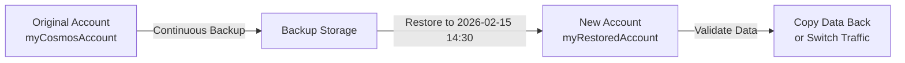

# How to Set Up Azure Cosmos DB Continuous Backup and Point-in-Time Restore

Author: [nawazdhandala](https://www.github.com/nawazdhandala)

Tags: Azure, Cosmos DB, Continuous Backup, Point-in-Time Restore, Disaster Recovery, Data Protection

Description: Configure continuous backup on Azure Cosmos DB and use point-in-time restore to recover data from any moment within your retention window.

---

Accidental deletions happen. A bad deployment wipes a container. A script with a bug corrupts thousands of documents. Someone drops the wrong database. With Azure Cosmos DB continuous backup, you can restore your data to any point in time within the last 7 or 30 days, down to the second. No more worrying about scheduled backup windows or restoring from hours-old snapshots. This guide covers how to set it up, perform restores, and understand the limitations.

## Continuous vs Periodic Backup

Cosmos DB offers two backup modes:

### Periodic Backup (Default)

- Takes full backups at configurable intervals (minimum every 1 hour)
- Keeps backups for a configurable retention period
- Restore requires contacting Azure support
- Restores the entire account, not individual containers

### Continuous Backup

- Continuously captures changes as they happen
- Restore to any point in time within the retention window
- Self-service restore through Portal, CLI, or SDK
- Can restore individual containers or databases
- Two tiers: 7-day retention and 30-day retention

Continuous backup is the clear winner for operational recovery. Periodic backup is mainly useful for compliance scenarios where you need long-term archival.

## Enabling Continuous Backup

### On a New Account

```bash
# Create a new Cosmos DB account with continuous backup (30-day retention)
az cosmosdb create \
    --name myCosmosAccount \
    --resource-group myResourceGroup \
    --locations regionName=eastus failoverPriority=0 \
    --backup-policy-type Continuous \
    --continuous-tier Continuous30Days \
    --default-consistency-level Session
```

The `--continuous-tier` parameter accepts:
- `Continuous7Days` - 7 days of point-in-time restore capability
- `Continuous30Days` - 30 days of point-in-time restore capability

### On an Existing Account

You can migrate from periodic to continuous backup:

```bash
# Migrate an existing account from periodic to continuous backup
az cosmosdb update \
    --name myCosmosAccount \
    --resource-group myResourceGroup \
    --backup-policy-type Continuous \
    --continuous-tier Continuous30Days
```

This migration is one-way. Once you switch to continuous backup, you cannot go back to periodic.

### Using the .NET SDK

```csharp
// Check if continuous backup is enabled on your account
using Microsoft.Azure.Management.CosmosDB;
using Microsoft.Azure.Management.CosmosDB.Models;

CosmosDBManagementClient managementClient = new CosmosDBManagementClient(credentials)
{
    SubscriptionId = subscriptionId
};

// Get the account properties
DatabaseAccountGetResults account = await managementClient.DatabaseAccounts.GetAsync(
    resourceGroupName, accountName);

// Check backup policy
if (account.BackupPolicy is ContinuousModeBackupPolicy continuousPolicy)
{
    Console.WriteLine($"Continuous backup enabled");
    Console.WriteLine($"Tier: {continuousPolicy.ContinuousModeProperties.Tier}");
}
else
{
    Console.WriteLine("Periodic backup - consider migrating to continuous");
}
```

## Performing a Point-in-Time Restore

When disaster strikes, you restore to a new account. The original account remains untouched.

### Using Azure CLI

```bash
# Restore the entire account to a point in time
# This creates a new Cosmos DB account with the restored data
az cosmosdb restore \
    --target-database-account-name myCosmosAccountRestored \
    --account-name myCosmosAccount \
    --resource-group myResourceGroup \
    --restore-timestamp "2026-02-15T14:30:00Z" \
    --location eastus
```

### Restoring Specific Databases or Containers

You do not have to restore everything. Target specific databases or containers:

```bash
# Restore only specific databases and containers
az cosmosdb restore \
    --target-database-account-name myRestoredAccount \
    --account-name myCosmosAccount \
    --resource-group myResourceGroup \
    --restore-timestamp "2026-02-15T14:30:00Z" \
    --location eastus \
    --databases-to-restore name=mydb collections=orders collections=customers \
    --databases-to-restore name=analyticsdb collections=events
```

This is extremely useful when only one container was affected - you do not need to restore everything.

### Using Azure Portal

1. Navigate to your Cosmos DB account
2. Click on "Point in Time Restore" under Settings
3. Select the target restore timestamp using the date and time picker
4. Choose which databases and containers to restore
5. Specify a name for the new restored account
6. Click Restore

The portal shows the earliest and latest restorable timestamps, making it easy to pick the right point in time.

## Understanding the Restore Process

The restore process creates a completely new Cosmos DB account. Here is the flow:



After the restore completes:

1. Verify the restored data in the new account
2. Either copy the needed data back to the original account, or switch your application to the restored account
3. Delete the old account when you are done (or keep it for reference)

Restore times depend on the data size:
- Small containers (< 10 GB): Minutes
- Medium containers (10-100 GB): 30 minutes to a few hours
- Large containers (100+ GB): Several hours

## Checking Restore Status

Monitor the progress of an ongoing restore:

```bash
# Check the status of a restore operation
az cosmosdb show \
    --name myRestoredAccount \
    --resource-group myResourceGroup \
    --query "provisioningState"

# Get detailed restore info
az cosmosdb show \
    --name myRestoredAccount \
    --resource-group myResourceGroup \
    --query "restoreParameters"
```

## Finding the Right Restore Point

If you are not sure exactly when the problem occurred, you can narrow it down:

```bash
# Get the earliest and latest restorable timestamps
az cosmosdb restorable-database-account list \
    --account-name myCosmosAccount \
    --query "[0].{earliest: oldestRestorableTime, latest: creationTime}"

# List all restorable databases for the account
az cosmosdb sql restorable-database list \
    --instance-id YOUR_INSTANCE_ID \
    --location eastus

# List all restorable containers within a database
az cosmosdb sql restorable-container list \
    --instance-id YOUR_INSTANCE_ID \
    --database-rid DATABASE_RID \
    --location eastus
```

## What Gets Restored

A restore includes:

- All documents as they existed at the restore timestamp
- Container configurations (indexing policies, TTL settings, partition keys)
- Database and container throughput settings
- Stored procedures, triggers, and user-defined functions
- Unique key policies

A restore does not include:

- Account-level settings (firewall rules, VNet configuration, RBAC)
- Diagnostic settings
- Alert rules
- The account's connection string and keys (the restored account gets new ones)

## Automation: Scheduled Restore Testing

You should regularly test your restore capability. Here is a script to automate restore testing:

```bash
#!/bin/bash
# Automated restore test script
# Run this monthly to verify your backup and restore works

ACCOUNT_NAME="myCosmosAccount"
RESOURCE_GROUP="myResourceGroup"
RESTORE_ACCOUNT="restore-test-$(date +%Y%m%d)"
RESTORE_TIME=$(date -u -v-1H +"%Y-%m-%dT%H:%M:%SZ")  # 1 hour ago

echo "Starting restore test..."
echo "Restoring $ACCOUNT_NAME to $RESTORE_ACCOUNT at $RESTORE_TIME"

# Perform the restore
az cosmosdb restore \
    --target-database-account-name "$RESTORE_ACCOUNT" \
    --account-name "$ACCOUNT_NAME" \
    --resource-group "$RESOURCE_GROUP" \
    --restore-timestamp "$RESTORE_TIME" \
    --location eastus

# Wait for restore to complete
echo "Waiting for restore to complete..."
while true; do
    STATE=$(az cosmosdb show --name "$RESTORE_ACCOUNT" --resource-group "$RESOURCE_GROUP" --query "provisioningState" -o tsv 2>/dev/null)
    if [ "$STATE" = "Succeeded" ]; then
        echo "Restore completed successfully!"
        break
    elif [ "$STATE" = "Failed" ]; then
        echo "Restore FAILED!"
        exit 1
    fi
    echo "  Current state: $STATE"
    sleep 60
done

# Validate: count documents in a key container
RESTORED_KEY=$(az cosmosdb keys list --name "$RESTORE_ACCOUNT" --resource-group "$RESOURCE_GROUP" --query "primaryMasterKey" -o tsv)
echo "Restore test passed. Cleaning up..."

# Delete the test restore account
az cosmosdb delete --name "$RESTORE_ACCOUNT" --resource-group "$RESOURCE_GROUP" --yes

echo "Restore test complete."
```

## Cost Considerations

Continuous backup has additional costs:

- **Continuous 7-day**: Approximately 20% additional cost on top of your base Cosmos DB charges
- **Continuous 30-day**: Approximately 25% additional cost

The restore operation itself is free - you only pay for the new account's storage and throughput once it is created.

For most production workloads, the cost of continuous backup is well worth the peace of mind. The alternative is losing data and spending days (or weeks) trying to reconstruct it.

## Best Practices

1. **Enable continuous backup on all production accounts**: The cost is modest compared to the risk of data loss.

2. **Test restores regularly**: A backup you have never tested is not a backup. Run a restore test at least quarterly.

3. **Document your restore procedure**: When something goes wrong, you want a runbook, not a knowledge search.

4. **Set up alerts**: Monitor for large-scale deletions or unexpected write patterns that might indicate accidental data corruption.

5. **Know your retention window**: If you choose 7-day retention and discover a problem 8 days later, you are out of luck. Choose 30-day retention if your data is critical.

6. **Plan for the restore account**: Know where the restored account will go (same region, same resource group) and have a plan for validating and migrating the data back.

Continuous backup and point-in-time restore is one of those features you hope you never need but are grateful to have when disaster strikes. Set it up now, test it once, and then forget about it - until the day it saves your data.
