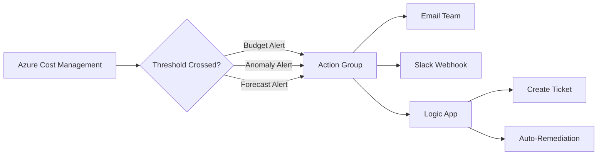

# How to Set Up Azure Cost Alerts and Budgets to Prevent Bill Shock

Author: [nawazdhandala](https://www.github.com/nawazdhandala)

Tags: Azure, Cost Management, Budgets, Alerts, FinOps, Cloud Costs, Governance

Description: Step-by-step guide to setting up Azure cost alerts and budgets to catch spending surprises before they turn into bill shock.

---

Bill shock is when you open your Azure invoice and discover it is three times what you expected. Maybe someone spun up 50 VMs for a load test and forgot to delete them. Maybe an auto-scaling rule went haywire. Maybe a dev/test database got accidentally provisioned at the premium tier. Whatever the cause, the result is the same: an unpleasant surprise.

The fix is simple but requires upfront setup: Azure Cost Management budgets and alerts. These tools let you set spending thresholds and get notified when costs approach or exceed those thresholds. In this post, I will walk you through setting everything up properly.

## Understanding Azure Cost Management

Azure Cost Management is a free built-in tool that tracks, allocates, and optimizes your Azure spending. It provides:

- **Cost analysis**: See where your money is going with breakdowns by resource, service, subscription, resource group, or tag.
- **Budgets**: Set spending limits with notifications.
- **Alerts**: Get notified when costs cross thresholds.
- **Exports**: Automatically export cost data to storage for external analysis.

All of this is available at no extra cost - it comes with every Azure subscription.

## Step 1: Create a Budget

A budget tracks your spending against a target amount and sends alerts when you cross specified thresholds. You can create budgets at the subscription level, resource group level, or management group level.

```bash
# Create a monthly budget of $5,000 at the subscription level
az consumption budget create \
  --budget-name "Monthly-Production-Budget" \
  --amount 5000 \
  --time-grain Monthly \
  --start-date 2026-02-01 \
  --end-date 2027-02-01 \
  --resource-group-filter "" \
  --category Cost
```

Through the Azure portal, you get more flexibility. Go to **Cost Management + Billing > Cost Management > Budgets > Add**.

Key settings:

- **Scope**: Choose subscription, resource group, or management group.
- **Amount**: Your budget limit for the period.
- **Time grain**: Monthly, Quarterly, or Annual.
- **Reset period**: Whether the budget resets automatically each period.
- **Expiration date**: When the budget stops being tracked.

## Step 2: Configure Alert Thresholds

Budget alerts fire when spending hits a percentage of the budget. I recommend setting multiple thresholds to give yourself early warnings:

- **50%** - Early warning. Things are on track but worth a glance.
- **75%** - Getting close. Time to review what is driving costs.
- **90%** - Almost at the limit. Take action if spending is unexpected.
- **100%** - Budget reached. Investigate immediately.
- **120%** - Over budget. Something needs to be fixed now.

```bash
# Create a budget with multiple alert thresholds
# Using the Azure REST API for more control
az rest \
  --method PUT \
  --url "https://management.azure.com/subscriptions/<sub-id>/providers/Microsoft.Consumption/budgets/Monthly-Budget?api-version=2023-05-01" \
  --body '{
    "properties": {
      "category": "Cost",
      "amount": 5000,
      "timeGrain": "Monthly",
      "timePeriod": {
        "startDate": "2026-02-01",
        "endDate": "2027-02-01"
      },
      "notifications": {
        "Alert50Percent": {
          "enabled": true,
          "operator": "GreaterThanOrEqualTo",
          "threshold": 50,
          "contactEmails": ["team@example.com"],
          "contactRoles": ["Owner", "Contributor"]
        },
        "Alert75Percent": {
          "enabled": true,
          "operator": "GreaterThanOrEqualTo",
          "threshold": 75,
          "contactEmails": ["team@example.com"]
        },
        "Alert90Percent": {
          "enabled": true,
          "operator": "GreaterThanOrEqualTo",
          "threshold": 90,
          "contactEmails": ["team@example.com", "finance@example.com"]
        },
        "Alert100Percent": {
          "enabled": true,
          "operator": "GreaterThanOrEqualTo",
          "threshold": 100,
          "contactEmails": ["team@example.com", "finance@example.com", "manager@example.com"]
        }
      }
    }
  }'
```

## Step 3: Set Up Action Groups for Automated Responses

For critical budget alerts, you might want more than just an email. Azure Action Groups can trigger:

- Email and SMS notifications
- Azure Logic Apps
- Azure Functions
- Webhooks (to Slack, Teams, PagerDuty, etc.)
- Azure Automation Runbooks

```bash
# Create an action group that sends emails and a webhook to Slack
az monitor action-group create \
  --resource-group myResourceGroup \
  --name CostAlertActionGroup \
  --short-name CostAlert \
  --email-receiver name=TeamLead email=lead@example.com \
  --email-receiver name=Finance email=finance@example.com \
  --webhook-receiver name=Slack uri="https://hooks.slack.com/services/xxx/yyy/zzz"
```

Link the action group to your budget alerts through the portal or API.

## Step 4: Create Anomaly Alerts

Budget alerts catch planned overspending, but anomaly alerts catch unexpected spending spikes. Azure Cost Management can detect anomalies based on historical patterns and alert you when spending deviates significantly.

```bash
# Create a cost anomaly alert rule
az rest \
  --method PUT \
  --url "https://management.azure.com/subscriptions/<sub-id>/providers/Microsoft.CostManagement/scheduledActions/DailyCostAnomaly?api-version=2023-08-01" \
  --body '{
    "kind": "InsightAlert",
    "properties": {
      "displayName": "Daily Cost Anomaly Alert",
      "status": "Enabled",
      "schedule": {
        "frequency": "Daily",
        "startDate": "2026-02-16T00:00:00Z",
        "endDate": "2027-02-16T00:00:00Z"
      },
      "notification": {
        "to": ["team@example.com"],
        "subject": "Azure Cost Anomaly Detected"
      },
      "viewId": "/subscriptions/<sub-id>/providers/Microsoft.CostManagement/views/ms:DailyCosts"
    }
  }'
```

Anomaly detection is particularly useful for catching:

- Accidental resource provisioning (someone creates expensive resources by mistake)
- Auto-scaling gone wrong (scaling out too far and not scaling back in)
- Data transfer spikes (unexpected egress traffic)
- Storage cost spikes (runaway log files or blob uploads)

## Step 5: Set Up Resource Group-Level Budgets

For teams that manage their own resource groups, create budgets at the resource group level. This gives each team visibility into their own spending:

```bash
# Create a budget scoped to a specific resource group
az consumption budget create \
  --budget-name "TeamA-Monthly-Budget" \
  --amount 2000 \
  --time-grain Monthly \
  --start-date 2026-02-01 \
  --end-date 2027-02-01 \
  --resource-group myTeamARG
```

This approach works well with a tagging strategy. You can also create budgets filtered by tags:

```bash
# Create a budget filtered by environment tag
az rest \
  --method PUT \
  --url "https://management.azure.com/subscriptions/<sub-id>/providers/Microsoft.Consumption/budgets/Dev-Environment-Budget?api-version=2023-05-01" \
  --body '{
    "properties": {
      "category": "Cost",
      "amount": 1000,
      "timeGrain": "Monthly",
      "timePeriod": {
        "startDate": "2026-02-01",
        "endDate": "2027-02-01"
      },
      "filter": {
        "tags": {
          "name": "Environment",
          "values": ["dev", "development"]
        }
      },
      "notifications": {
        "Alert80Percent": {
          "enabled": true,
          "operator": "GreaterThanOrEqualTo",
          "threshold": 80,
          "contactEmails": ["devteam@example.com"]
        }
      }
    }
  }'
```

## Step 6: Create Forecast-Based Alerts

Budget alerts based on actual spend only fire after the money is already spent. Forecast-based alerts predict where your spending is heading and alert you before you hit the threshold:

The key setting is the `threshold type`. Use `Forecasted` instead of `Actual`:

```json
{
  "Alert90Forecasted": {
    "enabled": true,
    "operator": "GreaterThanOrEqualTo",
    "threshold": 90,
    "thresholdType": "Forecasted",
    "contactEmails": ["team@example.com"]
  }
}
```

Forecast-based alerts are extremely useful. If Azure predicts you will hit 90% of your budget by month-end based on your current spending rate, you get alerted early enough to take corrective action.

## Step 7: Set Up a Daily Cost Report

Sometimes you just want a daily email showing what you spent yesterday. Azure Scheduled Exports can send cost data to a storage account, and you can set up a Logic App to email a summary:

```bash
# Create a daily cost export to a storage account
az costmanagement export create \
  --name "DailyCostExport" \
  --scope "/subscriptions/<sub-id>" \
  --storage-account-id "/subscriptions/<sub-id>/resourceGroups/myRG/providers/Microsoft.Storage/storageAccounts/mycostdata" \
  --storage-container "costexports" \
  --timeframe MonthToDate \
  --type ActualCost \
  --schedule-recurrence Daily \
  --schedule-status Active \
  --recurrence-period from="2026-02-16" to="2027-02-16"
```

## Step 8: Respond to Alerts

Setting up alerts is only half the battle. You need a process for responding to them. Here is a suggested response framework:

| Alert Level | Response |
|------------|----------|
| 50% of budget | Review - check if spending is on track |
| 75% of budget | Investigate - identify top cost drivers |
| 90% of budget | Act - implement cost reduction measures |
| 100% of budget | Escalate - involve management, freeze non-essential deployments |
| Anomaly detected | Investigate immediately - check for accidental or malicious spending |

## Alert Architecture



## Best Practices

1. **Set budgets for every subscription and critical resource group.** Coverage gaps mean surprises.
2. **Use forecast-based alerts, not just actual spend.** Get warned before the damage is done.
3. **Include multiple stakeholders in alerts.** The person who can fix the problem needs to see the alert.
4. **Review and adjust budgets quarterly.** As your workload grows, budgets need to grow too.
5. **Combine budgets with anomaly detection.** Budgets catch gradual overspending; anomalies catch sudden spikes.
6. **Tag everything.** Tags make it possible to create meaningful budgets by team, environment, project, or application.

## Summary

Azure Cost Management budgets and alerts are free and take minutes to set up. Create budgets at the subscription and resource group level with multiple threshold alerts (50%, 75%, 90%, 100%). Enable forecast-based alerts to get warned before you hit the limit. Set up anomaly detection for unexpected spikes. And most importantly, have a response process for when alerts fire. Bill shock is entirely preventable with these tools.
