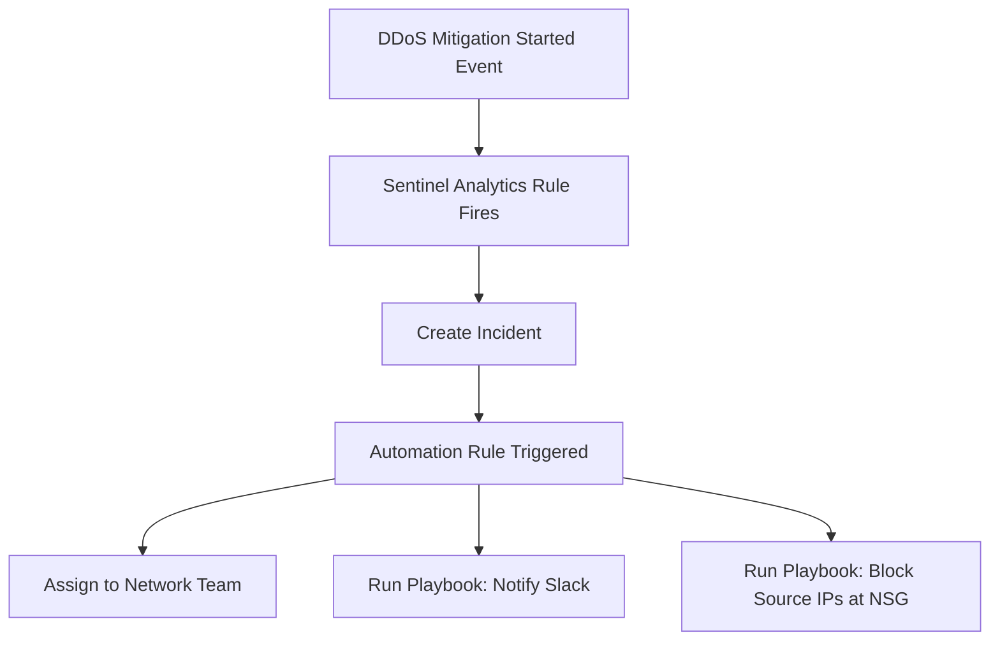

# How to Set Up Azure DDoS Protection Diagnostic Logs and Integration with Microsoft Sentinel

Author: [nawazdhandala](https://www.github.com/nawazdhandala)

Tags: Azure, DDoS Protection, Microsoft Sentinel, Diagnostic Logs, Network Security, SIEM, Monitoring

Description: A complete guide to enabling Azure DDoS Protection diagnostic logs, sending them to Log Analytics, and creating Sentinel alerts for DDoS attack detection and response.

---

Azure DDoS Protection Standard provides always-on traffic monitoring and automatic mitigation for distributed denial-of-service attacks. But enabling the protection is only half the picture. Without diagnostic logs flowing to a central location, your security team has no visibility into attack patterns, mitigation effectiveness, or the traffic volumes involved. Integrating DDoS Protection logs with Microsoft Sentinel gives you dashboards, alerting, and the ability to correlate DDoS events with other security incidents.

This guide covers enabling diagnostic logging, configuring the Sentinel integration, and building useful detection rules.

## What DDoS Protection Logs Capture

Azure DDoS Protection generates three categories of logs:

**DDoSProtectionNotifications:** High-level notifications about DDoS events. These tell you when mitigation starts and stops, and the overall status of the attack. You get entries like "DDoS attack detected on public IP X" and "DDoS mitigation ended for public IP X."

**DDoSMitigationFlowLogs:** Detailed per-flow information during an active attack. These logs contain the source IPs, destination ports, protocols, and actions taken (forwarded, dropped) for each flow during mitigation. This data is high volume during an attack.

**DDoSMitigationReports:** Post-attack summary reports with aggregate statistics about the attack - peak packet rates, traffic volume, top source countries, and mitigation effectiveness.

## Prerequisites

- Azure DDoS Protection Standard enabled on a virtual network (DDoS Network Protection plan)
- At least one public IP address associated with resources in the protected VNet
- A Log Analytics workspace connected to Microsoft Sentinel
- Network Contributor or higher role on the resources

## Step 1: Enable Diagnostic Settings on DDoS-Protected Public IPs

DDoS diagnostic logs are configured per public IP address, not at the DDoS plan level. This means you need to enable diagnostics on each public IP that you want to monitor.

```bash
# List all public IPs in the subscription to find DDoS-protected ones
az network public-ip list \
  --query "[?ddosSettings.ddosProtectionPlan != null].{Name:name, ResourceGroup:resourceGroup, IP:ipAddress, DDoSPlan:ddosSettings.ddosProtectionPlan.id}" \
  --output table

# Enable diagnostic settings on a specific public IP
# Send all three log categories to Log Analytics
az monitor diagnostic-settings create \
  --name "ddos-to-sentinel" \
  --resource "/subscriptions/{sub-id}/resourceGroups/{rg}/providers/Microsoft.Network/publicIPAddresses/myPublicIP" \
  --workspace "/subscriptions/{sub-id}/resourceGroups/{rg}/providers/Microsoft.OperationalInsights/workspaces/mySentinelWorkspace" \
  --logs '[
    {
      "category": "DDoSProtectionNotifications",
      "enabled": true,
      "retentionPolicy": {"enabled": false, "days": 0}
    },
    {
      "category": "DDoSMitigationFlowLogs",
      "enabled": true,
      "retentionPolicy": {"enabled": false, "days": 0}
    },
    {
      "category": "DDoSMitigationReports",
      "enabled": true,
      "retentionPolicy": {"enabled": false, "days": 0}
    }
  ]' \
  --metrics '[
    {
      "category": "AllMetrics",
      "enabled": true,
      "retentionPolicy": {"enabled": false, "days": 0}
    }
  ]'
```

Repeat this for each public IP you want to monitor. If you have many public IPs, script it:

```bash
# Enable diagnostic settings on ALL DDoS-protected public IPs
# This iterates through all public IPs with DDoS protection enabled
WORKSPACE_ID="/subscriptions/{sub-id}/resourceGroups/{rg}/providers/Microsoft.OperationalInsights/workspaces/mySentinelWorkspace"

az network public-ip list \
  --query "[?ddosSettings.protectionMode == 'Enabled'].id" \
  --output tsv | while read -r pip_id; do
    pip_name=$(basename "$pip_id")
    echo "Enabling diagnostics on $pip_name"

    az monitor diagnostic-settings create \
      --name "ddos-to-sentinel" \
      --resource "$pip_id" \
      --workspace "$WORKSPACE_ID" \
      --logs '[{"category":"DDoSProtectionNotifications","enabled":true},{"category":"DDoSMitigationFlowLogs","enabled":true},{"category":"DDoSMitigationReports","enabled":true}]' \
      --metrics '[{"category":"AllMetrics","enabled":true}]'
done
```

## Step 2: Enable the Sentinel DDoS Data Connector

Microsoft Sentinel has a built-in data connector for Azure DDoS Protection that simplifies the setup.

In the Sentinel portal, go to Content Hub and search for "Azure DDoS Protection." Install the solution, which includes:

- Data connector configuration
- Workbook template for DDoS visualization
- Analytics rules for attack detection
- Hunting queries

After installing, go to Data Connectors, find "Azure DDoS Protection," and click "Open connector page." Follow the instructions to connect your DDoS-protected resources.

## Step 3: Verify Data Ingestion

After enabling diagnostic settings, test that data is flowing. DDoS notification logs generate data even when there is no active attack - they produce periodic "no attack" status messages.

Run this query in Log Analytics to check:

```
// Check if DDoS protection notification data is being ingested
AzureDiagnostics
| where Category == "DDoSProtectionNotifications"
| where TimeGenerated > ago(24h)
| project TimeGenerated, Resource, publicIpAddress_s, type_s, msg_s
| order by TimeGenerated desc
| take 20
```

If you see results, data is flowing. If not, check:

1. The diagnostic setting is configured correctly
2. The public IP actually has DDoS Protection enabled
3. Wait at least 15 minutes for initial data to appear

## Step 4: Create Sentinel Analytics Rules

Create detection rules that fire when a DDoS attack is detected:

```
// Sentinel Analytics Rule: DDoS Attack Detected
// Trigger: When DDoS mitigation starts on any protected public IP
AzureDiagnostics
| where Category == "DDoSProtectionNotifications"
| where type_s == "MitigationStarted"
| project
    TimeGenerated,
    PublicIP = publicIpAddress_s,
    Message = msg_s,
    ResourceGroup = split(ResourceId, "/")[4],
    SubscriptionId
| extend AlertTitle = strcat("DDoS Attack Detected on ", PublicIP)
```

Create this as a scheduled analytics rule in Sentinel:

1. Go to Analytics in Sentinel
2. Click "Create" and select "Scheduled query rule"
3. Set the query above as the rule query
4. Run every 5 minutes with a lookback of 10 minutes
5. Set severity to High
6. Map entities: IP address to PublicIP

Create a second rule for when mitigation ends, so you can track attack duration:

```
// Sentinel Analytics Rule: DDoS Attack Mitigation Ended
// Use this to correlate with the start event and calculate attack duration
AzureDiagnostics
| where Category == "DDoSProtectionNotifications"
| where type_s == "MitigationStopped"
| project
    TimeGenerated,
    PublicIP = publicIpAddress_s,
    Message = msg_s
```

## Step 5: Build a DDoS Monitoring Workbook

Sentinel workbooks give you visual dashboards. Create a workbook that shows:

- Active DDoS mitigations
- Historical attack timeline
- Top attacked public IPs
- Traffic volume during attacks
- Source IP analysis from flow logs

Here are KQL queries for key workbook panels:

```
// Panel 1: Attack Timeline
// Shows when attacks started and stopped over the past 30 days
AzureDiagnostics
| where Category == "DDoSProtectionNotifications"
| where TimeGenerated > ago(30d)
| where type_s in ("MitigationStarted", "MitigationStopped")
| project TimeGenerated, PublicIP = publicIpAddress_s, EventType = type_s
| order by TimeGenerated asc
```

```
// Panel 2: Top Source IPs During Attacks
// Requires DDoSMitigationFlowLogs data from an actual attack
AzureDiagnostics
| where Category == "DDoSMitigationFlowLogs"
| where TimeGenerated > ago(7d)
| summarize
    FlowCount = count(),
    DroppedFlows = countif(action_s == "Dropped"),
    ForwardedFlows = countif(action_s == "Forwarded")
    by sourcePublicIpAddress_s
| order by FlowCount desc
| take 20
```

```
// Panel 3: Attack Volume Metrics
// Uses DDoS metric data for packets per second
AzureMetrics
| where MetricName == "IfUnderDDoSAttack"
| where TimeGenerated > ago(7d)
| where Maximum > 0
| project TimeGenerated, Resource, UnderAttack = Maximum
```

## Step 6: Set Up Automated Response

Combine Sentinel analytics rules with automation to respond to DDoS events automatically:



The playbook for blocking source IPs can analyze the DDoSMitigationFlowLogs, find the top source IPs, and add them to a Network Security Group deny rule. This provides an additional layer of defense beyond the automatic DDoS mitigation.

## Step 7: Configure Alert Notifications

Set up action groups to notify your team through multiple channels:

```bash
# Create an action group for DDoS alerts
az monitor action-group create \
  --name "DDoS-Alert-Team" \
  --resource-group myResourceGroup \
  --short-name "DDoSTeam" \
  --email-receiver name="NetworkTeam" email-address="network-team@contoso.com" \
  --email-receiver name="SecurityTeam" email-address="security-team@contoso.com"

# Create a metric alert for "Under DDoS Attack" metric
az monitor metrics alert create \
  --name "ddos-attack-detected" \
  --resource-group myResourceGroup \
  --scopes "/subscriptions/{sub-id}/resourceGroups/{rg}/providers/Microsoft.Network/publicIPAddresses/myPublicIP" \
  --condition "max IfUnderDDoSAttack > 0" \
  --window-size 5m \
  --evaluation-frequency 1m \
  --action "/subscriptions/{sub-id}/resourceGroups/{rg}/providers/Microsoft.Insights/actionGroups/DDoS-Alert-Team" \
  --description "Alert when DDoS attack is detected on the public IP" \
  --severity 1
```

## Cost Considerations

DDoS diagnostic logs, especially flow logs during an active attack, can generate significant data volume. During a large-scale attack, flow logs might produce gigabytes of data per hour. Plan your Log Analytics retention and pricing tier accordingly.

You can reduce costs by:

- Only enabling DDoSMitigationFlowLogs on your most critical public IPs
- Setting shorter retention periods for flow log data
- Using data collection rules to filter or sample flow log data before ingestion

## Summary

Azure DDoS Protection diagnostic logs combined with Microsoft Sentinel give your security team full visibility into DDoS events. Enable diagnostic settings on each protected public IP, install the Sentinel DDoS solution for pre-built content, create analytics rules for attack detection, and build workbooks for visualization. The integration turns DDoS protection from a silent background service into an observable, alertable component of your security operations.
