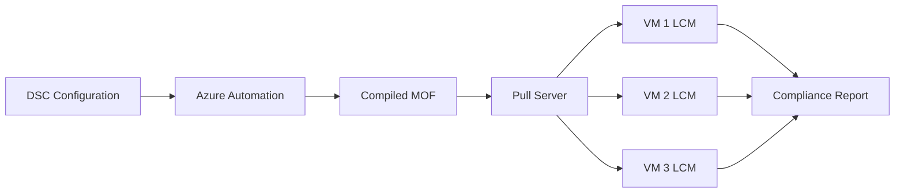

# How to Set Up Azure Desired State Configuration for Windows Server Compliance

Author: [nawazdhandala](https://www.github.com/nawazdhandala)

Tags: Azure, DSC, Windows Server, Compliance, Configuration Management, Automation, DevOps

Description: Configure Azure Automation Desired State Configuration to enforce and monitor Windows Server compliance across your Azure VM fleet.

---

Desired State Configuration (DSC) is PowerShell's built-in configuration management framework. It lets you declare what a Windows Server should look like - which features are installed, which services are running, which registry keys are set - and then enforces that state continuously. Azure Automation DSC extends this by providing a cloud-based pull server that your VMs register with, so you can manage configurations centrally without running your own infrastructure.

This post covers setting up Azure Automation DSC from scratch: writing configurations, compiling them, onboarding VMs, and monitoring compliance.

## How Azure Automation DSC Works

The workflow has four parts:

1. You write a DSC configuration in PowerShell
2. You upload and compile it in Azure Automation, which produces a MOF (Managed Object Format) file
3. VMs register with the Azure Automation DSC pull server
4. The Local Configuration Manager (LCM) on each VM pulls its configuration and applies it at regular intervals



## Setting Up Azure Automation

If you do not already have an Automation Account, create one.

```powershell
# Create the Automation Account with a system-assigned identity
New-AzAutomationAccount `
  -ResourceGroupName "rg-automation" `
  -Name "aa-dsc-management" `
  -Location "eastus" `
  -AssignSystemIdentity
```

## Writing a DSC Configuration

DSC configurations look like PowerShell functions with a `Configuration` keyword. Here is a configuration that enforces a baseline for web servers.

```powershell
# WebServerBaseline.ps1
# DSC configuration for IIS web server baseline compliance

Configuration WebServerBaseline {
    param (
        [string[]]$NodeName = 'localhost'
    )

    # Import the required DSC modules
    Import-DscResource -ModuleName 'PSDesiredStateConfiguration'
    Import-DscResource -ModuleName 'SecurityPolicyDsc'
    Import-DscResource -ModuleName 'AuditPolicyDsc'

    Node $NodeName {

        # Ensure IIS is installed
        WindowsFeature IIS {
            Ensure = 'Present'
            Name   = 'Web-Server'
        }

        # Ensure IIS Management Console is installed
        WindowsFeature IISManagement {
            Ensure    = 'Present'
            Name      = 'Web-Mgmt-Console'
            DependsOn = '[WindowsFeature]IIS'
        }

        # Ensure ASP.NET 4.8 is installed
        WindowsFeature ASPNET {
            Ensure    = 'Present'
            Name      = 'Web-Asp-Net45'
            DependsOn = '[WindowsFeature]IIS'
        }

        # Ensure the default IIS site is removed
        File RemoveDefaultSite {
            Ensure          = 'Absent'
            DestinationPath = 'C:\inetpub\wwwroot\iisstart.htm'
            Type            = 'File'
        }

        # Ensure Windows Firewall is enabled
        Service WindowsFirewall {
            Name        = 'MpsSvc'
            State       = 'Running'
            StartupType = 'Automatic'
        }

        # Ensure Windows Update service is running
        Service WindowsUpdate {
            Name        = 'wuauserv'
            State       = 'Running'
            StartupType = 'Automatic'
        }

        # Ensure Remote Desktop is disabled (access through Bastion instead)
        Registry DisableRDP {
            Ensure    = 'Present'
            Key       = 'HKLM:\SYSTEM\CurrentControlSet\Control\Terminal Server'
            ValueName = 'fDenyTSConnections'
            ValueData = '1'
            ValueType = 'DWord'
        }

        # Ensure TLS 1.2 is enabled
        Registry EnableTLS12Server {
            Ensure    = 'Present'
            Key       = 'HKLM:\SYSTEM\CurrentControlSet\Control\SecurityProviders\SCHANNEL\Protocols\TLS 1.2\Server'
            ValueName = 'Enabled'
            ValueData = '1'
            ValueType = 'DWord'
        }

        # Ensure TLS 1.0 is disabled
        Registry DisableTLS10Server {
            Ensure    = 'Present'
            Key       = 'HKLM:\SYSTEM\CurrentControlSet\Control\SecurityProviders\SCHANNEL\Protocols\TLS 1.0\Server'
            ValueName = 'Enabled'
            ValueData = '0'
            ValueType = 'DWord'
        }

        # Ensure the application log directory exists
        File AppLogDirectory {
            Ensure          = 'Present'
            DestinationPath = 'C:\Logs\Application'
            Type            = 'Directory'
        }

        # Ensure unnecessary features are removed
        WindowsFeature RemoveTelnet {
            Ensure = 'Absent'
            Name   = 'Telnet-Client'
        }

        WindowsFeature RemoveSMB1 {
            Ensure = 'Absent'
            Name   = 'FS-SMB1'
        }
    }
}
```

## Uploading Required DSC Modules

Before compiling, upload any non-built-in DSC modules to the Automation Account.

```powershell
# Upload the SecurityPolicyDsc module
New-AzAutomationModule `
  -ResourceGroupName "rg-automation" `
  -AutomationAccountName "aa-dsc-management" `
  -Name "SecurityPolicyDsc" `
  -ContentLinkUri "https://www.powershellgallery.com/api/v2/package/SecurityPolicyDsc/2.10.0.0"

# Upload the AuditPolicyDsc module
New-AzAutomationModule `
  -ResourceGroupName "rg-automation" `
  -AutomationAccountName "aa-dsc-management" `
  -Name "AuditPolicyDsc" `
  -ContentLinkUri "https://www.powershellgallery.com/api/v2/package/AuditPolicyDsc/1.4.0.0"
```

Wait for the modules to finish importing before proceeding. You can check the status:

```powershell
Get-AzAutomationModule `
  -ResourceGroupName "rg-automation" `
  -AutomationAccountName "aa-dsc-management" `
  -Name "SecurityPolicyDsc"
```

## Importing and Compiling the Configuration

Upload the configuration script and compile it.

```powershell
# Import the configuration
Import-AzAutomationDscConfiguration `
  -ResourceGroupName "rg-automation" `
  -AutomationAccountName "aa-dsc-management" `
  -SourcePath ".\WebServerBaseline.ps1" `
  -Published `
  -Force

# Compile the configuration
# This creates a MOF for each node name
Start-AzAutomationDscCompilationJob `
  -ResourceGroupName "rg-automation" `
  -AutomationAccountName "aa-dsc-management" `
  -ConfigurationName "WebServerBaseline"

# Check compilation status
Get-AzAutomationDscCompilationJob `
  -ResourceGroupName "rg-automation" `
  -AutomationAccountName "aa-dsc-management" `
  -ConfigurationName "WebServerBaseline"
```

After compilation succeeds, you will have a node configuration called `WebServerBaseline.localhost` available on the pull server.

## Onboarding Azure VMs

Register your existing Azure VMs with the DSC pull server.

```powershell
# Register a single VM
Register-AzAutomationDscNode `
  -ResourceGroupName "rg-automation" `
  -AutomationAccountName "aa-dsc-management" `
  -AzureVMName "vm-web-01" `
  -AzureVMResourceGroup "rg-web-servers" `
  -NodeConfigurationName "WebServerBaseline.localhost" `
  -ConfigurationMode "ApplyAndAutoCorrect" `
  -RebootNodeIfNeeded $true `
  -ActionAfterReboot "ContinueConfiguration" `
  -RefreshFrequencyMins 30 `
  -ConfigurationModeFrequencyMins 15
```

The key LCM settings are:

- **ConfigurationMode**: `ApplyAndAutoCorrect` automatically fixes drift. Use `ApplyAndMonitor` if you only want to report on drift without fixing it.
- **RefreshFrequencyMins**: How often the LCM checks the pull server for new configurations.
- **ConfigurationModeFrequencyMins**: How often the LCM checks and enforces the configuration locally.
- **RebootNodeIfNeeded**: Whether the LCM can reboot the server if a configuration resource requires it.

## Registering Multiple VMs in a Loop

For multiple VMs, script the registration.

```powershell
# Get all VMs in the web servers resource group
$vms = Get-AzVM -ResourceGroupName "rg-web-servers"

foreach ($vm in $vms) {
    Write-Output "Registering $($vm.Name)..."

    Register-AzAutomationDscNode `
      -ResourceGroupName "rg-automation" `
      -AutomationAccountName "aa-dsc-management" `
      -AzureVMName $vm.Name `
      -AzureVMResourceGroup $vm.ResourceGroupName `
      -NodeConfigurationName "WebServerBaseline.localhost" `
      -ConfigurationMode "ApplyAndAutoCorrect" `
      -RebootNodeIfNeeded $true `
      -RefreshFrequencyMins 30 `
      -ConfigurationModeFrequencyMins 15

    Write-Output "  Registered $($vm.Name)"
}
```

## Monitoring Compliance

Once VMs are registered, you can check their compliance status.

```powershell
# Get all DSC nodes and their compliance status
$nodes = Get-AzAutomationDscNode `
  -ResourceGroupName "rg-automation" `
  -AutomationAccountName "aa-dsc-management"

foreach ($node in $nodes) {
    $status = $node.Status
    $lastSeen = $node.LastSeen
    $config = $node.NodeConfigurationName

    Write-Output "$($node.Name): Status=$status, Config=$config, LastSeen=$lastSeen"
}
```

Nodes report one of three statuses:

- **Compliant**: The node matches its assigned configuration
- **Not Compliant**: The node has drifted from its configuration
- **Unresponsive**: The node has not checked in recently

## Creating a Compliance Report

For management reporting, generate a summary.

```powershell
# Generate a compliance summary
$nodes = Get-AzAutomationDscNode `
  -ResourceGroupName "rg-automation" `
  -AutomationAccountName "aa-dsc-management"

$compliant = ($nodes | Where-Object { $_.Status -eq "Compliant" }).Count
$nonCompliant = ($nodes | Where-Object { $_.Status -eq "NotCompliant" }).Count
$unresponsive = ($nodes | Where-Object { $_.Status -eq "Unresponsive" }).Count

Write-Output "=== DSC Compliance Report ==="
Write-Output "Total Nodes: $($nodes.Count)"
Write-Output "Compliant: $compliant"
Write-Output "Non-Compliant: $nonCompliant"
Write-Output "Unresponsive: $unresponsive"
Write-Output "Compliance Rate: $([math]::Round(($compliant / $nodes.Count) * 100, 1))%"
```

## Configuration Data for Different Roles

You can use configuration data to apply different settings to different server roles without writing separate configurations.

```powershell
# ConfigData for multiple server roles
$configData = @{
    AllNodes = @(
        @{
            NodeName                    = 'WebServer'
            Role                        = 'Web'
            Features                    = @('Web-Server', 'Web-Asp-Net45')
            DisableRDP                  = $true
        }
        @{
            NodeName                    = 'AppServer'
            Role                        = 'Application'
            Features                    = @('NET-Framework-45-Core')
            DisableRDP                  = $true
        }
    )
}
```

## Handling Configuration Drift

When the LCM is set to `ApplyAndAutoCorrect`, it automatically reverts unauthorized changes. For example, if someone manually enables RDP on a server, the LCM will detect the change on its next consistency check and set `fDenyTSConnections` back to 1.

If you prefer to be notified about drift without auto-correcting, use `ApplyAndMonitor` mode. This reports the drift in the compliance status but leaves the server in its current state. This is useful during a transition period when you are not yet confident that the configuration is complete and correct.

## Best Practices

Test configurations in a dev environment first. A misconfigured DSC resource can cause service outages if it changes a critical setting or triggers unexpected reboots.

Use `ApplyAndMonitor` mode initially. Switch to `ApplyAndAutoCorrect` only after you have verified that the configuration is complete and does not interfere with application behavior.

Keep configurations modular. Instead of one massive configuration, create separate configurations for security baseline, application features, and monitoring. Assign the appropriate configuration to each server role.

Version your DSC configurations in Git just like any other code. Track changes, review them in pull requests, and maintain a history of what was deployed when.

## Conclusion

Azure Automation DSC provides a centralized, scalable way to enforce Windows Server compliance across your Azure VM fleet. By declaring your desired state in PowerShell configurations, compiling them in Azure Automation, and onboarding VMs with the appropriate LCM settings, you get continuous compliance monitoring and optional auto-remediation. For organizations with Windows Server workloads in Azure, DSC is a mature and effective tool for maintaining consistent, secure server configurations.
