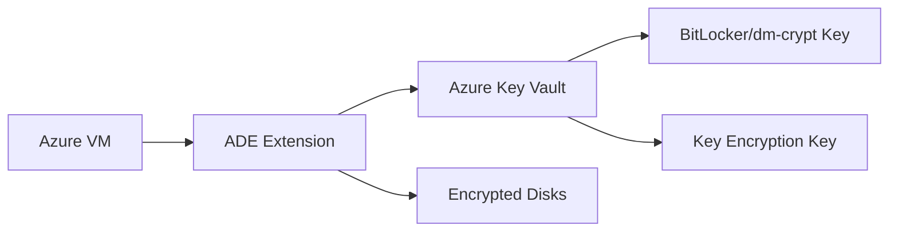

# How to Set Up Azure Disk Encryption for Virtual Machines

Author: [nawazdhandala](https://www.github.com/nawazdhandala)

Tags: Azure, Disk Encryption, Virtual Machine, Security, Key Vault, BitLocker, dm-crypt

Description: A complete guide to enabling Azure Disk Encryption on virtual machines using BitLocker for Windows and dm-crypt for Linux with Azure Key Vault.

---

Data at rest encryption is a fundamental security requirement for most organizations, whether driven by compliance regulations like HIPAA, PCI DSS, or GDPR, or simply by good security practices. Azure Disk Encryption (ADE) encrypts your VM's OS and data disks using industry-standard encryption - BitLocker on Windows and dm-crypt on Linux. The encryption keys are stored in Azure Key Vault, giving you centralized key management and access control.

In this guide, I will walk through the setup process for both Linux and Windows VMs, including Key Vault configuration, encryption enablement, and monitoring.

## How Azure Disk Encryption Works

Azure Disk Encryption integrates with Azure Key Vault to manage encryption keys. Here is the flow:

1. You create a Key Vault and generate (or import) encryption keys.
2. When you enable encryption on a VM, Azure installs the ADE extension.
3. The extension retrieves the encryption key from Key Vault.
4. On Windows, BitLocker encrypts the volumes. On Linux, dm-crypt encrypts the volumes.
5. The encryption key is wrapped by a Key Encryption Key (KEK) in Key Vault for additional security.
6. The encrypted data is transparent to the OS and applications - they read and write normally while the encryption layer handles everything.



## ADE vs. Server-Side Encryption

Azure actually provides two types of disk encryption, and it is worth understanding the difference:

**Server-Side Encryption (SSE)**: Enabled by default on all managed disks. Encrypts data at the storage layer using platform-managed keys. The encryption happens automatically and transparently.

**Azure Disk Encryption (ADE)**: Encrypts data inside the VM using BitLocker or dm-crypt. You control the keys through Key Vault. This provides encryption at the guest OS level.

For most compliance requirements, SSE (which is already enabled by default) is sufficient. ADE provides additional control over encryption keys and satisfies requirements that mandate guest-level encryption.

## Prerequisites

Before enabling ADE:

- The VM must use managed disks (unmanaged disks are not supported).
- The VM size must support encryption (most standard sizes do, but some basic-tier sizes do not).
- You need a Key Vault in the same region and subscription as the VM.
- The Key Vault must have the "enabledForDiskEncryption" property set to true.

## Step 1: Create a Key Vault

Create a Key Vault configured for disk encryption:

```bash
# Create a Key Vault enabled for disk encryption
az keyvault create \
  --resource-group myResourceGroup \
  --name myEncryptionVault \
  --location eastus \
  --enabled-for-disk-encryption true \
  --sku standard
```

The `--enabled-for-disk-encryption` flag is critical. Without it, ADE cannot access the vault.

If you already have a Key Vault, enable the property:

```bash
# Enable disk encryption access on an existing Key Vault
az keyvault update \
  --resource-group myResourceGroup \
  --name myExistingVault \
  --enabled-for-disk-encryption true
```

## Step 2: Create a Key Encryption Key (Recommended)

While not strictly required, using a Key Encryption Key (KEK) adds an additional layer of security. The KEK wraps the BitLocker or dm-crypt encryption key, so even if someone gets the volume encryption key, they cannot use it without the KEK.

```bash
# Create a Key Encryption Key in the Key Vault
az keyvault key create \
  --vault-name myEncryptionVault \
  --name myKEK \
  --kty RSA \
  --size 4096 \
  --protection software
```

For higher security, use `--protection hsm` to store the key in a hardware security module (requires a Premium SKU Key Vault).

## Step 3: Enable Encryption on a Linux VM

Enable encryption on all volumes (OS disk and data disks):

```bash
# Enable Azure Disk Encryption on a Linux VM with a KEK
az vm encryption enable \
  --resource-group myResourceGroup \
  --name myLinuxVM \
  --disk-encryption-keyvault myEncryptionVault \
  --key-encryption-key myKEK \
  --volume-type All
```

The `--volume-type` parameter accepts:
- `All`: Encrypt both OS and data disks.
- `OS`: Encrypt only the OS disk.
- `Data`: Encrypt only data disks.

For Linux VMs, there are some important notes:
- The OS disk encryption requires a reboot.
- Data disk encryption can happen while the VM is running.
- Supported Linux distributions include Ubuntu 18.04+, RHEL 7.2+, CentOS 7.2+, SUSE 15+, and Debian 9+.
- The root partition must be on a standard filesystem (ext4, XFS).

## Step 4: Enable Encryption on a Windows VM

The process for Windows is similar:

```bash
# Enable Azure Disk Encryption on a Windows VM with a KEK
az vm encryption enable \
  --resource-group myResourceGroup \
  --name myWindowsVM \
  --disk-encryption-keyvault myEncryptionVault \
  --key-encryption-key myKEK \
  --volume-type All
```

On Windows, BitLocker handles the encryption. The process typically takes 30-60 minutes depending on disk size. The VM may restart during the encryption process.

## Monitoring Encryption Progress

Check the encryption status:

```bash
# Check the encryption status of a VM
az vm encryption show \
  --resource-group myResourceGroup \
  --name myLinuxVM \
  --output json
```

The output shows the encryption status for each disk:

```json
{
  "disks": [
    {
      "encryptionSettings": null,
      "name": "myLinuxVM_OsDisk",
      "statuses": [
        {
          "code": "EncryptionState/encrypted",
          "displayStatus": "Encryption is enabled on disk",
          "level": "Info"
        }
      ]
    }
  ],
  "status": [
    {
      "code": "ProvisioningState/succeeded",
      "displayStatus": "Provisioning succeeded",
      "level": "Info"
    }
  ]
}
```

If encryption is in progress, you will see a status of `EncryptionState/EncryptionInProgress`.

## Encrypting Only Data Disks

For VMs where OS disk encryption is not required or not supported:

```bash
# Encrypt only data disks
az vm encryption enable \
  --resource-group myResourceGroup \
  --name myLinuxVM \
  --disk-encryption-keyvault myEncryptionVault \
  --key-encryption-key myKEK \
  --volume-type Data
```

This is useful when you have sensitive data on separate disks but do not need to encrypt the OS disk.

## Enabling Encryption at Scale

For multiple VMs, script the process:

```bash
#!/bin/bash
# Enable disk encryption on all VMs in a resource group

RESOURCE_GROUP="myResourceGroup"
KEYVAULT="myEncryptionVault"
KEK="myKEK"

# Get all VM names
VM_NAMES=$(az vm list \
  --resource-group $RESOURCE_GROUP \
  --query "[].name" \
  --output tsv)

for VM_NAME in $VM_NAMES; do
  # Check if already encrypted
  STATUS=$(az vm encryption show \
    --resource-group $RESOURCE_GROUP \
    --name $VM_NAME \
    --query "disks[0].statuses[0].code" \
    --output tsv 2>/dev/null)

  if [[ "$STATUS" == *"encrypted"* ]]; then
    echo "$VM_NAME is already encrypted. Skipping."
  else
    echo "Encrypting $VM_NAME..."
    az vm encryption enable \
      --resource-group $RESOURCE_GROUP \
      --name $VM_NAME \
      --disk-encryption-keyvault $KEYVAULT \
      --key-encryption-key $KEK \
      --volume-type All
    echo "$VM_NAME encryption initiated."
  fi
done
```

## Verifying Encryption from Inside the VM

You can verify encryption is active from within the VM.

On Linux:

```bash
# Check dm-crypt status
sudo lsblk -o NAME,SIZE,TYPE,MOUNTPOINT,FSTYPE
sudo cryptsetup status /dev/mapper/*

# Check if dm-crypt is in use
sudo dmsetup status
```

On Windows:

```powershell
# Check BitLocker status
manage-bde -status

# Or use PowerShell
Get-BitLockerVolume
```

## Key Rotation

Regularly rotating encryption keys is a security best practice:

```bash
# Create a new KEK version
az keyvault key create \
  --vault-name myEncryptionVault \
  --name myKEK \
  --kty RSA \
  --size 4096

# Re-encrypt the VM with the new key version
az vm encryption enable \
  --resource-group myResourceGroup \
  --name myLinuxVM \
  --disk-encryption-keyvault myEncryptionVault \
  --key-encryption-key myKEK \
  --volume-type All
```

Azure automatically uses the latest version of the KEK. The re-encryption is transparent and does not require the VM to be stopped.

## Disabling Encryption

If you need to remove encryption (not recommended for production):

```bash
# Disable encryption on data volumes
az vm encryption disable \
  --resource-group myResourceGroup \
  --name myLinuxVM \
  --volume-type Data
```

Note: On Linux VMs, you can only disable encryption on data volumes, not the OS volume. On Windows, you can disable encryption on all volumes.

## Enforcing Encryption with Azure Policy

Ensure all VMs in your organization are encrypted:

```bash
# Assign the built-in policy to audit unencrypted VMs
az policy assignment create \
  --name "audit-unencrypted-vms" \
  --scope "/subscriptions/{sub-id}" \
  --policy "0961003e-5a0a-4549-abde-af6a37f2724d"
```

This policy audits VMs that do not have disk encryption enabled and reports them as non-compliant.

## Troubleshooting Common Issues

**Encryption fails with permission error**: Make sure the Key Vault has `enabledForDiskEncryption` set to true. Also verify that the VM's identity has access to the Key Vault.

**Linux encryption fails on OS disk**: Check that the OS disk has enough free space (at least 5% free). dm-crypt needs space to set up the encryption layer.

**Windows encryption takes very long**: BitLocker encryption time depends on disk size. A 1 TB disk can take several hours. Check the status periodically rather than waiting.

**VM does not boot after encryption**: Check boot diagnostics for errors. In rare cases, you may need to disable encryption from the platform level and re-enable it.

**Encryption not supported on VM size**: Some older or basic-tier VM sizes do not support ADE. Resize to a supported size before enabling encryption.

## Best Practices

1. **Always use a KEK.** The additional layer of encryption makes key management more secure.
2. **Back up encryption keys.** Enable Key Vault soft delete and purge protection to prevent accidental key loss.
3. **Test encryption in dev/test first.** Verify that your application works correctly with encrypted disks before enabling in production.
4. **Monitor encryption status.** Use Azure Policy to continuously audit for unencrypted VMs.
5. **Plan for encryption time.** Initial encryption takes time, especially for large disks. Schedule it during a maintenance window.
6. **Use Premium SKU Key Vault for HSM-backed keys** if your compliance requirements mandate hardware key protection.

## Wrapping Up

Azure Disk Encryption provides guest-level encryption that satisfies compliance requirements and adds defense in depth to your security posture. The setup involves creating a Key Vault, generating a KEK, and running a single CLI command per VM. The encryption is transparent to applications and users - the only visible impact is a slight increase in disk latency during the initial encryption process. For organizations handling sensitive data, enabling ADE on all VMs should be a standard part of the deployment checklist.
