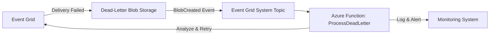

# How to Set Up Azure Event Grid Dead-Lettering for Failed Event Deliveries

Author: [nawazdhandala](https://www.github.com/nawazdhandala)

Tags: Azure, Event Grid, Dead-Lettering, Error Handling, Blob Storage, Event Delivery, Reliability

Description: Configure Azure Event Grid dead-lettering to capture failed event deliveries in Blob Storage for investigation and reprocessing.

---

When Azure Event Grid cannot deliver an event to a subscriber after exhausting all retries, the event is dropped by default. That means data loss. Dead-lettering captures these failed events in Azure Blob Storage so you can investigate what went wrong and reprocess them later. Setting it up takes just a few steps, but knowing how to handle the dead-lettered events properly is where the real value is.

## Why Events Fail Delivery

Events can fail delivery for several reasons:

- The subscriber endpoint is down or unreachable
- The subscriber returns an HTTP error code (4xx or 5xx)
- The subscriber takes too long to respond (Event Grid times out after 60 seconds for webhooks)
- The event's time-to-live (TTL) expires before successful delivery
- The subscriber rejects the event with a specific error

Without dead-lettering, all of these scenarios result in silent data loss after retries are exhausted.

## Setting Up the Dead-Letter Container

Dead-lettered events go to an Azure Blob Storage container. You need to create a storage account and container, then grant Event Grid permission to write to it.

```bash
# Create a storage account for dead-lettered events
az storage account create \
  --name stdeadletterevents \
  --resource-group rg-events \
  --location eastus2 \
  --sku Standard_LRS

# Create the container
az storage container create \
  --name deadletters \
  --account-name stdeadletterevents

# Get the storage account resource ID (needed for the subscription)
STORAGE_ID=$(az storage account show --name stdeadletterevents --resource-group rg-events --query "id" --output tsv)
```

## Enabling Dead-Lettering on a Subscription

Add the dead-letter destination when creating or updating an event subscription.

```bash
# Create a subscription with dead-lettering enabled
az eventgrid event-subscription create \
  --name sub-orders-with-dl \
  --source-resource-id "/subscriptions/{sub-id}/resourceGroups/rg-events/providers/Microsoft.EventGrid/topics/topic-orders" \
  --endpoint "https://myapp.azurewebsites.net/api/events" \
  --deadletter-endpoint "${STORAGE_ID}/blobServices/default/containers/deadletters" \
  --max-delivery-attempts 10 \
  --event-ttl 1440
```

The `--max-delivery-attempts` sets how many times Event Grid retries before dead-lettering (default is 30, max is 30). The `--event-ttl` sets the time-to-live in minutes (default and max is 1440, which is 24 hours).

## Dead-Lettering with Bicep

Here is the Bicep equivalent for infrastructure-as-code deployments.

```bicep
// Bicep template for an Event Grid subscription with dead-lettering
param topicName string = 'topic-orders'
param storageAccountName string = 'stdeadletterevents'

// Reference the existing storage account
resource storageAccount 'Microsoft.Storage/storageAccounts@2023-01-01' existing = {
  name: storageAccountName
}

// Event subscription with dead-letter configuration
resource eventSubscription 'Microsoft.EventGrid/topics/eventSubscriptions@2022-06-15' = {
  name: '${topicName}/sub-orders-with-dl'
  properties: {
    destination: {
      endpointType: 'WebHook'
      properties: {
        endpointUrl: 'https://myapp.azurewebsites.net/api/events'
        maxEventsPerBatch: 1
      }
    }
    // Dead-letter destination in Blob Storage
    deadLetterDestination: {
      endpointType: 'StorageBlob'
      properties: {
        resourceId: storageAccount.id
        blobContainerName: 'deadletters'
      }
    }
    retryPolicy: {
      maxDeliveryAttempts: 10
      eventTimeToLiveInMinutes: 1440
    }
  }
}
```

## What Dead-Lettered Events Look Like

When an event is dead-lettered, Event Grid writes a JSON blob to the storage container. The blob path follows this structure:

```
deadletters/{topicname}/{eventsubscriptionname}/{year}/{month}/{day}/{hour}/{hash}.json
```

The blob contains the original event plus additional metadata about why it was dead-lettered.

```json
{
  "deadLetterReason": "MaxDeliveryAttemptsExceeded",
  "deliveryAttempts": 10,
  "lastDeliveryOutcome": "BadRequest",
  "publishTime": "2026-02-16T10:30:00.000Z",
  "lastDeliveryAttemptTime": "2026-02-16T11:45:00.000Z",
  "lastHttpStatusCode": 400,
  "event": {
    "id": "event-12345",
    "eventType": "Orders.OrderPlaced",
    "subject": "/orders/12345",
    "eventTime": "2026-02-16T10:30:00Z",
    "data": {
      "orderId": "12345",
      "customerId": "cust-789",
      "totalAmount": 99.95
    },
    "dataVersion": "1.0"
  }
}
```

The `deadLetterReason` tells you why the event was dead-lettered:
- `MaxDeliveryAttemptsExceeded` - ran out of retry attempts
- `Unmatched` - event did not match any subscription (for system topics)
- `TtlExpired` - the event's time-to-live expired

## Processing Dead-Lettered Events

Having dead-lettered events in Blob Storage is only useful if you actually process them. Here is a function that monitors the dead-letter container and processes failed events.

```csharp
using Azure.Storage.Blobs;
using System.Text.Json;

public class DeadLetterProcessor
{
    private readonly BlobContainerClient _container;

    public DeadLetterProcessor(string storageConnectionString)
    {
        _container = new BlobContainerClient(storageConnectionString, "deadletters");
    }

    // List and process all dead-lettered events
    public async Task ProcessDeadLettersAsync()
    {
        // Iterate through all blobs in the dead-letter container
        await foreach (var blobItem in _container.GetBlobsAsync())
        {
            var blobClient = _container.GetBlobClient(blobItem.Name);
            var content = await blobClient.DownloadContentAsync();
            var deadLetter = JsonSerializer.Deserialize<DeadLetterEnvelope>(
                content.Value.Content.ToString()
            );

            Console.WriteLine($"Dead letter reason: {deadLetter.DeadLetterReason}");
            Console.WriteLine($"Last HTTP status: {deadLetter.LastHttpStatusCode}");
            Console.WriteLine($"Delivery attempts: {deadLetter.DeliveryAttempts}");

            // Decide what to do based on the reason
            switch (deadLetter.DeadLetterReason)
            {
                case "MaxDeliveryAttemptsExceeded":
                    // The subscriber was failing - maybe retry after fixing the bug
                    await RetryEvent(deadLetter.Event);
                    break;

                case "TtlExpired":
                    // The event aged out - log it and move on
                    LogExpiredEvent(deadLetter.Event);
                    break;

                default:
                    // Unknown reason - investigate manually
                    Console.WriteLine($"Unknown dead letter reason: {deadLetter.DeadLetterReason}");
                    break;
            }

            // Move processed blob to an archive container
            await ArchiveAndDelete(blobClient, blobItem.Name);
        }
    }

    private async Task RetryEvent(JsonElement eventData)
    {
        // Re-publish the event to the topic for another attempt
        Console.WriteLine("Re-publishing event for retry...");
        // Your republishing logic here
    }

    private void LogExpiredEvent(JsonElement eventData)
    {
        Console.WriteLine("Event expired before delivery - logging for audit");
    }

    private async Task ArchiveAndDelete(BlobClient blob, string name)
    {
        // Move to archive container, then delete from dead-letters
        // Implementation depends on your retention requirements
        await blob.DeleteAsync();
    }
}

// Model matching the dead-letter blob structure
public class DeadLetterEnvelope
{
    public string DeadLetterReason { get; set; }
    public int DeliveryAttempts { get; set; }
    public string LastDeliveryOutcome { get; set; }
    public int LastHttpStatusCode { get; set; }
    public string PublishTime { get; set; }
    public string LastDeliveryAttemptTime { get; set; }
    public JsonElement Event { get; set; }
}
```

## Automating Dead-Letter Processing

Instead of manually running a processor, trigger it automatically using an Event Grid subscription on the Blob Storage container itself. When a new blob lands in the dead-letter container, a function fires to process it.



This creates a self-healing loop: failed events are captured, analyzed, and either retried or escalated.

## Monitoring Dead-Letter Counts

Set up alerts on the dead-letter delivery count metric to catch issues early.

```bash
# Alert when dead-lettered events exceed a threshold
az monitor metrics alert create \
  --name "alert-eg-deadletters" \
  --resource-group rg-events \
  --scopes "/subscriptions/{sub-id}/resourceGroups/rg-events/providers/Microsoft.EventGrid/topics/topic-orders" \
  --condition "total DeadLetteredCount > 0" \
  --window-size 5m \
  --evaluation-frequency 5m \
  --severity 2 \
  --action "/subscriptions/{sub-id}/resourceGroups/rg-events/providers/Microsoft.Insights/actionGroups/ag-oncall"
```

## Dead-Lettering with Managed Identity

For production, use Managed Identity instead of storage account keys. Grant the Event Grid topic a `Storage Blob Data Contributor` role on the storage account, and configure the dead-letter destination to use the identity.

```bash
# Assign the role to Event Grid's system identity
TOPIC_PRINCIPAL=$(az eventgrid topic show --name topic-orders --resource-group rg-events --query "identity.principalId" --output tsv)

az role assignment create \
  --assignee "$TOPIC_PRINCIPAL" \
  --role "Storage Blob Data Contributor" \
  --scope "$STORAGE_ID"
```

## Retention and Cleanup

Dead-lettered blobs will accumulate over time. Set up a lifecycle management policy on the storage account to automatically delete old blobs.

```json
{
  "rules": [
    {
      "name": "cleanup-old-deadletters",
      "enabled": true,
      "type": "Lifecycle",
      "definition": {
        "filters": {
          "blobTypes": ["blockBlob"],
          "prefixMatch": ["deadletters/"]
        },
        "actions": {
          "baseBlob": {
            "tierToCool": { "daysAfterCreationGreaterThan": 7 },
            "delete": { "daysAfterCreationGreaterThan": 30 }
          }
        }
      }
    }
  ]
}
```

## Summary

Dead-lettering is essential for any production Event Grid deployment. Without it, failed event deliveries disappear silently. Enable dead-lettering on every subscription, set up automated processing for the dead-letter container, monitor the dead-letter count with alerts, and establish a retention policy. This combination ensures you never lose events and can investigate delivery failures systematically.
