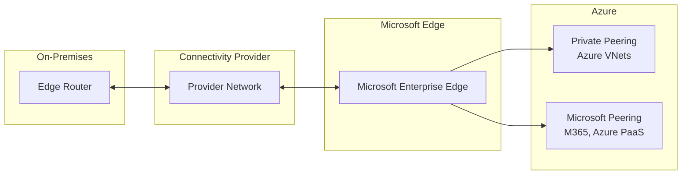

# How to Set Up Azure ExpressRoute Circuit with Microsoft Peering

Author: [nawazdhandala](https://www.github.com/nawazdhandala)

Tags: Azure, ExpressRoute, Microsoft Peering, Hybrid Networking, Private Connectivity, Azure Networking

Description: A comprehensive guide to setting up an Azure ExpressRoute circuit with Microsoft peering for private access to Microsoft cloud services.

---

When a VPN tunnel over the public internet is not enough - whether due to bandwidth requirements, latency sensitivity, or compliance constraints - Azure ExpressRoute provides a private, dedicated connection between your on-premises infrastructure and Azure. Unlike VPN, ExpressRoute traffic does not traverse the public internet. It goes through a connectivity provider's private network directly into Microsoft's backbone.

Microsoft peering on an ExpressRoute circuit gives you access to Microsoft 365, Dynamics 365, Azure PaaS services (like Azure Storage and SQL Database) via their public endpoints, and other Microsoft online services - all through the private connection. This guide walks through the setup process.

## ExpressRoute Peering Types

ExpressRoute supports two peering types:

- **Azure Private Peering**: Connects to Azure VNets (IaaS resources like VMs). This is the most common peering type.
- **Microsoft Peering**: Connects to Microsoft public services (Microsoft 365, Azure PaaS public endpoints, Dynamics 365).

You can have both peering types on the same circuit.



## Prerequisites

- An Azure subscription
- A contract with an ExpressRoute connectivity provider (like Equinix, AT&T, Megaport)
- Public IP address ranges for Microsoft peering (/29 or larger, must be public IPs you own or are authorized to use)
- An ASN (Autonomous System Number) for BGP peering
- Azure CLI installed

## Step 1: Create an ExpressRoute Circuit

```bash
# Create a resource group
az group create --name rg-expressroute-demo --location eastus

# Create an ExpressRoute circuit
az network express-route create \
  --resource-group rg-expressroute-demo \
  --name er-circuit-demo \
  --provider "Equinix" \
  --peering-location "Washington DC" \
  --bandwidth 200 \
  --sku-family MeteredData \
  --sku-tier Standard \
  --location eastus
```

Key parameters:

- `--provider`: Your connectivity provider's name (must match Azure's list exactly)
- `--peering-location`: The physical meet-me location (data center where your provider connects to Microsoft)
- `--bandwidth`: Circuit bandwidth in Mbps (50, 100, 200, 500, 1000, 2000, 5000, 10000)
- `--sku-tier`: Standard (single geo) or Premium (global reach)
- `--sku-family`: MeteredData (pay per GB) or UnlimitedData (flat rate)

## Step 2: Get the Service Key

After creating the circuit, retrieve the service key. You need to give this to your connectivity provider so they can provision their side of the connection.

```bash
# Get the service key
az network express-route show \
  --resource-group rg-expressroute-demo \
  --name er-circuit-demo \
  --query serviceKey --output tsv
```

Send this key to your provider. They will use it to set up the Layer 2 or Layer 3 connection on their side. The circuit status will show as "Not Provisioned" until the provider completes their setup.

## Step 3: Wait for Provider Provisioning

Monitor the circuit status until the provider completes their work.

```bash
# Check circuit provisioning status
az network express-route show \
  --resource-group rg-expressroute-demo \
  --name er-circuit-demo \
  --query "serviceProviderProvisioningState" --output tsv
```

This should eventually change from `NotProvisioned` to `Provisioned`. This process can take anywhere from a few hours to a few days depending on your provider.

## Step 4: Configure Microsoft Peering

Once the circuit is provisioned, set up Microsoft peering. You need public IP addresses for the BGP session - these are typically /30 subnets.

```bash
# Configure Microsoft peering on the circuit
az network express-route peering create \
  --resource-group rg-expressroute-demo \
  --circuit-name er-circuit-demo \
  --peering-type MicrosoftPeering \
  --peer-asn 65001 \
  --primary-peer-subnet 198.51.100.0/30 \
  --secondary-peer-subnet 198.51.100.4/30 \
  --vlan-id 300 \
  --advertised-public-prefixes 198.51.100.0/24
```

Let me break down these parameters:

- `--peer-asn`: Your organization's BGP ASN (or a private ASN if you do not have a public one)
- `--primary-peer-subnet`: A /30 subnet for the primary BGP session (you use .1, Microsoft uses .2)
- `--secondary-peer-subnet`: A /30 subnet for the secondary (redundant) BGP session
- `--vlan-id`: The VLAN tag for this peering (coordinate with your provider)
- `--advertised-public-prefixes`: The public IP prefixes you are advertising to Microsoft (must be registered to you in an RIR)

## Step 5: Validate Prefix Ownership

Microsoft requires validation that you own or are authorized to use the advertised public prefixes. The peering state will show as "Validation needed" until this is complete.

```bash
# Check peering state
az network express-route peering show \
  --resource-group rg-expressroute-demo \
  --circuit-name er-circuit-demo \
  --name MicrosoftPeering \
  --query "microsoftPeeringConfig.advertisedPublicPrefixesState" --output tsv
```

You may need to open a support ticket with the advertised prefixes and proof of ownership (LOA from your ISP or RIR registration).

## Step 6: Configure Route Filters

Microsoft peering gives access to many services, but you should only receive routes for the services you actually need. Route filters control which BGP communities (and therefore which services) you receive routes for.

```bash
# Create a route filter
az network route-filter create \
  --resource-group rg-expressroute-demo \
  --name rf-microsoft-peering \
  --location eastus

# Add a rule to allow Azure East US service routes
az network route-filter rule create \
  --resource-group rg-expressroute-demo \
  --filter-name rf-microsoft-peering \
  --name allow-azure-eastus \
  --access Allow \
  --communities "12076:51004"

# Add a rule for Microsoft 365 Exchange Online
az network route-filter rule create \
  --resource-group rg-expressroute-demo \
  --filter-name rf-microsoft-peering \
  --name allow-exchange-online \
  --access Allow \
  --communities "12076:5010"
```

Common BGP community values:

| Service | BGP Community |
|---|---|
| Azure East US | 12076:51004 |
| Azure West US | 12076:51006 |
| Azure West Europe | 12076:51002 |
| Exchange Online | 12076:5010 |
| SharePoint Online | 12076:5020 |
| Skype for Business | 12076:5030 |

## Step 7: Apply the Route Filter to the Peering

```bash
# Associate the route filter with Microsoft peering
az network express-route peering update \
  --resource-group rg-expressroute-demo \
  --circuit-name er-circuit-demo \
  --name MicrosoftPeering \
  --route-filter rf-microsoft-peering
```

## Step 8: Verify BGP Routes

After configuration, verify that BGP sessions are established and routes are being exchanged.

```bash
# Check the peering status
az network express-route peering show \
  --resource-group rg-expressroute-demo \
  --circuit-name er-circuit-demo \
  --name MicrosoftPeering \
  --query "{state:state, primaryAzurePort:primaryAzurePort, secondaryAzurePort:secondaryAzurePort}" \
  --output table

# View the route table for Microsoft peering
az network express-route list-route-tables \
  --resource-group rg-expressroute-demo \
  --name er-circuit-demo \
  --path primary \
  --peering-name MicrosoftPeering
```

## NAT Requirements

For Microsoft peering, all traffic must be source NAT'd to the public IP addresses you advertised. Microsoft will only accept traffic from the advertised prefixes. Configure NAT on your edge router before the traffic enters the ExpressRoute circuit.

This is different from private peering, where you use private IP addresses and no NAT is needed.

## High Availability

ExpressRoute circuits come with two connections (primary and secondary) for redundancy. For production workloads, consider:

- **Two circuits in different peering locations** for maximum resilience
- **Monitoring both BGP sessions** and alerting if one goes down
- **BFD (Bidirectional Forwarding Detection)** for faster failover

```bash
# Enable BFD on the peering
az network express-route peering update \
  --resource-group rg-expressroute-demo \
  --circuit-name er-circuit-demo \
  --name MicrosoftPeering \
  --bfd-enabled true
```

## Monitoring

Set up monitoring for the ExpressRoute circuit to track bandwidth utilization, BGP availability, and dropped packets.

```bash
# Check circuit metrics
az monitor metrics list \
  --resource $(az network express-route show --resource-group rg-expressroute-demo --name er-circuit-demo --query id -o tsv) \
  --metric "BitsInPerSecond" "BitsOutPerSecond" "BgpAvailability" \
  --interval PT5M
```

## Cleanup

```bash
# Delete the resource group
az group delete --name rg-expressroute-demo --yes --no-wait
```

Note that deleting the Azure resources does not automatically deprovision the circuit with your provider. Contact your provider separately to avoid continued charges on their side.

## Wrapping Up

ExpressRoute with Microsoft peering provides private, dedicated connectivity to Microsoft cloud services without going over the internet. The setup process involves creating the circuit, working with your provider for physical provisioning, configuring BGP peering with your public IP ranges, and applying route filters to control which service routes you receive. The process takes longer than a VPN setup because of the provider coordination, but the result is enterprise-grade connectivity with predictable latency and bandwidth guarantees.
