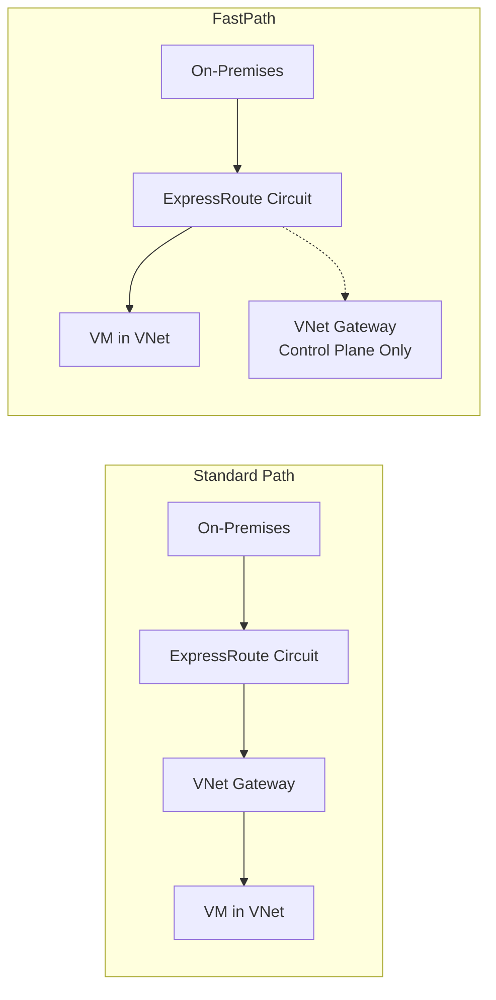

# How to Set Up Azure ExpressRoute with FastPath for Improved Network Performance

Author: [nawazdhandala](https://www.github.com/nawazdhandala)

Tags: Azure, ExpressRoute, FastPath, Networking, Performance, Hybrid Cloud

Description: Learn how to enable Azure ExpressRoute FastPath to bypass the virtual network gateway and improve data plane performance for latency-sensitive workloads.

---

Azure ExpressRoute provides a private connection between your on-premises datacenter and Azure, but the virtual network gateway sitting in the data path can become a bottleneck for high-throughput or latency-sensitive workloads. ExpressRoute FastPath addresses this by sending traffic directly to the virtual machine in the VNet, bypassing the gateway for data plane operations. The gateway still handles control plane operations like route exchange, but the actual data packets take a shortcut.

This guide covers when FastPath makes sense, how to enable it, what its limitations are, and how to verify it is working correctly.

## How ExpressRoute FastPath Works

In a standard ExpressRoute setup, all traffic from your on-premises network to Azure VMs flows through the ExpressRoute virtual network gateway. The gateway handles both control plane operations (BGP route exchange, route propagation) and data plane operations (forwarding actual data packets).



With FastPath enabled, data plane traffic bypasses the gateway and goes directly to the VM. The gateway remains involved only for control plane tasks like learning and propagating routes. This reduces latency and increases throughput because the gateway is no longer a bottleneck in the forwarding path.

## When to Use FastPath

FastPath is most valuable for:

- **High-throughput workloads**: Data replication, backup traffic, large file transfers, and database synchronization that push large volumes of data
- **Latency-sensitive applications**: Real-time trading systems, gaming backends, and interactive applications where every millisecond matters
- **HPC workloads**: High-performance computing scenarios with tight coupling between on-premises and Azure compute nodes

The performance improvement depends on your specific gateway SKU and traffic pattern. The UltraPerformance and ErGw3AZ gateway SKUs already offer high throughput, but FastPath can still reduce latency by removing one hop from the data path.

## Prerequisites

FastPath has specific requirements:

- **Gateway SKU**: You must use either UltraPerformance or ErGw3AZ gateway SKU. FastPath is not supported on Standard or HighPerformance gateway SKUs.
- **ExpressRoute circuit SKU**: Must be an ExpressRoute circuit (not ExpressRoute Local). Both Standard and Premium circuits support FastPath.
- **Peering type**: Only private peering supports FastPath. Microsoft peering does not.

## Step 1: Verify Your Gateway SKU

Before enabling FastPath, check that your gateway supports it:

```bash
# Check the current gateway SKU
az network vnet-gateway show \
  --name myExpressRouteGateway \
  --resource-group myResourceGroup \
  --query "sku.name" -o tsv
```

If your gateway is not UltraPerformance or ErGw3AZ, you need to upgrade it:

```bash
# Upgrade the gateway to ErGw3AZ (zone-redundant ultra performance)
# WARNING: This causes a brief connectivity interruption
az network vnet-gateway update \
  --name myExpressRouteGateway \
  --resource-group myResourceGroup \
  --sku ErGw3AZ
```

Gateway SKU upgrades cause a short period of downtime (typically 30-60 seconds), so plan this during a maintenance window.

## Step 2: Enable FastPath on the Connection

FastPath is enabled on the connection object that links the ExpressRoute circuit to the virtual network gateway. You can enable it on a new connection or update an existing one.

For a new connection:

```bash
# Get the ExpressRoute circuit resource ID
CIRCUIT_ID=$(az network express-route show \
  --name myExpressRouteCircuit \
  --resource-group myResourceGroup \
  --query id -o tsv)

# Create a new connection with FastPath enabled
az network vpn-connection create \
  --name myExpressRouteConnection \
  --resource-group myResourceGroup \
  --vnet-gateway1 myExpressRouteGateway \
  --express-route-circuit2 $CIRCUIT_ID \
  --routing-weight 0 \
  --enable-fastpath true
```

For an existing connection:

```bash
# Enable FastPath on an existing ExpressRoute connection
az network vpn-connection update \
  --name myExpressRouteConnection \
  --resource-group myResourceGroup \
  --enable-fastpath true
```

## Step 3: Verify FastPath Is Active

After enabling FastPath, verify it is active on the connection:

```bash
# Check the FastPath status
az network vpn-connection show \
  --name myExpressRouteConnection \
  --resource-group myResourceGroup \
  --query "expressRouteGatewayBypass" -o tsv
```

This should return `true`. You can also check the connection status:

```bash
# Verify the connection is in Connected state
az network vpn-connection show \
  --name myExpressRouteConnection \
  --resource-group myResourceGroup \
  --query "{Name:name, Status:connectionStatus, FastPath:expressRouteGatewayBypass}" -o table
```

## Step 4: Validate Performance Improvement

To confirm FastPath is making a difference, measure latency and throughput before and after enabling it.

**Latency test using ping or PSPing**: Run latency measurements from an on-premises machine to an Azure VM before and after enabling FastPath. You should see a reduction in round-trip time.

```bash
# From an on-premises Linux machine, measure latency to an Azure VM
# Run this BEFORE and AFTER enabling FastPath to compare
ping -c 100 10.0.1.10 | tail -1
```

**Throughput test using iperf3**: Set up iperf3 on an Azure VM and your on-premises machine to measure throughput:

```bash
# On the Azure VM (server side)
iperf3 -s -p 5201

# On the on-premises machine (client side)
# Run a 30-second throughput test with 4 parallel streams
iperf3 -c 10.0.1.10 -p 5201 -t 30 -P 4
```

Compare the throughput numbers with and without FastPath. The improvement is most noticeable with high-bandwidth workloads.

## Step 5: Configure Monitoring

Monitor your ExpressRoute connection to detect any issues with FastPath:

```bash
# Enable diagnostic logging for the ExpressRoute gateway
az monitor diagnostic-settings create \
  --name "expressroute-diagnostics" \
  --resource "/subscriptions/{sub-id}/resourceGroups/myResourceGroup/providers/Microsoft.Network/virtualNetworkGateways/myExpressRouteGateway" \
  --workspace "/subscriptions/{sub-id}/resourceGroups/myResourceGroup/providers/Microsoft.OperationalInsights/workspaces/myWorkspace" \
  --metrics '[{"category": "AllMetrics", "enabled": true}]'
```

Key metrics to watch:

- **ExpressRouteGatewayBitsPerSecond**: Throughput through the gateway (should decrease with FastPath since data bypasses the gateway)
- **ExpressRouteGatewayCountOfRoutesAdvertised**: Route count from the gateway
- **ExpressRouteGatewayPacketsPerSecond**: Packet rate through the gateway

When FastPath is working correctly, you should see the gateway throughput metrics decrease while your actual application throughput to VMs remains the same or improves.

## FastPath Limitations

FastPath has several known limitations that you need to be aware of:

**No support for VNet peering transit**: FastPath only works for VMs in the VNet directly connected to the ExpressRoute gateway. Traffic to peered VNets still goes through the gateway. If you have a hub-and-spoke topology, only the hub VNet benefits from FastPath.

**No support for UDRs on the GatewaySubnet**: User-defined routes on the GatewaySubnet are not applied to FastPath traffic since the traffic bypasses the gateway. If you rely on UDRs for traffic steering, FastPath will skip them.

**No support for Private Link**: Traffic destined for Private Link endpoints still goes through the gateway even with FastPath enabled. This is because Private Link uses a different forwarding mechanism.

**No support for Basic Load Balancer**: FastPath does not work with backends behind a Basic SKU internal load balancer. Use Standard Load Balancer instead.

**Limited NSG flow log support**: Since FastPath traffic does not go through the gateway, flow logs at the gateway level do not capture this traffic. You need NSG flow logs on the VM's subnet instead.

## Hub-and-Spoke Considerations

In a hub-and-spoke topology, FastPath only helps with traffic going to VMs in the hub VNet. For spoke VNets, traffic still traverses the gateway because VNet peering requires the gateway for route propagation.

If you need FastPath performance for spoke VNets, consider these alternatives:

- Deploy ExpressRoute gateways directly in spoke VNets (increases cost)
- Use ExpressRoute Direct with multiple circuits
- Move latency-sensitive workloads to the hub VNet

## Rollback Plan

If FastPath causes unexpected behavior, you can disable it without downtime:

```bash
# Disable FastPath on the connection
az network vpn-connection update \
  --name myExpressRouteConnection \
  --resource-group myResourceGroup \
  --enable-fastpath false
```

Traffic will resume flowing through the gateway within a few seconds. This is a non-disruptive operation - existing connections are maintained, though there might be a brief increase in latency as traffic shifts back to the gateway path.

## Wrapping Up

ExpressRoute FastPath is a straightforward way to squeeze more performance out of your hybrid connectivity. The setup is simple: ensure you have the right gateway SKU, enable FastPath on the connection, and verify the performance improvement. The main things to watch out for are the limitations around VNet peering, UDRs, and Private Link. For workloads that sit in the directly connected VNet and need the lowest possible latency between on-premises and Azure, FastPath is worth enabling.
