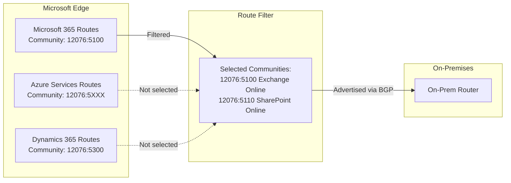

# How to Set Up Azure ExpressRoute with Route Filters for Microsoft Peering

Author: [nawazdhandala](https://www.github.com/nawazdhandala)

Tags: Azure, ExpressRoute, Route Filters, Microsoft Peering, BGP, Networking

Description: Configure Azure ExpressRoute route filters to control which Microsoft 365 and Azure PaaS service routes are advertised through Microsoft peering.

---

Azure ExpressRoute Microsoft peering gives you private connectivity to Microsoft cloud services like Microsoft 365, Dynamics 365, and Azure PaaS services. But Microsoft advertises thousands of route prefixes through this peering, and you probably do not want all of them in your routing table. Route filters let you selectively choose which service communities are advertised to your on-premises network, keeping your routing tables clean and your traffic patterns predictable.

This guide covers how to set up route filters for ExpressRoute Microsoft peering, select the right BGP communities, and manage the route filter lifecycle.

## How Route Filters Work

When you enable Microsoft peering on an ExpressRoute circuit, Microsoft is ready to advertise routes for all its cloud services. However, no routes are advertised until you attach a route filter. The route filter specifies which BGP communities you want to receive, and Microsoft only advertises the prefixes associated with those communities.



Each Microsoft service is identified by a BGP community value. By selecting specific communities in your route filter, you control exactly which routes your on-premises network learns.

## Prerequisites

- An ExpressRoute circuit with Microsoft peering enabled (or ready to be enabled)
- A connectivity provider or ExpressRoute Direct setup
- Your on-premises edge routers configured for BGP peering
- Azure CLI installed
- Understanding of which Microsoft services your organization uses

## Step 1: Understand BGP Communities

Microsoft organizes its services into BGP communities. Here are the most commonly used ones:

| Service | BGP Community | Description |
|---------|--------------|-------------|
| Exchange Online | 12076:5100 | Exchange Online, EOP |
| SharePoint Online | 12076:5110 | SharePoint, OneDrive |
| Skype/Teams | 12076:5120 | Teams, Skype for Business Online |
| Microsoft 365 Common | 12076:5200 | AAD, Portal, shared infrastructure |
| Dynamics 365 | 12076:5300 | Dynamics 365 |
| Azure (region-specific) | 12076:51XXX | Azure PaaS services by region |

You can also filter by Azure region. For example, Azure services in East US have the community 12076:51004, and West Europe has 12076:51012.

## Step 2: Create a Route Filter

Create a route filter resource:

```bash
# Create a route filter
az network route-filter create \
  --name myRouteFilter \
  --resource-group myResourceGroup \
  --location eastus
```

## Step 3: Add Route Filter Rules

Add rules to the filter for the BGP communities you want to receive. Each rule specifies one or more BGP community values:

```bash
# Allow Exchange Online routes
az network route-filter rule create \
  --filter-name myRouteFilter \
  --resource-group myResourceGroup \
  --name AllowExchangeOnline \
  --access Allow \
  --communities "12076:5100" \
  --route-filter-type Community

# Allow SharePoint Online routes
az network route-filter rule create \
  --filter-name myRouteFilter \
  --resource-group myResourceGroup \
  --name AllowSharePoint \
  --access Allow \
  --communities "12076:5110" \
  --route-filter-type Community

# Allow Teams routes
az network route-filter rule create \
  --filter-name myRouteFilter \
  --resource-group myResourceGroup \
  --name AllowTeams \
  --access Allow \
  --communities "12076:5120" \
  --route-filter-type Community

# Allow Microsoft 365 Common routes (AAD, portal, etc.)
az network route-filter rule create \
  --filter-name myRouteFilter \
  --resource-group myResourceGroup \
  --name AllowM365Common \
  --access Allow \
  --communities "12076:5200" \
  --route-filter-type Community
```

You can combine multiple communities in a single rule:

```bash
# Allow multiple services in one rule
az network route-filter rule create \
  --filter-name myRouteFilter \
  --resource-group myResourceGroup \
  --name AllowAllM365 \
  --access Allow \
  --communities "12076:5100" "12076:5110" "12076:5120" "12076:5200" \
  --route-filter-type Community
```

## Step 4: Associate the Route Filter with Microsoft Peering

Link the route filter to your ExpressRoute circuit's Microsoft peering:

```bash
# Get the route filter resource ID
FILTER_ID=$(az network route-filter show \
  --name myRouteFilter \
  --resource-group myResourceGroup \
  --query id -o tsv)

# Associate the route filter with Microsoft peering
az network express-route peering update \
  --circuit-name myExpressRouteCircuit \
  --resource-group myResourceGroup \
  --name MicrosoftPeering \
  --route-filter $FILTER_ID
```

After association, Microsoft begins advertising only the routes matching your filter rules. This can take a few minutes to propagate.

## Step 5: Verify Advertised Routes

Check which routes are being advertised through the peering:

```bash
# List the routes advertised by Microsoft through the peering
az network express-route list-route-tables \
  --name myExpressRouteCircuit \
  --resource-group myResourceGroup \
  --peering-name MicrosoftPeering \
  --path primary \
  --output table
```

You should see only the route prefixes associated with the BGP communities you selected. If you selected Exchange Online (12076:5100), you will see the IP prefixes used by Exchange Online endpoints.

Also check the routes on your on-premises router:

```bash
# On a Cisco router, check BGP routes from the ExpressRoute peer
show ip bgp neighbors 10.0.0.1 routes
```

## Step 6: Configure On-Premises Routing

On your on-premises routers, you should apply additional filtering to ensure only expected routes are accepted and that traffic is routed optimally:

```
! Cisco IOS example - accept only specific communities from Microsoft peering
ip community-list standard MSFT-EXCHANGE permit 12076:5100
ip community-list standard MSFT-SHAREPOINT permit 12076:5110
ip community-list standard MSFT-TEAMS permit 12076:5120
ip community-list standard MSFT-M365COMMON permit 12076:5200

route-map ACCEPT-MSFT-ROUTES permit 10
  match community MSFT-EXCHANGE MSFT-SHAREPOINT MSFT-TEAMS MSFT-M365COMMON

route-map ACCEPT-MSFT-ROUTES deny 20
  ! Deny everything else

router bgp 65010
  neighbor 10.0.0.1 route-map ACCEPT-MSFT-ROUTES in
```

This provides defense in depth - even if the Azure route filter misconfiguration allows unexpected routes, your on-premises routers will reject them.

## Step 7: Monitor and Maintain Route Filters

Set up monitoring for route changes:

```bash
# Check the current route filter configuration
az network route-filter show \
  --name myRouteFilter \
  --resource-group myResourceGroup \
  --query "rules[].{Name:name, Communities:communities, Access:access}" \
  --output table
```

Create an alert for when the number of routes changes unexpectedly:

```bash
# Monitor the ExpressRoute circuit metrics
az monitor metrics list \
  --resource "/subscriptions/{sub-id}/resourceGroups/myResourceGroup/providers/Microsoft.Network/expressRouteCircuits/myExpressRouteCircuit" \
  --metric "BgpAvailability" "RoutesAdvertisedToMSFTPeer" "RoutesAdvertisedToPeer" \
  --interval PT5M \
  --output table
```

## Adding and Removing Services

As your organization adopts new Microsoft services, update the route filter:

```bash
# Add Dynamics 365 routes to the filter
az network route-filter rule create \
  --filter-name myRouteFilter \
  --resource-group myResourceGroup \
  --name AllowDynamics365 \
  --access Allow \
  --communities "12076:5300" \
  --route-filter-type Community
```

To remove a service:

```bash
# Remove a route filter rule
az network route-filter rule delete \
  --filter-name myRouteFilter \
  --resource-group myResourceGroup \
  --name AllowDynamics365
```

Route changes propagate within a few minutes. During the propagation, there should be no traffic disruption for existing services.

## Common Mistakes

**Not including Microsoft 365 Common (12076:5200)**: Many people select Exchange and SharePoint but forget the Common community. Azure AD authentication, the Microsoft 365 portal, and other shared infrastructure are in this community. Without it, authentication to Microsoft 365 services may fail or fall back to the internet path.

**Selecting too many communities**: Only select the services you actually use. Each community adds routes to your routing table, and some services have hundreds of prefixes. Unnecessary routes waste router memory and make troubleshooting harder.

**Forgetting on-premises route filtering**: Always apply route filtering on your on-premises routers in addition to the Azure route filter. This provides defense in depth and protects against misconfiguration.

**Not accounting for route changes**: Microsoft occasionally updates its IP ranges. Your route filter automatically handles this because it is community-based, not prefix-based. But your on-premises firewall rules might need updates if they reference specific IP ranges.

## Route Filter vs Network Rules

Route filters control which routes are advertised through BGP - they determine which traffic can take the ExpressRoute path. They do not enforce which traffic must take the ExpressRoute path. If a user's DNS resolution returns a Microsoft IP that is in both the ExpressRoute advertised routes and the default internet route, the most specific route wins.

For this reason, many organizations combine route filters with:
- DNS-based routing (split DNS for Microsoft services)
- Proxy PAC files that direct Microsoft traffic over ExpressRoute
- Firewall rules that enforce the desired traffic path

## Wrapping Up

Route filters for ExpressRoute Microsoft peering give you precise control over which Microsoft service routes appear in your on-premises routing tables. Start by identifying the services your organization uses, map them to BGP communities, create a route filter with those communities, and attach it to your Microsoft peering. Always apply complementary filtering on your on-premises routers, and monitor route counts to detect unexpected changes. The goal is a clean routing table that only contains the routes you actually need, keeping your hybrid network predictable and easy to troubleshoot.
