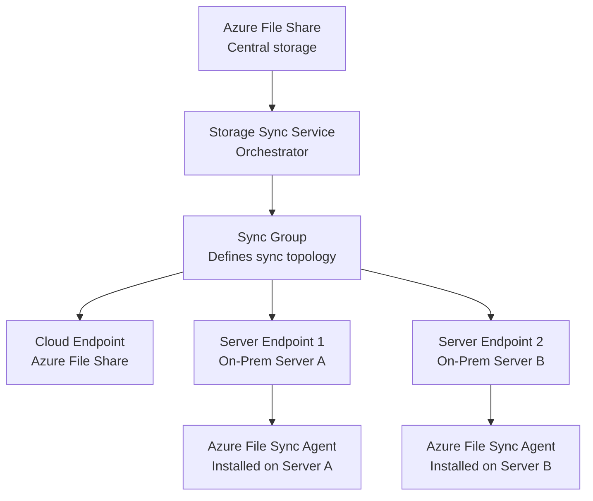
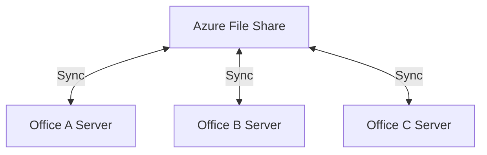

# How to Set Up Azure File Sync to Synchronize On-Premises File Servers

Author: [nawazdhandala](https://www.github.com/nawazdhandala)

Tags: Azure, Azure File Sync, File Server, Hybrid Cloud, Azure Files, Data Synchronization, On-Premises

Description: A complete walkthrough of setting up Azure File Sync to synchronize on-premises Windows file servers with Azure File Shares for hybrid cloud file storage.

---

Azure File Sync bridges on-premises Windows file servers with Azure Files. It turns your Azure File Share into a central hub that syncs with one or more on-premises servers, giving you the best of both worlds: local file server performance for frequently accessed files and cloud storage capacity for everything else.

The killer feature is cloud tiering. Azure File Sync can keep only the most recently accessed files on your local server and tier cold files to Azure. When someone opens a tiered file, it gets pulled down from Azure transparently. From the user's perspective, all files appear to be on the local server.

## Architecture Overview

Here is how the components fit together:



Key components:

- **Storage Sync Service** - The Azure resource that manages sync relationships
- **Sync Group** - Defines which Azure File Share and which server endpoints should be kept in sync
- **Cloud Endpoint** - Points to an Azure File Share
- **Server Endpoint** - A specific path on a registered Windows server
- **Azure File Sync Agent** - Software installed on each on-premises server

## Prerequisites

- Windows Server 2016 or later (2019 or 2022 recommended)
- .NET Framework 4.7.2 or later
- An Azure File Share (standard tier, SMB protocol)
- Outbound internet connectivity from the server (HTTPS on port 443)
- At least one NTFS volume on the server (ReFS is not supported)

## Step 1: Create the Storage Sync Service

```bash
# Create a Storage Sync Service resource
az resource create \
  --resource-group myresourcegroup \
  --name myStorageSyncService \
  --resource-type "Microsoft.StorageSync/storageSyncServices" \
  --properties "{}" \
  --location eastus
```

Or through the portal: search for "Azure File Sync" in the marketplace and create a Storage Sync Service.

## Step 2: Create the Azure File Share

If you do not already have one:

```bash
# Create a storage account
az storage account create \
  --name mysyncstorage \
  --resource-group myresourcegroup \
  --location eastus \
  --sku Standard_LRS \
  --kind StorageV2

# Create a file share
az storage share-rm create \
  --storage-account mysyncstorage \
  --resource-group myresourcegroup \
  --name myfileshare \
  --quota 1024
```

The file share must use the SMB protocol (the default). NFS shares are not supported with Azure File Sync.

## Step 3: Install the Azure File Sync Agent

Download and install the agent on your on-premises Windows server.

### Using PowerShell

```powershell
# Download the Azure File Sync agent installer
$agentUrl = "https://aka.ms/afs/agent/Server2022"  # Use the URL for your Windows Server version
$installerPath = "$env:TEMP\StorageSyncAgent.msi"
Invoke-WebRequest -Uri $agentUrl -OutFile $installerPath

# Install the agent silently
Start-Process msiexec.exe -ArgumentList "/i `"$installerPath`" /quiet" -Wait

# Verify the installation
Get-Service FileSyncSvc
```

The agent install adds:
- The `FileSyncSvc` Windows service
- A PowerShell module for server registration
- The Azure File Sync filter driver for cloud tiering

## Step 4: Register the Server

After installing the agent, register the server with your Storage Sync Service:

```powershell
# Import the Azure File Sync module
Import-Module "C:\Program Files\Azure\StorageSyncAgent\StorageSync.Management.PowerShell.Cmdlets.dll"

# Log in to Azure
Login-AzStorageSync -SubscriptionId "your-subscription-id" -TenantId "your-tenant-id"

# Register the server with the Storage Sync Service
Register-AzStorageSyncServer `
  -ResourceGroupName "myresourcegroup" `
  -StorageSyncServiceName "myStorageSyncService"
```

A browser window opens for Azure AD authentication. After authentication, the server registration completes. You can verify the registration in the Azure portal under your Storage Sync Service's "Registered servers" section.

## Step 5: Create a Sync Group

A sync group defines the sync relationship between one Azure File Share and one or more server endpoints:

```powershell
# Create a sync group
New-AzStorageSyncGroup `
  -ResourceGroupName "myresourcegroup" `
  -StorageSyncServiceName "myStorageSyncService" `
  -SyncGroupName "mySyncGroup"
```

## Step 6: Add the Cloud Endpoint

The cloud endpoint points to your Azure File Share:

```powershell
# Add the cloud endpoint (Azure File Share)
New-AzStorageSyncCloudEndpoint `
  -ResourceGroupName "myresourcegroup" `
  -StorageSyncServiceName "myStorageSyncService" `
  -SyncGroupName "mySyncGroup" `
  -StorageAccountResourceId (Get-AzStorageAccount -ResourceGroupName "myresourcegroup" -Name "mysyncstorage").Id `
  -AzureFileShareName "myfileshare"
```

Each sync group can have only one cloud endpoint but multiple server endpoints.

## Step 7: Add a Server Endpoint

The server endpoint specifies which folder on the on-premises server should be synced:

```powershell
# Add a server endpoint with cloud tiering enabled
New-AzStorageSyncServerEndpoint `
  -ResourceGroupName "myresourcegroup" `
  -StorageSyncServiceName "myStorageSyncService" `
  -SyncGroupName "mySyncGroup" `
  -ServerResourceId (Get-AzStorageSyncServer -ResourceGroupName "myresourcegroup" -StorageSyncServiceName "myStorageSyncService")[0].ServerId `
  -ServerLocalPath "D:\FileShare" `
  -CloudTieringEnabled `
  -VolumeFreeSpacePercent 20 `
  -TierFilesOlderThanDays 30
```

The cloud tiering parameters:

- `CloudTieringEnabled` - Turns on cloud tiering
- `VolumeFreeSpacePercent 20` - Keep at least 20% of the volume free. When the volume gets fuller than this, Azure File Sync tiers the oldest files to the cloud.
- `TierFilesOlderThanDays 30` - Tier files that have not been accessed in 30 days regardless of volume space.

## Understanding Cloud Tiering

Cloud tiering is Azure File Sync's most valuable feature. Here is how it works:

1. All files appear in the local file system with their full metadata (name, size, timestamps, permissions).
2. Frequently accessed files are kept locally in full.
3. Infrequently accessed files are "tiered" - their content is stored only in Azure. The local file becomes a reparse point (think of it as a smart placeholder).
4. When a user or application opens a tiered file, Azure File Sync transparently downloads it from Azure.

From the user's perspective, all files are always available. The tiered files just take a moment longer to open the first time.

### How Tiered Files Look

Tiered files have a special attribute visible in File Explorer (a cloud icon overlay) and in PowerShell:

```powershell
# Check if a file is tiered or local
$file = Get-Item "D:\FileShare\old-report.pdf"
$attributes = $file.Attributes

if ($attributes -band [System.IO.FileAttributes]::ReparsePoint) {
    Write-Host "File is tiered (stored in Azure)"
} else {
    Write-Host "File is stored locally"
}
```

### Recalling Tiered Files

You can force a tiered file to be downloaded locally:

```powershell
# Recall a specific tiered file
Invoke-StorageSyncFileRecall -Path "D:\FileShare\old-report.pdf"
```

To recall all files in a directory (useful before taking a backup):

```powershell
# Recall all tiered files in a directory
Invoke-StorageSyncFileRecall -Path "D:\FileShare\important-docs" -Order LastAccessTime
```

## Multi-Server Sync

You can add multiple server endpoints to the same sync group. This enables multi-site file sharing where changes made on one server sync to Azure and then down to other servers:



Each server gets its own copy of the file share data, with cloud tiering independently managed. Changes made on any server propagate to all others through the Azure File Share.

Note that conflict resolution uses "last writer wins" at the file level. If two users edit the same file on different servers simultaneously, the last upload wins and the other version is saved as a conflict file.

## Monitoring Sync Health

Monitor sync health through the Azure portal or PowerShell:

```powershell
# Check sync status for a server endpoint
Get-AzStorageSyncServerEndpoint `
  -ResourceGroupName "myresourcegroup" `
  -StorageSyncServiceName "myStorageSyncService" `
  -SyncGroupName "mySyncGroup"
```

Key metrics to watch:

- **Sync session results** - Whether the last sync completed successfully
- **Files not syncing** - Number of files with sync errors
- **Cloud tiering health** - Whether tiering is working correctly
- **Volume free space** - Whether the free space policy is being maintained

Set up Azure Monitor alerts for sync failures:

```bash
# Create an alert rule for sync errors
az monitor metrics alert create \
  --name "sync-failure-alert" \
  --resource-group myresourcegroup \
  --scopes "/subscriptions/{sub-id}/resourceGroups/myresourcegroup/providers/Microsoft.StorageSync/storageSyncServices/myStorageSyncService" \
  --condition "total SyncSessionResult < 1" \
  --description "Alert when Azure File Sync session fails"
```

## Best Practices

**Start with cloud tiering enabled.** It is the primary value proposition of Azure File Sync. Without it, you are just doing file replication, which you could do with other tools.

**Set the volume free space policy to at least 20%.** This gives the system enough room to work. If the volume is nearly full, tiering cannot free up space fast enough and you get performance issues.

**Test with a small subset first.** Before syncing a 10 TB file share, test with a smaller folder to validate that sync works correctly in your environment.

**Keep the agent updated.** Microsoft releases monthly updates for the Azure File Sync agent. Newer versions fix bugs and improve performance.

**Plan for initial sync time.** The first sync of a large file share can take hours or days depending on the amount of data and network bandwidth. Schedule it accordingly.

## Wrapping Up

Azure File Sync is the right tool when you need to keep on-premises file servers in sync with Azure Files. Cloud tiering gives you effectively unlimited storage capacity on servers with limited local disk space. The setup involves several moving parts - the Storage Sync Service, the agent, sync groups, and endpoints - but once configured, it runs reliably with minimal intervention. Monitor sync health, keep the agent updated, and plan your cloud tiering policies based on your access patterns.
