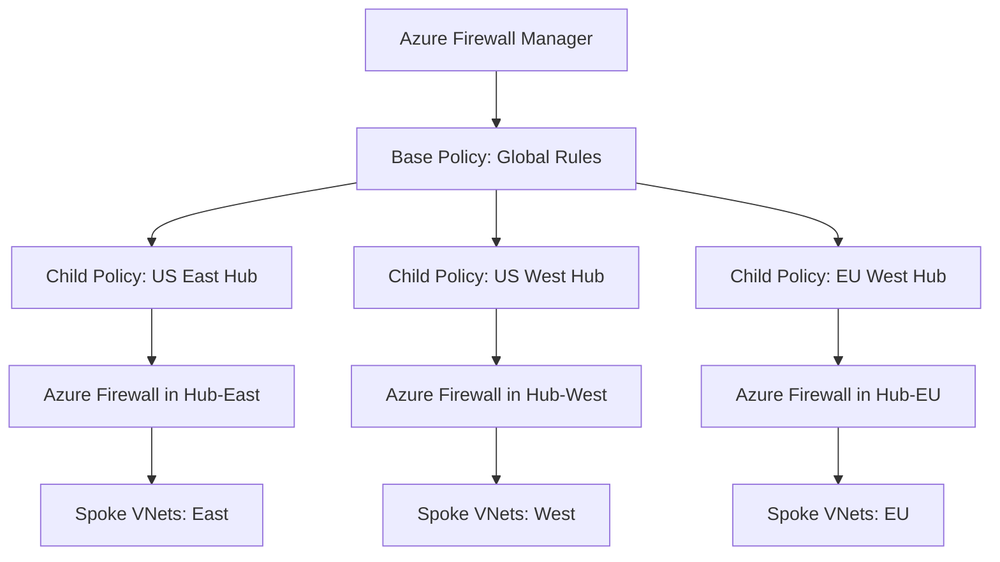

# How to Set Up Azure Firewall Manager Central Policy Management Across Multiple Virtual Networks

Author: [nawazdhandala](https://www.github.com/nawazdhandala)

Tags: Azure, Azure Firewall, Firewall Manager, Network Security, Central Policy, Hub-and-Spoke, Virtual Networks

Description: Learn how to use Azure Firewall Manager to create and manage centralized firewall policies across multiple virtual networks and regions in your Azure environment.

---

Managing firewall rules across multiple Azure virtual networks without a central management tool leads to inconsistencies, drift, and security gaps. One team creates permissive rules that another team would never approve, and nobody has a clear picture of what traffic is allowed across the entire environment. Azure Firewall Manager solves this by letting you define firewall policies centrally and apply them across multiple Azure Firewalls in different VNets and regions.

In this post, I will walk through setting up Firewall Manager with a hierarchy of policies that supports both global baseline rules and VNet-specific customizations.

## The Architecture: Hub-and-Spoke with Central Policy

The typical architecture for centralized firewall management uses a hub-and-spoke topology where each hub VNet has an Azure Firewall instance, and Firewall Manager pushes policies to all of them.



The policy hierarchy works through inheritance. The base policy contains rules that apply everywhere (like blocking known malicious domains or allowing Azure management traffic). Child policies inherit the base rules and add region-specific or workload-specific rules.

## Step 1: Create the Base Firewall Policy

The base policy defines your organization's security baseline. Every firewall in your environment will enforce these rules.

This creates a base firewall policy with global network and application rules:

```bash
# Create the base firewall policy
az network firewall policy create \
  --name fw-policy-base \
  --resource-group rg-firewall-policies \
  --location eastus \
  --sku Premium \
  --threat-intel-mode Deny \
  --idps-mode Deny

# Create a rule collection group for the base policy
# Lower priority numbers are evaluated first
az network firewall policy rule-collection-group create \
  --name "BaseRuleCollectionGroup" \
  --policy-name fw-policy-base \
  --resource-group rg-firewall-policies \
  --priority 100
```

Now add the baseline rules that should apply globally. This adds network rules that allow essential Azure management traffic:

```bash
# Allow Azure management plane traffic (required for Azure services to function)
az network firewall policy rule-collection-group collection add-filter-collection \
  --name "AllowAzureManagement" \
  --policy-name fw-policy-base \
  --resource-group rg-firewall-policies \
  --rule-collection-group-name "BaseRuleCollectionGroup" \
  --collection-priority 100 \
  --action Allow \
  --rule-name "AllowAzureMonitor" \
  --rule-type NetworkRule \
  --source-addresses "10.0.0.0/8" \
  --destination-addresses "AzureMonitor" \
  --destination-ports 443 \
  --ip-protocols TCP

# Block known malicious FQDNs using threat intelligence
# (This is handled automatically when threat-intel-mode is set to Deny)

# Allow DNS resolution
az network firewall policy rule-collection-group collection add-filter-collection \
  --name "AllowDNS" \
  --policy-name fw-policy-base \
  --resource-group rg-firewall-policies \
  --rule-collection-group-name "BaseRuleCollectionGroup" \
  --collection-priority 110 \
  --action Allow \
  --rule-name "AllowDnsToAzure" \
  --rule-type NetworkRule \
  --source-addresses "10.0.0.0/8" \
  --destination-addresses "168.63.129.16" \
  --destination-ports 53 \
  --ip-protocols TCP UDP
```

Add application rules for common web filtering. This allows specific FQDN categories while blocking everything else by default:

```bash
# Allow Windows Update traffic from all networks
az network firewall policy rule-collection-group collection add-filter-collection \
  --name "AllowWindowsUpdate" \
  --policy-name fw-policy-base \
  --resource-group rg-firewall-policies \
  --rule-collection-group-name "BaseRuleCollectionGroup" \
  --collection-priority 200 \
  --action Allow \
  --rule-name "WindowsUpdate" \
  --rule-type ApplicationRule \
  --source-addresses "10.0.0.0/8" \
  --protocols Https=443 \
  --fqdn-tags "WindowsUpdate"

# Allow access to Azure Key Vault from all networks
az network firewall policy rule-collection-group collection add-filter-collection \
  --name "AllowKeyVault" \
  --policy-name fw-policy-base \
  --resource-group rg-firewall-policies \
  --rule-collection-group-name "BaseRuleCollectionGroup" \
  --collection-priority 210 \
  --action Allow \
  --rule-name "AzureKeyVault" \
  --rule-type ApplicationRule \
  --source-addresses "10.0.0.0/8" \
  --protocols Https=443 \
  --target-fqdns "*.vault.azure.net"
```

## Step 2: Create Child Policies for Each Region

Child policies inherit all rules from the base policy and add region-specific rules.

This creates child policies for two regions that inherit from the base:

```bash
# Child policy for US East hub - inherits from base policy
BASE_POLICY_ID=$(az network firewall policy show \
  --name fw-policy-base \
  --resource-group rg-firewall-policies \
  --query id -o tsv)

az network firewall policy create \
  --name fw-policy-eastus \
  --resource-group rg-firewall-policies \
  --location eastus \
  --base-policy "$BASE_POLICY_ID" \
  --sku Premium

# Child policy for US West hub
az network firewall policy create \
  --name fw-policy-westus \
  --resource-group rg-firewall-policies \
  --location westus2 \
  --base-policy "$BASE_POLICY_ID" \
  --sku Premium
```

Now add region-specific rules to each child policy. This adds rules specific to the East US deployment:

```bash
# Create a rule collection group for East US specific rules
az network firewall policy rule-collection-group create \
  --name "EastUSRuleCollectionGroup" \
  --policy-name fw-policy-eastus \
  --resource-group rg-firewall-policies \
  --priority 200

# Allow East US spoke networks to access the SQL database cluster
az network firewall policy rule-collection-group collection add-filter-collection \
  --name "AllowEastUSSQLAccess" \
  --policy-name fw-policy-eastus \
  --resource-group rg-firewall-policies \
  --rule-collection-group-name "EastUSRuleCollectionGroup" \
  --collection-priority 100 \
  --action Allow \
  --rule-name "SQLAccess" \
  --rule-type NetworkRule \
  --source-addresses "10.1.0.0/16" \
  --destination-addresses "10.1.100.0/24" \
  --destination-ports 1433 \
  --ip-protocols TCP

# Allow East US applications to reach a specific SaaS API
az network firewall policy rule-collection-group collection add-filter-collection \
  --name "AllowEastUSSaaS" \
  --policy-name fw-policy-eastus \
  --resource-group rg-firewall-policies \
  --rule-collection-group-name "EastUSRuleCollectionGroup" \
  --collection-priority 110 \
  --action Allow \
  --rule-name "PartnerAPI" \
  --rule-type ApplicationRule \
  --source-addresses "10.1.0.0/16" \
  --protocols Https=443 \
  --target-fqdns "api.partner-service.com"
```

## Step 3: Deploy Azure Firewalls in Hub VNets

With the policies defined, deploy Azure Firewall instances in each hub VNet and associate them with their respective child policies.

This deploys an Azure Firewall in the East US hub VNet with the regional policy:

```bash
# Create the hub VNet with AzureFirewallSubnet
az network vnet create \
  --name vnet-hub-eastus \
  --resource-group rg-networking-eastus \
  --location eastus \
  --address-prefix 10.1.0.0/16 \
  --subnet-name AzureFirewallSubnet \
  --subnet-prefix 10.1.0.0/26

# Create a public IP for the firewall
az network public-ip create \
  --name pip-fw-eastus \
  --resource-group rg-networking-eastus \
  --location eastus \
  --sku Standard \
  --allocation-method Static

# Get the East US policy ID
EASTUS_POLICY_ID=$(az network firewall policy show \
  --name fw-policy-eastus \
  --resource-group rg-firewall-policies \
  --query id -o tsv)

# Deploy the Azure Firewall with the regional policy
az network firewall create \
  --name fw-hub-eastus \
  --resource-group rg-networking-eastus \
  --location eastus \
  --sku AZFW_VNet \
  --tier Premium \
  --vnet-name vnet-hub-eastus \
  --public-ip pip-fw-eastus \
  --firewall-policy "$EASTUS_POLICY_ID"
```

## Step 4: Configure Route Tables for Spoke Traffic

For spoke VNet traffic to flow through the firewall, you need User Defined Routes (UDRs) that point the default route to the firewall's private IP.

This creates a route table that sends all traffic through the Azure Firewall:

```bash
# Get the firewall private IP
FW_PRIVATE_IP=$(az network firewall show \
  --name fw-hub-eastus \
  --resource-group rg-networking-eastus \
  --query "ipConfigurations[0].privateIPAddress" -o tsv)

# Create a route table for spoke subnets
az network route-table create \
  --name rt-spoke-to-firewall \
  --resource-group rg-networking-eastus \
  --location eastus \
  --disable-bgp-route-propagation true

# Add default route pointing to the firewall
az network route-table route create \
  --name "ToFirewall" \
  --route-table-name rt-spoke-to-firewall \
  --resource-group rg-networking-eastus \
  --next-hop-type VirtualAppliance \
  --address-prefix "0.0.0.0/0" \
  --next-hop-ip-address "$FW_PRIVATE_IP"

# Associate the route table with spoke subnets
az network vnet subnet update \
  --name snet-workload \
  --vnet-name vnet-spoke-app1 \
  --resource-group rg-networking-eastus \
  --route-table rt-spoke-to-firewall
```

## Step 5: Use Firewall Manager to Monitor Policy Deployment

Firewall Manager provides a central dashboard where you can see all your firewalls, their associated policies, and the compliance status. Navigate to Azure Firewall Manager in the portal to see:

- **Secured virtual hubs and VNets** with their firewall instances
- **Firewall policy assignments** showing which policy is applied where
- **Policy compliance** indicating whether all firewalls are running the latest version of their assigned policy

You can also use Firewall Manager to convert existing firewalls to use central policies. If you already have Azure Firewalls with locally defined rules, you can import those rules into a policy and then associate the policy with the firewall.

## Step 6: Implement DNAT Rules for Inbound Traffic

If you need to allow inbound traffic from the internet to specific backend services, configure DNAT (Destination NAT) rules in the appropriate child policy.

This adds a DNAT rule that forwards incoming HTTPS traffic to an internal web server:

```bash
# Add DNAT rule to allow inbound web traffic
az network firewall policy rule-collection-group collection add-nat-collection \
  --name "InboundWebTraffic" \
  --policy-name fw-policy-eastus \
  --resource-group rg-firewall-policies \
  --rule-collection-group-name "EastUSRuleCollectionGroup" \
  --collection-priority 50 \
  --action DNAT \
  --rule-name "WebServerDNAT" \
  --source-addresses "*" \
  --destination-addresses "<firewall-public-ip>" \
  --destination-ports 443 \
  --ip-protocols TCP \
  --translated-address "10.1.2.4" \
  --translated-port 443
```

## Managing Policy Updates

One of the biggest advantages of centralized policy management is that changes to the base policy automatically propagate to all child policies and their associated firewalls. When you add a new rule to the base policy, every firewall in every region picks it up.

However, be careful with changes to the base policy. A misconfigured rule at the base level can break connectivity across your entire environment. I recommend:

1. **Test changes in a staging environment first.** Have a test firewall with a child of the base policy where you validate changes.
2. **Use rule collection group priorities carefully.** Base policy rules should use lower priority numbers (100-199) so child policy rules (200+) can override them if needed.
3. **Review changes with your security team.** Any base policy change affects every firewall, so it should go through your change management process.

## Logging and Analytics

Enable diagnostic logging on all Azure Firewall instances to send logs to a central Log Analytics workspace. This gives you a unified view of traffic across all your firewalls.

```bash
# Enable diagnostic logging on the firewall
az monitor diagnostic-settings create \
  --name "fw-diagnostics" \
  --resource "/subscriptions/<sub-id>/resourceGroups/rg-networking-eastus/providers/Microsoft.Network/azureFirewalls/fw-hub-eastus" \
  --workspace "/subscriptions/<sub-id>/resourceGroups/rg-monitoring/providers/Microsoft.OperationalInsights/workspaces/law-central" \
  --logs '[{"category":"AzureFirewallApplicationRule","enabled":true},{"category":"AzureFirewallNetworkRule","enabled":true},{"category":"AzureFirewallDnsProxy","enabled":true}]'
```

## Wrapping Up

Azure Firewall Manager transforms firewall management from a per-instance task into a centralized, policy-driven operation. The policy inheritance model is particularly powerful - define your security baseline once in the base policy, customize per region or workload in child policies, and every firewall gets the rules it needs automatically. For organizations with multiple Azure regions or complex hub-and-spoke topologies, this approach is far more manageable and less error-prone than configuring each firewall individually. Start with a solid base policy, build your hierarchy carefully, and you will have a consistent firewall posture across your entire Azure environment.
