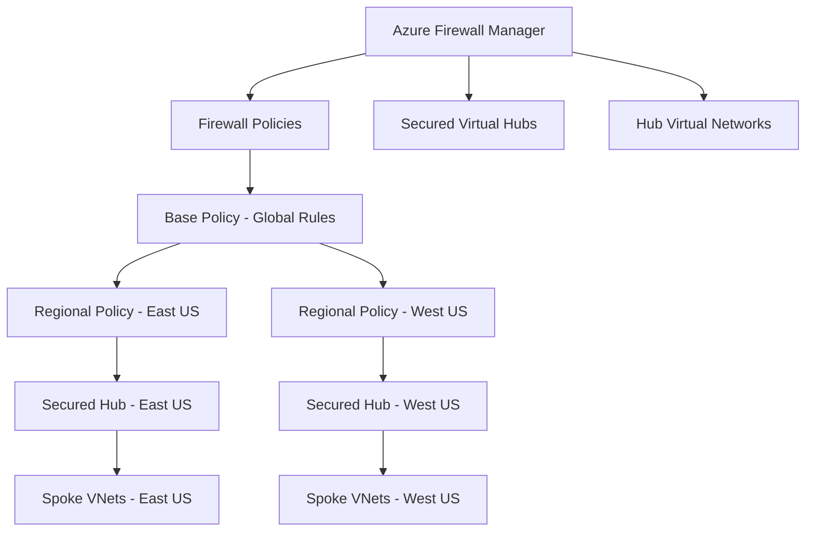

# How to Set Up Azure Firewall Manager with Secured Virtual Hubs and Firewall Policies

Author: [nawazdhandala](https://www.github.com/nawazdhandala)

Tags: Azure, Azure Firewall, Firewall Manager, Virtual WAN, Secured Virtual Hub, Network Security, Firewall Policy

Description: Learn how to deploy Azure Firewall Manager with secured virtual hubs and hierarchical firewall policies for centralized network security management at scale.

---

Managing network security across multiple regions and virtual networks gets complicated fast. When you have Azure Firewalls in several regions, each with its own rules, keeping them consistent and manageable becomes a real challenge. Azure Firewall Manager solves this by providing a central management plane for Azure Firewall deployments across secured virtual hubs and hub virtual networks. You define firewall policies once, organize them into a hierarchy, and apply them consistently across your infrastructure.

This guide walks through setting up Firewall Manager with secured virtual hubs, creating hierarchical policies, and managing them at scale.

## Understanding the Architecture

Azure Firewall Manager supports two architecture types:

**Secured virtual hub**: An Azure Virtual WAN Hub with Azure Firewall deployed inside it. This is the recommended approach for new deployments because it integrates with the Azure Virtual WAN routing infrastructure.

**Hub virtual network**: A standard Azure VNet that you designate as a hub with Azure Firewall deployed in it. This is used when you already have a hub-and-spoke topology without Virtual WAN.



The hierarchical policy model is one of Firewall Manager's most powerful features. You create a base policy with rules that apply everywhere (like blocking known malicious IPs), and then child policies inherit those rules and add region-specific or application-specific rules on top.

## Prerequisites

You need:
- Azure subscription with Contributor or Network Contributor role
- Azure Virtual WAN deployed (for secured virtual hub approach)
- Understanding of your network topology and security requirements
- Budget for Azure Firewall and Virtual WAN costs

## Step 1: Create an Azure Virtual WAN

If you do not already have a Virtual WAN:

```powershell
# Create a resource group for the WAN infrastructure
New-AzResourceGroup -Name "wan-rg" -Location "eastus"

# Create the Virtual WAN
$wan = New-AzVirtualWan `
    -ResourceGroupName "wan-rg" `
    -Name "enterprise-vwan" `
    -Location "eastus" `
    -VirtualWanType "Standard"  # Standard tier required for secured hubs

Write-Host "Virtual WAN created: $($wan.Name)"
```

## Step 2: Create a Secured Virtual Hub

A secured virtual hub is a Virtual WAN hub with Azure Firewall integrated:

```powershell
# Create a Virtual WAN Hub
$hub = New-AzVirtualHub `
    -ResourceGroupName "wan-rg" `
    -VirtualWanId $wan.Id `
    -Name "hub-eastus" `
    -Location "eastus" `
    -AddressPrefix "10.0.0.0/24"

Write-Host "Virtual Hub created: $($hub.Name)"
Write-Host "Waiting for hub provisioning to complete..."

# Wait for hub to be provisioned (this can take 10-30 minutes)
do {
    Start-Sleep -Seconds 30
    $hubStatus = Get-AzVirtualHub -ResourceGroupName "wan-rg" -Name "hub-eastus"
    Write-Host "  Status: $($hubStatus.ProvisioningState)"
} while ($hubStatus.ProvisioningState -ne "Succeeded")
```

## Step 3: Create a Base Firewall Policy

Create a base (parent) policy with rules that should apply to all locations:

```powershell
# Create the base firewall policy
# This contains global rules inherited by all child policies
$basePolicy = New-AzFirewallPolicy `
    -ResourceGroupName "wan-rg" `
    -Name "base-firewall-policy" `
    -Location "eastus" `
    -ThreatIntelMode "Deny" `
    -DnsSetting @{
        EnableProxy = $true
        Servers = @("168.63.129.16")  # Azure DNS
    }

Write-Host "Base firewall policy created: $($basePolicy.Name)"
```

Add global network rules to the base policy:

```powershell
# Create a rule collection group in the base policy
# Rule collection groups have priorities - lower numbers are evaluated first
$ruleCollectionGroup = New-AzFirewallPolicyRuleCollectionGroup `
    -Name "GlobalRules" `
    -Priority 100 `
    -FirewallPolicyName "base-firewall-policy" `
    -ResourceGroupName "wan-rg"

# Define a network rule collection for infrastructure access
$infraRule1 = New-AzFirewallPolicyNetworkRule `
    -Name "AllowDNS" `
    -Protocol "UDP", "TCP" `
    -SourceAddress "*" `
    -DestinationAddress "168.63.129.16" `
    -DestinationPort "53" `
    -Description "Allow DNS queries to Azure DNS"

$infraRule2 = New-AzFirewallPolicyNetworkRule `
    -Name "AllowNTP" `
    -Protocol "UDP" `
    -SourceAddress "*" `
    -DestinationAddress "time.windows.com" `
    -DestinationPort "123" `
    -Description "Allow NTP time synchronization"

$networkRuleCollection = New-AzFirewallPolicyFilterRuleCollection `
    -Name "InfrastructureRules" `
    -Priority 100 `
    -ActionType "Allow" `
    -Rule $infraRule1, $infraRule2

# Define an application rule collection for global web access
$webRule = New-AzFirewallPolicyApplicationRule `
    -Name "AllowMicrosoftUpdates" `
    -Protocol @{Port = 443; ProtocolType = "Https"} `
    -SourceAddress "*" `
    -TargetFqdn "*.microsoft.com", "*.windowsupdate.com", "*.windows.com" `
    -Description "Allow Windows Update and Microsoft services"

$appRuleCollection = New-AzFirewallPolicyFilterRuleCollection `
    -Name "GlobalWebAccess" `
    -Priority 200 `
    -ActionType "Allow" `
    -Rule $webRule

# Update the rule collection group with both collections
Set-AzFirewallPolicyRuleCollectionGroup `
    -Name "GlobalRules" `
    -Priority 100 `
    -FirewallPolicyName "base-firewall-policy" `
    -ResourceGroupName "wan-rg" `
    -RuleCollection $networkRuleCollection, $appRuleCollection

Write-Host "Global rules added to base policy."
```

## Step 4: Create Child Policies for Each Region

Child policies inherit all rules from the parent and can add their own:

```powershell
# Create a child policy for the East US region
# It inherits all rules from the base policy
$childPolicyEast = New-AzFirewallPolicy `
    -ResourceGroupName "wan-rg" `
    -Name "eastus-firewall-policy" `
    -Location "eastus" `
    -BasePolicy $basePolicy.Id

Write-Host "Child policy created for East US, inheriting from base policy."

# Add region-specific rules to the child policy
$eastRule = New-AzFirewallPolicyApplicationRule `
    -Name "AllowEastUSApps" `
    -Protocol @{Port = 443; ProtocolType = "Https"} `
    -SourceAddress "10.1.0.0/16" `
    -TargetFqdn "eastus-app.contoso.com", "eastus-api.contoso.com" `
    -Description "Allow access to East US regional applications"

$eastRuleCollection = New-AzFirewallPolicyFilterRuleCollection `
    -Name "RegionalApps" `
    -Priority 300 `
    -ActionType "Allow" `
    -Rule $eastRule

$ruleGroup = New-AzFirewallPolicyRuleCollectionGroup `
    -Name "RegionalRules" `
    -Priority 200 `
    -FirewallPolicyName "eastus-firewall-policy" `
    -ResourceGroupName "wan-rg" `
    -RuleCollection $eastRuleCollection

Write-Host "Regional rules added to East US child policy."
```

## Step 5: Deploy Azure Firewall to the Secured Hub

Now deploy Azure Firewall in the Virtual WAN Hub and associate it with the regional policy:

```powershell
# Deploy Azure Firewall to the secured virtual hub
# This associates the firewall with the regional child policy
$firewall = New-AzFirewall `
    -ResourceGroupName "wan-rg" `
    -Name "fw-hub-eastus" `
    -Location "eastus" `
    -VirtualHubId $hub.Id `
    -FirewallPolicyId $childPolicyEast.Id `
    -Sku "AZFW_Hub"  # SKU for Virtual WAN hub deployment

Write-Host "Azure Firewall deployed to hub-eastus."
Write-Host "Firewall provisioning can take 10-15 minutes."
```

Alternatively, you can do this through Firewall Manager in the portal:

1. Go to Azure Firewall Manager.
2. Click on Virtual Hubs.
3. Select your hub.
4. Click Convert to secured virtual hub.
5. Select the firewall policy to associate.
6. Choose the Azure Firewall tier (Standard or Premium).
7. Click Create.

## Step 6: Connect Spoke Virtual Networks

Connect your spoke VNets to the secured hub:

```powershell
# Connect a spoke VNet to the virtual hub
$spokeVnet = Get-AzVirtualNetwork -ResourceGroupName "app-rg" -Name "app-vnet-eastus"

New-AzVirtualHubVnetConnection `
    -ResourceGroupName "wan-rg" `
    -ParentResourceName "hub-eastus" `
    -Name "conn-app-vnet" `
    -RemoteVirtualNetwork $spokeVnet `
    -RoutingConfiguration @{
        # Route all traffic through the secured hub firewall
        AssociatedRouteTable = @{
            Id = "/subscriptions/SUB_ID/resourceGroups/wan-rg/providers/Microsoft.Network/virtualHubs/hub-eastus/hubRouteTables/defaultRouteTable"
        }
    }

Write-Host "Spoke VNet connected to secured hub."
```

## Step 7: Configure Routing Intent

Routing intent forces all traffic from spoke VNets through the Azure Firewall:

1. In the Azure portal, go to your Virtual Hub.
2. Click on Routing Intent and Routing Policies.
3. Enable Internet Traffic routing policy and select the Azure Firewall as the next hop.
4. Enable Private Traffic routing policy to route inter-VNet traffic through the firewall.

This ensures that all traffic - both internet-bound and between spokes - passes through the firewall for inspection.

## Step 8: Add IDPS and TLS Inspection (Premium Tier)

If you deployed Azure Firewall Premium, you can enable IDPS (Intrusion Detection and Prevention System) and TLS inspection in the firewall policy:

```powershell
# Update the base policy with IDPS settings
# This applies to all child policies
$idpsSettings = @{
    Mode = "Alert"  # Use "Deny" for prevention mode
    # Optionally configure signature overrides
    SignatureOverrides = @(
        @{
            Id = "2024897"
            Mode = "Deny"  # Block specific signatures even in alert mode
        }
    )
}

# Enable TLS inspection (requires a certificate)
$tlsSettings = @{
    CertificateAuthority = @{
        KeyVaultSecretId = "https://firewall-keyvault.vault.azure.net/secrets/tls-cert"
        Name = "firewall-tls-cert"
    }
}

Write-Host "IDPS and TLS inspection settings are configured through the firewall policy in the portal."
Write-Host "Navigate to the policy, then IDPS to configure detection and prevention rules."
Write-Host "Navigate to TLS Inspection to configure certificate-based inspection."
```

## Step 9: Monitor with Firewall Manager

Firewall Manager provides a centralized view of all your firewalls:

1. Go to Azure Firewall Manager.
2. The Overview page shows all secured hubs and their status.
3. Click on a secured hub to see its firewall configuration.
4. Use the Threat Intelligence tab to see threats blocked across all firewalls.

For detailed logging, enable diagnostic settings on each Azure Firewall to send logs to Log Analytics:

```kusto
// Query firewall logs across all firewalls
// This gives you a unified view of network activity
AzureDiagnostics
| where Category in ("AzureFirewallNetworkRule", "AzureFirewallApplicationRule")
| where TimeGenerated > ago(1h)
| extend
    Protocol = extract("Protocol: (.*?),", 1, msg_s),
    SourceIP = extract("from (.*?):", 1, msg_s),
    DestIP = extract("to (.*?):", 1, msg_s),
    Action = extract("Action: (.*?)\\.", 1, msg_s)
| summarize RuleHits = count() by Action, Resource
| sort by RuleHits desc
```

## Hierarchical Policy Best Practices

When designing your policy hierarchy:

- Put deny rules in the base policy. If something should be blocked everywhere, enforce it at the top level.
- Put allow rules in child policies. Each region or business unit can have its own permitted traffic.
- Use rule collection group priorities carefully. Lower numbers are evaluated first, so put deny rules in lower-numbered groups.
- Keep the base policy focused on security. DNS settings, threat intelligence mode, and core deny rules belong here.
- Test policy changes in a staging environment before applying to production hubs.

## Cost Considerations

The secured virtual hub architecture involves several cost components:

- Azure Virtual WAN hub: Per-hour charge plus data processing
- Azure Firewall: Per-hour charge plus data processing per GB
- Firewall Policy: Free for the first policy, additional policies have a small charge
- Bandwidth: Standard Azure bandwidth charges for internet egress

For a two-region deployment with Standard tier firewalls, expect costs in the range of $3,000-5,000 per month before bandwidth charges. Premium tier with IDPS and TLS inspection increases the per-hour firewall cost.

## Conclusion

Azure Firewall Manager with secured virtual hubs provides the centralized network security management that large organizations need. The hierarchical policy model lets you define global rules once and extend them with region-specific configurations. The key steps are deploying the Virtual WAN, creating secured hubs with Azure Firewall, building a policy hierarchy from base to child, connecting spoke VNets, and configuring routing intent to force traffic through the firewall. Once in place, you have a consistent, manageable, and auditable network security layer across all your Azure regions.
