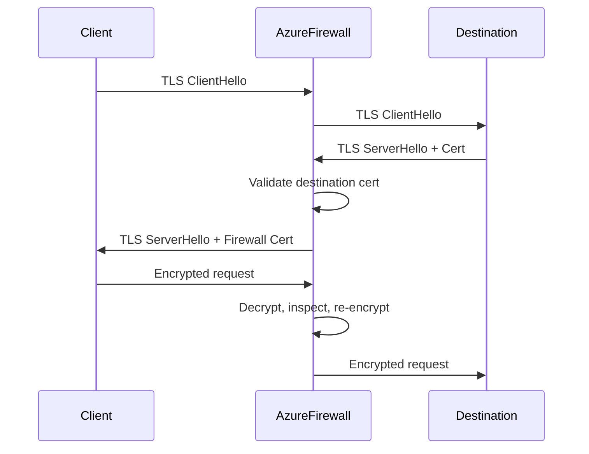

# How to Set Up Azure Firewall Premium with TLS Inspection

Author: [nawazdhandala](https://www.github.com/nawazdhandala)

Tags: Azure, Firewall, TLS Inspection, Security, Network Security, Encryption

Description: A practical guide to setting up Azure Firewall Premium with TLS inspection to decrypt and inspect encrypted traffic for threat detection.

---

Encrypted traffic is everywhere. That is generally a good thing for privacy and security, but it creates a blind spot for network security tools. If a firewall cannot see inside TLS-encrypted connections, it cannot detect malware, command-and-control traffic, or data exfiltration hiding inside HTTPS sessions. Azure Firewall Premium solves this with TLS inspection, which decrypts traffic at the firewall, inspects it against your security rules, and re-encrypts it before forwarding to the destination.

This guide walks through the full setup process, including certificate management, policy configuration, and the gotchas you will run into along the way.

## How TLS Inspection Works

TLS inspection is essentially a man-in-the-middle operation performed by your firewall. When a client initiates a TLS connection to an external server, the firewall intercepts the handshake. It presents its own certificate to the client (signed by your intermediate CA), establishes a separate TLS session with the actual destination server, and passes traffic between the two sessions after inspecting it.

The flow looks like this:



For this to work without certificate errors on the client side, the client must trust the CA certificate that the firewall uses to sign its interception certificates.

## Prerequisites

You will need:

- An Azure subscription with Owner or Contributor access
- An existing Azure Virtual Network with a subnet named AzureFirewallSubnet (minimum /26)
- Azure Key Vault for storing the intermediate CA certificate
- An intermediate CA certificate in PFX format (we will cover generating one)
- Azure CLI or PowerShell with the Az module

## Step 1: Generate an Intermediate CA Certificate

You need an intermediate CA certificate that Azure Firewall will use to sign the certificates it presents to clients during TLS inspection. Do not use your root CA directly - use an intermediate to limit the blast radius if anything goes wrong.

Here is how to generate one using OpenSSL:

```bash
# Generate the intermediate CA private key
openssl genrsa -out intermediate-ca.key 4096

# Create a certificate signing request for the intermediate CA
openssl req -new -key intermediate-ca.key \
  -out intermediate-ca.csr \
  -subj "/CN=Azure Firewall Intermediate CA/O=MyOrg/C=US"

# Sign the intermediate CA certificate with your root CA
# This assumes you have root-ca.key and root-ca.crt available
openssl x509 -req -in intermediate-ca.csr \
  -CA root-ca.crt \
  -CAkey root-ca.key \
  -CAcreateserial \
  -out intermediate-ca.crt \
  -days 365 \
  -sha256 \
  -extensions v3_ca \
  -extfile <(echo "[v3_ca]
basicConstraints = critical,CA:TRUE,pathlen:0
keyUsage = critical,keyCertSign,cRLSign")

# Package as PFX for Azure Key Vault import
openssl pkcs12 -export \
  -out intermediate-ca.pfx \
  -inkey intermediate-ca.key \
  -in intermediate-ca.crt \
  -certfile root-ca.crt \
  -passout pass:YourSecurePassword
```

## Step 2: Store the Certificate in Azure Key Vault

Azure Firewall Premium retrieves the intermediate CA certificate from Key Vault using a managed identity. First, import the certificate:

```bash
# Create a Key Vault if you do not have one
az keyvault create \
  --name myFirewallKV \
  --resource-group myResourceGroup \
  --location eastus \
  --sku premium

# Import the intermediate CA certificate
az keyvault certificate import \
  --vault-name myFirewallKV \
  --name intermediate-ca \
  --file intermediate-ca.pfx \
  --password "YourSecurePassword"
```

## Step 3: Create the Firewall Policy with TLS Inspection

Azure Firewall Premium uses a firewall policy object to configure TLS inspection. The policy references the Key Vault certificate.

```bash
# Create a user-assigned managed identity for the firewall
az identity create \
  --name fw-identity \
  --resource-group myResourceGroup \
  --location eastus

# Get the identity's principal ID and resource ID
IDENTITY_PRINCIPAL=$(az identity show --name fw-identity \
  --resource-group myResourceGroup \
  --query principalId -o tsv)

IDENTITY_ID=$(az identity show --name fw-identity \
  --resource-group myResourceGroup \
  --query id -o tsv)

# Grant the managed identity access to Key Vault secrets and certificates
az keyvault set-policy \
  --name myFirewallKV \
  --object-id $IDENTITY_PRINCIPAL \
  --secret-permissions get list \
  --certificate-permissions get list

# Get the Key Vault certificate secret ID
CERT_SECRET_ID=$(az keyvault certificate show \
  --vault-name myFirewallKV \
  --name intermediate-ca \
  --query sid -o tsv)

# Create the firewall policy with TLS inspection configuration
az network firewall policy create \
  --name myFwPolicy \
  --resource-group myResourceGroup \
  --location eastus \
  --sku Premium \
  --identity-type UserAssigned \
  --user-assigned-identity $IDENTITY_ID \
  --transport-security-certificate-authority-name intermediate-ca \
  --transport-security-certificate-authority-key-vault-secret-id $CERT_SECRET_ID
```

## Step 4: Create Application Rules with TLS Inspection Enabled

TLS inspection is enabled on a per-rule basis within rule collection groups. You choose which traffic gets inspected by defining application rules with TLS inspection turned on.

```bash
# Create a rule collection group
az network firewall policy rule-collection-group create \
  --name DefaultApplicationRuleCollectionGroup \
  --policy-name myFwPolicy \
  --resource-group myResourceGroup \
  --priority 300

# Add an application rule collection with TLS inspection
az network firewall policy rule-collection-group collection add-filter-collection \
  --name "InspectWebTraffic" \
  --policy-name myFwPolicy \
  --resource-group myResourceGroup \
  --rule-collection-group-name DefaultApplicationRuleCollectionGroup \
  --collection-priority 100 \
  --action Allow \
  --rule-name "AllowAndInspectHTTPS" \
  --rule-type ApplicationRule \
  --source-addresses "10.0.0.0/16" \
  --protocols Https=443 \
  --target-fqdns "*.example.com" \
  --enable-tls-inspection true
```

## Step 5: Deploy Azure Firewall Premium

Now deploy the actual firewall instance and associate it with the policy:

```bash
# Create a public IP for the firewall
az network public-ip create \
  --name fw-public-ip \
  --resource-group myResourceGroup \
  --location eastus \
  --allocation-method Static \
  --sku Standard

# Deploy Azure Firewall Premium with the policy
az network firewall create \
  --name myFirewallPremium \
  --resource-group myResourceGroup \
  --location eastus \
  --sku AZFW_VNet \
  --tier Premium \
  --firewall-policy myFwPolicy \
  --vnet-name myVNet \
  --public-ip fw-public-ip
```

## Step 6: Distribute the Root CA Certificate to Clients

For TLS inspection to work without certificate warnings, every client behind the firewall must trust the root CA that signed your intermediate certificate. How you distribute this depends on your environment:

- **Domain-joined Windows machines**: Deploy via Group Policy (Computer Configuration > Policies > Windows Settings > Security Settings > Public Key Policies > Trusted Root Certification Authorities)
- **Linux machines**: Copy the root CA certificate to `/usr/local/share/ca-certificates/` and run `update-ca-certificates`
- **Containers**: Include the certificate in your container image or mount it at runtime
- **Mobile devices**: Use MDM solutions like Intune to push the certificate

This step is critical. If clients do not trust the root CA, they will see certificate errors for every HTTPS site they visit through the firewall.

## Step 7: Configure IDPS Rules

One of the main benefits of TLS inspection is that it enables the Intrusion Detection and Prevention System (IDPS) to analyze decrypted traffic. Configure IDPS in your firewall policy:

```bash
# Enable IDPS in alert and deny mode
az network firewall policy intrusion-detection add \
  --policy-name myFwPolicy \
  --resource-group myResourceGroup \
  --mode "Alert"

# You can override specific signature rules
# For example, set a specific signature to deny mode
az network firewall policy intrusion-detection add \
  --policy-name myFwPolicy \
  --resource-group myResourceGroup \
  --mode "Deny" \
  --signature-overrides id=2024897 mode=Deny
```

## Troubleshooting Common Issues

**Certificate chain errors**: The most frequent problem is an incomplete certificate chain. Make sure the PFX file you import into Key Vault includes the full chain from the intermediate CA up to the root CA.

**Performance impact**: TLS inspection adds latency because the firewall has to decrypt and re-encrypt every inspected connection. Plan your firewall sizing accordingly. Azure Firewall Premium can handle up to 250 Mbps of TLS inspection throughput per instance.

**Certificate pinning**: Some applications use certificate pinning, which means they only accept specific certificates. These applications will break with TLS inspection. You need to create bypass rules for these destinations.

**Key Vault access failures**: If the firewall cannot retrieve the certificate from Key Vault, TLS inspection silently fails. Monitor the firewall's diagnostic logs for Key Vault-related errors and verify the managed identity has the correct permissions.

## What to Exclude from TLS Inspection

Not all traffic should go through TLS inspection. Here are common exclusions:

- Windows Update endpoints (certificate pinning)
- Microsoft 365 optimize-category endpoints (performance reasons)
- Banking and financial service sites (regulatory concerns)
- Health-related endpoints (HIPAA considerations)
- Any endpoint that uses certificate pinning

Create network rules (not application rules) for traffic you want to bypass TLS inspection, since network rules do not perform TLS interception.

## Wrapping Up

TLS inspection with Azure Firewall Premium gives you visibility into encrypted traffic that would otherwise be a blind spot. The setup involves generating an intermediate CA, storing it in Key Vault, creating a Premium firewall policy with TLS inspection enabled, and distributing the root CA to all clients. The most important thing to get right is the certificate chain and the client trust configuration. Take time to test thoroughly in a non-production environment before rolling this out to your entire network.
