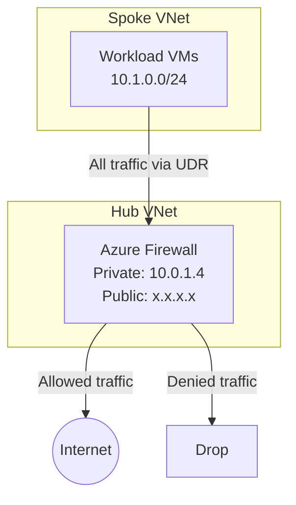
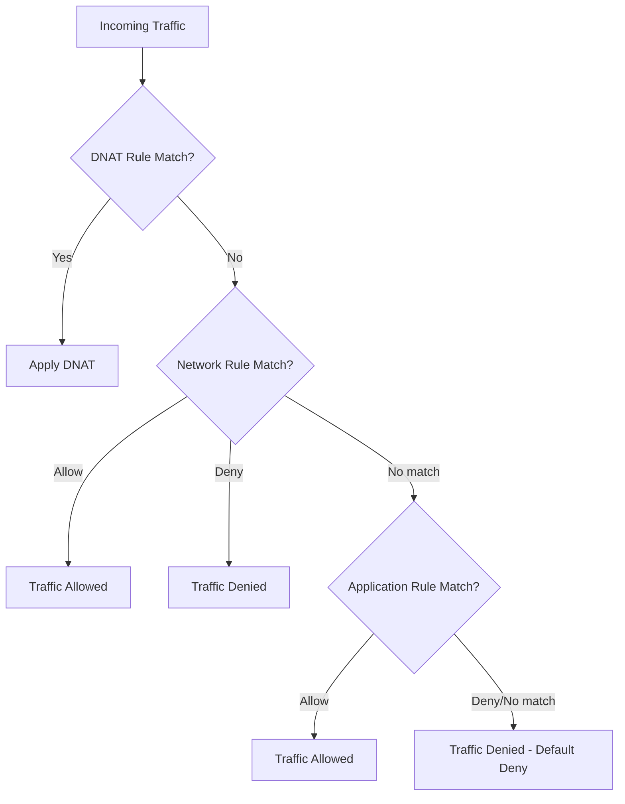

# How to Set Up Azure Firewall with Network and Application Rules

Author: [nawazdhandala](https://www.github.com/nawazdhandala)

Tags: Azure, Azure Firewall, Network Security, Firewall Rules, Cloud Networking, Traffic Filtering

Description: A practical guide to deploying Azure Firewall and configuring network and application rules to control traffic in your virtual network.

---

Azure Firewall is a managed, cloud-native network security service that protects your Azure virtual network resources. Unlike NSGs which operate at Layer 3/4, Azure Firewall provides Layer 3 through Layer 7 filtering. It can inspect and filter traffic based on IP addresses and ports (network rules), fully qualified domain names (application rules), and even perform threat intelligence-based filtering.

This guide covers deploying an Azure Firewall, configuring network rules for port-based filtering, application rules for FQDN-based filtering, and setting up the routing to direct traffic through the firewall.

## Architecture

A typical Azure Firewall deployment sits in a hub VNet, with spoke VNets routing traffic through it. The firewall has a public IP for outbound internet access and a private IP that workloads route to.



## Prerequisites

- An Azure subscription
- Azure CLI installed and configured
- Basic understanding of VNets and subnets

## Step 1: Create the Network Infrastructure

Azure Firewall requires its own dedicated subnet named `AzureFirewallSubnet` with a minimum size of /26.

```bash
# Create a resource group
az group create --name rg-firewall-demo --location eastus

# Create the hub VNet with AzureFirewallSubnet
az network vnet create \
  --resource-group rg-firewall-demo \
  --name vnet-hub \
  --location eastus \
  --address-prefixes 10.0.0.0/16 \
  --subnet-name AzureFirewallSubnet \
  --subnet-prefixes 10.0.1.0/26

# Create a workload subnet in the hub VNet
az network vnet subnet create \
  --resource-group rg-firewall-demo \
  --vnet-name vnet-hub \
  --name subnet-workloads \
  --address-prefixes 10.0.2.0/24

# Create a public IP for the firewall
az network public-ip create \
  --resource-group rg-firewall-demo \
  --name pip-firewall \
  --sku Standard \
  --allocation-method Static
```

## Step 2: Deploy Azure Firewall

```bash
# Create the Azure Firewall
az network firewall create \
  --resource-group rg-firewall-demo \
  --name fw-demo \
  --location eastus \
  --sku AZFW_VNet \
  --tier Standard

# Associate the firewall with the VNet and public IP
az network firewall ip-config create \
  --resource-group rg-firewall-demo \
  --firewall-name fw-demo \
  --name fw-ipconfig \
  --public-ip-address pip-firewall \
  --vnet-name vnet-hub
```

After creation, get the firewall's private IP address. This is the IP you will use as the next hop in your route tables.

```bash
# Get the firewall's private IP
az network firewall show \
  --resource-group rg-firewall-demo \
  --name fw-demo \
  --query "ipConfigurations[0].privateIPAddress" \
  --output tsv
```

This typically returns something like `10.0.1.4`.

## Step 3: Create a Firewall Policy

Azure Firewall uses policies to organize rules. A policy can contain multiple rule collection groups, each with rule collections, each with individual rules.

```bash
# Create a firewall policy
az network firewall policy create \
  --resource-group rg-firewall-demo \
  --name policy-fw-demo \
  --location eastus \
  --sku Standard

# Associate the policy with the firewall
az network firewall update \
  --resource-group rg-firewall-demo \
  --name fw-demo \
  --firewall-policy policy-fw-demo
```

## Step 4: Add Network Rules

Network rules filter traffic based on source/destination IP, port, and protocol. They are useful for allowing specific port-based communication.

```bash
# Create a rule collection group for network rules
az network firewall policy rule-collection-group create \
  --resource-group rg-firewall-demo \
  --policy-name policy-fw-demo \
  --name rcg-network \
  --priority 200

# Add a network rule collection that allows DNS and NTP
az network firewall policy rule-collection-group collection add-filter-collection \
  --resource-group rg-firewall-demo \
  --policy-name policy-fw-demo \
  --rule-collection-group-name rcg-network \
  --name rc-allow-infrastructure \
  --collection-priority 100 \
  --action Allow \
  --rule-type NetworkRule \
  --rule-name allow-dns \
  --source-addresses "10.0.2.0/24" \
  --destination-addresses "*" \
  --destination-ports 53 \
  --ip-protocols UDP TCP

# Add another rule to allow SSH to a specific server
az network firewall policy rule-collection-group collection rule add \
  --resource-group rg-firewall-demo \
  --policy-name policy-fw-demo \
  --rule-collection-group-name rcg-network \
  --collection-name rc-allow-infrastructure \
  --rule-type NetworkRule \
  --name allow-ssh-to-jumpbox \
  --source-addresses "10.0.2.0/24" \
  --destination-addresses "10.0.3.4" \
  --destination-ports 22 \
  --ip-protocols TCP
```

## Step 5: Add Application Rules

Application rules are where Azure Firewall really shines. They let you allow or deny traffic based on fully qualified domain names (FQDNs). This means you can say "allow traffic to *.ubuntu.com for package updates" without knowing the IP addresses.

```bash
# Create a rule collection group for application rules
az network firewall policy rule-collection-group create \
  --resource-group rg-firewall-demo \
  --policy-name policy-fw-demo \
  --name rcg-application \
  --priority 300

# Add an application rule collection for web access
az network firewall policy rule-collection-group collection add-filter-collection \
  --resource-group rg-firewall-demo \
  --policy-name policy-fw-demo \
  --rule-collection-group-name rcg-application \
  --name rc-allow-web \
  --collection-priority 100 \
  --action Allow \
  --rule-type ApplicationRule \
  --rule-name allow-package-updates \
  --source-addresses "10.0.2.0/24" \
  --protocols Https=443 Http=80 \
  --target-fqdns "*.ubuntu.com" "*.debian.org" "packages.microsoft.com"

# Add a rule to allow access to Azure services
az network firewall policy rule-collection-group collection rule add \
  --resource-group rg-firewall-demo \
  --policy-name policy-fw-demo \
  --rule-collection-group-name rcg-application \
  --collection-name rc-allow-web \
  --rule-type ApplicationRule \
  --name allow-azure-services \
  --source-addresses "10.0.2.0/24" \
  --protocols Https=443 \
  --target-fqdns "*.azure.com" "*.microsoft.com" "*.windows.net"
```

## Step 6: Add DNAT Rules (Optional)

If you need to expose internal services to the internet through the firewall, use DNAT (Destination NAT) rules.

```bash
# Create a rule collection group for DNAT rules
az network firewall policy rule-collection-group create \
  --resource-group rg-firewall-demo \
  --policy-name policy-fw-demo \
  --name rcg-dnat \
  --priority 100

# Add a DNAT rule to forward port 8080 to an internal web server
az network firewall policy rule-collection-group collection add-nat-collection \
  --resource-group rg-firewall-demo \
  --policy-name policy-fw-demo \
  --rule-collection-group-name rcg-dnat \
  --name rc-dnat-web \
  --collection-priority 100 \
  --action DNAT \
  --rule-name dnat-webserver \
  --source-addresses "*" \
  --destination-addresses "$(az network public-ip show --resource-group rg-firewall-demo --name pip-firewall --query ipAddress -o tsv)" \
  --destination-ports 8080 \
  --translated-address 10.0.2.10 \
  --translated-port 80 \
  --ip-protocols TCP
```

## Step 7: Configure Route Tables

The firewall only inspects traffic that is routed through it. Create a route table that forces traffic from the workload subnet through the firewall's private IP.

```bash
# Create a route table
az network route-table create \
  --resource-group rg-firewall-demo \
  --name rt-workloads \
  --location eastus \
  --disable-bgp-route-propagation true

# Add a default route pointing to the firewall
az network route-table route create \
  --resource-group rg-firewall-demo \
  --route-table-name rt-workloads \
  --name route-to-firewall \
  --address-prefix 0.0.0.0/0 \
  --next-hop-type VirtualAppliance \
  --next-hop-ip-address 10.0.1.4

# Associate the route table with the workload subnet
az network vnet subnet update \
  --resource-group rg-firewall-demo \
  --vnet-name vnet-hub \
  --name subnet-workloads \
  --route-table rt-workloads
```

## Step 8: Enable Logging

Azure Firewall can send logs to Log Analytics, Storage, or Event Hubs. This is essential for troubleshooting and compliance.

```bash
# Create a Log Analytics workspace
az monitor log-analytics workspace create \
  --resource-group rg-firewall-demo \
  --workspace-name law-firewall \
  --location eastus

# Enable diagnostic logging for the firewall
FIREWALL_ID=$(az network firewall show --resource-group rg-firewall-demo --name fw-demo --query id -o tsv)
WORKSPACE_ID=$(az monitor log-analytics workspace show --resource-group rg-firewall-demo --workspace-name law-firewall --query id -o tsv)

az monitor diagnostic-settings create \
  --resource $FIREWALL_ID \
  --name diag-firewall \
  --workspace $WORKSPACE_ID \
  --logs '[{"category":"AzureFirewallApplicationRule","enabled":true},{"category":"AzureFirewallNetworkRule","enabled":true},{"category":"AzureFirewallDnsProxy","enabled":true}]'
```

## Rule Processing Order

Azure Firewall processes rules in a specific order, and understanding this is critical for troubleshooting:

1. **DNAT rules** are processed first
2. **Network rules** are processed second
3. **Application rules** are processed last

If a network rule allows traffic, application rules for the same traffic are not evaluated. This means if you have a network rule allowing all TCP/443 traffic, your FQDN-based application rules will never be hit for HTTPS traffic.



## Cleanup

```bash
# Delete all resources
az group delete --name rg-firewall-demo --yes --no-wait
```

## Wrapping Up

Azure Firewall provides centralized traffic filtering with network rules for port-based control and application rules for FQDN-based control. The deployment process involves creating the firewall in a dedicated subnet, defining policies with rule collections, and routing traffic through the firewall with UDRs. Remember the processing order - DNAT first, then network rules, then application rules - and always enable diagnostic logging so you can troubleshoot when traffic gets unexpectedly blocked.
