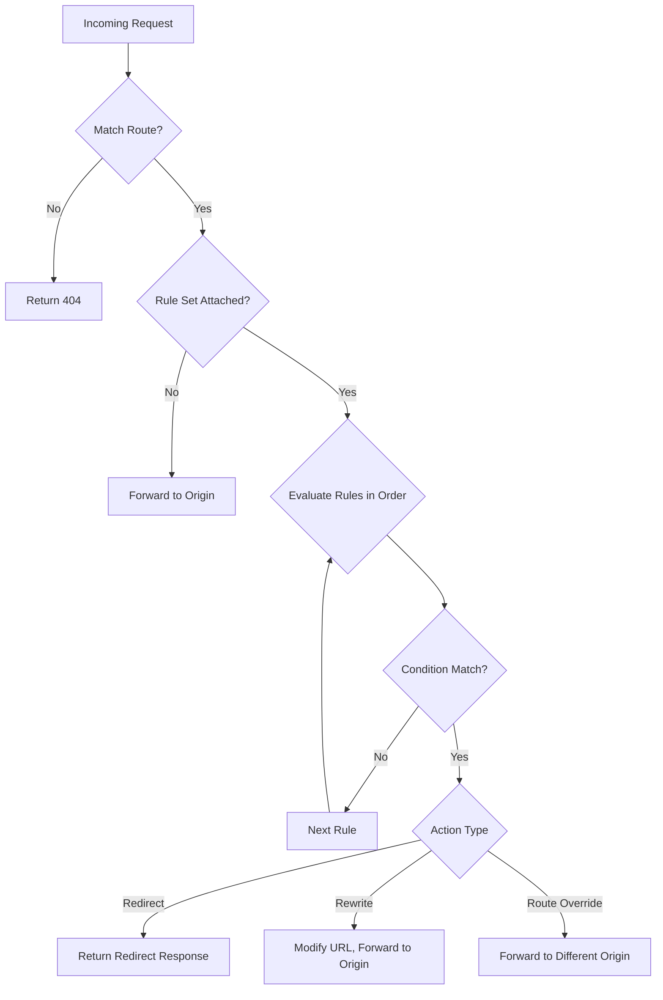

# How to Set Up Azure Front Door Routing Rules with URL Redirect

Author: [nawazdhandala](https://www.github.com/nawazdhandala)

Tags: Azure, Front Door, Routing Rules, URL Redirect, CDN, Networking, Traffic Management

Description: Learn how to configure Azure Front Door routing rules with URL redirect to handle HTTP-to-HTTPS redirection, domain migrations, and custom routing logic.

---

URL redirection is one of those things that sounds trivial until you need to handle it at scale across multiple domains, paths, and protocols. Azure Front Door provides built-in URL redirect capabilities in its routing rules, letting you handle everything from simple HTTP-to-HTTPS redirects to complex path rewrites without touching your backend servers.

In this post, I will cover how to set up Front Door routing rules with different types of URL redirects, including protocol redirects, domain swaps, path rewrites, and query string handling.

## Why Handle Redirects at Front Door?

Handling redirects at the edge (Front Door) rather than at the origin server has clear advantages:

- **Reduced origin load.** Redirect responses are served from Front Door's edge locations. Your backend never sees these requests.
- **Lower latency.** The redirect happens at the nearest POP (Point of Presence) to the user, so the round trip is minimal.
- **Centralized management.** All redirect logic lives in one place instead of being scattered across web server configs and application code.
- **No backend changes required.** You can redirect traffic without deploying code or modifying IIS/nginx/Apache configurations.

## Azure Front Door Redirect Types

Front Door supports four redirect types:

| Type | HTTP Status | Use Case |
|------|------------|----------|
| Moved (301) | Permanent redirect | Domain migration, SEO-friendly permanent moves |
| Found (302) | Temporary redirect | A/B testing, temporary maintenance pages |
| Temporary Redirect (307) | Temporary, preserves method | API redirects where POST must stay POST |
| Permanent Redirect (308) | Permanent, preserves method | Permanent API endpoint moves |

The 307 and 308 types are important for API traffic because 301 and 302 can cause browsers to change POST requests to GET on the redirect. If you are redirecting API endpoints, use 307 or 308.

## Setting Up HTTP-to-HTTPS Redirect

This is the most common redirect scenario. Here is how to configure it using Azure CLI with Front Door Standard/Premium:

First, create a Front Door profile and endpoint if you do not have one:

```bash
# Create a Front Door profile (Standard tier)
az afd profile create \
  --resource-group myResourceGroup \
  --profile-name myFrontDoor \
  --sku Standard_AzureFrontDoor

# Create an endpoint
az afd endpoint create \
  --resource-group myResourceGroup \
  --profile-name myFrontDoor \
  --endpoint-name myEndpoint \
  --enabled-state Enabled
```

Now create a rule set with a redirect rule for HTTP-to-HTTPS:

```bash
# Create a rule set
az afd rule-set create \
  --resource-group myResourceGroup \
  --profile-name myFrontDoor \
  --rule-set-name redirectRules

# Create a rule that redirects HTTP to HTTPS
az afd rule create \
  --resource-group myResourceGroup \
  --profile-name myFrontDoor \
  --rule-set-name redirectRules \
  --rule-name httpToHttps \
  --order 1 \
  --match-variable RequestScheme \
  --operator Equal \
  --match-values HTTP \
  --action-name UrlRedirect \
  --redirect-protocol Https \
  --redirect-type Moved
```

This rule matches any request using HTTP and redirects it to the same URL with HTTPS, returning a 301 status code.

## Domain Redirect (Old Domain to New Domain)

When migrating from one domain to another, you want to redirect all traffic while preserving the path and query string:

```bash
# Create a rule that redirects old domain to new domain
az afd rule create \
  --resource-group myResourceGroup \
  --profile-name myFrontDoor \
  --rule-set-name redirectRules \
  --rule-name domainRedirect \
  --order 2 \
  --match-variable RequestHeader \
  --selector Host \
  --operator Equal \
  --match-values "old-domain.com" \
  --action-name UrlRedirect \
  --redirect-type Moved \
  --redirect-protocol MatchRequest \
  --custom-host "new-domain.com"
```

The `--redirect-protocol MatchRequest` setting preserves whatever protocol the original request used. The `--custom-host` overrides just the hostname while keeping the path and query string intact.

## Path-Based Redirects

Sometimes you need to redirect specific paths. For example, redirecting `/blog` to `/articles`:

```bash
# Create a rule that redirects /blog/* to /articles/*
az afd rule create \
  --resource-group myResourceGroup \
  --profile-name myFrontDoor \
  --rule-set-name redirectRules \
  --rule-name pathRedirect \
  --order 3 \
  --match-variable UrlPath \
  --operator BeginsWith \
  --match-values "/blog" \
  --action-name UrlRedirect \
  --redirect-type Moved \
  --redirect-protocol MatchRequest \
  --custom-path "/articles"
```

One thing to note: this replaces the entire path with `/articles`. If the original request was `/blog/my-post`, the redirect goes to `/articles`, not `/articles/my-post`. For path prefix replacement, you need to use URL rewrite instead of redirect, or use a more specific set of rules.

## Redirect with Query String Manipulation

You can preserve, modify, or strip query strings during redirects:

```bash
# Redirect while preserving the original query string
az afd rule create \
  --resource-group myResourceGroup \
  --profile-name myFrontDoor \
  --rule-set-name redirectRules \
  --rule-name queryPreserve \
  --order 4 \
  --match-variable UrlPath \
  --operator Equal \
  --match-values "/search" \
  --action-name UrlRedirect \
  --redirect-type Found \
  --redirect-protocol Https \
  --custom-host "search.example.com" \
  --custom-query-string "{query_string}"

# Redirect while adding a query parameter
az afd rule create \
  --resource-group myResourceGroup \
  --profile-name myFrontDoor \
  --rule-set-name redirectRules \
  --rule-name queryAdd \
  --order 5 \
  --match-variable UrlPath \
  --operator Equal \
  --match-values "/promo" \
  --action-name UrlRedirect \
  --redirect-type Found \
  --redirect-protocol Https \
  --custom-path "/landing" \
  --custom-query-string "source=promo&{query_string}"
```

## Combining Conditions

Rules can have multiple match conditions. All conditions must be true for the rule to trigger:

```bash
# Redirect only mobile users from a specific path
az afd rule create \
  --resource-group myResourceGroup \
  --profile-name myFrontDoor \
  --rule-set-name redirectRules \
  --rule-name mobileRedirect \
  --order 6 \
  --match-variable UrlPath \
  --operator BeginsWith \
  --match-values "/app" \
  --action-name UrlRedirect \
  --redirect-type Found \
  --redirect-protocol Https \
  --custom-host "m.example.com"
```

## Routing Rules Flow

Here is how Front Door processes incoming requests through routing rules:



Rules are evaluated in the order specified by the `--order` parameter. The first matching rule wins, and no further rules are evaluated.

## Associating Rule Sets with Routes

After creating your rule set, you need to associate it with a route:

```bash
# Create a route and associate the rule set
az afd route create \
  --resource-group myResourceGroup \
  --profile-name myFrontDoor \
  --endpoint-name myEndpoint \
  --route-name myRoute \
  --origin-group myOriginGroup \
  --rule-sets redirectRules \
  --supported-protocols Http Https \
  --patterns-to-match "/*"
```

## Testing Your Redirects

Use curl to verify redirects without following them:

```bash
# Test redirect response - shows the Location header without following
curl -I -H "Host: old-domain.com" https://myEndpoint.azurefd.net/blog

# Expected output should include:
# HTTP/2 301
# location: https://new-domain.com/articles
```

The `-I` flag fetches headers only, and you should see the redirect status code and Location header matching your configuration.

## Common Pitfalls

**Redirect loops.** If you have a rule that redirects `/A` to `/B` and another that redirects `/B` to `/A`, you will create an infinite loop. Browsers will stop after a few cycles and show an error.

**Rule ordering.** Rules with lower order numbers are evaluated first. Put your most specific rules first and catch-all rules last.

**Caching of 301 redirects.** Browsers aggressively cache 301 responses. If you set up a wrong 301 redirect, users may be stuck with it until they clear their cache. Use 302 during testing.

**Protocol mismatch.** If you redirect HTTP to HTTPS but your origin does not support HTTPS, the request will fail. Make sure your origin can handle whatever protocol you are redirecting to.

## Summary

Azure Front Door routing rules with URL redirect give you powerful control over how traffic flows before it ever reaches your backend. Whether you need simple HTTP-to-HTTPS enforcement, domain migrations, or path-based routing logic, the combination of match conditions and redirect actions handles it all. Start with 302 (temporary) redirects while testing, switch to 301 (permanent) once confirmed, and always test with curl before relying on browser behavior.
