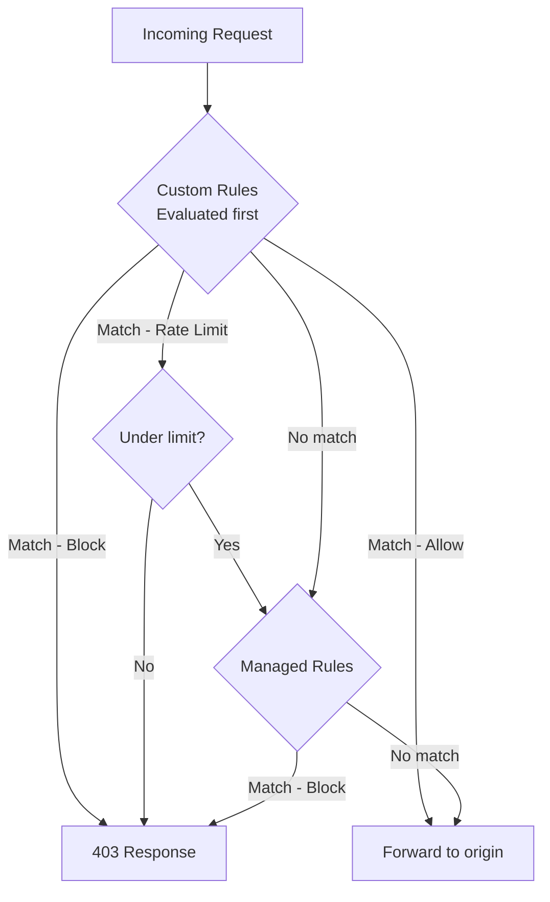

# How to Set Up Azure Front Door WAF Policy with Custom Rules

Author: [nawazdhandala](https://www.github.com/nawazdhandala)

Tags: Azure, Front Door, WAF, Custom Rules, Web Security, Azure Networking, Rate Limiting

Description: A hands-on guide to creating Azure Front Door WAF policies with custom rules for rate limiting, geo-filtering, and request inspection.

---

Azure Front Door sits at the edge of Microsoft's global network, making it the ideal place to inspect and filter HTTP traffic before it reaches your backend. The Web Application Firewall (WAF) on Front Door can run managed rule sets (like OWASP CRS) and custom rules that you define. Custom rules are particularly powerful because they let you implement business-specific logic like rate limiting by IP, blocking traffic from certain countries, or inspecting specific request headers.

This guide walks through creating a WAF policy for Front Door and building custom rules for common security scenarios.

## Custom Rules vs. Managed Rules

Managed rules are pre-built rule sets maintained by Microsoft. They cover common attack patterns like SQL injection, XSS, and protocol violations. You turn them on and they work.

Custom rules are rules you write yourself. They are evaluated before managed rules and let you:

- Rate limit requests per IP
- Block or allow traffic from specific countries
- Inspect request headers, query strings, and body
- Block specific user agents
- Implement IP allow lists and deny lists



## Prerequisites

- An Azure subscription
- An Azure Front Door profile (Standard or Premium tier)
- Azure CLI installed

## Step 1: Create a WAF Policy

```bash
# Create a resource group
az group create --name rg-waf-fd-demo --location eastus

# Create a WAF policy for Front Door
az network front-door waf-policy create \
  --resource-group rg-waf-fd-demo \
  --name wafpolicyfd \
  --sku Premium_AzureFrontDoor \
  --mode Prevention \
  --redirect-url "https://www.myapp.com/blocked"
```

The `--mode Prevention` means matching requests are actively blocked. Use `Detection` mode while testing to log matches without blocking.

## Step 2: Create a Rate Limiting Rule

Rate limiting is one of the most valuable custom rules. It protects your backend from being overwhelmed by too many requests from a single source.

```bash
# Create a rate limit rule: max 100 requests per minute per IP
az network front-door waf-policy rule create \
  --resource-group rg-waf-fd-demo \
  --policy-name wafpolicyfd \
  --name RateLimitPerIP \
  --priority 100 \
  --rule-type RateLimitRule \
  --action Block \
  --rate-limit-duration 1 \
  --rate-limit-threshold 100 \
  --defer

# Add a match condition (apply to all requests)
az network front-door waf-policy rule match-condition add \
  --resource-group rg-waf-fd-demo \
  --policy-name wafpolicyfd \
  --name RateLimitPerIP \
  --match-variable RemoteAddr \
  --operator IPMatch \
  --values "0.0.0.0/0" "::/0"
```

This rule limits each IP address to 100 requests per minute. When exceeded, the client gets a 403 response until the rate drops below the threshold.

You can also rate limit based on other groupings. For example, rate limiting per IP plus specific URL path:

```bash
# Rate limit login attempts: max 10 per minute per IP
az network front-door waf-policy rule create \
  --resource-group rg-waf-fd-demo \
  --policy-name wafpolicyfd \
  --name RateLimitLogin \
  --priority 110 \
  --rule-type RateLimitRule \
  --action Block \
  --rate-limit-duration 1 \
  --rate-limit-threshold 10 \
  --defer

# Match condition: only apply to the login endpoint
az network front-door waf-policy rule match-condition add \
  --resource-group rg-waf-fd-demo \
  --policy-name wafpolicyfd \
  --name RateLimitLogin \
  --match-variable RequestUri \
  --operator Contains \
  --values "/login" "/api/auth"
```

## Step 3: Create a Geo-Filtering Rule

Block traffic from countries where you do not do business. This reduces attack surface significantly.

```bash
# Block traffic from specific countries
az network front-door waf-policy rule create \
  --resource-group rg-waf-fd-demo \
  --policy-name wafpolicyfd \
  --name GeoBlock \
  --priority 200 \
  --rule-type MatchRule \
  --action Block \
  --defer

# Add geo match condition
az network front-door waf-policy rule match-condition add \
  --resource-group rg-waf-fd-demo \
  --policy-name wafpolicyfd \
  --name GeoBlock \
  --match-variable RemoteAddr \
  --operator GeoMatch \
  --values "CN" "RU" "KP"
```

Alternatively, use an allow list approach where only specified countries can access your application:

```bash
# Allow only specific countries (block everything else)
az network front-door waf-policy rule create \
  --resource-group rg-waf-fd-demo \
  --policy-name wafpolicyfd \
  --name GeoAllow \
  --priority 210 \
  --rule-type MatchRule \
  --action Block \
  --defer

# Negate the condition: block if NOT from allowed countries
az network front-door waf-policy rule match-condition add \
  --resource-group rg-waf-fd-demo \
  --policy-name wafpolicyfd \
  --name GeoAllow \
  --match-variable RemoteAddr \
  --operator GeoMatch \
  --negate \
  --values "US" "CA" "GB" "DE" "FR"
```

## Step 4: Create an IP Allow List

For admin endpoints that should only be accessible from known IPs:

```bash
# Block access to admin paths except from allowed IPs
az network front-door waf-policy rule create \
  --resource-group rg-waf-fd-demo \
  --policy-name wafpolicyfd \
  --name BlockAdminExceptAllowed \
  --priority 50 \
  --rule-type MatchRule \
  --action Block \
  --defer

# Match condition 1: Request is for admin path
az network front-door waf-policy rule match-condition add \
  --resource-group rg-waf-fd-demo \
  --policy-name wafpolicyfd \
  --name BlockAdminExceptAllowed \
  --match-variable RequestUri \
  --operator Contains \
  --values "/admin" "/wp-admin" "/dashboard"

# Match condition 2: AND source IP is NOT in the allow list
az network front-door waf-policy rule match-condition add \
  --resource-group rg-waf-fd-demo \
  --policy-name wafpolicyfd \
  --name BlockAdminExceptAllowed \
  --match-variable RemoteAddr \
  --operator IPMatch \
  --negate \
  --values "203.0.113.0/24" "198.51.100.10"
```

This rule blocks requests to admin paths unless they come from the specified IP ranges. Both conditions must match (AND logic) for the rule to trigger.

## Step 5: Block Suspicious User Agents

Block known bad bots and scanners by their user agent strings.

```bash
# Block suspicious user agents
az network front-door waf-policy rule create \
  --resource-group rg-waf-fd-demo \
  --policy-name wafpolicyfd \
  --name BlockBadBots \
  --priority 300 \
  --rule-type MatchRule \
  --action Block \
  --defer

az network front-door waf-policy rule match-condition add \
  --resource-group rg-waf-fd-demo \
  --policy-name wafpolicyfd \
  --name BlockBadBots \
  --match-variable RequestHeader \
  --selector "User-Agent" \
  --operator Contains \
  --transforms Lowercase \
  --values "sqlmap" "nikto" "masscan" "dirbuster" "nmap"
```

The `--transforms Lowercase` ensures case-insensitive matching.

## Step 6: Require Specific Headers

Some applications require API keys or custom headers. You can enforce this at the WAF level.

```bash
# Block API requests without an API key header
az network front-door waf-policy rule create \
  --resource-group rg-waf-fd-demo \
  --policy-name wafpolicyfd \
  --name RequireAPIKey \
  --priority 400 \
  --rule-type MatchRule \
  --action Block \
  --defer

# Match on API path
az network front-door waf-policy rule match-condition add \
  --resource-group rg-waf-fd-demo \
  --policy-name wafpolicyfd \
  --name RequireAPIKey \
  --match-variable RequestUri \
  --operator BeginsWith \
  --values "/api/"

# AND no X-API-Key header present
az network front-door waf-policy rule match-condition add \
  --resource-group rg-waf-fd-demo \
  --policy-name wafpolicyfd \
  --name RequireAPIKey \
  --match-variable RequestHeader \
  --selector "X-API-Key" \
  --operator Equal \
  --negate \
  --values "valid-api-key-12345"
```

## Step 7: Associate the WAF Policy with Front Door

Link the policy to your Front Door endpoint.

```bash
# Associate WAF policy with Front Door security policy
az afd security-policy create \
  --resource-group rg-waf-fd-demo \
  --profile-name fd-myapp \
  --security-policy-name sp-waf \
  --waf-policy wafpolicyfd \
  --domains myapp-endpoint
```

## Step 8: Enable WAF Logging

Enable diagnostic logs to see what the WAF is doing.

```bash
# Create Log Analytics workspace
az monitor log-analytics workspace create \
  --resource-group rg-waf-fd-demo \
  --workspace-name law-waf-fd \
  --location eastus

# Enable diagnostic settings on Front Door
FD_ID=$(az afd profile show --resource-group rg-waf-fd-demo --profile-name fd-myapp --query id -o tsv)
LAW_ID=$(az monitor log-analytics workspace show --resource-group rg-waf-fd-demo --workspace-name law-waf-fd --query id -o tsv)

az monitor diagnostic-settings create \
  --resource $FD_ID \
  --name diag-waf \
  --workspace $LAW_ID \
  --logs '[{"category":"FrontDoorWebApplicationFirewallLog","enabled":true},{"category":"FrontDoorAccessLog","enabled":true}]'
```

## Rule Priority and Evaluation Order

Custom rules are evaluated in priority order (lowest number first). Once a rule matches, its action is taken and no further rules are checked. Plan your priorities carefully:

| Priority Range | Purpose |
|---|---|
| 1-99 | IP allow/block lists (highest priority) |
| 100-199 | Rate limiting rules |
| 200-299 | Geo-filtering rules |
| 300-399 | Bot detection rules |
| 400-499 | Header validation rules |
| 500+ | Catch-all rules |

## Cleanup

```bash
# Delete the resource group
az group delete --name rg-waf-fd-demo --yes --no-wait
```

## Wrapping Up

Custom WAF rules on Azure Front Door let you implement application-specific security controls at the global edge. Rate limiting protects against abuse, geo-filtering reduces attack surface, IP allow lists secure admin endpoints, and header inspection validates API access. Start with Detection mode to understand your traffic patterns, then switch to Prevention mode for active blocking. Always enable logging so you can monitor matches and tune rules over time. The combination of custom rules and managed rule sets gives you comprehensive Layer 7 protection for your web applications.
