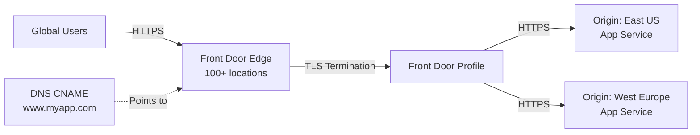

# How to Set Up Azure Front Door with Custom Domain and HTTPS

Author: [nawazdhandala](https://www.github.com/nawazdhandala)

Tags: Azure, Front Door, CDN, Custom Domain, HTTPS, Global Load Balancing, Azure Networking

Description: Step-by-step guide to setting up Azure Front Door with a custom domain and managed HTTPS certificate for global traffic distribution.

---

Azure Front Door is a global load balancer and CDN that sits at the edge of Microsoft's network. It routes traffic to the closest or healthiest backend, provides SSL offloading, and can cache static content at edge locations worldwide. If you are running a web application that needs to serve users across multiple regions with low latency, Front Door is one of the best tools Azure offers.

In this guide, we will set up a Front Door profile, add a custom domain, enable HTTPS with a managed certificate, and route traffic to a backend origin.

## Why Azure Front Door

Front Door operates at Layer 7 (HTTP/HTTPS) and has points of presence in over 100 edge locations globally. When a user in Tokyo makes a request, that request hits a Front Door edge node in Japan, which then routes it to the nearest healthy backend. The TLS handshake happens at the edge, not at your origin server, which dramatically reduces the perceived latency.

Key features include:

- Global HTTP load balancing with instant failover
- SSL offloading at the edge
- URL-based routing
- Session affinity
- Web Application Firewall (WAF) integration
- Built-in caching

## Prerequisites

- An Azure subscription
- A custom domain name with access to DNS records
- A backend origin (web app, storage account, or any HTTP endpoint)
- Azure CLI installed

## Step 1: Create a Front Door Profile

Azure Front Door has two tiers: Standard and Premium. Standard is suitable for most use cases. Premium adds private link support and more advanced WAF capabilities.

```bash
# Create a resource group
az group create --name rg-frontdoor-demo --location eastus

# Create a Front Door profile (Standard tier)
az afd profile create \
  --resource-group rg-frontdoor-demo \
  --profile-name fd-myapp \
  --sku Standard_AzureFrontDoor
```

## Step 2: Create an Endpoint

The endpoint is the Front Door-generated hostname that clients initially connect to before you add a custom domain.

```bash
# Create an endpoint
az afd endpoint create \
  --resource-group rg-frontdoor-demo \
  --profile-name fd-myapp \
  --endpoint-name myapp-endpoint \
  --enabled-state Enabled
```

This creates a hostname like `myapp-endpoint.z01.azurefd.net`. You can use this for testing before setting up your custom domain.

## Step 3: Create an Origin Group and Origin

An origin group is a collection of backends that Front Door load balances across. Each origin is a specific backend endpoint.

```bash
# Create an origin group with health probing
az afd origin-group create \
  --resource-group rg-frontdoor-demo \
  --profile-name fd-myapp \
  --origin-group-name og-webapp \
  --probe-request-type GET \
  --probe-protocol Https \
  --probe-interval-in-seconds 30 \
  --probe-path /health \
  --sample-size 4 \
  --successful-samples-required 3 \
  --additional-latency-in-milliseconds 50

# Add an origin (your backend web app)
az afd origin create \
  --resource-group rg-frontdoor-demo \
  --profile-name fd-myapp \
  --origin-group-name og-webapp \
  --origin-name origin-webapp-eastus \
  --host-name myapp-eastus.azurewebsites.net \
  --origin-host-header myapp-eastus.azurewebsites.net \
  --http-port 80 \
  --https-port 443 \
  --priority 1 \
  --weight 1000 \
  --enabled-state Enabled
```

The `--origin-host-header` is important. This is the Host header sent to the backend. For Azure App Services, it must match the app's hostname, otherwise the app might reject the request or route it incorrectly.

## Step 4: Create a Route

Routes tie endpoints to origin groups. They define which traffic patterns go to which backends.

```bash
# Create a route
az afd route create \
  --resource-group rg-frontdoor-demo \
  --profile-name fd-myapp \
  --endpoint-name myapp-endpoint \
  --route-name route-default \
  --origin-group og-webapp \
  --supported-protocols Https Http \
  --patterns-to-match "/*" \
  --forwarding-protocol HttpsOnly \
  --https-redirect Enabled \
  --link-to-default-domain Enabled
```

The `--https-redirect Enabled` flag automatically redirects HTTP requests to HTTPS, which is what you want for production.

## Step 5: Add a Custom Domain

Now let us add your custom domain to the Front Door profile.

```bash
# Add a custom domain
az afd custom-domain create \
  --resource-group rg-frontdoor-demo \
  --profile-name fd-myapp \
  --custom-domain-name myapp-custom \
  --host-name www.myapp.com \
  --certificate-type ManagedCertificate \
  --minimum-tls-version TLS12
```

The `--certificate-type ManagedCertificate` tells Front Door to automatically provision and manage a TLS certificate for your domain. No need to buy a certificate or deal with renewals.

## Step 6: Validate Domain Ownership

Before Front Door issues a managed certificate, you need to prove you own the domain. Front Door requires a DNS TXT record for validation.

```bash
# Get the validation token
az afd custom-domain show \
  --resource-group rg-frontdoor-demo \
  --profile-name fd-myapp \
  --custom-domain-name myapp-custom \
  --query "validationProperties" \
  --output json
```

This returns a validation token. Create a TXT record at your DNS provider:

- **Record type:** TXT
- **Name:** `_dnsauth.www` (or `_dnsauth` for the apex domain)
- **Value:** The validation token from the command output

DNS propagation can take a few minutes to an hour. Front Door periodically checks for the TXT record.

## Step 7: Create CNAME Record

While waiting for validation, create a CNAME record pointing your custom domain to the Front Door endpoint.

At your DNS provider, add:

- **Record type:** CNAME
- **Name:** `www`
- **Value:** `myapp-endpoint.z01.azurefd.net`

## Step 8: Associate the Custom Domain with the Route

Once the domain is validated, associate it with your route.

```bash
# Update the route to include the custom domain
az afd route update \
  --resource-group rg-frontdoor-demo \
  --profile-name fd-myapp \
  --endpoint-name myapp-endpoint \
  --route-name route-default \
  --custom-domains myapp-custom
```

## Step 9: Verify Everything Works

Check the status of the custom domain and certificate.

```bash
# Check custom domain status
az afd custom-domain show \
  --resource-group rg-frontdoor-demo \
  --profile-name fd-myapp \
  --custom-domain-name myapp-custom \
  --query "{domainValidationState:domainValidationState, provisioningState:provisioningState}" \
  --output table
```

The `domainValidationState` should show `Approved` and the provisioning state should be `Succeeded`. At this point, you can test by navigating to `https://www.myapp.com` in your browser.

## Architecture Overview

Here is what the complete setup looks like:



## Caching Configuration

Front Door can cache static content at edge locations. Enable caching on your route for better performance.

```bash
# Enable caching on the route
az afd route update \
  --resource-group rg-frontdoor-demo \
  --profile-name fd-myapp \
  --endpoint-name myapp-endpoint \
  --route-name route-default \
  --enable-caching true \
  --query-string-caching-behavior IgnoreQueryString
```

## Troubleshooting

If your custom domain is stuck in "Pending" validation state, check the DNS TXT record. Use `nslookup -type=TXT _dnsauth.www.myapp.com` to verify it resolves correctly. Some DNS providers have propagation delays up to 24 hours, though most are much faster.

If you get certificate errors, make sure the CNAME record is pointing to the correct Front Door endpoint hostname. The managed certificate issuance can take up to an hour after domain validation succeeds.

## Cleanup

```bash
# Delete all demo resources
az group delete --name rg-frontdoor-demo --yes --no-wait
```

## Wrapping Up

Azure Front Door with a custom domain and managed HTTPS gives you global traffic distribution, SSL termination at the edge, and automatic certificate management without operational overhead. The setup involves creating a Front Door profile, defining origins and routes, adding your custom domain with DNS validation, and letting Front Door handle the certificate. Once everything is wired up, your users get faster response times thanks to edge proximity, and you get a simpler operational model since Front Door handles certificate renewals automatically.
