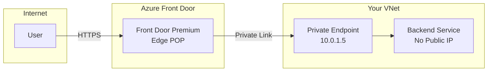

# How to Set Up Azure Front Door with Private Link Origin for Secure Backend Access

Author: [nawazdhandala](https://www.github.com/nawazdhandala)

Tags: Azure, Front Door, Private Link, Security, Networking, CDN, Backend Protection

Description: Configure Azure Front Door Premium with Private Link origins to connect to backend services over private endpoints without exposing them to the public internet.

---

Azure Front Door accelerates and secures web traffic at the edge, but it has traditionally required your backend services to be publicly accessible. Even with access restrictions, having a public IP on your backend creates a surface that attackers can target directly, bypassing Front Door entirely. Private Link origins eliminate this by connecting Front Door to your backend through a private endpoint. Your backend has no public IP at all, and the only way to reach it is through Front Door.

This guide covers how to set up Front Door Premium with Private Link origins for different backend types, including App Service, Storage, and custom backends behind a Load Balancer.

## How Private Link Origins Work

In a standard Front Door configuration, Front Door connects to your backend's public endpoint. With Private Link origins, Front Door establishes a private connection through Azure Private Link to a private endpoint on your backend resource. The traffic never leaves the Microsoft backbone network.



The backend resource does not need a public IP. Front Door's Private Link connection reaches it through the private endpoint, and you can completely disable public access on the backend.

## Prerequisites

- Azure Front Door Premium profile (Private Link origins are a Premium-only feature)
- A backend service that supports Private Link (App Service, Azure Storage, Azure Load Balancer Standard, or Application Gateway)
- A virtual network (needed for some backend types)
- Azure CLI installed

## Step 1: Create a Front Door Premium Profile

If you do not already have a Front Door Premium profile:

```bash
# Create a Front Door Premium profile
az afd profile create \
  --profile-name myFrontDoorPremium \
  --resource-group myResourceGroup \
  --sku Premium_AzureFrontDoor
```

## Step 2: Set Up a Private Link Origin for App Service

App Service is one of the most common backends for Front Door. Here is how to connect them via Private Link:

```bash
# First, create the Front Door endpoint
az afd endpoint create \
  --endpoint-name myAppEndpoint \
  --profile-name myFrontDoorPremium \
  --resource-group myResourceGroup \
  --enabled-state Enabled

# Create an origin group
az afd origin-group create \
  --origin-group-name myAppOriginGroup \
  --profile-name myFrontDoorPremium \
  --resource-group myResourceGroup \
  --probe-request-type GET \
  --probe-protocol Https \
  --probe-interval-in-seconds 30 \
  --probe-path "/health" \
  --sample-size 4 \
  --successful-samples-required 3 \
  --additional-latency-in-milliseconds 50

# Create the origin with Private Link
# Replace the private-link-resource with your App Service resource ID
az afd origin create \
  --origin-name myAppOrigin \
  --origin-group-name myAppOriginGroup \
  --profile-name myFrontDoorPremium \
  --resource-group myResourceGroup \
  --host-name mywebapp.azurewebsites.net \
  --origin-host-header mywebapp.azurewebsites.net \
  --http-port 80 \
  --https-port 443 \
  --priority 1 \
  --weight 1000 \
  --enable-private-link true \
  --private-link-resource "/subscriptions/{sub-id}/resourceGroups/myResourceGroup/providers/Microsoft.Web/sites/mywebapp" \
  --private-link-location eastus \
  --private-link-request-message "Front Door Premium Private Link"
```

## Step 3: Approve the Private Endpoint Connection

When Front Door creates a Private Link origin, it generates a private endpoint connection request on the backend resource. You need to approve this request:

```bash
# List pending private endpoint connections on the App Service
az webapp show \
  --name mywebapp \
  --resource-group myResourceGroup \
  --query "privateEndpointConnections[?properties.privateLinkServiceConnectionState.status=='Pending']" \
  -o table

# Approve the connection
# Get the connection ID from the previous command
az webapp update \
  --name mywebapp \
  --resource-group myResourceGroup \
  --set "privateEndpointConnections[0].properties.privateLinkServiceConnectionState.status=Approved"
```

Alternatively, approve through the portal by navigating to the App Service > Networking > Private endpoints, where you will see the pending connection from Front Door.

## Step 4: Configure a Route

Create a route to direct traffic from the Front Door endpoint to the Private Link origin:

```bash
# Create a route
az afd route create \
  --route-name myAppRoute \
  --endpoint-name myAppEndpoint \
  --profile-name myFrontDoorPremium \
  --resource-group myResourceGroup \
  --origin-group myAppOriginGroup \
  --supported-protocols Https \
  --patterns-to-match "/*" \
  --forwarding-protocol HttpsOnly \
  --https-redirect Enabled
```

## Step 5: Disable Public Access on the Backend

Now that Front Door connects via Private Link, disable public access on the App Service:

```bash
# Restrict the App Service to Private Link access only
az webapp update \
  --name mywebapp \
  --resource-group myResourceGroup \
  --set publicNetworkAccess=Disabled
```

After this, the only way to reach the App Service is through Front Door's Private Link connection. Direct access attempts to `mywebapp.azurewebsites.net` will fail.

## Step 6: Set Up a Private Link Origin for Azure Storage

Storage accounts are another common backend, especially for static content. Here is how to connect a Storage account via Private Link:

```bash
# Create an origin with Private Link to a Storage account blob endpoint
az afd origin create \
  --origin-name myStorageOrigin \
  --origin-group-name myStaticOriginGroup \
  --profile-name myFrontDoorPremium \
  --resource-group myResourceGroup \
  --host-name mystorageaccount.blob.core.windows.net \
  --origin-host-header mystorageaccount.blob.core.windows.net \
  --http-port 80 \
  --https-port 443 \
  --priority 1 \
  --weight 1000 \
  --enable-private-link true \
  --private-link-resource "/subscriptions/{sub-id}/resourceGroups/myResourceGroup/providers/Microsoft.Storage/storageAccounts/mystorageaccount" \
  --private-link-sub-resource-type blob \
  --private-link-location eastus \
  --private-link-request-message "Front Door Premium - Storage"
```

Remember to approve the private endpoint connection on the Storage account and then disable public access:

```bash
# Disable public access on the storage account
az storage account update \
  --name mystorageaccount \
  --resource-group myResourceGroup \
  --default-action Deny \
  --bypass None
```

## Step 7: Set Up a Private Link Origin for Internal Load Balancer

For custom backends behind an internal (private) load balancer, you can use a Private Link Service to expose them to Front Door:

```bash
# First, create a Private Link Service attached to your internal load balancer
az network private-link-service create \
  --name myPrivateLinkService \
  --resource-group myResourceGroup \
  --location eastus \
  --vnet-name myVNet \
  --subnet mySubnet \
  --lb-name myInternalLB \
  --lb-frontend-ip-configs myFrontendIP \
  --auto-approval ""

# Then create the Front Door origin pointing to the Private Link Service
az afd origin create \
  --origin-name myCustomOrigin \
  --origin-group-name myCustomOriginGroup \
  --profile-name myFrontDoorPremium \
  --resource-group myResourceGroup \
  --host-name 10.0.1.10 \
  --origin-host-header myapp.example.com \
  --http-port 80 \
  --https-port 443 \
  --priority 1 \
  --weight 1000 \
  --enable-private-link true \
  --private-link-resource "/subscriptions/{sub-id}/resourceGroups/myResourceGroup/providers/Microsoft.Network/privateLinkServices/myPrivateLinkService" \
  --private-link-location eastus \
  --private-link-request-message "Front Door Premium - Custom Backend"
```

## Verifying the Connection

Check the Private Link connection status:

```bash
# Check the origin's Private Link status
az afd origin show \
  --origin-name myAppOrigin \
  --origin-group-name myAppOriginGroup \
  --profile-name myFrontDoorPremium \
  --resource-group myResourceGroup \
  --query "sharedPrivateLinkResource.status" -o tsv
```

The status should be `Approved`. If it shows `Pending`, you need to approve the connection on the backend resource.

## Cost Considerations

Private Link origins add cost in two areas:

1. **Front Door Premium**: Private Link is only available in the Premium tier, which costs more than Standard
2. **Private Link charges**: Standard Private Link pricing applies for the private endpoint connection

For most production workloads, the security benefit of removing public backend access justifies the extra cost.

## Troubleshooting

**Origin shows unhealthy**: If the origin health probe fails after setting up Private Link, check that the health probe path exists and returns a 200 response. Also verify the private endpoint connection is approved.

**502 Bad Gateway errors**: This usually means Front Door cannot reach the backend. Verify the private endpoint connection status and ensure the backend application is running.

**Slow connection setup**: The first request after Private Link establishment might be slightly slower because the private endpoint needs to warm up. Subsequent requests should be normal.

**Backend still publicly accessible**: After setting up Private Link, remember to explicitly disable public access on the backend resource. Private Link does not automatically disable public access.

## Wrapping Up

Azure Front Door with Private Link origins gives you the best of both worlds - global edge acceleration and private backend connectivity. Your backends do not need public IPs, and the only ingress path is through Front Door. The setup requires Front Door Premium and a few extra steps to create the Private Link origin and approve the connection, but the security improvement is substantial. Once configured, monitor the origin health and Private Link status to ensure the connection stays healthy.
