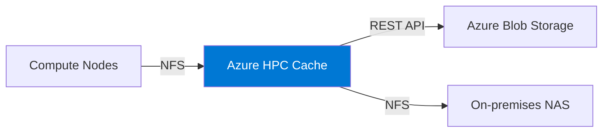

# How to Set Up Azure HPC Cache with Azure Blob Storage as a Storage Target

Author: [nawazdhandala](https://www.github.com/nawazdhandala)

Tags: Azure, HPC Cache, Blob Storage, High Performance Computing, NFS, Caching, Data Pipelines

Description: A step-by-step guide to deploying Azure HPC Cache with Azure Blob Storage as a backend storage target for high-performance computing workloads.

---

High performance computing workloads - think genomics processing, financial modeling, seismic analysis, or media rendering - need fast access to large datasets. Azure Blob Storage is great for storing those datasets cheaply, but its latency and IOPS characteristics are not designed for the random read patterns typical in HPC. Azure HPC Cache bridges this gap by placing a caching layer between your compute nodes and blob storage, serving hot data with NFS-like performance while keeping cold data in cost-effective blob storage.

This guide walks through deploying an Azure HPC Cache instance, configuring blob storage as a storage target, and connecting compute clients.

## How Azure HPC Cache Works

Azure HPC Cache sits between your compute cluster and your storage backends. It presents an NFS interface to compute nodes while pulling data from Azure Blob Storage (or on-premises NAS systems) on demand.

The data flow looks like this:



When a compute node requests a file, HPC Cache checks its local SSD cache first. If the file is cached (cache hit), it is served instantly with sub-millisecond latency. If not (cache miss), HPC Cache fetches it from blob storage, caches it, and serves it to the client. Subsequent requests for the same file are served from cache.

This works particularly well for workloads where many compute nodes read the same dataset, because the data is fetched from blob storage once and served to all nodes from cache.

## Prerequisites

Before deploying HPC Cache, you need:

- An Azure subscription with the Microsoft.StorageCache resource provider registered
- A virtual network with a dedicated subnet (/24 or larger) for the cache
- An Azure Blob Storage account with hierarchical namespace disabled
- A blob container with your dataset
- An ADLS-NFS enabled storage account (if using NFS-mounted blob containers)

## Step 1: Register the Resource Provider

```bash
# Register the HPC Cache resource provider
az provider register --namespace Microsoft.StorageCache

# Wait for registration
az provider show --namespace Microsoft.StorageCache --query "registrationState" -o tsv
```

## Step 2: Create the Network Infrastructure

HPC Cache needs a dedicated subnet with no other resources. The subnet must be large enough to accommodate the cache's virtual IPs:

```bash
# Create a VNet for the HPC environment (or use existing)
az network vnet create \
  --resource-group rg-hpc \
  --name vnet-hpc \
  --address-prefix 10.0.0.0/16 \
  --location eastus2

# Create a dedicated subnet for HPC Cache
# /24 is recommended for most deployments
az network vnet subnet create \
  --resource-group rg-hpc \
  --vnet-name vnet-hpc \
  --name snet-hpc-cache \
  --address-prefixes 10.0.1.0/24

# Create a subnet for compute nodes
az network vnet subnet create \
  --resource-group rg-hpc \
  --vnet-name vnet-hpc \
  --name snet-compute \
  --address-prefixes 10.0.2.0/24
```

## Step 3: Prepare the Blob Storage Container

Create or configure the blob container that will serve as the storage target. HPC Cache uses a special ADLS-NFS-compatible format for blob storage targets:

```bash
# Create a storage account for HPC data
az storage account create \
  --name sthpcdata2026 \
  --resource-group rg-hpc \
  --location eastus2 \
  --sku Standard_LRS \
  --kind StorageV2

# Create a container for the dataset
az storage container create \
  --account-name sthpcdata2026 \
  --name datasets \
  --auth-mode login

# Upload your dataset (or use AzCopy for large datasets)
azcopy copy \
  "/data/input-dataset/" \
  "https://sthpcdata2026.blob.core.windows.net/datasets/input/?$SAS" \
  --recursive
```

## Step 4: Set Up Storage Account Access

HPC Cache needs permission to access the blob storage account. Grant the cache's managed identity the required roles:

```bash
# Get the storage account resource ID
STORAGE_ID=$(az storage account show \
  --name sthpcdata2026 \
  --resource-group rg-hpc \
  --query "id" -o tsv)

# The HPC Cache service principal needs these roles:
# - Storage Account Contributor (for management operations)
# - Storage Blob Data Contributor (for data access)

# Grant Storage Account Contributor
az role assignment create \
  --role "Storage Account Contributor" \
  --assignee-object-id "$(az ad sp show --id 'StorageCacheRP' --query 'id' -o tsv 2>/dev/null || echo '<hpc-cache-sp-id>')" \
  --scope "$STORAGE_ID"

# Grant Storage Blob Data Contributor
az role assignment create \
  --role "Storage Blob Data Contributor" \
  --assignee-object-id "$(az ad sp show --id 'StorageCacheRP' --query 'id' -o tsv 2>/dev/null || echo '<hpc-cache-sp-id>')" \
  --scope "$STORAGE_ID"
```

## Step 5: Deploy the HPC Cache

Create the HPC Cache instance. Choose the cache size based on your working set size (the amount of data actively accessed by compute nodes):

```bash
# Create the HPC Cache
# Available SKUs: Standard_2G, Standard_4G, Standard_8G
# These represent the cache throughput tier
az hpc-cache create \
  --resource-group rg-hpc \
  --name hpccache-prod \
  --location eastus2 \
  --cache-size-gb 6144 \
  --sku-name Standard_4G \
  --subnet "/subscriptions/<sub-id>/resourceGroups/rg-hpc/providers/Microsoft.Network/virtualNetworks/vnet-hpc/subnets/snet-hpc-cache"
```

Cache creation takes 15-20 minutes. The available cache sizes are:

| SKU | Cache Sizes | Max Throughput |
|-----|------------|----------------|
| Standard_2G | 3072, 6144, 12288 GB | 2 GB/s |
| Standard_4G | 6144, 12288, 24576 GB | 4 GB/s |
| Standard_8G | 12288, 24576, 49152 GB | 8 GB/s |

Choose a cache size that fits your hot dataset. If your compute nodes access 4 TB of data regularly, a 6144 GB (6 TB) cache gives you headroom.

## Step 6: Add the Blob Storage Target

After the cache is created, add the blob storage container as a storage target:

```bash
# Add blob storage as a storage target
az hpc-cache blob-storage-target add \
  --resource-group rg-hpc \
  --cache-name hpccache-prod \
  --name blobstorage-datasets \
  --storage-account "/subscriptions/<sub-id>/resourceGroups/rg-hpc/providers/Microsoft.Storage/storageAccounts/sthpcdata2026" \
  --container-name datasets \
  --virtual-namespace-path "/datasets"
```

The `--virtual-namespace-path` defines where this storage target appears in the cache's NFS namespace. Clients will mount the cache and access data at `/datasets`.

## Step 7: Connect Compute Nodes

Compute nodes connect to the HPC Cache via NFS. First, get the cache's mount addresses:

```bash
# Get the mount addresses
az hpc-cache show \
  --resource-group rg-hpc \
  --name hpccache-prod \
  --query "mountAddresses" \
  --output tsv
```

This returns multiple IP addresses for load balancing. Distribute your compute nodes across these IPs.

On each compute node, mount the cache:

```bash
# Install NFS client
sudo apt-get install -y nfs-common

# Create mount point
sudo mkdir -p /hpc/datasets

# Mount the cache using one of the mount addresses
# Use 'hard' mount for production to handle transient failures
sudo mount -t nfs \
  -o hard,proto=tcp,mountproto=tcp,retry=30,nconnect=8 \
  10.0.1.4:/datasets /hpc/datasets

# Verify the mount
df -h /hpc/datasets
ls /hpc/datasets/
```

The `nconnect=8` option (available on Linux kernel 5.3+) creates multiple TCP connections per mount, which improves throughput for parallel workloads.

## Step 8: Distribute Mounts Across Cache IPs

For a compute cluster, distribute the mount addresses evenly across nodes:

```bash
#!/bin/bash
# distribute-mounts.sh
# Distribute NFS mounts across HPC Cache mount addresses

# HPC Cache mount addresses
MOUNT_IPS=("10.0.1.4" "10.0.1.5" "10.0.1.6")

# Get the hostname number to determine which IP to use
HOST_NUM=$(hostname | grep -o '[0-9]*$')
IP_INDEX=$((HOST_NUM % ${#MOUNT_IPS[@]}))
MOUNT_IP=${MOUNT_IPS[$IP_INDEX]}

echo "Node $(hostname) will mount from $MOUNT_IP"

# Create mount point and mount
sudo mkdir -p /hpc/datasets
sudo mount -t nfs \
  -o hard,proto=tcp,mountproto=tcp,retry=30,nconnect=8 \
  "$MOUNT_IP:/datasets" /hpc/datasets
```

## Step 9: Write Back Results

When your compute job produces output, you can write it back through the cache to blob storage:

```bash
# Run your HPC job (example: processing genomic data)
./process_genome.sh --input /hpc/datasets/input/ --output /hpc/datasets/output/

# The output is written to the cache first
# HPC Cache writes it back to blob storage asynchronously
```

For jobs where you need to ensure data is flushed to blob storage before proceeding, use the flush command:

```bash
# Flush all cached writes to the storage target
az hpc-cache storage-target flush \
  --resource-group rg-hpc \
  --cache-name hpccache-prod \
  --name blobstorage-datasets
```

## Monitoring Cache Performance

Track cache hit rates and throughput to validate your cache sizing:

```bash
# View cache performance metrics
az monitor metrics list \
  --resource "/subscriptions/<sub-id>/resourceGroups/rg-hpc/providers/Microsoft.StorageCache/caches/hpccache-prod" \
  --metric "ClientIOPS" "ClientLatency" "StorageTargetIOPS" \
  --interval PT5M \
  --output table
```

Key metrics to watch:
- **ClientIOPS**: Total IOPS served to compute nodes (both cache hits and misses)
- **StorageTargetIOPS**: IOPS hitting the backend storage (cache misses)
- **ClientLatency**: Average latency as seen by compute nodes

A healthy cache should show ClientIOPS much higher than StorageTargetIOPS, indicating most reads are served from cache.

## Wrapping Up

Azure HPC Cache transforms Azure Blob Storage into a high-performance data source suitable for HPC workloads. The cache sits transparently between compute and storage, serving hot data at NFS speeds while keeping the bulk of your data in cost-effective blob storage. Size the cache based on your working set, distribute mount addresses across compute nodes, and monitor hit rates to ensure you are getting the expected performance benefit. For HPC workloads that need fast, shared access to large datasets stored in blob storage, HPC Cache is one of the most effective solutions available on Azure.
