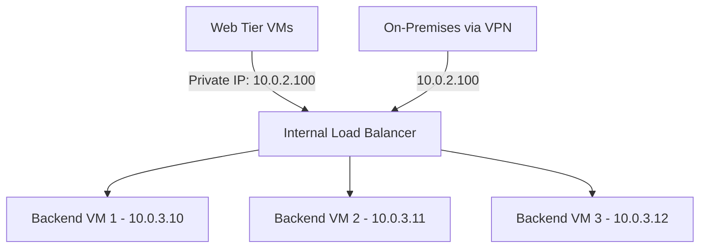

# How to Set Up Azure Internal Load Balancer for Private Backend Services

Author: [nawazdhandala](https://www.github.com/nawazdhandala)

Tags: Azure, Internal Load Balancer, Private Services, Networking, High Availability, Backend, ILB

Description: A complete guide to deploying Azure Internal Load Balancer for distributing traffic to private backend services without public internet exposure.

---

Not every load balancer needs a public IP. Internal services - databases, message queues, microservice APIs, and middleware - need load balancing too, but they should never be exposed to the internet. Azure Internal Load Balancer (ILB) provides layer-4 load balancing entirely within your virtual network, keeping traffic private.

In this post, I will walk through setting up an ILB, configuring backend pools and health probes, and connecting it to your private services.

## What is an Internal Load Balancer?

An Internal Load Balancer is identical to a public Azure Load Balancer except it has a private frontend IP address instead of a public one. It distributes traffic from sources within the VNet (or connected networks via peering, VPN, or ExpressRoute) to backend VMs.



The key difference from a public load balancer:

- **No public IP.** The frontend uses a private IP from your VNet subnet.
- **Only accessible from within the VNet** (or peered/connected networks).
- **Same SKU options.** Standard and Basic, though Standard is recommended for production.

## When to Use Internal Load Balancer

- **Database clusters:** Distribute read queries across multiple database replicas
- **Internal APIs:** Load balance requests to internal microservices
- **Message brokers:** Distribute connections across RabbitMQ/Kafka broker nodes
- **Middle-tier services:** Balance traffic between your web tier and application tier
- **SAP systems:** Load balance SAP application servers

## Step 1: Create the Internal Load Balancer

```bash
# Create a Standard Internal Load Balancer with a private frontend IP
az network lb create \
  --resource-group myResourceGroup \
  --name myInternalLB \
  --sku Standard \
  --vnet-name myVNet \
  --subnet backendSubnet \
  --frontend-ip-name frontendPrivateIP \
  --private-ip-address 10.0.3.100 \
  --backend-pool-name backendPool
```

The `--private-ip-address` is optional. If you omit it, Azure assigns one dynamically from the subnet. For production, I recommend specifying a static IP so your clients always know where to connect.

Notice there is no `--public-ip-address` parameter. That is what makes it internal.

## Step 2: Create Health Probes

Health probes ensure traffic only goes to healthy backends. Choose the probe type based on your service:

```bash
# TCP health probe for a database service on port 5432
az network lb probe create \
  --resource-group myResourceGroup \
  --lb-name myInternalLB \
  --name postgresProbe \
  --protocol Tcp \
  --port 5432 \
  --interval 15 \
  --threshold 2

# HTTP health probe for an internal API
az network lb probe create \
  --resource-group myResourceGroup \
  --lb-name myInternalLB \
  --name apiHealthProbe \
  --protocol Http \
  --port 8080 \
  --path "/health" \
  --interval 10 \
  --threshold 3
```

Parameters:
- `--interval` is how often (in seconds) the probe checks each backend
- `--threshold` is how many consecutive failures before marking a backend as unhealthy

## Step 3: Create Load Balancing Rules

Rules define how traffic is distributed from the frontend to the backend:

```bash
# Load balancing rule for the database service
az network lb rule create \
  --resource-group myResourceGroup \
  --lb-name myInternalLB \
  --name postgresRule \
  --frontend-ip-name frontendPrivateIP \
  --frontend-port 5432 \
  --backend-pool-name backendPool \
  --backend-port 5432 \
  --protocol Tcp \
  --probe-name postgresProbe \
  --idle-timeout 30 \
  --enable-tcp-reset true

# Load balancing rule for the API service
az network lb rule create \
  --resource-group myResourceGroup \
  --lb-name myInternalLB \
  --name apiRule \
  --frontend-ip-name frontendPrivateIP \
  --frontend-port 8080 \
  --backend-pool-name backendPool \
  --backend-port 8080 \
  --protocol Tcp \
  --probe-name apiHealthProbe \
  --idle-timeout 15 \
  --enable-tcp-reset true
```

## Step 4: Add VMs to the Backend Pool

Add your backend VMs by updating their NIC configurations:

```bash
# Add VM1 to the backend pool
az network nic ip-config address-pool add \
  --resource-group myResourceGroup \
  --nic-name vm1NIC \
  --ip-config-name ipconfig1 \
  --lb-name myInternalLB \
  --address-pool backendPool

# Add VM2 to the backend pool
az network nic ip-config address-pool add \
  --resource-group myResourceGroup \
  --nic-name vm2NIC \
  --ip-config-name ipconfig1 \
  --lb-name myInternalLB \
  --address-pool backendPool

# Add VM3 to the backend pool
az network nic ip-config address-pool add \
  --resource-group myResourceGroup \
  --nic-name vm3NIC \
  --ip-config-name ipconfig1 \
  --lb-name myInternalLB \
  --address-pool backendPool
```

## Step 5: Configure Session Persistence

For some backend services, you need requests from the same client to consistently go to the same backend. This is called session affinity or sticky sessions.

```bash
# Update the rule to use client IP-based session persistence
az network lb rule update \
  --resource-group myResourceGroup \
  --lb-name myInternalLB \
  --name postgresRule \
  --load-distribution SourceIP
```

Load distribution options:
- **Default (None):** 5-tuple hash (source IP, source port, destination IP, destination port, protocol). Distributes traffic evenly.
- **SourceIP:** 2-tuple hash (source IP, destination IP). All connections from the same source IP go to the same backend.
- **SourceIPProtocol:** 3-tuple hash (source IP, destination IP, protocol).

For database connections, `SourceIP` is usually appropriate since you want a client's connection pool to stick to one database server.

## HA Ports Configuration

If your backend VMs run multiple services on different ports, you can use HA Ports to load balance all ports with a single rule:

```bash
# Create an HA Ports rule (all protocols, all ports)
az network lb rule create \
  --resource-group myResourceGroup \
  --lb-name myInternalLB \
  --name haPortsRule \
  --frontend-ip-name frontendPrivateIP \
  --frontend-port 0 \
  --backend-pool-name backendPool \
  --backend-port 0 \
  --protocol All \
  --probe-name apiHealthProbe \
  --enable-tcp-reset true
```

HA Ports is commonly used with network virtual appliances (NVAs) where you want all traffic to flow through the load balancer regardless of port.

## Accessing the ILB from Peered VNets

The ILB is accessible from peered VNets as long as:

1. VNet peering is configured and both sides show `Connected`
2. There is no NSG blocking traffic to the ILB subnet
3. There are no UDRs diverting traffic away from the peered VNet

No special configuration is needed on the ILB itself. The private IP is routable across peered VNets.

## Accessing the ILB from On-Premises

If you have a VPN or ExpressRoute connection, on-premises servers can reach the ILB by its private IP. Make sure:

1. The on-premises routing table includes a route to the VNet address range through the VPN/ExpressRoute gateway
2. NSGs allow traffic from the on-premises IP ranges
3. The ILB's frontend IP is within the VNet address range that is advertised to on-premises

## Monitoring the ILB

Check backend pool health and track metrics:

```bash
# View load balancer health probe status
az network lb show \
  --resource-group myResourceGroup \
  --name myInternalLB \
  --query "loadBalancingRules[].{name:name, probe:probe.id}" \
  --output table
```

Key metrics to monitor in Azure Monitor:

- **Health Probe Status:** Shows which backends are healthy or unhealthy
- **Data Path Availability:** Whether the ILB itself is functioning
- **SNAT Connection Count:** Relevant if backend VMs make outbound connections
- **Byte Count and Packet Count:** Traffic volume through the ILB

Set up alerts for probe failures:

```bash
# Alert when any backend becomes unhealthy
az monitor metrics alert create \
  --resource-group myResourceGroup \
  --name backendHealthAlert \
  --scopes "/subscriptions/<sub-id>/resourceGroups/myResourceGroup/providers/Microsoft.Network/loadBalancers/myInternalLB" \
  --condition "avg HealthProbeStatus < 100" \
  --window-size 5m \
  --evaluation-frequency 1m \
  --action-group myAlertGroup \
  --description "One or more backend VMs are unhealthy"
```

## Common Issues

**Cannot reach the ILB from a VM in the same subnet.** Standard SKU ILBs require NSG rules on the backend subnet. Make sure there is an inbound rule allowing traffic to the ILB port from the source subnets.

**Backend VMs cannot make outbound internet connections.** Standard ILB does not provide outbound connectivity. You need a NAT Gateway, a public load balancer, or instance-level public IPs for outbound traffic.

**Health probes failing.** Make sure the service on the backend VM is actually listening on the probed port. Check the VM's local firewall (iptables, Windows Firewall) in addition to NSGs.

## Summary

Azure Internal Load Balancer keeps your backend services private while providing the same load balancing, health monitoring, and high availability as a public load balancer. Deploy it with a static private IP, set up health probes tailored to your service, and add your backend VMs to the pool. Clients in the same VNet, peered VNets, or on-premises networks can all reach the ILB by its private IP. Just remember that Standard ILB does not provide outbound connectivity, so plan your backend VMs' outbound access separately.
