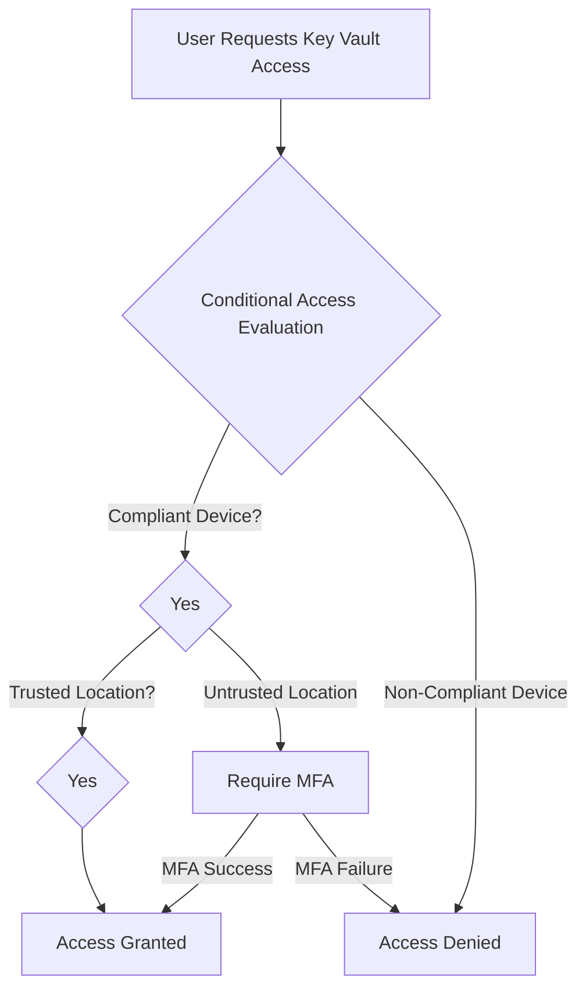

# How to Set Up Azure Key Vault Access with Conditional Access Policies for Enhanced Security

Author: [nawazdhandala](https://www.github.com/nawazdhandala)

Tags: Azure, Key Vault, Conditional Access, Security, Microsoft Entra ID, Zero Trust, Access Control

Description: Learn how to combine Azure Key Vault access controls with Microsoft Entra ID Conditional Access policies to enforce location, device, and risk-based restrictions on secret access.

---

Azure Key Vault already provides solid access control through RBAC and access policies, but those controls only answer the question "who is allowed to access this resource?" They do not consider context like where the request is coming from, what device is being used, or whether the sign-in session shows signs of compromise. Conditional Access fills that gap by adding context-aware policy enforcement to Key Vault access. You can require that secrets are only accessible from managed devices, from specific network locations, or when the user's risk level is low.

In this post, I will show you how to layer Conditional Access policies on top of Key Vault to create a more robust security posture for your most sensitive secrets and keys.

## Why Conditional Access for Key Vault

Consider a scenario where a developer's credentials get phished. The attacker now has valid Azure AD credentials. Without Conditional Access, those credentials might be enough to access Key Vault and extract production database connection strings, API keys, or encryption keys.

With Conditional Access, you can require that Key Vault access only works from compliant devices, from your corporate network, with multi-factor authentication, and only when the user's risk score is low. The phished credentials become much less useful because the attacker cannot satisfy these additional conditions.



## Prerequisites

To use Conditional Access with Key Vault, you need:

- Microsoft Entra ID Premium P1 or P2 licenses (Conditional Access is a premium feature).
- Key Vault configured to use Azure RBAC for access control (recommended) or access policies.
- The "Microsoft Azure Management" cloud app registered in your Conditional Access policy targets (Key Vault falls under this umbrella), or you can target Key Vault specifically.

## Step 1: Switch Key Vault to RBAC Authorization

If your Key Vault is still using the legacy access policy model, I recommend switching to Azure RBAC. RBAC integrates better with Conditional Access and gives you more granular control.

This converts an existing Key Vault from access policies to RBAC authorization:

```bash
# Update Key Vault to use RBAC for data plane authorization
az keyvault update \
  --name kv-production-secrets \
  --resource-group rg-production \
  --enable-rbac-authorization true

# Assign the Key Vault Secrets User role to your application
az role assignment create \
  --assignee "<app-or-user-object-id>" \
  --role "Key Vault Secrets User" \
  --scope "/subscriptions/<subscription-id>/resourceGroups/rg-production/providers/Microsoft.KeyVault/vaults/kv-production-secrets"
```

A word of caution: when you switch from access policies to RBAC, the existing access policies stop working immediately. Make sure you have RBAC role assignments in place for all users and applications that need access before making the switch.

## Step 2: Create Named Locations

Before creating the Conditional Access policy, define your trusted network locations. Named locations tell Entra ID which IP ranges or countries represent trusted access points.

You can create named locations in the Entra admin center or using Microsoft Graph PowerShell:

```powershell
# Connect to Microsoft Graph with the required permissions
Connect-MgGraph -Scopes "Policy.ReadWrite.ConditionalAccess"

# Create a named location for your corporate office IP range
$officeLocation = @{
    "@odata.type" = "#microsoft.graph.ipNamedLocation"
    displayName = "Corporate Office Networks"
    isTrusted = $true
    ipRanges = @(
        @{
            "@odata.type" = "#microsoft.graph.iPv4CidrRange"
            # Replace with your actual office IP ranges
            cidrAddress = "203.0.113.0/24"
        },
        @{
            "@odata.type" = "#microsoft.graph.iPv4CidrRange"
            cidrAddress = "198.51.100.0/24"
        }
    )
}

New-MgIdentityConditionalAccessNamedLocation -BodyParameter $officeLocation
```

## Step 3: Create the Conditional Access Policy for Key Vault

Now create the Conditional Access policy that targets Key Vault access. You can target either "Microsoft Azure Management" (which covers all Azure management plane operations including Key Vault) or the specific Key Vault resource.

This PowerShell script creates a Conditional Access policy that requires MFA and a compliant device for Key Vault access from untrusted locations:

```powershell
# Get the named location ID we just created
$namedLocation = Get-MgIdentityConditionalAccessNamedLocation `
    -Filter "displayName eq 'Corporate Office Networks'"

# Create the Conditional Access policy
$policy = @{
    displayName = "Require MFA and Compliant Device for Key Vault Access"
    state = "enabledForReportingButNotEnforced"  # Start in report-only mode
    conditions = @{
        # Apply to all users except emergency access accounts
        users = @{
            includeUsers = @("All")
            excludeUsers = @("<emergency-access-account-id>")
        }
        # Target Azure Key Vault specifically
        applications = @{
            includeApplications = @("cfa8b339-82a2-471a-a3c9-0fc0be7a4093")
            # The above GUID is the Azure Key Vault service principal app ID
        }
        # Only apply when NOT on trusted networks
        locations = @{
            includeLocations = @("All")
            excludeLocations = @($namedLocation.Id)
        }
        # Consider sign-in risk if you have Entra ID P2
        signInRiskLevels = @()
    }
    grantControls = @{
        operator = "AND"
        builtInControls = @(
            "mfa",
            "compliantDevice"
        )
    }
    sessionControls = @{
        signInFrequency = @{
            value = 4
            type = "hours"
            isEnabled = $true
        }
    }
}

New-MgIdentityConditionalAccessPolicy -BodyParameter $policy
```

Notice that I set the state to `enabledForReportingButNotEnforced`. This is report-only mode, which lets you see what the policy would do without actually blocking anyone. Always start here.

## Step 4: Test in Report-Only Mode

Leave the policy in report-only mode for at least a week. During this time, check the Conditional Access insights workbook to see which sign-ins would have been affected.

Navigate to Microsoft Entra admin center, then Protection, then Conditional Access, then Insights and reporting. Filter by your policy name to see:

- How many sign-ins would have been blocked
- Which users would have been affected
- What conditions triggered the policy

This is where you will catch things like service principals or automation accounts that access Key Vault and would be blocked by the MFA requirement. Service principals cannot do interactive MFA, so you need to exclude them from the policy or handle them differently.

## Step 5: Handle Service Principal Access

Service principals and managed identities that access Key Vault programmatically cannot satisfy MFA or device compliance requirements. You have a few options:

**Option 1: Exclude service principals from the policy.** This is the simplest approach but reduces your security coverage.

**Option 2: Use a separate policy for service principals.** Create a policy that targets workload identities and enforces different controls, like IP-based restrictions.

This creates a separate policy that restricts service principal access to Key Vault based on IP address:

```powershell
# Policy for workload identities (service principals)
$workloadPolicy = @{
    displayName = "Restrict Key Vault Access for Service Principals to Trusted Networks"
    state = "enabledForReportingButNotEnforced"
    conditions = @{
        # Target service principals using the workload identity filter
        clientApplications = @{
            includeServicePrincipals = @("All")
            excludeServicePrincipals = @()
        }
        applications = @{
            includeApplications = @("cfa8b339-82a2-471a-a3c9-0fc0be7a4093")
        }
        # Block access from outside trusted networks
        locations = @{
            includeLocations = @("All")
            excludeLocations = @($namedLocation.Id)
        }
    }
    grantControls = @{
        operator = "OR"
        builtInControls = @("block")
    }
}

New-MgIdentityConditionalAccessPolicy -BodyParameter $workloadPolicy
```

## Step 6: Enable the Policy

Once you are satisfied with the report-only results and have handled all edge cases, switch the policy to enabled mode.

```powershell
# Get the policy ID
$policyToEnable = Get-MgIdentityConditionalAccessPolicy `
    -Filter "displayName eq 'Require MFA and Compliant Device for Key Vault Access'"

# Enable the policy (switch from report-only to enforced)
Update-MgIdentityConditionalAccessPolicy `
    -ConditionalAccessPolicyId $policyToEnable.Id `
    -State "enabled"
```

## Step 7: Configure Key Vault Firewall as Additional Protection

Conditional Access and Key Vault's built-in firewall complement each other. The Key Vault firewall restricts network-level access, while Conditional Access restricts identity-level access. Use both for defense in depth.

This configures the Key Vault firewall to allow access only from specific networks:

```bash
# Configure Key Vault firewall to restrict network access
# Default action is Deny - only explicitly allowed networks can connect
az keyvault update \
  --name kv-production-secrets \
  --resource-group rg-production \
  --default-action Deny

# Allow access from a specific subnet
az keyvault network-rule add \
  --name kv-production-secrets \
  --resource-group rg-production \
  --subnet "/subscriptions/<sub-id>/resourceGroups/rg-prod/providers/Microsoft.Network/virtualNetworks/vnet-prod/subnets/snet-app"

# Allow access from trusted Azure services
az keyvault update \
  --name kv-production-secrets \
  --resource-group rg-production \
  --bypass AzureServices
```

## Monitoring and Alerting

Set up alerts so you know when Conditional Access policies block Key Vault access attempts. This helps you catch both legitimate issues (a developer locked out because their device fell out of compliance) and security events (an attacker failing to access secrets).

You can create alerts in Azure Monitor based on the Entra ID sign-in logs:

```kusto
// Alert query: Key Vault access blocked by Conditional Access
// Run this in your Log Analytics workspace connected to Entra ID logs
SigninLogs
| where TimeGenerated > ago(1h)
| where ResourceDisplayName contains "Key Vault"
    or AppDisplayName contains "Key Vault"
| where ConditionalAccessStatus == "failure"
| project
    TimeGenerated,
    UserPrincipalName,
    IPAddress,
    Location,
    ConditionalAccessPolicies,
    Status
| order by TimeGenerated desc
```

## Best Practices

1. **Always start in report-only mode.** Jumping straight to enforcement will almost certainly lock someone out.
2. **Maintain emergency access accounts.** Exclude at least two break-glass accounts from all Conditional Access policies.
3. **Use the principle of least privilege for Key Vault RBAC.** Give users "Key Vault Secrets User" instead of "Key Vault Administrator" when they only need to read secrets.
4. **Combine with private endpoints.** For the highest security, use Key Vault private endpoints so the vault is not accessible from the public internet at all.
5. **Review policies quarterly.** Named locations change, team members change, and your security requirements evolve. Regular reviews keep your policies relevant.

## Wrapping Up

Layering Conditional Access on top of Key Vault access controls gives you a contextual security model that goes far beyond simple "who has permission" checks. You can enforce that secrets are only accessible under the right conditions - from the right device, the right network, with the right authentication strength - and that significantly reduces the risk from credential compromise. The setup requires some careful planning, especially around service principal access, but the end result is a much stronger security posture around your most sensitive assets.
