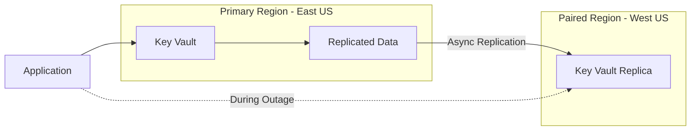

# How to Set Up Azure Key Vault Backup and Disaster Recovery Across Paired Regions

Author: [nawazdhandala](https://www.github.com/nawazdhandala)

Tags: Azure Key Vault, Backup, Disaster Recovery, Paired Regions, Business Continuity, Key Management, Azure

Description: A comprehensive guide to backing up Azure Key Vault secrets, keys, and certificates and restoring them across Azure paired regions for disaster recovery.

---

Azure Key Vault is built with high availability in mind. It replicates data within the same region and to a paired region automatically. During a regional outage, Microsoft can fail over the vault to the paired region, and your applications continue to work with read-only access. But there are scenarios where the built-in replication is not enough, where you need explicit backups, cross-region restore capabilities, or protection against accidental deletion.

This guide covers Key Vault's built-in resilience, how to create explicit backups, and how to design a disaster recovery strategy that handles the scenarios Azure's automatic replication does not cover.

## Understanding Key Vault's Built-In Resilience

Azure Key Vault automatically replicates your data in two ways:

1. **Within the region**: Data is replicated across multiple availability zones (in regions that support them) or across fault domains
2. **Across paired regions**: Data is asynchronously replicated to the Azure paired region

When a regional outage occurs, Microsoft automatically fails over the vault to the secondary region. During this failover:
- The vault is available in **read-only mode**
- You cannot create, update, or delete secrets, keys, or certificates
- Existing data is accessible for your applications
- DNS TTL ensures the failover happens within minutes



This automatic replication covers most disaster scenarios, but it has limitations:
- The failover is Microsoft-controlled, not customer-controlled
- Read-only mode during failover means you cannot rotate secrets or update configurations
- Accidental deletion of a secret is replicated to the paired region too
- There is no point-in-time recovery

## When You Need Explicit Backups

You need explicit backups for these scenarios:

- **Accidental deletion**: Soft delete helps (and is now enabled by default), but purge protection has a retention window. If someone purges a secret after the soft-delete retention period, it is gone from both regions.
- **Cross-tenant recovery**: You cannot restore a backup from one tenant to another, but you can restore across subscriptions within the same tenant.
- **Compliance requirements**: Some regulatory frameworks require you to maintain independent backup copies of cryptographic material.
- **Migration**: Moving secrets from one vault to another, such as during a subscription migration.

## Step 1: Enable Soft Delete and Purge Protection

Before setting up backups, make sure your vault has soft delete and purge protection enabled. Soft delete retains deleted objects for a configurable period (7 to 90 days). Purge protection prevents permanent deletion until the retention period expires.

```bash
# Check current soft delete and purge protection settings
az keyvault show \
  --name myKeyVault \
  --query '{softDelete: properties.enableSoftDelete, purgeProtection: properties.enablePurgeProtection, retentionDays: properties.softDeleteRetentionInDays}'

# Enable purge protection if not already enabled (note: this cannot be disabled once enabled)
az keyvault update \
  --name myKeyVault \
  --enable-purge-protection true
```

Purge protection is a one-way setting. Once enabled, it cannot be disabled. This is intentional because it is a security feature that prevents malicious deletion of cryptographic material.

## Step 2: Back Up Individual Secrets, Keys, and Certificates

Azure Key Vault supports backing up individual objects. The backup is encrypted and can only be restored to a vault in the same Azure tenant and geography.

```bash
# Back up a secret
az keyvault secret backup \
  --vault-name myKeyVault \
  --name database-connection-string \
  --file ./backups/database-connection-string.backup

# Back up a key
az keyvault key backup \
  --vault-name myKeyVault \
  --name encryption-key \
  --file ./backups/encryption-key.backup

# Back up a certificate
az keyvault certificate backup \
  --vault-name myKeyVault \
  --name api-certificate \
  --file ./backups/api-certificate.backup
```

The backup files are encrypted blobs. They contain all versions of the object, not just the current version. You cannot read the contents of a backup file - you can only restore it to an Azure Key Vault.

## Step 3: Automate Full Vault Backup

For vaults with many objects, manually backing up each one is not practical. Here is a PowerShell script that backs up everything in a vault.

```powershell
# Automated full vault backup script
param(
    [string]$VaultName = "myKeyVault",
    [string]$BackupPath = "./kv-backups/$(Get-Date -Format 'yyyy-MM-dd')"
)

# Create the backup directory
New-Item -ItemType Directory -Path $BackupPath -Force | Out-Null

# Track success and failure counts
$successCount = 0
$failCount = 0

# Back up all secrets
Write-Host "Backing up secrets..."
$secrets = Get-AzKeyVaultSecret -VaultName $VaultName
foreach ($secret in $secrets) {
    try {
        $fileName = Join-Path $BackupPath "secret-$($secret.Name).backup"
        Backup-AzKeyVaultSecret -VaultName $VaultName -Name $secret.Name -OutputFile $fileName -Force
        $successCount++
        Write-Host "  OK: $($secret.Name)"
    } catch {
        $failCount++
        Write-Warning "  FAILED: $($secret.Name) - $($_.Exception.Message)"
    }
}

# Back up all keys
Write-Host "Backing up keys..."
$keys = Get-AzKeyVaultKey -VaultName $VaultName
foreach ($key in $keys) {
    try {
        $fileName = Join-Path $BackupPath "key-$($key.Name).backup"
        Backup-AzKeyVaultKey -VaultName $VaultName -Name $key.Name -OutputFile $fileName -Force
        $successCount++
        Write-Host "  OK: $($key.Name)"
    } catch {
        $failCount++
        Write-Warning "  FAILED: $($key.Name) - $($_.Exception.Message)"
    }
}

# Back up all certificates
Write-Host "Backing up certificates..."
$certs = Get-AzKeyVaultCertificate -VaultName $VaultName
foreach ($cert in $certs) {
    try {
        $fileName = Join-Path $BackupPath "cert-$($cert.Name).backup"
        Backup-AzKeyVaultCertificate -VaultName $VaultName -Name $cert.Name -OutputFile $fileName -Force
        $successCount++
        Write-Host "  OK: $($cert.Name)"
    } catch {
        $failCount++
        Write-Warning "  FAILED: $($cert.Name) - $($_.Exception.Message)"
    }
}

Write-Host "`nBackup complete: $successCount succeeded, $failCount failed"
Write-Host "Backup location: $BackupPath"
```

## Step 4: Store Backups Securely

The backup files must be stored securely. They are encrypted and tied to your Azure tenant, but they still contain references to sensitive material.

```bash
# Upload backups to an Azure Storage account with immutable storage
# First, create a storage container with a time-based retention policy
az storage container create \
  --name kv-backups \
  --account-name backupstorage \
  --auth-mode login

# Set an immutability policy to prevent deletion for 90 days
az storage container immutability-policy create \
  --account-name backupstorage \
  --container-name kv-backups \
  --period 90

# Upload the backup files
az storage blob upload-batch \
  --destination kv-backups \
  --source ./kv-backups/ \
  --account-name backupstorage \
  --auth-mode login
```

Using immutable storage for Key Vault backups prevents anyone from deleting the backups, even with administrative access to the storage account. This protects against ransomware scenarios where an attacker might try to destroy both the vault and its backups.

## Step 5: Restore to a Vault in the Paired Region

When disaster strikes and you need to restore to a vault in another region, create a new vault in the paired region and restore the backups.

```bash
# Create a recovery vault in the paired region
az keyvault create \
  --name myKeyVault-recovery \
  --resource-group dr-resource-group \
  --location westus \
  --enable-soft-delete true \
  --enable-purge-protection true \
  --retention-days 90

# Restore a secret from backup
az keyvault secret restore \
  --vault-name myKeyVault-recovery \
  --file ./backups/database-connection-string.backup

# Restore a key from backup
az keyvault key restore \
  --vault-name myKeyVault-recovery \
  --file ./backups/encryption-key.backup

# Restore a certificate from backup
az keyvault certificate restore \
  --vault-name myKeyVault-recovery \
  --file ./backups/api-certificate.backup
```

Important constraints for restore operations:
- The target vault must be in the same Azure geography (e.g., both in US or both in Europe)
- The target vault must be in the same Azure tenant
- The target vault must not already have an object with the same name
- All versions of the object are restored, not just the latest

## Step 6: Automate Backup with Azure Automation

Set up a scheduled backup using Azure Automation so backups happen regularly without manual intervention.

```powershell
# Azure Automation Runbook for scheduled Key Vault backup
# Schedule this to run daily or weekly

param(
    [string]$VaultName = "myKeyVault",
    [string]$StorageAccountName = "backupstorage",
    [string]$ContainerName = "kv-backups"
)

# Authenticate using the Automation Account's managed identity
Connect-AzAccount -Identity

$datestamp = Get-Date -Format "yyyy-MM-dd-HHmm"
$localPath = "$env:TEMP/kv-backup-$datestamp"
New-Item -ItemType Directory -Path $localPath -Force | Out-Null

# Back up all vault objects
$secrets = Get-AzKeyVaultSecret -VaultName $VaultName
foreach ($secret in $secrets) {
    $file = "$localPath/secret-$($secret.Name).backup"
    Backup-AzKeyVaultSecret -VaultName $VaultName -Name $secret.Name -OutputFile $file -Force
}

$keys = Get-AzKeyVaultKey -VaultName $VaultName
foreach ($key in $keys) {
    $file = "$localPath/key-$($key.Name).backup"
    Backup-AzKeyVaultKey -VaultName $VaultName -Name $key.Name -OutputFile $file -Force
}

$certs = Get-AzKeyVaultCertificate -VaultName $VaultName
foreach ($cert in $certs) {
    $file = "$localPath/cert-$($cert.Name).backup"
    Backup-AzKeyVaultCertificate -VaultName $VaultName -Name $cert.Name -OutputFile $file -Force
}

# Upload to blob storage
$context = New-AzStorageContext -StorageAccountName $StorageAccountName -UseConnectedAccount
Get-ChildItem $localPath | ForEach-Object {
    Set-AzStorageBlobContent `
        -File $_.FullName `
        -Container $ContainerName `
        -Blob "$datestamp/$($_.Name)" `
        -Context $context `
        -Force
}

Write-Output "Backup completed: $(Get-ChildItem $localPath | Measure-Object | Select-Object -ExpandProperty Count) objects backed up to $ContainerName/$datestamp"

# Clean up temp files
Remove-Item -Path $localPath -Recurse -Force
```

## Step 7: Test Your Recovery Process

A backup strategy is only as good as your last successful restore test. Schedule regular recovery tests.

```bash
# Create a test vault for recovery testing
az keyvault create \
  --name myKeyVault-test-restore \
  --resource-group test-rg \
  --location eastus \
  --enable-soft-delete true

# Restore a sample of backups and verify
az keyvault secret restore \
  --vault-name myKeyVault-test-restore \
  --file ./backups/database-connection-string.backup

# Verify the restored secret matches the original
ORIGINAL=$(az keyvault secret show --vault-name myKeyVault --name database-connection-string --query value -o tsv)
RESTORED=$(az keyvault secret show --vault-name myKeyVault-test-restore --name database-connection-string --query value -o tsv)

if [ "$ORIGINAL" = "$RESTORED" ]; then
    echo "Restore verification PASSED"
else
    echo "Restore verification FAILED - values do not match"
fi

# Clean up the test vault
az keyvault delete --name myKeyVault-test-restore
az keyvault purge --name myKeyVault-test-restore
```

## Application Architecture for DR

Your applications should be designed to handle Key Vault failover gracefully. Here are some patterns.

**Pattern 1: DNS-based failover (default)**

Applications reference the vault by DNS name. During Microsoft-managed failover, the DNS resolves to the secondary region automatically. No application changes needed, but the vault is read-only.

**Pattern 2: Active-active with two vaults**

Maintain two vaults in different regions with synchronized secrets. Your application configuration includes both vault URLs and falls back to the secondary if the primary is unavailable.

```python
# Python example of active-active Key Vault access
from azure.keyvault.secrets import SecretClient
from azure.identity import DefaultAzureCredential

credential = DefaultAzureCredential()

# Try primary vault first, fall back to secondary
vaults = [
    "https://myKeyVault.vault.azure.net",
    "https://myKeyVault-secondary.vault.azure.net"
]

def get_secret(name):
    for vault_url in vaults:
        try:
            client = SecretClient(vault_url=vault_url, credential=credential)
            secret = client.get_secret(name)
            return secret.value
        except Exception as e:
            print(f"Failed to access {vault_url}: {e}")
            continue
    raise Exception(f"Could not retrieve secret {name} from any vault")
```

## Wrapping Up

Azure Key Vault provides solid built-in resilience through automatic cross-region replication, but explicit backups are essential for protection against accidental deletion, compliance requirements, and scenarios where you need customer-controlled recovery. Automate your backups, store them in immutable storage, and test your recovery process regularly. The combination of soft delete, purge protection, automated backups, and recovery testing gives you a comprehensive disaster recovery strategy for your most critical cryptographic material and secrets.
