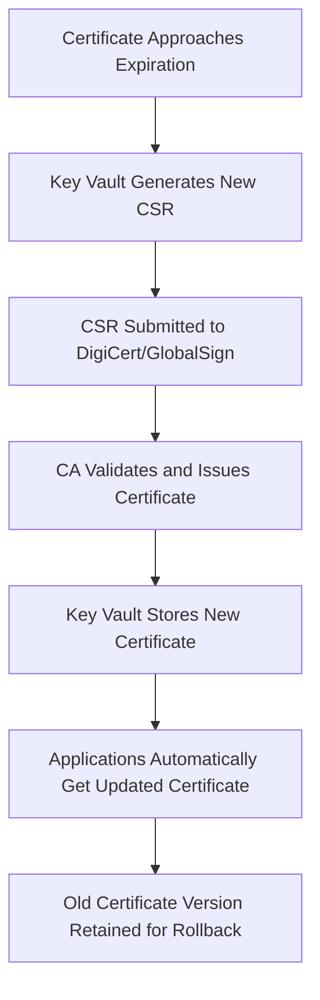

# How to Set Up Azure Key Vault Certificate Auto-Renewal with DigiCert and GlobalSign Integration

Author: [nawazdhandala](https://www.github.com/nawazdhandala)

Tags: Azure Key Vault, Certificate Management, DigiCert, GlobalSign, SSL Certificates, Automation, PKI

Description: Learn how to configure Azure Key Vault to automatically renew SSL/TLS certificates through integrated CA providers like DigiCert and GlobalSign.

---

Managing SSL/TLS certificates is one of those tasks that seems simple until you have dozens of them expiring on different dates across multiple services. Missing a renewal causes outages, and manual renewal processes are error-prone. Azure Key Vault solves this by integrating directly with Certificate Authorities like DigiCert and GlobalSign, allowing certificates to be renewed automatically before they expire.

In this guide, I will walk through setting up the CA integration, configuring certificate policies for auto-renewal, and monitoring the process to make sure everything works smoothly.

## How Key Vault Certificate Auto-Renewal Works

Azure Key Vault acts as a certificate lifecycle manager. When you configure a certificate with an integrated CA, Key Vault handles the entire lifecycle:

1. Key Vault generates a Certificate Signing Request (CSR)
2. Key Vault submits the CSR to the integrated CA (DigiCert or GlobalSign)
3. The CA validates the request and issues the certificate
4. Key Vault stores the certificate and private key
5. When the certificate approaches expiration, Key Vault automatically repeats the process



The private key never leaves Key Vault. The CA only receives the CSR (which contains the public key), and the issued certificate is stored back in Key Vault. Applications that reference the certificate get the latest version automatically.

## Prerequisites

Before setting up auto-renewal, you need:

- An Azure Key Vault (Premium tier recommended for HSM-backed keys)
- A DigiCert CertCentral account or GlobalSign account with API access
- Administrator access to the CA account to generate API credentials
- Domain validation already configured with your CA (you should have previously issued at least one certificate for your domain)
- Key Vault Certificates Officer role on the Key Vault

## Step 1: Configure the Certificate Issuer in Key Vault

First, register your CA as a certificate issuer in Key Vault.

### DigiCert Integration

You need your DigiCert API key and Organization ID from the CertCentral portal.

```bash
# Register DigiCert as a certificate issuer in Key Vault
az keyvault certificate issuer create \
  --vault-name myKeyVault \
  --issuer-name DigiCertIssuer \
  --provider-name DigiCert \
  --account-id "YOUR_DIGICERT_ACCOUNT_ID" \
  --api-key "YOUR_DIGICERT_API_KEY" \
  --organization-id "YOUR_ORG_ID"
```

### GlobalSign Integration

For GlobalSign, you need your MSSL (Managed SSL) account credentials.

```bash
# Register GlobalSign as a certificate issuer in Key Vault
az keyvault certificate issuer create \
  --vault-name myKeyVault \
  --issuer-name GlobalSignIssuer \
  --provider-name GlobalSign \
  --account-id "YOUR_GLOBALSIGN_ACCOUNT_ID" \
  --api-key "YOUR_GLOBALSIGN_API_KEY"
```

Verify the issuer is configured correctly.

```bash
# List configured issuers and verify their status
az keyvault certificate issuer list --vault-name myKeyVault --output table

# Show details of a specific issuer
az keyvault certificate issuer show \
  --vault-name myKeyVault \
  --issuer-name DigiCertIssuer \
  --query '{name: provider, accountId: credentials.accountId}'
```

## Step 2: Create a Certificate Policy

The certificate policy defines what type of certificate to request, how it should be renewed, and what actions to take as it approaches expiration.

Create a JSON policy file that specifies the certificate parameters.

```json
{
  "issuerParameters": {
    "name": "DigiCertIssuer",
    "certificateType": "OV-SSL"
  },
  "keyProperties": {
    "exportable": true,
    "keyType": "RSA",
    "keySize": 2048,
    "reuseKey": false
  },
  "secretProperties": {
    "contentType": "application/x-pkcs12"
  },
  "x509CertificateProperties": {
    "subject": "CN=api.contoso.com",
    "subjectAlternativeNames": {
      "dnsNames": [
        "api.contoso.com",
        "api-staging.contoso.com"
      ]
    },
    "validityInMonths": 12
  },
  "lifetimeActions": [
    {
      "trigger": {
        "daysBeforeExpiry": 30
      },
      "action": {
        "actionType": "AutoRenew"
      }
    },
    {
      "trigger": {
        "daysBeforeExpiry": 60
      },
      "action": {
        "actionType": "EmailContacts"
      }
    }
  ]
}
```

Key settings in this policy:

- **certificateType**: Matches the product type in your CA account (OV-SSL, EV-SSL, etc.)
- **reuseKey**: Set to `false` to generate a new key pair on each renewal (more secure)
- **validityInMonths**: Certificate validity period (subject to CA and your account limits)
- **lifetimeActions**: Two actions are configured - auto-renew 30 days before expiry and email contacts 60 days before expiry

## Step 3: Create the Certificate

Now create the certificate using the policy. Key Vault will generate the CSR, submit it to the CA, and store the issued certificate.

```bash
# Create a certificate with the auto-renewal policy
az keyvault certificate create \
  --vault-name myKeyVault \
  --name api-contoso-cert \
  --policy @certificate-policy.json
```

The certificate creation is asynchronous. For OV (Organization Validated) certificates, the CA typically issues them within minutes if domain validation is already in place. For EV (Extended Validation) certificates, it may take longer due to additional verification requirements.

Check the status of the certificate operation.

```bash
# Check the pending certificate operation status
az keyvault certificate pending show \
  --vault-name myKeyVault \
  --name api-contoso-cert \
  --query '{status: status, statusDetail: statusDetail, requestId: requestId}'
```

Once the status shows `completed`, the certificate is ready.

```bash
# Verify the issued certificate details
az keyvault certificate show \
  --vault-name myKeyVault \
  --name api-contoso-cert \
  --query '{subject: policy.x509CertificateProperties.subject, expiry: attributes.expires, thumbprint: x509Thumbprint}'
```

## Step 4: Configure Email Notifications

Key Vault can send email notifications when certificates are approaching expiration. This serves as a safety net in case auto-renewal fails.

Add contact email addresses to the Key Vault.

```bash
# Add certificate contacts for expiration notifications
az keyvault certificate contact add \
  --vault-name myKeyVault \
  --email "infra-team@contoso.com"

az keyvault certificate contact add \
  --vault-name myKeyVault \
  --email "security-team@contoso.com"
```

The email notification triggers based on the `lifetimeActions` in the certificate policy. In our example, contacts receive an email 60 days before expiry, giving the team plenty of time to investigate if auto-renewal has not already succeeded.

## Step 5: Integrate with Azure Services

Many Azure services can pull certificates directly from Key Vault, which means they automatically pick up renewed certificates.

### Azure App Service

```bash
# Import a Key Vault certificate into App Service
az webapp config ssl import \
  --resource-group myResourceGroup \
  --name myWebApp \
  --key-vault myKeyVault \
  --key-vault-certificate-name api-contoso-cert
```

App Service periodically checks Key Vault for updated certificate versions and rotates automatically.

### Azure Application Gateway

```bash
# Reference a Key Vault certificate in Application Gateway
az network application-gateway ssl-cert create \
  --resource-group myResourceGroup \
  --gateway-name myAppGateway \
  --name api-ssl-cert \
  --key-vault-secret-id "https://myKeyVault.vault.azure.net/secrets/api-contoso-cert"
```

Application Gateway polls Key Vault every 4 hours for certificate updates. When a renewal happens, the new certificate is picked up on the next poll.

### Azure Front Door

```bash
# Associate a Key Vault certificate with an Azure Front Door custom domain
az afd secret create \
  --resource-group myResourceGroup \
  --profile-name myFrontDoor \
  --secret-name api-cert-secret \
  --use-latest-version true \
  --secret-source "/subscriptions/YOUR_SUB/resourceGroups/myResourceGroup/providers/Microsoft.KeyVault/vaults/myKeyVault/secrets/api-contoso-cert"
```

The `--use-latest-version true` flag ensures Front Door always uses the most recent certificate version.

## Step 6: Monitor Certificate Renewals

Set up monitoring to catch renewal failures early.

```bash
# Create an Azure Monitor alert for certificate expiration
az monitor metrics alert create \
  --name "cert-expiry-alert" \
  --resource-group myResourceGroup \
  --scopes "/subscriptions/YOUR_SUB/resourceGroups/myResourceGroup/providers/Microsoft.KeyVault/vaults/myKeyVault" \
  --condition "avg SaturationShoelace > 0" \
  --description "Alert when Key Vault certificates are approaching expiration"
```

For more precise monitoring, use Azure Event Grid to subscribe to Key Vault certificate events.

```bash
# Create an Event Grid subscription for certificate events
az eventgrid event-subscription create \
  --name cert-renewal-events \
  --source-resource-id "/subscriptions/YOUR_SUB/resourceGroups/myResourceGroup/providers/Microsoft.KeyVault/vaults/myKeyVault" \
  --included-event-types "Microsoft.KeyVault.CertificateNearExpiry" "Microsoft.KeyVault.CertificateExpired" \
  --endpoint "https://your-webhook-endpoint.com/api/cert-events"
```

This sends notifications to your webhook when certificates are near expiry or have expired, giving you real-time visibility into the renewal process.

## Handling Renewal Failures

Sometimes auto-renewal fails. Common reasons include:

**CA account issues**: API keys expired, account billing problems, or quota limits reached. Check the pending operation status for error details.

```bash
# Check for failed certificate operations
az keyvault certificate pending show \
  --vault-name myKeyVault \
  --name api-contoso-cert \
  --query '{status: status, error: error}'
```

**Domain validation expired**: Some CAs require periodic domain revalidation. If validation has lapsed, the CA will reject the renewal request. Log in to your CA portal and complete the domain validation process.

**Policy mismatch**: If you changed the certificate type in your CA account but not in the Key Vault policy, the renewal request may be rejected. Update the certificate policy to match.

To manually trigger a renewal after fixing the issue, use this command.

```bash
# Manually trigger certificate renewal
az keyvault certificate create \
  --vault-name myKeyVault \
  --name api-contoso-cert \
  --policy "$(az keyvault certificate show --vault-name myKeyVault --name api-contoso-cert --query policy)"
```

## Best Practices

1. **Set renewal to trigger at least 30 days before expiry.** This gives you time to investigate and fix failures before the certificate actually expires.

2. **Always configure email notifications as a backup.** Auto-renewal should work, but having email alerts means a human gets notified if it does not.

3. **Do not reuse keys on renewal.** Generate new key pairs for better security. The `reuseKey: false` setting handles this.

4. **Test the full flow in a non-production vault first.** Create a test certificate with a short validity period and verify that auto-renewal works end-to-end before relying on it in production.

5. **Monitor CA account credentials.** If your DigiCert or GlobalSign API key expires, all auto-renewals will fail silently until you update it.

6. **Keep certificate versions.** Key Vault retains previous versions of certificates. Do not purge old versions immediately - they are useful for rollback if the renewed certificate has issues.

## Wrapping Up

Azure Key Vault certificate auto-renewal with DigiCert or GlobalSign integration takes the manual work out of certificate management. Once configured, certificates renew themselves before expiration, Azure services pick up the new certificates automatically, and your team gets notified if anything goes wrong. The initial setup requires CA credentials and a well-defined certificate policy, but after that the system runs itself. Just keep an eye on the monitoring alerts and CA account health, and you will never have a certificate-related outage again.
