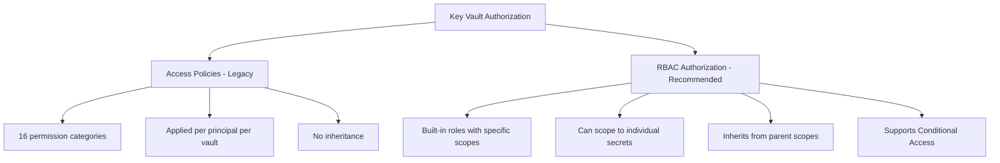

# How to Set Up Azure Key Vault with RBAC Authorization Instead of Access Policies

Author: [nawazdhandala](https://www.github.com/nawazdhandala)

Tags: Azure, Key Vault, RBAC, Access Control, Security, Authorization, Secrets Management

Description: Learn why Azure Key Vault RBAC authorization is preferred over access policies and how to migrate from access policies to RBAC for better security and manageability.

---

Azure Key Vault has two authorization models: the legacy access policies model and the newer Azure RBAC model. For years, access policies were the only option, and they work fine for simple scenarios. But as organizations scale and need finer-grained permissions, conditional access integration, and centralized access management, RBAC authorization becomes the clear winner.

In this guide, I will explain the differences, show you how to set up Key Vault with RBAC from scratch, and walk through migrating existing vaults from access policies to RBAC.

## Access Policies vs. RBAC: Why Switch

Access policies and RBAC differ in several important ways:

| Feature | Access Policies | RBAC Authorization |
|---|---|---|
| Granularity | Per vault (all-or-nothing per secret/key/cert) | Per individual secret, key, or certificate |
| Maximum policies per vault | 1024 | No limit (standard Azure RBAC) |
| Conditional Access | Not supported | Supported through Entra ID |
| Audit integration | Limited | Full Azure Activity Log integration |
| Management plane | Separate from data plane | Unified with Azure RBAC |
| Inheritance | No inheritance | Inherits from resource group, subscription, management group |



The biggest advantage of RBAC is the ability to scope permissions to individual secrets. With access policies, if you grant someone access to secrets, they can read all secrets in the vault. With RBAC, you can grant access to a specific secret and nothing else.

## Prerequisites

You need:

- Azure subscription with Owner or User Access Administrator role
- Existing Key Vault (for migration) or the ability to create a new one
- Understanding of which principals need access to which secrets/keys/certificates

## Step 1: Create a New Key Vault with RBAC Authorization

If you are creating a new vault, enable RBAC from the start:

### Via the Azure Portal

1. Navigate to the Azure portal and search for "Key vaults."
2. Click Create.
3. Fill in the basics (subscription, resource group, name, region, pricing tier).
4. On the Access configuration tab, select Azure role-based access control under Permission model.
5. Complete the remaining tabs and click Create.

### Via PowerShell

```powershell
# Create a new Key Vault with RBAC authorization enabled
# The -EnableRbacAuthorization flag is the key setting
$vault = New-AzKeyVault `
    -VaultName "myapp-keyvault-rbac" `
    -ResourceGroupName "myapp-rg" `
    -Location "eastus" `
    -EnableRbacAuthorization `
    -Sku "Standard" `
    -EnablePurgeProtection `
    -SoftDeleteRetentionInDays 90

Write-Host "Key Vault created with RBAC authorization:"
Write-Host "  Name: $($vault.VaultName)"
Write-Host "  URI: $($vault.VaultUri)"
Write-Host "  Authorization: RBAC"
```

### Via Azure CLI

```bash
# Create a Key Vault with RBAC authorization
az keyvault create \
    --name myapp-keyvault-rbac \
    --resource-group myapp-rg \
    --location eastus \
    --enable-rbac-authorization true \
    --enable-purge-protection true \
    --retention-days 90
```

## Step 2: Understand Key Vault RBAC Roles

Azure provides several built-in roles specifically for Key Vault:

| Role | Description | Scope |
|---|---|---|
| Key Vault Administrator | Full access to manage vault and all objects | Vault, secret, key, or cert |
| Key Vault Secrets Officer | Manage secrets (create, update, delete, list) | Vault or specific secret |
| Key Vault Secrets User | Read secret values | Vault or specific secret |
| Key Vault Certificates Officer | Manage certificates | Vault or specific cert |
| Key Vault Crypto Officer | Manage keys and cryptographic operations | Vault or specific key |
| Key Vault Crypto User | Perform crypto operations using keys | Vault or specific key |
| Key Vault Reader | Read vault metadata (not secret values) | Vault |

The "Officer" roles can manage objects (create, update, delete). The "User" roles can only read or use them. This separation is critical for following least privilege.

## Step 3: Assign Roles at the Vault Level

For applications that need access to all secrets in a vault:

```powershell
# Grant an application access to read all secrets in the vault
# Get the service principal for the application
$sp = Get-AzADServicePrincipal -DisplayName "MyBackendApp"

# Assign the Key Vault Secrets User role at the vault scope
New-AzRoleAssignment `
    -ObjectId $sp.Id `
    -RoleDefinitionName "Key Vault Secrets User" `
    -Scope "/subscriptions/SUB_ID/resourceGroups/myapp-rg/providers/Microsoft.KeyVault/vaults/myapp-keyvault-rbac"

Write-Host "Secrets User role assigned to $($sp.DisplayName) at vault scope."
```

## Step 4: Assign Roles at the Individual Secret Level

This is where RBAC really shines. You can grant access to a single secret:

```powershell
# First, create a secret
$secretValue = ConvertTo-SecureString -String "SuperSecret123!" -AsPlainText -Force
Set-AzKeyVaultSecret -VaultName "myapp-keyvault-rbac" -Name "database-password" -SecretValue $secretValue

# Grant a specific application access to only this one secret
$sp = Get-AzADServicePrincipal -DisplayName "DatabaseMigrationTool"

# The scope includes the specific secret name
New-AzRoleAssignment `
    -ObjectId $sp.Id `
    -RoleDefinitionName "Key Vault Secrets User" `
    -Scope "/subscriptions/SUB_ID/resourceGroups/myapp-rg/providers/Microsoft.KeyVault/vaults/myapp-keyvault-rbac/secrets/database-password"

Write-Host "Access granted to the database-password secret only."
Write-Host "This principal cannot read any other secrets in the vault."
```

## Step 5: Set Up Admin Access

Administrators need the Key Vault Administrator role to manage the vault:

```powershell
# Grant admin access to the security team group
$adminGroup = Get-AzADGroup -DisplayName "Key Vault Admins"

New-AzRoleAssignment `
    -ObjectId $adminGroup.Id `
    -RoleDefinitionName "Key Vault Administrator" `
    -Scope "/subscriptions/SUB_ID/resourceGroups/myapp-rg/providers/Microsoft.KeyVault/vaults/myapp-keyvault-rbac"

Write-Host "Key Vault Administrator role assigned to Key Vault Admins group."
```

Important note: The person who creates the Key Vault does not automatically get data plane access when RBAC is enabled. Unlike access policies where the creator was added by default, with RBAC you must explicitly assign a role. Make sure to assign yourself or your admin group the Key Vault Administrator role immediately after creating the vault.

## Step 6: Migrate an Existing Vault from Access Policies to RBAC

If you have an existing vault using access policies, you can switch to RBAC:

### Step 6a: Document Current Access Policies

Before making any changes, document who currently has access:

```powershell
# Export current access policies for documentation
$vault = Get-AzKeyVault -VaultName "existing-keyvault"

Write-Host "Current access policies for: $($vault.VaultName)"
Write-Host "================================"

foreach ($policy in $vault.AccessPolicies) {
    # Resolve the principal name
    $principal = Get-AzADServicePrincipal -ObjectId $policy.ObjectId -ErrorAction SilentlyContinue
    if (-not $principal) {
        $principal = Get-AzADUser -ObjectId $policy.ObjectId -ErrorAction SilentlyContinue
    }
    if (-not $principal) {
        $principal = Get-AzADGroup -ObjectId $policy.ObjectId -ErrorAction SilentlyContinue
    }

    $name = if ($principal) { $principal.DisplayName } else { "Unknown ($($policy.ObjectId))" }

    Write-Host "Principal: $name"
    Write-Host "  Secrets: $($policy.PermissionsToSecrets -join ', ')"
    Write-Host "  Keys: $($policy.PermissionsToKeys -join ', ')"
    Write-Host "  Certificates: $($policy.PermissionsToCertificates -join ', ')"
    Write-Host ""
}
```

### Step 6b: Create Equivalent RBAC Assignments

Map each access policy to the appropriate RBAC role:

```powershell
# Map access policy permissions to RBAC roles
# This helper function determines the appropriate RBAC role
function Get-EquivalentRbacRole {
    param (
        [string[]]$SecretPermissions,
        [string[]]$KeyPermissions,
        [string[]]$CertPermissions
    )

    $roles = @()

    # If they have get/list on secrets, they need Secrets User
    if ($SecretPermissions -contains "get" -or $SecretPermissions -contains "list") {
        $roles += "Key Vault Secrets User"
    }
    # If they have set/delete on secrets, they need Secrets Officer
    if ($SecretPermissions -contains "set" -or $SecretPermissions -contains "delete") {
        $roles += "Key Vault Secrets Officer"
    }
    # Similar logic for keys and certificates
    if ($KeyPermissions -contains "get" -or $KeyPermissions -contains "list") {
        $roles += "Key Vault Crypto User"
    }
    if ($KeyPermissions -contains "create" -or $KeyPermissions -contains "delete") {
        $roles += "Key Vault Crypto Officer"
    }
    if ($CertPermissions.Count -gt 0) {
        $roles += "Key Vault Certificates Officer"
    }

    return $roles | Sort-Object -Unique
}

# Apply RBAC assignments for each former access policy
$vault = Get-AzKeyVault -VaultName "existing-keyvault"
$vaultScope = $vault.ResourceId

foreach ($policy in $vault.AccessPolicies) {
    $roles = Get-EquivalentRbacRole `
        -SecretPermissions $policy.PermissionsToSecrets `
        -KeyPermissions $policy.PermissionsToKeys `
        -CertPermissions $policy.PermissionsToCertificates

    foreach ($roleName in $roles) {
        New-AzRoleAssignment `
            -ObjectId $policy.ObjectId `
            -RoleDefinitionName $roleName `
            -Scope $vaultScope `
            -ErrorAction Continue

        Write-Host "Assigned $roleName to $($policy.ObjectId)"
    }
}
```

### Step 6c: Switch the Authorization Model

Once all RBAC assignments are in place, switch the vault:

```powershell
# Switch the vault from access policies to RBAC authorization
# WARNING: This immediately changes the authorization model
# Make sure all RBAC assignments are in place before running this
Update-AzKeyVault `
    -VaultName "existing-keyvault" `
    -ResourceGroupName "myapp-rg" `
    -EnableRbacAuthorization $true

Write-Host "Vault switched to RBAC authorization."
Write-Host "Access policies are now ignored. Only RBAC assignments control access."
```

### Step 6d: Test Access

Immediately after switching, test that applications can still access their secrets:

```powershell
# Test secret access with the current user
try {
    $secret = Get-AzKeyVaultSecret -VaultName "existing-keyvault" -Name "test-secret"
    Write-Host "Secret access successful: $($secret.Name)"
}
catch {
    Write-Error "Secret access FAILED: $($_.Exception.Message)"
    Write-Host "You may need to assign yourself a Key Vault role."
}
```

## Best Practices

When using RBAC with Key Vault:

- Always assign roles to groups, not individual users. This makes access management much easier.
- Use the most restrictive role possible. If an app only reads secrets, use Secrets User, not Secrets Officer.
- Scope to the narrowest level possible. If an app only needs one secret, scope the role assignment to that secret.
- Combine with Privileged Identity Management for admin roles. Make Key Vault Administrator an eligible role that requires activation.
- Monitor role assignments through Azure Activity Logs. Alert on unexpected new assignments.

## Conclusion

Azure Key Vault with RBAC authorization provides a more granular, manageable, and secure permission model compared to legacy access policies. You can scope access to individual secrets, integrate with Conditional Access, inherit permissions from parent scopes, and manage everything through the same Azure RBAC system you use for all other Azure resources. For new vaults, always choose RBAC. For existing vaults, plan a careful migration by documenting current access, creating equivalent RBAC assignments, and testing thoroughly before and after the switch.
