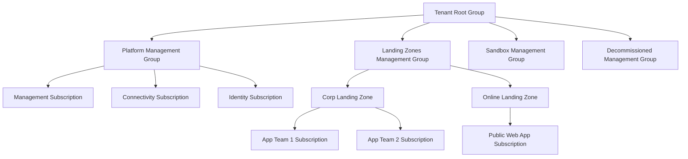

# How to Set Up Azure Landing Zones Using the Cloud Adoption Framework

Author: [nawazdhandala](https://www.github.com/nawazdhandala)

Tags: Azure, Landing Zones, Cloud Adoption Framework, Governance, Enterprise Architecture, Infrastructure, Platform

Description: Set up Azure Landing Zones following the Cloud Adoption Framework to create a well-governed, scalable foundation for your cloud workloads.

---

An Azure Landing Zone is a pre-configured environment that provides the right foundation for your cloud workloads. It includes networking, identity, governance, security, and management configurations that follow Microsoft's best practices. Think of it as the scaffolding you set up before you start building - it ensures that every workload deployed on top of it inherits the right guardrails from day one.

The Cloud Adoption Framework (CAF) provides the methodology, and Azure Landing Zones provide the implementation. In this post, I will walk through how to set up landing zones properly.

## Why Landing Zones Matter

Without a landing zone, each team deploys into Azure in their own way. One team creates VNets with overlapping address spaces. Another team deploys resources without tags. A third team creates public-facing storage accounts. Within months, you have a mess that is hard to govern, hard to secure, and expensive to maintain.

Landing zones solve this by establishing a consistent baseline. Every subscription gets the same network connectivity, the same security policies, the same monitoring configuration, and the same naming conventions.

## The Azure Landing Zone Architecture

The CAF recommends a specific architecture with these components:



Each component has a specific purpose:

- **Platform Management Group** - shared infrastructure managed by the platform team
  - **Management** - Log Analytics, Automation, monitoring tools
  - **Connectivity** - Hub VNet, firewalls, VPN/ExpressRoute gateways, DNS
  - **Identity** - Active Directory domain controllers (if needed)
- **Landing Zones Management Group** - workload subscriptions
  - **Corp** - internal applications that need corporate network access
  - **Online** - internet-facing applications
- **Sandbox** - experimentation subscriptions with relaxed policies
- **Decommissioned** - subscriptions being retired

## Deployment Options

You have three main ways to deploy landing zones:

1. **Azure Portal (start small)** - use the "Deploy to Azure" button from the ALZ accelerator
2. **Terraform module** - the `caf-enterprise-scale` Terraform module
3. **Bicep** - Azure's ALZ Bicep modules

I will show the Terraform approach since it is the most popular for production use.

## Setting Up with Terraform

First, set up the management group hierarchy and policies:

```hcl
# main.tf - Deploy Azure Landing Zone using the CAF module
module "enterprise_scale" {
  source  = "Azure/caf-enterprise-scale/azurerm"
  version = "~> 5.0"

  # Required - the root management group for the hierarchy
  root_parent_id = data.azurerm_client_config.current.tenant_id

  # Organization-specific settings
  root_id   = "contoso"
  root_name = "Contoso"

  # Default location for resources
  default_location = "eastus"

  # Enable deployment of the management resources
  # This creates Log Analytics, Automation Account, etc.
  deploy_management_resources = true
  subscription_id_management  = var.management_subscription_id

  # Enable deployment of connectivity resources
  # This creates the hub VNet, firewall, VPN gateway
  deploy_connectivity_resources = true
  subscription_id_connectivity  = var.connectivity_subscription_id

  # Enable deployment of identity resources
  deploy_identity_resources = true
  subscription_id_identity  = var.identity_subscription_id

  # Configure the management resources
  configure_management_resources = local.configure_management_resources

  # Configure connectivity (hub-spoke networking)
  configure_connectivity_resources = local.configure_connectivity_resources
}
```

Configure the management resources:

```hcl
# locals.tf - Management resource configuration
locals {
  configure_management_resources = {
    settings = {
      log_analytics = {
        enabled = true
        config = {
          # Retain logs for 90 days
          retention_in_days = 90
          # Enable specific solutions
          enable_monitoring_for_vm       = true
          enable_monitoring_for_vmss     = true
          enable_sentinel                = true
          enable_solution_for_vm_insights = true
        }
      }
      security_center = {
        enabled = true
        config = {
          # Enable Defender for all resource types
          email_security_contact = "security@contoso.com"
          phone_security_contact = "+1-555-0123"
        }
      }
    }
    location = "eastus"
    tags = {
      environment = "platform"
      managedBy   = "platform-team"
    }
  }
}
```

Configure the connectivity resources:

```hcl
# locals-connectivity.tf - Networking configuration
locals {
  configure_connectivity_resources = {
    settings = {
      hub_networks = [
        {
          enabled = true
          config = {
            address_space                = ["10.0.0.0/16"]
            location                     = "eastus"
            enable_firewall              = true
            enable_vpn_gateway           = true
            enable_expressroute_gateway  = false

            # Azure Firewall configuration
            azure_firewall = [{
              enabled = true
              config = {
                address_prefix      = "10.0.1.0/24"
                enable_dns_proxy    = true
                sku_tier            = "Standard"
                threat_intel_mode   = "Alert"
              }
            }]

            # VPN Gateway configuration
            vpn_gateway = [{
              enabled = true
              config = {
                address_prefix = "10.0.2.0/24"
                gateway_sku    = "VpnGw2AZ"
              }
            }]

            # DNS settings
            dns = [{
              enabled = true
              config = {
                enable_private_link_by_service = {
                  azure_sql_database    = true
                  azure_cosmos_db       = true
                  azure_key_vault       = true
                  azure_storage_blob    = true
                  azure_container_registry = true
                }
              }
            }]
          }
        }
      ]

      # Virtual WAN configuration (alternative to hub-spoke)
      vwan_hub_networks = []
    }
    location = "eastus"
    tags = {
      environment = "connectivity"
      managedBy   = "platform-team"
    }
  }
}
```

## Creating Landing Zone Subscriptions

Once the platform is deployed, create subscriptions for workload teams:

```bash
# Create a subscription for a workload team
az account create \
  --enrollment-account-name "team-enrollment" \
  --offer-type MS-AZR-0017P \
  --display-name "App-Team-1-Prod"

# Move the subscription to the Corp landing zone management group
az account management-group subscription add \
  --name "contoso-landing-zones-corp" \
  --subscription "App-Team-1-Prod"
```

## Policy Assignments

Landing zones rely on Azure Policy to enforce governance automatically. The CAF module deploys a set of policies by default, but here are the key ones:

```hcl
# Custom policy assignments for landing zone subscriptions
resource "azurerm_management_group_policy_assignment" "require_tags" {
  name                 = "require-cost-center-tag"
  management_group_id  = module.enterprise_scale.azurerm_management_group.landing_zones.id
  policy_definition_id = "/providers/Microsoft.Authorization/policyDefinitions/871b6d14-10aa-478d-b466-ef6f37e24d8e"
  description          = "Require cost center tag on all resource groups"

  parameters = jsonencode({
    tagName = {
      value = "CostCenter"
    }
  })

  non_compliance_message {
    content = "All resource groups must have a CostCenter tag."
  }
}

resource "azurerm_management_group_policy_assignment" "deny_public_ip" {
  name                 = "deny-public-ip"
  management_group_id  = module.enterprise_scale.azurerm_management_group.landing_zones_corp.id
  policy_definition_id = "/providers/Microsoft.Authorization/policyDefinitions/6c112d4e-5bc7-47ae-a041-ea2d9dccd749"
  description          = "Deny public IP addresses in Corp landing zones"
}
```

## Vending Subscriptions to Teams

The subscription vending process should be automated so teams can request landing zones through a self-service portal or pipeline:

```hcl
# subscription-vending.tf - Automate subscription creation
module "subscription_vending" {
  source = "Azure/lz-vending/azurerm"

  for_each = var.landing_zone_requests

  subscription_alias_enabled = true
  subscription_billing_scope = var.billing_scope
  subscription_display_name  = each.value.name
  subscription_workload      = each.value.workload_type

  # Place in the correct management group
  subscription_management_group_association_enabled = true
  subscription_management_group_id = each.value.is_internal ? "contoso-landing-zones-corp" : "contoso-landing-zones-online"

  # Create a spoke VNet and peer it to the hub
  virtual_network_enabled = true
  virtual_networks = {
    primary = {
      name                = "${each.value.short_name}-vnet"
      address_space       = [each.value.address_space]
      location            = each.value.location
      resource_group_name = "${each.value.short_name}-network-rg"

      hub_peering_enabled                         = true
      hub_network_resource_id                     = var.hub_vnet_id
      hub_peering_use_remote_gateways             = true
      hub_peering_allow_hub_gateway_transit        = true
    }
  }

  # Apply role assignments
  role_assignments = {
    team_contributor = {
      principal_id   = each.value.team_group_id
      definition     = "Contributor"
      relative_scope = ""
    }
  }
}
```

## What Gets Deployed

When you set up landing zones following the CAF, each workload subscription gets:

1. A spoke VNet peered to the hub
2. Route tables that send traffic through the firewall
3. NSGs with baseline rules
4. Diagnostic settings sending logs to the central Log Analytics
5. Azure Policy assignments enforcing tagging, location, and security rules
6. RBAC role assignments for the team
7. Budget alerts

This consistent baseline means teams can start deploying their workloads immediately with confidence that the foundation is solid.

## Summary

Azure Landing Zones, built on the Cloud Adoption Framework, give you a scalable, well-governed foundation for cloud adoption. The management group hierarchy provides policy inheritance, the hub-spoke networking centralizes security, and the subscription vending process makes it easy to onboard new teams. Start with the platform subscriptions (management, connectivity, identity), get the policies right, and then create landing zone subscriptions for your workload teams. The upfront investment in building landing zones saves enormous amounts of time and pain compared to retrofitting governance onto an existing unmanaged environment.
