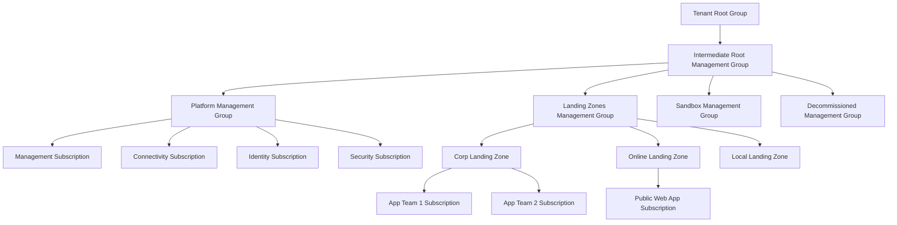

# How to Set Up Azure Landing Zones Using the Cloud Adoption Framework

Author: [nawazdhandala](https://www.github.com/nawazdhandala)

Tags: Azure, Landing Zone, Cloud Adoption Framework, Governance, Enterprise Architecture, Infrastructure, Platform

Description: Set up Azure Landing Zones following the Cloud Adoption Framework to create a well-governed, scalable foundation for your cloud workloads.

---

An Azure Landing Zone is a pre-configured environment that provides the right foundation for your cloud workloads. It includes networking, identity, governance, security, and management configurations that follow Microsoft's best practices. Think of it as the scaffolding you set up before you start building - it ensures that every workload deployed on top of it inherits the right guardrails from day one.

The Cloud Adoption Framework (CAF) provides the methodology, and Azure Landing Zones provide the implementation. In this post, I will walk through how to set up landing zones properly.

## Why Landing Zones Matter

Without a landing zone, each team deploys into Azure in their own way. One team creates VNets with overlapping address spaces. Another team deploys resources without tags. A third team creates public-facing storage accounts. Within months, you have a mess that is hard to govern, hard to secure, and expensive to maintain.

Landing zones solve this by establishing a consistent baseline. Every subscription gets the same network connectivity, the same security policies, the same monitoring configuration, and the same naming conventions.

## The Azure Landing Zone Architecture

The CAF recommends a specific architecture with these components:


```mermaid
graph TD
    ROOT[Tenant Root Group] --> ALZ[Intermediate Root Management Group]
    ALZ --> PLATFORM[Platform Management Group]
    ALZ --> WORKLOADS[Landing Zones Management Group]
    ALZ --> SANDBOX[Sandbox Management Group]
    ALZ --> DECOMMISSIONED[Decommissioned Management Group]

    PLATFORM --> MGMT[Management Subscription]
    PLATFORM --> CONN[Connectivity Subscription]
    PLATFORM --> IDENTITY[Identity Subscription]
    PLATFORM --> SECURITY[Security Subscription]

    WORKLOADS --> CORP[Corp Landing Zone]
    WORKLOADS --> ONLINE[Online Landing Zone]
    WORKLOADS --> LOCAL[Local Landing Zone]

    CORP --> SUB1[App Team 1 Subscription]
    CORP --> SUB2[App Team 2 Subscription]

    ONLINE --> SUB3[Public Web App Subscription]
```

Each component has a specific purpose:

- **Intermediate Root Management Group** - parent for all management groups created by the Azure landing zone architecture
- **Platform Management Group** - shared infrastructure managed by the platform team
  - **Management** - Log Analytics, Automation, monitoring tools
  - **Connectivity** - Hub VNet, firewalls, VPN/ExpressRoute gateways, DNS
  - **Identity** - Active Directory domain controllers (if needed)
  - **Security** - Microsoft Sentinel and other security/SIEM tooling
- **Landing Zones Management Group** - workload subscriptions
  - **Corp** - internal applications that need corporate network access
  - **Online** - internet-facing applications
  - **Local** - workloads running on Azure Local
- **Sandbox** - experimentation subscriptions with relaxed policies
- **Decommissioned** - subscriptions being retired

## Deployment Options

You have three main ways to deploy landing zones:

1. **Azure Portal (start small)** - use the Azure landing zone portal accelerator
2. **Terraform** - use the Azure landing zone IaC accelerator or Azure Verified Modules (AVM)
3. **Bicep** - use Azure Verified Modules for Bicep

I will show the Terraform approach since it is the most popular for production use.

## Setting Up with Terraform

First, set up the management group hierarchy and policies:

```hcl
# main.tf - Deploy the Azure Landing Zone management group hierarchy and policies

terraform {
  required_version = ">= 1.12, < 2.0"

  required_providers {
    alz = {
      source  = "azure/alz"
      version = "~> 0.21"
    }
    azapi = {
      source  = "azure/azapi"
      version = "~> 2.4"
    }
    azurerm = {
      source  = "hashicorp/azurerm"
      version = "~> 4.35"
    }
  }
}

data "azapi_client_config" "current" {}

provider "azurerm" {
  features {}
}

provider "alz" {
  library_references = [
    {
      path = "platform/alz"
      ref  = "2026.04.2"
    }
  ]
}

module "alz" {
  source  = "Azure/avm-ptn-alz/azurerm"
  version = "~> 0.21"

  # Required - the parent management group for the hierarchy.
  # Use the tenant ID to create the ALZ hierarchy under the tenant root group.
  parent_resource_id = data.azapi_client_config.current.tenant_id

  # Organization-specific settings
  architecture_name = "alz"

  # Default location for policy managed identities
  location = "eastus"
}
```

Configure the management resources:

```hcl
# locals.tf - Management resource configuration
locals {
  management_location        = "eastus"
  management_resource_group  = "rg-alz-management"
  log_analytics_workspace    = "law-alz-management"
  automation_account         = "aa-alz-management"
}

module "management" {
  source  = "Azure/avm-ptn-alz-management/azurerm"
  version = "~> 0.9"

  location                     = local.management_location
  resource_group_name          = local.management_resource_group
  log_analytics_workspace_name = local.log_analytics_workspace
  automation_account_name      = local.automation_account

  log_analytics_workspace_retention_in_days = 90

  tags = {
    environment = "platform"
    managedBy   = "platform-team"
  }
}
```

Configure the connectivity resources:

```hcl
# locals-connectivity.tf - Networking configuration
locals {
  connectivity_location       = "eastus"
  connectivity_resource_group = "rg-alz-connectivity"
}

resource "azurerm_resource_group" "connectivity" {
  name     = local.connectivity_resource_group
  location = local.connectivity_location

  tags = {
    environment = "connectivity"
    managedBy   = "platform-team"
  }
}

module "connectivity" {
  source  = "Azure/avm-ptn-alz-connectivity-hub-and-spoke-vnet/azurerm"
  version = "~> 0.17"

  hub_and_spoke_networks_settings = {
    enabled_resources = {
      ddos_protection_plan = false
    }
  }

  hub_virtual_networks = {
    primary = {
      location                  = local.connectivity_location
      default_parent_id         = azurerm_resource_group.connectivity.id
      default_hub_address_space = "10.0.0.0/16"

      enabled_resources = {
        firewall                              = true
        firewall_policy                       = true
        virtual_network_gateway_vpn           = true
        virtual_network_gateway_express_route = false
        private_dns_zones                     = true
        private_dns_resolver                  = false
        bastion                               = false
      }

      firewall = {
        subnet_address_prefix            = "10.0.1.0/24"
        management_subnet_address_prefix = "10.0.2.0/26"
      }

      firewall_policy = {
        sku                      = "Standard"
        threat_intelligence_mode = "Alert"
        dns = {
          proxy_enabled = true
        }
      }

      virtual_network_gateways = {
        subnet_address_prefix = "10.0.3.0/24"
        vpn = {
          sku = "VpnGw2AZ"
        }
      }
    }
  }

  tags = {
    environment = "connectivity"
    managedBy   = "platform-team"
  }
}
```

## Creating Landing Zone Subscriptions

Once the platform is deployed, create subscriptions for workload teams:

```bash
# Create a subscription for a workload team
az account create \
  --enrollment-account-name "team-enrollment" \
  --offer-type MS-AZR-0017P \
  --display-name "App-Team-1-Prod"

# Move the subscription to the Corp landing zone management group
az account management-group subscription add \
  --name "corp" \
  --subscription "<subscription-id>"
```

## Policy Assignments

Landing zones rely on Azure Policy to enforce governance automatically. The ALZ module deploys a set of policies by default, but here are the key ones:

```hcl
# Custom policy assignments for landing zone subscriptions
resource "azurerm_management_group_policy_assignment" "require_tags" {
  name                 = "require-cost-center-tag"
  management_group_id  = "landing_zones"
  policy_definition_id = "/providers/Microsoft.Authorization/policyDefinitions/96670d01-0a4d-4649-9c89-2d3abc0a5025"
  description          = "Require cost center tag on all resource groups"

  parameters = jsonencode({
    tagName = {
      value = "CostCenter"
    }
  })

  non_compliance_message {
    content = "All resource groups must have a CostCenter tag."
  }
}

resource "azurerm_management_group_policy_assignment" "deny_public_ip" {
  name                 = "deny-public-ip"
  management_group_id  = "corp"
  policy_definition_id = "/providers/Microsoft.Authorization/policyDefinitions/6c112d4e-5bc7-47ae-a041-ea2d9dccd749"
  description          = "Deny public IP addresses in Corp landing zones"

  parameters = jsonencode({
    listOfResourceTypesNotAllowed = {
      value = [
        "Microsoft.Network/publicIPAddresses"
      ]
    }
  })
}
```

## Vending Subscriptions to Teams

The subscription vending process should be automated so teams can request landing zones through a self-service portal or pipeline:

```hcl
# subscription-vending.tf - Automate subscription creation
module "subscription_vending" {
  source  = "Azure/avm-ptn-alz-sub-vending/azure"
  version = "~> 0.2"

  for_each = var.landing_zone_requests

  location = each.value.location

  subscription_alias_enabled = true
  subscription_billing_scope = var.billing_scope
  subscription_display_name  = each.value.name
  subscription_alias_name    = each.value.short_name
  subscription_workload      = each.value.workload_type

  # Place in the correct management group
  subscription_management_group_association_enabled = true
  subscription_management_group_id = each.value.is_internal ? "corp" : "online"

  resource_group_creation_enabled = true
  resource_groups = {
    network = {
      name     = "${each.value.short_name}-network-rg"
      location = each.value.location
    }
  }

  # Create a spoke VNet and peer it to the hub
  virtual_network_enabled = true
  virtual_networks = {
    primary = {
      name               = "${each.value.short_name}-vnet"
      address_space      = [each.value.address_space]
      location           = each.value.location
      resource_group_key = "network"

      hub_peering_enabled     = true
      hub_network_resource_id = var.hub_vnet_id
      hub_peering_options_tohub = {
        use_remote_gateways = true
      }
      hub_peering_options_fromhub = {
        allow_gateway_transit = true
      }
    }
  }

  # Apply role assignments
  role_assignment_enabled = true
  role_assignments = {
    team_contributor = {
      principal_id   = each.value.team_group_id
      definition     = "Contributor"
      relative_scope = ""
    }
  }
}
```

## What Gets Deployed

When you set up landing zones following the CAF, each workload subscription can get:

1. A spoke VNet peered to the hub
2. Route tables that send traffic through the firewall when route tables are configured
3. NSGs with baseline rules when NSGs are configured
4. Diagnostic settings sending logs to the central Log Analytics
5. Azure Policy assignments enforcing tagging, location, and security rules
6. RBAC role assignments for the team
7. Budget alerts when budgets are enabled

This consistent baseline means teams can start deploying their workloads immediately with confidence that the foundation is solid.

## Summary

Azure Landing Zones, built on the Cloud Adoption Framework, give you a scalable, well-governed foundation for cloud adoption. The management group hierarchy provides policy inheritance, the hub-spoke networking centralizes security, and the subscription vending process makes it easy to onboard new teams. Start with the platform subscriptions (management, connectivity, identity), get the policies right, and then create landing zone subscriptions for your workload teams. The upfront investment in building landing zones saves enormous amounts of time and pain compared to retrofitting governance onto an existing unmanaged environment.
