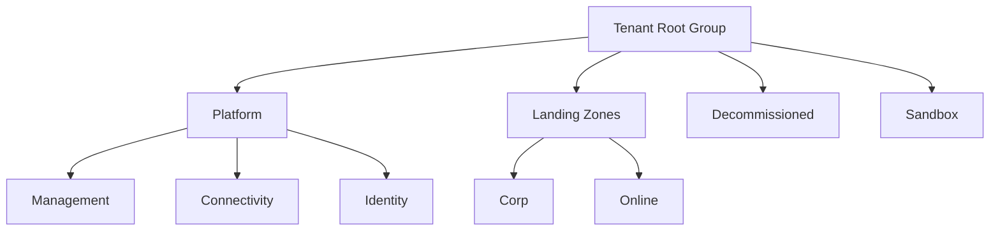

# How to Set Up Azure Landing Zones with Terraform Enterprise Scale Module

Author: [nawazdhandala](https://www.github.com/nawazdhandala)

Tags: Terraform, Azure, Landing Zones, Enterprise Scale, Cloud Adoption Framework, Infrastructure as Code, Governance

Description: Step-by-step guide to deploying Azure landing zones using the Terraform Enterprise Scale module for governance, security, and scalable cloud foundations.

---

Setting up a proper Azure environment for an enterprise is not just about creating a few subscriptions and deploying workloads. You need a management group hierarchy, centralized logging, security baselines, network connectivity, and governance policies - all before the first application team writes a line of code. Microsoft calls this pattern "Azure landing zones," and the Terraform Enterprise Scale module automates the entire thing.

I have rolled out landing zones for organizations ranging from 50 to 5000 engineers, and the Enterprise Scale module has saved weeks of work every single time. In this post, I will walk through how to set it up from scratch.

## What Is an Azure Landing Zone?

An Azure landing zone is a well-architected, multi-subscription Azure environment that accounts for governance, security, networking, and identity. Think of it as the foundation layer that makes everything else possible.

The Cloud Adoption Framework defines the landing zone architecture with these components:



Each management group gets specific Azure policies assigned to enforce standards. The platform subscriptions host shared services. Landing zone subscriptions are where application teams deploy their workloads.

## The Enterprise Scale Module

The `caf-enterprise-scale` Terraform module (published by Azure as `Azure/caf-enterprise-scale/azurerm` on the Terraform Registry) implements this entire architecture. It creates management groups, assigns policies, deploys connectivity resources, and sets up logging - all from a single module call.

## Prerequisites

You need the following before starting:

- An Azure AD tenant with Global Administrator or equivalent permissions
- At least one Azure subscription for management resources
- Terraform 1.3 or later
- Azure CLI authenticated with sufficient privileges

Permissions are the trickiest part. The module creates management groups and assigns policies at the tenant level, so you need elevated access. Run this to grant yourself the required role:

```bash
# Elevate access to manage all Azure subscriptions and management groups
az rest --method post \
  --url "/providers/Microsoft.Authorization/elevateAccess?api-version=2016-07-01"
```

## Step 1: Basic Module Configuration

Start with a minimal configuration. Create your Terraform project:

```hcl
# main.tf - Deploy Azure landing zones using the Enterprise Scale module

terraform {
  required_version = ">= 1.3.0"

  required_providers {
    azurerm = {
      source  = "hashicorp/azurerm"
      version = ">= 3.74.0"
    }
  }
}

provider "azurerm" {
  features {}
}

# Data source to get current client configuration
data "azurerm_client_config" "current" {}

# Deploy the Enterprise Scale landing zone architecture
module "enterprise_scale" {
  source  = "Azure/caf-enterprise-scale/azurerm"
  version = "~> 5.0"

  # Use a custom prefix for your organization
  root_parent_id = data.azurerm_client_config.current.tenant_id
  root_id        = "contoso"      # Short identifier for your org
  root_name      = "Contoso"      # Display name

  # Default location for deployments
  default_location = "eastus2"
}
```

This alone creates the full management group hierarchy with default policy assignments. Run `terraform plan` and you will see dozens of resources being created.

## Step 2: Configure Management Resources

The management subscription hosts Log Analytics, Azure Monitor, and automation resources. Enable it by adding the management configuration:

```hcl
# main.tf - Add management subscription configuration

module "enterprise_scale" {
  source  = "Azure/caf-enterprise-scale/azurerm"
  version = "~> 5.0"

  root_parent_id = data.azurerm_client_config.current.tenant_id
  root_id        = "contoso"
  root_name      = "Contoso"
  default_location = "eastus2"

  # Enable deployment of management resources
  deploy_management_resources    = true
  subscription_id_management     = "aaaaaaaa-bbbb-cccc-dddd-eeeeeeeeeeee"  # Your management subscription ID

  # Configure Log Analytics workspace settings
  configure_management_resources = local.configure_management_resources
}

locals {
  configure_management_resources = {
    settings = {
      log_analytics = {
        enabled = true
        config = {
          # Retain logs for 90 days
          retention_in_days                                 = 90
          enable_monitoring_for_vm                          = true
          enable_monitoring_for_vmss                        = true
          enable_solution_for_agent_health_assessment       = true
          enable_solution_for_anti_malware                  = true
          enable_solution_for_change_tracking               = true
          enable_solution_for_service_map                   = true
          enable_solution_for_sql_assessment                = true
          enable_solution_for_sql_vulnerability_assessment  = true
          enable_solution_for_sql_advanced_threat_detection = true
          enable_sentinel                                   = true
        }
      }
      security_center = {
        enabled = true
        config = {
          # Enable Defender for Cloud on all tiers
          email_security_contact = "security@contoso.com"
          enable_defender_for_app_services     = true
          enable_defender_for_arm              = true
          enable_defender_for_containers       = true
          enable_defender_for_key_vault        = true
          enable_defender_for_servers          = true
          enable_defender_for_sql_servers      = true
          enable_defender_for_sql_server_vms   = true
          enable_defender_for_storage          = true
        }
      }
    }
    # Use default tags and location
    location = null
    tags     = null
    advanced = null
  }
}
```

This creates a Log Analytics workspace, enables Microsoft Sentinel, and turns on Defender for Cloud across your environment. These are the baseline monitoring and security capabilities that every enterprise needs.

## Step 3: Configure Connectivity

The connectivity subscription hosts your hub network, DNS, and gateways. Here is how to enable the hub-spoke connectivity pattern:

```hcl
# Add connectivity resources to the module configuration

module "enterprise_scale" {
  # ... previous configuration ...

  # Enable connectivity resources (hub network, firewall, DNS)
  deploy_connectivity_resources    = true
  subscription_id_connectivity     = "ffffffff-gggg-hhhh-iiii-jjjjjjjjjjjj"

  configure_connectivity_resources = local.configure_connectivity_resources
}

locals {
  configure_connectivity_resources = {
    settings = {
      hub_networks = [
        {
          enabled = true
          config = {
            address_space                = ["10.0.0.0/16"]
            location                     = "eastus2"
            link_to_ddos_protection_plan = false

            # Enable Azure Firewall in the hub
            azure_firewall = {
              enabled = true
              config = {
                address_prefix                = "10.0.1.0/24"
                enable_dns_proxy              = true
                dns_servers                   = []
                sku_tier                      = "Standard"
                base_policy_id                = ""
                private_ip_ranges             = []
                threat_intelligence_mode      = "Alert"
                threat_intelligence_allowlist = []
                availability_zones = {
                  zone_1 = true
                  zone_2 = true
                  zone_3 = true
                }
              }
            }

            # Skip VPN gateway for now
            spoke_virtual_network_resource_ids = []
            enable_outbound_virtual_network_peering = true
            enable_hub_network_mesh_peering         = false
          }
        }
      ]

      # Configure DNS zones
      dns = {
        enabled = true
        config = {
          location = null
          enable_private_link_by_service = {
            azure_api_management                 = true
            azure_app_configuration_stores       = true
            azure_automation_dscandhybridworker   = true
            azure_automation_webhook             = true
            azure_backup                         = true
            azure_cache_for_redis                = true
            azure_container_registry             = true
            azure_cosmos_db_cassandra            = true
            azure_cosmos_db_sql                  = true
            azure_database_for_mysql_server      = true
            azure_database_for_postgresql_server = true
            azure_key_vault                      = true
            azure_monitor                        = true
            azure_sql_database_sqlserver         = true
            azure_storage_blob                   = true
            azure_web_sites_sites                = true
          }
          private_link_locations = ["eastus2"]
          public_dns_zones       = []
          private_dns_zones      = []
        }
      }
    }
    location = null
    tags     = null
    advanced = null
  }
}
```

This creates a hub virtual network with Azure Firewall and private DNS zones for Azure Private Link. The private DNS zones are crucial - they enable private endpoints across your organization without each team having to manage their own DNS.

## Step 4: Customize Policy Assignments

The module comes with sensible default policies, but you will almost certainly want to customize them. You can override the built-in archetypes or create custom ones:

```hcl
# Add custom landing zone archetypes

module "enterprise_scale" {
  # ... previous configuration ...

  # Custom landing zone archetype definitions
  custom_landing_zones = {
    "contoso-pci" = {
      display_name               = "PCI Workloads"
      parent_management_group_id = "contoso-landing-zones"
      subscription_ids           = []
      archetype_config = {
        archetype_id   = "default_empty"
        parameters     = {}
        access_control = {}
      }
    }
  }
}
```

## Step 5: Deploy and Iterate

With the configuration ready, deploy in stages:

```bash
# Initialize Terraform and download the module
terraform init

# Preview what will be created - expect 100+ resources
terraform plan -out=landing-zone.tfplan

# Deploy the landing zone foundation
terraform apply landing-zone.tfplan
```

The initial deployment takes 30-45 minutes, primarily because of Azure Firewall and policy assignment propagation. Subsequent runs are much faster.

## Managing Landing Zone Subscriptions

Once the foundation is in place, you vend new subscriptions into the appropriate management groups. The policies assigned to those management groups automatically apply to any subscription placed there.

For a Corp landing zone subscription (one that needs connectivity to the hub):

1. Create or move the subscription into the Corp management group
2. Add its virtual network as a spoke peered to the hub
3. The management group policies handle everything else - diagnostics, security baselines, tagging requirements

## Day-Two Operations

After the initial deployment, most changes are incremental. Adding a new spoke, adjusting a policy parameter, or enabling a new Defender plan. The module handles these changes gracefully because it reconciles the desired state with the current state.

Keep these operational practices in mind:

- Always run `terraform plan` before `terraform apply`. Landing zone changes affect your entire organization.
- Use separate state files for the landing zone foundation versus individual workloads.
- Version pin the module and test upgrades in a non-production tenant first.
- Document any customizations you make on top of the defaults so that module upgrades do not surprise you.

## Common Challenges

A few things I have learned the hard way:

The biggest friction point is permissions. The module needs tenant-level access, which most organizations restrict heavily. Work with your identity team early to get the right role assignments.

Policy assignments can take up to 30 minutes to evaluate on existing resources. Do not panic if compliance dashboards show violations immediately after deployment - give it time.

If you have existing management groups, the module can adopt them, but the names must match exactly. Plan your naming convention before deploying.

The Enterprise Scale module is the fastest path to a production-ready Azure environment. It encodes years of Microsoft's best practices into a single Terraform module call. Start with the defaults, customize where needed, and build from there.
