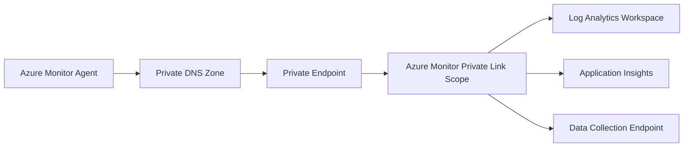

# How to Set Up Azure Monitor Private Link Scope for Secure Data Collection

Author: [nawazdhandala](https://www.github.com/nawazdhandala)

Tags: Azure Monitor, Private Link, Security, Networking, Data Collection, Azure Cloud, Network Security

Description: Step-by-step guide to configuring Azure Monitor Private Link Scope to route monitoring data over private connections instead of the public internet.

---

By default, Azure Monitor agents and SDKs send telemetry data over the public internet. The data is encrypted with TLS, so it is secure in transit, but the traffic still traverses public networks. For organizations with strict security requirements - government workloads, financial services, healthcare, or anyone with a "no public internet" policy - this is not acceptable.

Azure Monitor Private Link Scope (AMPLS) solves this by routing all monitoring data through Azure Private Link. Your agents connect to private endpoints in your VNet, and the traffic stays entirely within the Microsoft backbone network. No data leaves the private network.

## What AMPLS Covers

AMPLS secures the data path for multiple Azure Monitor services:

- **Log Analytics workspaces**: Log ingestion and query data
- **Application Insights**: Telemetry ingestion and live metrics
- **Data Collection Endpoints**: Custom log ingestion through DCR-based collection
- **Azure Monitor metrics**: Custom metrics ingestion

Each AMPLS resource can be associated with up to 50 Azure Monitor resources (workspaces, Application Insights resources, etc.) and up to 10 private endpoints.

## How It Works

The architecture involves several components:



1. The Azure Monitor Agent resolves Azure Monitor endpoints through private DNS
2. Private DNS zones map Azure Monitor hostnames to private IP addresses in your VNet
3. The private endpoint provides a network interface in your VNet that connects to AMPLS
4. AMPLS routes the traffic to the associated Azure Monitor resources

## Step 1: Create the Azure Monitor Private Link Scope

```bash
# Create an Azure Monitor Private Link Scope
az monitor private-link-scope create \
  --name myAMPLS \
  --resource-group myRG \
  --location global
```

AMPLS is a global resource, meaning it does not have a specific region. However, the private endpoints you connect to it are regional.

## Step 2: Associate Azure Monitor Resources

Link your Log Analytics workspace and Application Insights resources to the AMPLS:

```bash
# Associate a Log Analytics workspace with the AMPLS
az monitor private-link-scope scoped-resource create \
  --name "workspace-link" \
  --resource-group myRG \
  --scope-name myAMPLS \
  --linked-resource "/subscriptions/<sub-id>/resourceGroups/myRG/providers/Microsoft.OperationalInsights/workspaces/myWorkspace"

# Associate an Application Insights resource
az monitor private-link-scope scoped-resource create \
  --name "appinsights-link" \
  --resource-group myRG \
  --scope-name myAMPLS \
  --linked-resource "/subscriptions/<sub-id>/resourceGroups/myRG/providers/Microsoft.Insights/components/myAppInsights"
```

If you use Data Collection Endpoints (DCEs), associate those too:

```bash
# Associate a Data Collection Endpoint
az monitor private-link-scope scoped-resource create \
  --name "dce-link" \
  --resource-group myRG \
  --scope-name myAMPLS \
  --linked-resource "/subscriptions/<sub-id>/resourceGroups/myRG/providers/Microsoft.Insights/dataCollectionEndpoints/myDCE"
```

## Step 3: Create the Private Endpoint

Create a private endpoint in your VNet that connects to the AMPLS:

```bash
# Create a private endpoint for the AMPLS in your VNet
az network private-endpoint create \
  --name ampls-private-endpoint \
  --resource-group myRG \
  --vnet-name myVNet \
  --subnet monitoring-subnet \
  --private-connection-resource-id "/subscriptions/<sub-id>/resourceGroups/myRG/providers/Microsoft.Insights/privateLinkScopes/myAMPLS" \
  --group-id azuremonitor \
  --connection-name ampls-connection \
  --location eastus
```

The private endpoint gets a private IP address from the subnet you specify. All traffic to Azure Monitor will be routed through this IP.

## Step 4: Configure Private DNS Zones

For the private endpoint to work, DNS queries for Azure Monitor endpoints must resolve to the private IP address instead of the public IP. This requires private DNS zones.

Create the required DNS zones:

```bash
# Create private DNS zones for Azure Monitor endpoints
az network private-dns zone create \
  --resource-group myRG \
  --name privatelink.monitor.azure.com

az network private-dns zone create \
  --resource-group myRG \
  --name privatelink.oms.opinsights.azure.com

az network private-dns zone create \
  --resource-group myRG \
  --name privatelink.ods.opinsights.azure.com

az network private-dns zone create \
  --resource-group myRG \
  --name privatelink.agentsvc.azure-automation.net

az network private-dns zone create \
  --resource-group myRG \
  --name privatelink.blob.core.windows.net
```

Link the DNS zones to your VNet:

```bash
# Link each DNS zone to the VNet
for zone in privatelink.monitor.azure.com \
            privatelink.oms.opinsights.azure.com \
            privatelink.ods.opinsights.azure.com \
            privatelink.agentsvc.azure-automation.net \
            privatelink.blob.core.windows.net; do
  az network private-dns zone vnet-link create \
    --resource-group myRG \
    --zone-name $zone \
    --name "${zone}-link" \
    --virtual-network myVNet \
    --registration-enabled false
done
```

Create DNS records for the private endpoint:

```bash
# Create DNS zone group to auto-register DNS records
az network private-endpoint dns-zone-group create \
  --resource-group myRG \
  --endpoint-name ampls-private-endpoint \
  --name default \
  --private-dns-zone "/subscriptions/<sub-id>/resourceGroups/myRG/providers/Microsoft.Network/privateDnsZones/privatelink.monitor.azure.com" \
  --zone-name monitor
```

## Step 5: Configure the Access Mode

AMPLS supports two access modes that control how resources handle public traffic:

**Private Only**: Azure Monitor resources linked to this AMPLS only accept traffic from private link connections. All public ingestion and queries are blocked.

**Open**: Azure Monitor resources accept both private link and public traffic. This is the default and is easier to roll out incrementally.

```bash
# Set the access mode to Private Only for maximum security
az monitor private-link-scope update \
  --name myAMPLS \
  --resource-group myRG \
  --set accessModeSettings.ingestionAccessMode=PrivateOnly \
  --set accessModeSettings.queryAccessMode=PrivateOnly
```

Be careful with Private Only mode - if you have agents outside the VNet (e.g., on-premises servers without VPN), they will lose the ability to send data. Switch to Private Only only after confirming all agents have network connectivity through the private endpoint.

## Step 6: Configure Agents to Use the Private Endpoint

**Azure Monitor Agent (AMA)**: If AMA runs on VMs within the VNet (or connected VNets), it automatically uses the private endpoint because of the DNS resolution. No agent configuration change is needed.

**On-premises servers via VPN/ExpressRoute**: Ensure that DNS queries from on-premises resolve Azure Monitor endpoints to the private IP. This typically requires:

1. A DNS forwarder in Azure that forwards private DNS zone queries
2. On-premises DNS configured to forward Azure Monitor domain queries to the Azure DNS forwarder

```bash
# Verify DNS resolution from a VM in the VNet
nslookup myworkspace.ods.opinsights.azure.com
# Should return a private IP (e.g., 10.0.5.4) instead of a public IP
```

If the resolution still returns a public IP, the DNS configuration is not correct.

**Application Insights SDK**: Applications running in the VNet automatically use the private endpoint. Set the connection string as usual - the DNS resolution handles routing.

## Step 7: Validate the Setup

Verify that data is flowing through the private endpoint:

```bash
# Check the private endpoint connection status
az network private-endpoint show \
  --name ampls-private-endpoint \
  --resource-group myRG \
  --query "privateLinkServiceConnections[0].privateLinkServiceConnectionState.status"
```

This should return "Approved."

From a VM in the VNet, verify DNS resolution:

```bash
# Test DNS resolution for Log Analytics endpoint
nslookup myworkspace.ods.opinsights.azure.com

# Expected: resolves to a private IP like 10.0.x.x
# Not expected: resolves to a public IP like 13.x.x.x
```

Check that the agent is sending data by querying recent heartbeats:

```kql
// Verify agents are sending data through private link
Heartbeat
| where TimeGenerated > ago(15m)
| summarize LastHeartbeat = max(TimeGenerated) by Computer
| order by LastHeartbeat desc
```

## Step 8: Handle Multi-Region Deployments

If you have VNets in multiple Azure regions, you need a private endpoint in each region that connects to the same AMPLS.

```bash
# Create a private endpoint in a second region
az network private-endpoint create \
  --name ampls-private-endpoint-westus \
  --resource-group myRG \
  --vnet-name myVNet-westus \
  --subnet monitoring-subnet \
  --private-connection-resource-id "/subscriptions/<sub-id>/resourceGroups/myRG/providers/Microsoft.Insights/privateLinkScopes/myAMPLS" \
  --group-id azuremonitor \
  --connection-name ampls-connection-westus \
  --location westus2
```

Set up the same DNS zones and links for the west US VNet.

## Common Issues and Troubleshooting

**Agent cannot send data after enabling Private Only mode**: The agent is trying to reach Azure Monitor through a public endpoint, but public access is now blocked. Check DNS resolution from the agent's machine.

**Queries fail in the portal**: If you set query access to Private Only, you can only run queries from within the VNet. The Azure Portal runs queries from Microsoft's infrastructure, which is outside your VNet. Consider keeping query access mode as Open, or use Azure Bastion to access the portal from within the VNet.

**Private DNS zones not resolving correctly**: Ensure the VNet link is created for each DNS zone. Also verify there are no custom DNS settings on the VNet that override the private DNS zones.

**Reaching the 50-resource limit**: A single AMPLS supports up to 50 associated resources. For large deployments, create multiple AMPLS resources, each with its own private endpoint.

## Security Benefits

With AMPLS configured, your monitoring data flow has these security properties:

- All data stays on the Microsoft backbone network
- No monitoring traffic traverses the public internet
- You can use NSG rules to control which subnets can reach the private endpoint
- Network flow logs show all monitoring traffic through the private endpoint
- Compliant with regulatory requirements for private data handling

## Cost Considerations

Private endpoints incur hourly charges and data processing charges:

- Private endpoint: approximately $0.01/hour per endpoint
- Data processed: approximately $0.01/GB through the endpoint

For most monitoring workloads, the additional cost is minimal compared to the security benefit.

## Summary

Azure Monitor Private Link Scope lets you keep all monitoring data on private networks, meeting strict security and compliance requirements. The setup involves creating an AMPLS resource, associating your Azure Monitor resources, deploying a private endpoint in your VNet, and configuring DNS. Start with Open access mode for a gradual rollout, validate that agents are routing through the private endpoint, and switch to Private Only mode when you are confident everything is working. The result is monitoring with the same functionality but without any data touching the public internet.
