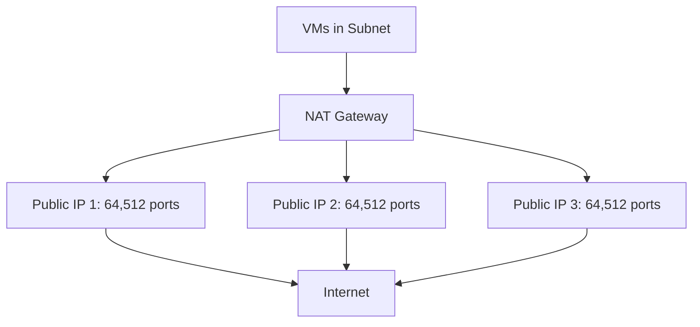

# How to Set Up Azure NAT Gateway with Multiple Public IP Addresses

Author: [nawazdhandala](https://www.github.com/nawazdhandala)

Tags: Azure, NAT Gateway, Public IP, Networking, Outbound Connectivity, SNAT, Scalability

Description: Learn how to configure Azure NAT Gateway with multiple public IP addresses to scale outbound connectivity and avoid SNAT port exhaustion for your VMs.

---

Every time a VM in Azure makes an outbound connection to the internet, it needs a public IP and a source port for the return traffic to find its way back. This is handled through Source Network Address Translation (SNAT). Without a NAT Gateway, Azure VMs rely on default outbound access or load balancer SNAT, both of which have limited port pools and can run into exhaustion under heavy outbound load.

Azure NAT Gateway solves this by providing dedicated outbound connectivity with a much larger SNAT port pool. Adding multiple public IPs to the NAT Gateway multiplies the available SNAT ports, giving you the scale needed for workloads that make thousands of concurrent outbound connections.

## Why Multiple Public IPs Matter

Each public IP address provides 64,512 SNAT ports. A single IP can handle around 64,000 concurrent outbound connections across all VMs in the associated subnet. That sounds like a lot, but consider:

- A microservice making API calls to 10 external services with connection pooling can easily use hundreds of ports per instance
- Web scraping or data integration workloads can open thousands of concurrent connections
- Container workloads with many pods, each making outbound calls, share the same SNAT pool

With multiple public IPs, you multiply the available ports. Two IPs give you roughly 128,000 ports. Sixteen IPs (the maximum) give you over a million.



## Prerequisites

1. Standard SKU public IP addresses (NAT Gateway requires Standard SKU)
2. A VNet with at least one subnet
3. No conflicting outbound rules (remove load balancer outbound rules or instance-level public IPs on the subnet VMs)

## Step 1: Create Multiple Public IP Addresses

Create the public IPs that will be used by the NAT Gateway:

```bash
# Create the first public IP
az network public-ip create \
  --resource-group myResourceGroup \
  --name natGwPIP1 \
  --sku Standard \
  --allocation-method Static \
  --zone 1 2 3

# Create the second public IP
az network public-ip create \
  --resource-group myResourceGroup \
  --name natGwPIP2 \
  --sku Standard \
  --allocation-method Static \
  --zone 1 2 3

# Create the third public IP
az network public-ip create \
  --resource-group myResourceGroup \
  --name natGwPIP3 \
  --sku Standard \
  --allocation-method Static \
  --zone 1 2 3
```

Using `--zone 1 2 3` makes the IPs zone-redundant, which is recommended for production.

## Step 2: Create the NAT Gateway with Multiple IPs

You can associate up to 16 public IP addresses with a single NAT Gateway:

```bash
# Create the NAT Gateway with multiple public IPs
az network nat gateway create \
  --resource-group myResourceGroup \
  --name myNATGateway \
  --location eastus \
  --public-ip-addresses natGwPIP1 natGwPIP2 natGwPIP3 \
  --idle-timeout 10
```

The `--idle-timeout` specifies how long (in minutes) an idle connection stays open before the SNAT mapping is released. The default is 4 minutes, and you can set it up to 120 minutes. For most workloads, 4-10 minutes is appropriate.

## Step 3: Associate the NAT Gateway with a Subnet

```bash
# Associate the NAT Gateway with a subnet
az network vnet subnet update \
  --resource-group myResourceGroup \
  --vnet-name myVNet \
  --name appSubnet \
  --nat-gateway myNATGateway
```

After this, all VMs in `appSubnet` will use the NAT Gateway for outbound internet traffic. This takes effect immediately for new connections.

## Step 4: Add More Public IPs to an Existing NAT Gateway

If you need to scale up later, add more IPs:

```bash
# Create an additional public IP
az network public-ip create \
  --resource-group myResourceGroup \
  --name natGwPIP4 \
  --sku Standard \
  --allocation-method Static \
  --zone 1 2 3

# Update the NAT Gateway to include the new IP
az network nat gateway update \
  --resource-group myResourceGroup \
  --name myNATGateway \
  --public-ip-addresses natGwPIP1 natGwPIP2 natGwPIP3 natGwPIP4
```

Note: When updating, you must list all IPs (existing and new). If you only specify the new one, it replaces the existing ones.

## Using Public IP Prefixes Instead

If you need many IPs, consider using a public IP prefix instead of individual IPs. A prefix gives you a contiguous range:

```bash
# Create a public IP prefix with 16 addresses (/28)
az network public-ip prefix create \
  --resource-group myResourceGroup \
  --name natGwPrefix \
  --length 28 \
  --location eastus \
  --zone 1 2 3

# Create NAT Gateway with the prefix
az network nat gateway create \
  --resource-group myResourceGroup \
  --name myNATGateway \
  --location eastus \
  --public-ip-prefixes natGwPrefix \
  --idle-timeout 10
```

A /28 prefix gives you 16 IPs and over a million SNAT ports. You can also combine individual IPs and prefixes on the same NAT Gateway, up to 16 total IPs.

## How NAT Gateway Selects the Outbound IP

When a VM makes an outbound connection through a NAT Gateway with multiple IPs, the gateway selects the source IP based on a hash of the connection flow. This means:

- Connections to the same destination tend to use the same source IP
- Different destination IPs may use different source IPs
- The distribution is not round-robin - it is hash-based for connection consistency

This matters if the destination service uses IP-based allow lists. You need to add all NAT Gateway IPs to those allow lists:

```bash
# List all public IPs associated with the NAT Gateway
az network nat gateway show \
  --resource-group myResourceGroup \
  --name myNATGateway \
  --query "publicIpAddresses[].id" \
  --output tsv | while read ip_id; do
    az network public-ip show --ids $ip_id --query ipAddress --output tsv
done
```

## Monitoring SNAT Port Usage

Monitor your SNAT usage to know when you need to add more IPs:

```bash
# Check NAT Gateway metrics
az monitor metrics list \
  --resource "/subscriptions/<sub-id>/resourceGroups/myResourceGroup/providers/Microsoft.Network/natGateways/myNATGateway" \
  --metric "SNATConnectionCount" \
  --interval PT1M \
  --aggregation Total \
  --output table
```

Key metrics:

- **SNAT Connection Count:** Total active SNAT connections
- **Total SNAT Connection Count:** Including failed attempts
- **Dropped Packets:** Packets dropped due to SNAT exhaustion
- **Bytes Processed:** Data volume through the gateway

Set up alerts for SNAT exhaustion:

```bash
# Alert when dropped packets indicate SNAT exhaustion
az monitor metrics alert create \
  --resource-group myResourceGroup \
  --name snatExhaustionAlert \
  --scopes "/subscriptions/<sub-id>/resourceGroups/myResourceGroup/providers/Microsoft.Network/natGateways/myNATGateway" \
  --condition "total DroppedPackets > 0" \
  --window-size 5m \
  --evaluation-frequency 1m \
  --action-group opsTeam \
  --description "NAT Gateway dropping packets - possible SNAT exhaustion"
```

## Configuring Multiple Subnets

A single NAT Gateway can be associated with multiple subnets in the same VNet:

```bash
# Associate with a second subnet
az network vnet subnet update \
  --resource-group myResourceGroup \
  --vnet-name myVNet \
  --name apiSubnet \
  --nat-gateway myNATGateway

# Associate with a third subnet
az network vnet subnet update \
  --resource-group myResourceGroup \
  --vnet-name myVNet \
  --name workerSubnet \
  --nat-gateway myNATGateway
```

All subnets share the same pool of SNAT ports. Keep this in mind when calculating how many public IPs you need.

## NAT Gateway vs. Other Outbound Options

| Feature | NAT Gateway | LB Outbound Rules | Instance Public IP |
|---------|-------------|-------------------|-------------------|
| SNAT ports per IP | 64,512 | 1,024 per instance | 64,512 |
| Max IPs | 16 | Multiple | 1 per NIC |
| Managed | Yes | Partially | No |
| Per-subnet config | Yes | Per backend pool | Per VM |
| Idle timeout | 4-120 min | 4-66 min | N/A |

NAT Gateway is the clear winner for most outbound scenarios. It provides the most ports, the simplest configuration, and the best management experience.

## Removing a NAT Gateway Association

If you need to stop using the NAT Gateway on a subnet:

```bash
# Remove NAT Gateway from a subnet
az network vnet subnet update \
  --resource-group myResourceGroup \
  --vnet-name myVNet \
  --name appSubnet \
  --nat-gateway ""
```

After removal, VMs in that subnet revert to the default outbound access method.

## Common Issues

**Destination rejects connections.** If the destination has an IP allow list, make sure all NAT Gateway public IPs are included. The gateway may use any of its IPs for a given connection.

**Existing connections not migrated.** When you first associate a NAT Gateway, existing connections continue on their current path. New connections use the NAT Gateway. If you need all connections through the NAT Gateway, restart the affected services.

**Cannot associate NAT Gateway.** A subnet cannot have both a NAT Gateway and VMs with instance-level public IPs for outbound. Remove the public IPs first, or use a different subnet.

**Idle timeout causing dropped connections.** Long-running idle connections (like database connection pools) may be dropped when the idle timeout expires. Increase the timeout or implement keepalive on the application side.

## Summary

Azure NAT Gateway with multiple public IPs is the most scalable and manageable way to handle outbound internet connectivity from your VMs. Each IP adds 64,512 SNAT ports, and you can use up to 16 IPs (or public IP prefixes) for over a million ports. Associate the gateway with your subnets, monitor SNAT connection counts and dropped packets, and add more IPs when you approach capacity. For workloads with heavy outbound connection needs, NAT Gateway eliminates the SNAT exhaustion problems that plague other outbound methods.
