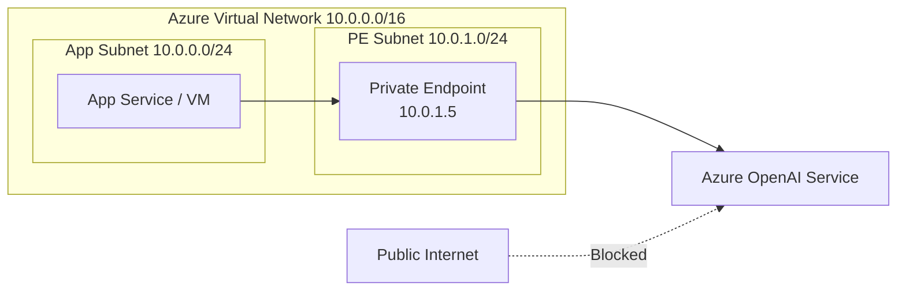

# How to Set Up Azure OpenAI Service with Private Endpoints for Network Isolation

Author: [nawazdhandala](https://www.github.com/nawazdhandala)

Tags: Azure OpenAI, Private Endpoints, Network Security, Virtual Network, Azure Networking, Zero Trust, Enterprise Security

Description: Configure Azure OpenAI Service with private endpoints to restrict access to your virtual network and eliminate public internet exposure.

---

By default, Azure OpenAI Service is accessible over the public internet. Any application with the right API key can call your endpoint from anywhere. For many enterprises, that is not acceptable. Regulatory requirements, security policies, and zero-trust architectures demand that AI services are only reachable from within your corporate network.

Private endpoints solve this by giving your Azure OpenAI resource a private IP address inside your Azure Virtual Network (VNet). Traffic between your applications and Azure OpenAI stays on the Microsoft backbone network and never traverses the public internet. Combined with disabling public network access, this creates true network isolation.

## What Private Endpoints Do

A private endpoint creates a network interface in your VNet subnet with a private IP address (e.g., 10.0.1.5) that maps to your Azure OpenAI resource. When your application connects to the OpenAI endpoint, DNS resolution returns the private IP instead of the public IP, and traffic routes through the VNet.



## Prerequisites

- An Azure subscription with permissions to create VNets and private endpoints
- An existing Azure OpenAI resource (or you will create one)
- An Azure Virtual Network with at least one subnet dedicated to private endpoints
- Azure CLI or Azure Portal access

## Step 1: Create the Virtual Network (If Needed)

If you do not already have a VNet, create one. You need at least two subnets: one for your applications and one for private endpoints.

```bash
# Create a resource group for all networking resources
az group create --name rg-openai-network --location eastus

# Create the virtual network with two subnets
az network vnet create \
    --name vnet-openai \
    --resource-group rg-openai-network \
    --location eastus \
    --address-prefix 10.0.0.0/16 \
    --subnet-name snet-apps \
    --subnet-prefix 10.0.0.0/24

# Add a dedicated subnet for private endpoints
az network vnet subnet create \
    --name snet-private-endpoints \
    --resource-group rg-openai-network \
    --vnet-name vnet-openai \
    --address-prefix 10.0.1.0/24
```

## Step 2: Disable Private Endpoint Network Policies on the Subnet

Private endpoints require that network policies (like NSG rules) are disabled on the subnet. This is a prerequisite for creating the private endpoint.

```bash
# Disable private endpoint network policies on the subnet
az network vnet subnet update \
    --name snet-private-endpoints \
    --resource-group rg-openai-network \
    --vnet-name vnet-openai \
    --disable-private-endpoint-network-policies true
```

## Step 3: Create the Private Endpoint

Now create the private endpoint that connects your VNet to the Azure OpenAI resource.

```bash
# Get the resource ID of your Azure OpenAI resource
OPENAI_ID=$(az cognitiveservices account show \
    --name your-openai-resource \
    --resource-group rg-openai \
    --query id -o tsv)

# Create the private endpoint
az network private-endpoint create \
    --name pe-openai \
    --resource-group rg-openai-network \
    --vnet-name vnet-openai \
    --subnet snet-private-endpoints \
    --private-connection-resource-id $OPENAI_ID \
    --group-id account \
    --connection-name openai-connection
```

The `--group-id account` parameter specifies the sub-resource type. For Cognitive Services (which includes Azure OpenAI), the group ID is `account`.

## Step 4: Configure Private DNS

For your applications to resolve the Azure OpenAI hostname to the private IP, you need a Private DNS Zone. Without this, DNS resolution returns the public IP, and traffic will not flow through the private endpoint.

```bash
# Create the Private DNS Zone for Cognitive Services
az network private-dns zone create \
    --name privatelink.openai.azure.com \
    --resource-group rg-openai-network

# Link the DNS zone to your VNet so VMs and services in the VNet use it
az network private-dns link vnet create \
    --name openai-dns-link \
    --resource-group rg-openai-network \
    --zone-name privatelink.openai.azure.com \
    --virtual-network vnet-openai \
    --registration-enabled false

# Create a DNS zone group to automatically manage DNS records
az network private-endpoint dns-zone-group create \
    --name openai-dns-group \
    --resource-group rg-openai-network \
    --endpoint-name pe-openai \
    --private-dns-zone privatelink.openai.azure.com \
    --zone-name openai
```

After this, if you resolve `your-openai-resource.openai.azure.com` from within the VNet, it will return the private IP address (e.g., 10.0.1.5) instead of the public IP.

## Step 5: Disable Public Network Access

With the private endpoint in place, disable public access to the Azure OpenAI resource so it is only reachable through the VNet.

```bash
# Disable public network access on the Azure OpenAI resource
az cognitiveservices account update \
    --name your-openai-resource \
    --resource-group rg-openai \
    --public-network-access Disabled
```

After this change, any attempt to call the Azure OpenAI API from outside the VNet will be rejected with a network error. This includes calls from your local development machine, the Azure portal's test features, and any external services.

## Step 6: Test the Connection

Deploy a test VM or use an existing resource in the VNet to verify connectivity.

```bash
# Create a test VM in the app subnet (if you do not already have one)
az vm create \
    --name vm-test \
    --resource-group rg-openai-network \
    --vnet-name vnet-openai \
    --subnet snet-apps \
    --image Ubuntu2204 \
    --admin-username azureuser \
    --generate-ssh-keys \
    --size Standard_B1s

# SSH into the VM and test DNS resolution
ssh azureuser@<vm-public-ip>
nslookup your-openai-resource.openai.azure.com
# Should return the private IP (10.0.1.x)

# Test the API call from within the VNet
curl -s https://your-openai-resource.openai.azure.com/openai/deployments/gpt-4o-mini/chat/completions?api-version=2024-06-01 \
    -H "Content-Type: application/json" \
    -H "api-key: your-api-key" \
    -d '{"messages": [{"role": "user", "content": "Hello"}], "max_tokens": 50}'
```

If the DNS resolution returns the private IP and the API call succeeds, your private endpoint is working correctly.

## Step 7: Connect Your Application

Applications running in the VNet (or peered VNets) can now call Azure OpenAI using the same endpoint URL and API key as before. No code changes are needed - the DNS resolution transparently routes traffic through the private endpoint.

```python
# app.py - Application that uses Azure OpenAI through private endpoint
# No code changes needed compared to public endpoint access
from openai import AzureOpenAI

# The endpoint URL is the same - DNS handles the routing
client = AzureOpenAI(
    azure_endpoint="https://your-openai-resource.openai.azure.com/",
    api_key="your-api-key",
    api_version="2024-06-01"
)

# This call routes through the private endpoint automatically
response = client.chat.completions.create(
    model="gpt-4o-mini",
    messages=[
        {"role": "system", "content": "You are a helpful assistant."},
        {"role": "user", "content": "Explain private endpoints in one sentence."}
    ]
)

print(response.choices[0].message.content)
```

## Step 8: Handle Hybrid Scenarios

In practice, you might need to allow access from both the VNet and specific external locations (like a CI/CD pipeline or a developer's machine). Use network ACLs instead of completely disabling public access:

```bash
# Allow access from the VNet and specific IP addresses
# while keeping private endpoint active
az cognitiveservices account update \
    --name your-openai-resource \
    --resource-group rg-openai \
    --public-network-access Enabled

# Add an IP rule for your office or CI/CD pipeline
az cognitiveservices account network-rule add \
    --name your-openai-resource \
    --resource-group rg-openai \
    --ip-address 203.0.113.50

# Add a VNet rule for another subnet
az cognitiveservices account network-rule add \
    --name your-openai-resource \
    --resource-group rg-openai \
    --vnet-name vnet-openai \
    --subnet snet-apps
```

## Cross-Region and VNet Peering

If your application and Azure OpenAI resource are in different regions, you can still use private endpoints. Set up VNet peering between the two VNets:

```bash
# Peer the app VNet with the OpenAI VNet
az network vnet peering create \
    --name app-to-openai \
    --resource-group rg-app \
    --vnet-name vnet-app \
    --remote-vnet /subscriptions/<sub-id>/resourceGroups/rg-openai-network/providers/Microsoft.Network/virtualNetworks/vnet-openai \
    --allow-vnet-access

# Create the reverse peering
az network vnet peering create \
    --name openai-to-app \
    --resource-group rg-openai-network \
    --vnet-name vnet-openai \
    --remote-vnet /subscriptions/<sub-id>/resourceGroups/rg-app/providers/Microsoft.Network/virtualNetworks/vnet-app \
    --allow-vnet-access
```

Make sure the Private DNS Zone is also linked to the app VNet so DNS resolution works from there too.

## Monitoring and Troubleshooting

Use Azure Network Watcher to diagnose connectivity issues:

```bash
# Verify that the private endpoint connection is approved
az network private-endpoint show \
    --name pe-openai \
    --resource-group rg-openai-network \
    --query "privateLinkServiceConnections[0].privateLinkServiceConnectionState.status"
# Should return "Approved"

# Check the private IP assigned to the endpoint
az network private-endpoint show \
    --name pe-openai \
    --resource-group rg-openai-network \
    --query "customDnsConfigs[0].ipAddresses[0]"
```

Common issues include DNS not resolving to the private IP (check DNS zone links), NSG rules blocking traffic to the private endpoint subnet, and the private endpoint connection being in a "Pending" state (requires approval from the resource owner).

## Summary

Private endpoints for Azure OpenAI Service give you network-level isolation that satisfies enterprise security requirements. The setup involves creating a private endpoint in your VNet, configuring private DNS for transparent name resolution, and optionally disabling public access entirely. Your application code does not change at all - the same endpoint URL and API key work, with DNS handling the routing behind the scenes. For organizations with strict compliance requirements, this is often a non-negotiable prerequisite before adopting Azure OpenAI.
