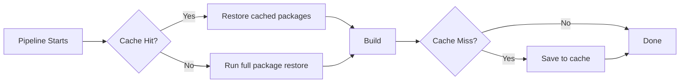

# How to Set Up Azure Pipelines Caching to Reduce Build Times for npm and NuGet Restores

Author: [nawazdhandala](https://www.github.com/nawazdhandala)

Tags: Azure Pipelines, Caching, npm, NuGet, Build Optimization, CI/CD, DevOps

Description: Configure pipeline caching in Azure Pipelines to dramatically cut build times by reusing npm and NuGet package restores across runs.

---

Package restores are one of the most common bottlenecks in CI/CD pipelines. Every time your pipeline runs, it downloads the same packages from the same registries, even when nothing has changed. For a medium-sized .NET solution with a React frontend, this can easily add 3 to 5 minutes per build. Multiply that by dozens of builds per day and you are burning real time and money.

Azure Pipelines has a built-in caching task that can store and restore directories between pipeline runs. Once configured, your pipeline will only download packages when the lockfile changes. This guide covers how to set it up for both npm and NuGet, with some real-world tuning advice.

## How Pipeline Caching Works

The caching mechanism in Azure Pipelines is straightforward. You define a cache key (usually based on a lockfile hash), a target path (where packages are stored), and the pipeline handles the rest.



On the first run, there is no cache, so the full restore runs and then the result is saved. On subsequent runs, if the lockfile has not changed, the cache is restored and the restore step either skips entirely or finishes in seconds.

## Setting Up npm Caching

For Node.js projects, the cache target is typically the `node_modules` directory or the npm cache folder. I prefer caching `node_modules` directly because it avoids the extra time npm spends resolving and linking packages even with a warm cache.

Here is a YAML pipeline configuration that caches npm packages:

```yaml
# Pipeline with npm caching - uses package-lock.json as the cache key
trigger:
  - main

pool:
  vmImage: 'ubuntu-latest'

variables:
  # Define the npm cache directory variable
  npm_config_cache: $(Pipeline.Workspace)/.npm

steps:
  # Cache task must come before the install step
  - task: Cache@2
    inputs:
      key: 'npm | "$(Agent.OS)" | package-lock.json'
      restoreKeys: |
        npm | "$(Agent.OS)"
      path: $(npm_config_cache)
    displayName: 'Cache npm packages'

  # Install step - will be much faster with a warm cache
  - script: npm ci
    displayName: 'Install dependencies'

  - script: npm run build
    displayName: 'Build application'

  - script: npm test
    displayName: 'Run tests'
```

A few things to note about this configuration:

The `key` field uses a pipe-separated list of values. The string `"npm"` is a literal prefix, `$(Agent.OS)` ensures caches are not shared across different operating systems (npm can produce platform-specific binaries), and `package-lock.json` means the cache key changes whenever the lockfile changes.

The `restoreKeys` field provides fallback keys. If the exact key does not match (because the lockfile changed), Azure Pipelines will look for the most recent cache that matches the prefix. This gives you a partial cache hit, which is still faster than starting from scratch.

### Caching node_modules Directly

If you want to skip the npm resolution step entirely, you can cache `node_modules` instead:

```yaml
# Cache node_modules directly for maximum speed
- task: Cache@2
  inputs:
    key: 'node_modules | "$(Agent.OS)" | package-lock.json'
    path: 'node_modules'
  displayName: 'Cache node_modules'

# Only run install if the cache was not restored
- script: npm ci
  displayName: 'Install dependencies'
  condition: ne(variables['CacheRestored-node_modules'], 'true')
```

This approach is faster but has a trade-off: if your build modifies `node_modules` (some post-install scripts do this), you might get inconsistent results. Test this carefully before relying on it.

## Setting Up NuGet Caching

NuGet caching follows the same pattern. The key difference is that NuGet stores packages in a global cache directory, and the lockfile is typically the solution file or a combination of project files.

Here is the YAML for NuGet caching:

```yaml
# Pipeline with NuGet caching - uses project files as the cache key
trigger:
  - main

pool:
  vmImage: 'ubuntu-latest'

variables:
  NUGET_PACKAGES: $(Pipeline.Workspace)/.nuget/packages

steps:
  # Cache NuGet packages based on all project files
  - task: Cache@2
    inputs:
      key: 'nuget | "$(Agent.OS)" | **/packages.lock.json'
      restoreKeys: |
        nuget | "$(Agent.OS)"
      path: $(NUGET_PACKAGES)
    displayName: 'Cache NuGet packages'

  # Restore will be fast when packages are cached
  - task: DotNetCoreCLI@2
    inputs:
      command: 'restore'
      projects: '**/*.csproj'
    displayName: 'Restore NuGet packages'

  - task: DotNetCoreCLI@2
    inputs:
      command: 'build'
      arguments: '--no-restore'
    displayName: 'Build solution'

  - task: DotNetCoreCLI@2
    inputs:
      command: 'test'
      arguments: '--no-build'
    displayName: 'Run tests'
```

### Generating NuGet Lock Files

NuGet does not generate lock files by default. You need to enable them explicitly by adding a property to your project files or `Directory.Build.props`:

```xml
<!-- Add this to Directory.Build.props to enable NuGet lock files for all projects -->
<Project>
  <PropertyGroup>
    <RestorePackagesWithLockFile>true</RestorePackagesWithLockFile>
  </PropertyGroup>
</Project>
```

After adding this, run `dotnet restore` locally to generate the `packages.lock.json` files. Commit these to your repository. Without them, the cache key will not have a stable file to hash against.

## Combining npm and NuGet Caching in a Single Pipeline

Many projects have both a .NET backend and a Node.js frontend. Here is how you combine both caching strategies:

```yaml
# Combined pipeline with both npm and NuGet caching
trigger:
  - main

pool:
  vmImage: 'ubuntu-latest'

variables:
  npm_config_cache: $(Pipeline.Workspace)/.npm
  NUGET_PACKAGES: $(Pipeline.Workspace)/.nuget/packages

steps:
  # Cache npm packages
  - task: Cache@2
    inputs:
      key: 'npm | "$(Agent.OS)" | frontend/package-lock.json'
      restoreKeys: |
        npm | "$(Agent.OS)"
      path: $(npm_config_cache)
    displayName: 'Cache npm'

  # Cache NuGet packages
  - task: Cache@2
    inputs:
      key: 'nuget | "$(Agent.OS)" | **/packages.lock.json'
      restoreKeys: |
        nuget | "$(Agent.OS)"
      path: $(NUGET_PACKAGES)
    displayName: 'Cache NuGet'

  # Frontend build
  - script: |
      cd frontend
      npm ci
      npm run build
    displayName: 'Build frontend'

  # Backend build
  - task: DotNetCoreCLI@2
    inputs:
      command: 'restore'
      projects: 'backend/**/*.csproj'
    displayName: 'Restore backend'

  - task: DotNetCoreCLI@2
    inputs:
      command: 'build'
      projects: 'backend/**/*.csproj'
      arguments: '--no-restore'
    displayName: 'Build backend'
```

## Measuring the Impact

Before and after enabling caching, you should measure the actual time savings. Check the pipeline run summary and compare the duration of your restore steps.

In my experience, here are typical improvements:

- npm install with cold cache: 90-120 seconds
- npm install with warm cache: 5-15 seconds
- NuGet restore with cold cache: 60-90 seconds
- NuGet restore with warm cache: 3-10 seconds

The exact savings depend on your project size, the number of packages, and the network latency between the build agent and the package registry.

## Cache Limits and Gotchas

Azure Pipelines has some limits on caching that you should be aware of:

1. **Cache size limit.** Each cache entry can be up to 2 GB. If your `node_modules` is larger than that (it happens with monorepos), you will need to split the cache or use a different strategy.

2. **Cache expiration.** Caches expire after 7 days of not being accessed. For active projects this is never an issue, but for repositories with infrequent builds, you might see more cache misses than expected.

3. **Cross-branch caching.** Caches are scoped to the branch by default. A cache created on the `main` branch can be used by feature branches, but not the other way around. This is intentional - it prevents feature branch experiments from polluting the main branch cache.

4. **Parallel jobs.** If you have multiple jobs running in parallel, they each manage their own cache independently. This means you might store the same packages multiple times under different cache keys.

## Tips for Getting the Most Out of Caching

Keep your lockfiles committed and up to date. The cache key depends on them, and stale lockfiles lead to inconsistent builds.

Use `npm ci` instead of `npm install`. The `ci` command is designed for CI environments - it is faster, stricter, and does not modify the lockfile.

For NuGet, use `--no-restore` on subsequent dotnet commands after the initial restore. This avoids redundant work.

Consider caching other slow steps too. The Cache task is not limited to package managers. You can cache compiled intermediate outputs, Docker layers, or anything else that lives in a directory and changes infrequently.

## Wrapping Up

Pipeline caching is one of the easiest performance wins you can get in Azure Pipelines. The setup takes about 10 minutes, and the payoff is immediate. For most projects, you will see build times drop by 1 to 3 minutes per run, which adds up fast across a team. Start with your slowest pipeline, add caching for the package restore step, measure the improvement, and then roll it out to the rest of your pipelines.
