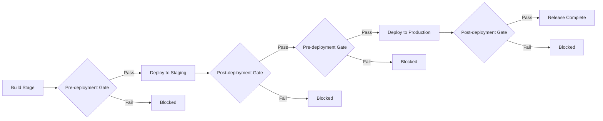

# How to Set Up Azure Pipelines Deployment Gates with Azure Monitor Alert Integration

Author: [nawazdhandala](https://www.github.com/nawazdhandala)

Tags: Azure Pipelines, Deployment Gates, Azure Monitor, CI/CD, Release Management, DevOps, Monitoring

Description: Learn how to configure deployment gates in Azure Pipelines that check Azure Monitor alerts before and after deployments proceed.

---

Deploying to production without any safety checks is a recipe for outages. Even if your tests pass in the pipeline, things can go wrong in the real environment - a spike in error rates, degraded performance, or downstream service issues. Azure Pipelines deployment gates give you automated checkpoints that verify conditions before a deployment proceeds and validate health after it completes.

In this post, I will show you how to set up deployment gates that integrate with Azure Monitor alerts. The idea is simple: before deploying, check that there are no active critical alerts in your environment. After deploying, wait and check that the deployment did not trigger any new alerts. If something looks wrong, the gate blocks the deployment automatically.

## What Are Deployment Gates?

Deployment gates are automated checks that Azure Pipelines evaluates at specific points in a release pipeline. They run on a schedule (every few minutes) and either pass or fail based on external conditions. A gate might check:

- Are there any active alerts in Azure Monitor?
- Does the health endpoint return 200 OK?
- Is the error rate below a threshold?
- Has a change management ticket been approved?

Gates are configured on stage pre-deployment or post-deployment conditions. Pre-deployment gates run before the stage begins, and post-deployment gates run after the stage completes but before the next stage starts.



## Prerequisites

Before setting up gates with Azure Monitor, you need:

1. A classic release pipeline in Azure DevOps (gates are a classic release feature, not available in YAML multi-stage pipelines directly)
2. Azure Monitor configured with alert rules for your application
3. A service connection from Azure DevOps to your Azure subscription

## Creating Azure Monitor Alert Rules

First, make sure you have relevant alert rules in Azure Monitor. Here is how to create one using Azure CLI that monitors the error rate of an App Service:

```bash
# Create a metric alert that fires when HTTP 5xx errors exceed 10 in 5 minutes
az monitor metrics alert create \
  --name "High-Error-Rate-WebApp" \
  --resource-group "production-rg" \
  --scopes "/subscriptions/SUB_ID/resourceGroups/production-rg/providers/Microsoft.Web/sites/my-webapp" \
  --condition "total Http5xx > 10" \
  --window-size 5m \
  --evaluation-frequency 1m \
  --severity 1 \
  --description "Alert when 5xx errors exceed threshold" \
  --action "/subscriptions/SUB_ID/resourceGroups/production-rg/providers/Microsoft.Insights/actionGroups/ops-team"
```

You can also create alerts for response time, CPU usage, memory, or any custom metric your application emits:

```bash
# Create an alert for slow response times
az monitor metrics alert create \
  --name "Slow-Response-Time-WebApp" \
  --resource-group "production-rg" \
  --scopes "/subscriptions/SUB_ID/resourceGroups/production-rg/providers/Microsoft.Web/sites/my-webapp" \
  --condition "avg HttpResponseTime > 3" \
  --window-size 5m \
  --evaluation-frequency 1m \
  --severity 2 \
  --description "Alert when average response time exceeds 3 seconds"
```

## Configuring the Release Pipeline with Gates

Now let's set up the classic release pipeline with deployment gates.

### Step 1: Create or Open Your Release Pipeline

In Azure DevOps, go to Pipelines and then Releases. Create a new release pipeline or edit an existing one. You should have at least two stages (e.g., Staging and Production).

### Step 2: Configure Pre-Deployment Gates for the Production Stage

Click on the pre-deployment conditions icon (the lightning bolt) on your Production stage. Enable "Gates" and configure the following:

- **Delay before evaluation**: Set to 0 minutes (or a small delay if you want to give time for things to settle)
- **Time between re-evaluation of gates**: 5 minutes (how often the gate rechecks)
- **Timeout after which gates fail**: 60 minutes (if gates do not pass within this time, the deployment fails)
- **Minimum duration for passed gates**: 10 minutes (gates must stay green for at least this long)

### Step 3: Add the Azure Monitor Alerts Gate

Click "Add" under gates and select "Query Azure Monitor alerts." Configure it with:

- **Azure subscription**: Select your service connection
- **Resource group**: The resource group to check for alerts
- **Resource type**: Leave as "All" to check all resources, or select a specific type
- **Alert severity**: Select the severity levels that should block deployment (typically Sev 0 and Sev 1)
- **Alert state**: Monitor state should be "Fired" (active alerts)
- **Filter condition**: "Greater than" with threshold "0"

This means: if there are any fired alerts of severity 0 or 1 in the specified resource group, the gate fails and deployment is blocked.

## Setting Up Post-Deployment Health Validation

Post-deployment gates are equally important. After your deployment completes, you want to verify that nothing broke. Here is how to set that up:

Click on the post-deployment conditions icon on your Staging stage. Enable gates and add the same "Query Azure Monitor alerts" gate, but with these settings:

- **Delay before evaluation**: 10 minutes (give the new deployment time to warm up and receive traffic)
- **Time between re-evaluation**: 5 minutes
- **Timeout**: 30 minutes
- **Minimum duration for passed gates**: 15 minutes

The delay is key here. Right after a deployment, it takes a few minutes for the new code to receive enough traffic to generate meaningful metrics. Setting the initial delay to 10 minutes ensures you are evaluating real post-deployment behavior.

## Using Azure Functions for Custom Gate Logic

Sometimes the built-in gates are not flexible enough. You might want to check a combination of metrics or query a custom health endpoint. Azure Functions can serve as custom gates.

Here is an Azure Function that checks multiple health indicators:

```python
import azure.functions as func
import requests
import json

def main(req: func.HttpRequest) -> func.HttpResponse:
    """
    Custom deployment gate that checks multiple health signals.
    Returns 200 if all checks pass, 500 if any fail.
    """

    checks = []

    # Check 1: Application health endpoint
    try:
        health_resp = requests.get("https://my-webapp.azurewebsites.net/health", timeout=10)
        checks.append({
            "name": "health_endpoint",
            "passed": health_resp.status_code == 200,
            "detail": f"Status: {health_resp.status_code}"
        })
    except Exception as e:
        checks.append({
            "name": "health_endpoint",
            "passed": False,
            "detail": str(e)
        })

    # Check 2: Error rate from Application Insights
    # Query the error rate over the last 10 minutes
    error_rate = get_error_rate_from_app_insights()
    checks.append({
        "name": "error_rate",
        "passed": error_rate < 5.0,
        "detail": f"Error rate: {error_rate}%"
    })

    # Check 3: Response time p95
    p95_latency = get_p95_latency_from_app_insights()
    checks.append({
        "name": "p95_latency",
        "passed": p95_latency < 2000,
        "detail": f"P95 latency: {p95_latency}ms"
    })

    # Evaluate all checks
    all_passed = all(check["passed"] for check in checks)
    status_code = 200 if all_passed else 500

    return func.HttpResponse(
        json.dumps({"checks": checks, "passed": all_passed}),
        status_code=status_code,
        mimetype="application/json"
    )
```

To use this as a gate, add the "Invoke REST API" gate type and point it at your Azure Function URL. Configure it to expect a 200 status code for success.

## Gate Evaluation Flow

Understanding how gates evaluate helps you configure them correctly. Here is the sequence:

1. The release reaches the gate checkpoint
2. The initial delay period passes (if configured)
3. Azure DevOps evaluates all gates simultaneously
4. If any gate fails, it waits for the re-evaluation interval and tries again
5. Once all gates pass, the minimum duration timer starts
6. If all gates remain passing for the minimum duration, the gate succeeds
7. If gates do not pass within the timeout period, the entire gate fails

The minimum duration is important because it prevents false positives. A single successful check might be a fluke - requiring gates to stay green for 10 or 15 minutes ensures the system is actually stable.

## Combining Gates with Approvals

Gates and manual approvals work well together. A common pattern is:

- Pre-deployment on Production: manual approval from a release manager AND automated gates checking for active alerts
- Post-deployment on Production: automated gates checking health metrics for 15 minutes

This gives you both human oversight and automated safety checks.

## Monitoring Gate Results

After a release runs, you can review the gate evaluation history in the release details. Azure DevOps shows each evaluation attempt, whether it passed or failed, and the response from each gate. This history is valuable for debugging when a release gets blocked and you need to understand why.

## Tips for Effective Gate Configuration

Start conservative and relax over time. Set tight thresholds initially - it is better to block a valid deployment occasionally than to let a bad one through. As you gain confidence in your gates, you can adjust the thresholds.

Keep the re-evaluation interval reasonable. Checking every minute creates a lot of API calls and noise. Every 5 minutes is usually a good balance.

Set the timeout thoughtfully. Too short and you will get false failures during brief alert storms. Too long and your deployments take forever. 30 to 60 minutes is typical.

Monitor for alert fatigue. If your alerts fire too often for non-critical issues, they will constantly block deployments and teams will start bypassing gates. Keep your alert rules clean and meaningful.

## Wrapping Up

Deployment gates with Azure Monitor integration add an automated safety net to your release process. They catch issues that automated tests miss - things like infrastructure degradation, downstream service problems, or configuration drift that only shows up in the real environment. Combined with proper alerting and health monitoring, gates make deployments significantly safer without slowing down your release cadence for healthy systems.
