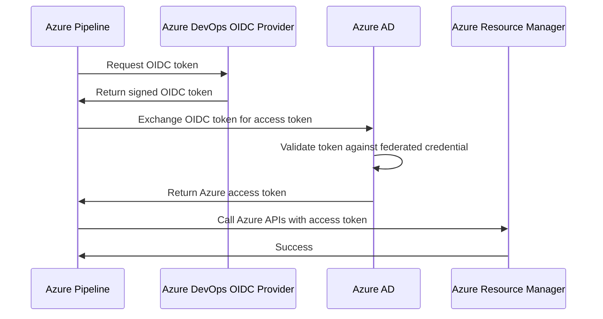

# How to Set Up Azure Pipelines OIDC Authentication to Eliminate Stored Service Principal Secrets

Author: [nawazdhandala](https://www.github.com/nawazdhandala)

Tags: Azure Pipelines, OIDC, Workload Identity Federation, Security, Service Principal, Authentication, Zero Trust

Description: Learn how to configure Azure Pipelines with OIDC workload identity federation to authenticate to Azure without storing any secrets or certificates.

---

Every Azure Pipelines service connection has traditionally required a stored secret - a service principal client secret or certificate that the pipeline uses to authenticate to Azure. These secrets have expiration dates, need rotation, can be leaked, and represent a persistent credential that attackers can exploit. Workload identity federation using OIDC (OpenID Connect) eliminates this problem entirely by replacing stored secrets with short-lived tokens that are generated on the fly.

With OIDC, your pipeline does not store any Azure credentials. Instead, Azure DevOps issues a short-lived token that proves the pipeline's identity, and Azure AD trusts that token based on a pre-configured federation. No secrets to rotate, no credentials to leak, no expiration dates to manage.

## How OIDC Federation Works

The flow is straightforward. When a pipeline job needs to authenticate to Azure, it requests a token from Azure DevOps. Azure DevOps issues an OIDC token that contains claims about the pipeline (the organization, project, pipeline ID, branch, etc.). The pipeline presents this token to Azure AD. Azure AD verifies the token against the federated credential configuration and, if it matches, issues an Azure access token. The pipeline uses that access token to manage Azure resources.



The key security improvement is that no long-lived credential exists anywhere. The OIDC token lives for minutes, the Azure access token lives for about an hour, and neither is stored persistently.

## Prerequisites

Before setting up OIDC federation, you need:

- An Azure subscription with permissions to create service principals and federated credentials
- An Azure DevOps organization and project
- Permissions to create service connections in Azure DevOps
- Azure CLI installed locally (for the setup steps)

## Step 1: Create the Service Principal

Create an Azure AD application and service principal that your pipeline will authenticate as.

```bash
# Create an Azure AD application
APP_NAME="azure-pipelines-oidc"
APP_ID=$(az ad app create --display-name "$APP_NAME" --query appId --output tsv)
echo "Application ID: $APP_ID"

# Create a service principal for the application
SP_ID=$(az ad sp create --id "$APP_ID" --query id --output tsv)
echo "Service Principal Object ID: $SP_ID"

# Assign the service principal a role on your subscription
# Use the minimum required role (e.g., Contributor for deployments)
SUBSCRIPTION_ID=$(az account show --query id --output tsv)
az role assignment create \
  --assignee "$APP_ID" \
  --role "Contributor" \
  --scope "/subscriptions/$SUBSCRIPTION_ID"

echo "Service principal created and assigned Contributor role"
```

## Step 2: Configure the Federated Credential

This is the critical step. You create a federated credential on the Azure AD application that tells Azure AD to trust tokens from your Azure DevOps organization.

```bash
# Get your Azure DevOps organization and project details
ADO_ORG="your-organization"
ADO_PROJECT="your-project"
# The service connection name you will create in Azure DevOps
SERVICE_CONNECTION_NAME="Azure-OIDC-Connection"

# The issuer URL for Azure DevOps OIDC
ISSUER="https://vstoken.dev.azure.com/$ADO_ORG"

# The subject identifier ties the credential to a specific service connection
# Format: sc://<organization>/<project>/<service-connection-name>
SUBJECT="sc://$ADO_ORG/$ADO_PROJECT/$SERVICE_CONNECTION_NAME"

# Create the federated credential
az ad app federated-credential create \
  --id "$APP_ID" \
  --parameters '{
    "name": "azure-pipelines-federation",
    "issuer": "'$ISSUER'",
    "subject": "'$SUBJECT'",
    "description": "Federation for Azure Pipelines OIDC",
    "audiences": ["api://AzureADTokenExchange"]
  }'

echo "Federated credential created"
echo "Issuer: $ISSUER"
echo "Subject: $SUBJECT"
```

The `subject` claim is what locks the credential to a specific service connection. Only pipeline runs using that exact service connection in that exact project and organization can use this credential.

## Step 3: Create the Service Connection in Azure DevOps

Now create the service connection in Azure DevOps that uses workload identity federation instead of a stored secret.

Navigate to Project Settings, then Service connections, then "New service connection." Select "Azure Resource Manager" and then "Workload identity federation (manual)."

Fill in the fields:

```
Service connection name: Azure-OIDC-Connection  (must match the subject claim)
Subscription ID: your-subscription-id
Subscription name: Your Subscription Name
Service Principal ID (Client ID): the APP_ID from step 1
Tenant ID: your-azure-ad-tenant-id
```

You can also create the service connection using the Azure DevOps CLI.

```bash
# Create the service connection via CLI
# Note: This requires the azure-devops CLI extension
az devops service-endpoint create \
  --service-endpoint-configuration '{
    "data": {
      "subscriptionId": "'$SUBSCRIPTION_ID'",
      "subscriptionName": "My Subscription",
      "environment": "AzureCloud",
      "scopeLevel": "Subscription",
      "creationMode": "Manual"
    },
    "name": "'$SERVICE_CONNECTION_NAME'",
    "type": "AzureRM",
    "url": "https://management.azure.com/",
    "authorization": {
      "parameters": {
        "tenantid": "'$(az account show --query tenantId --output tsv)'",
        "serviceprincipalid": "'$APP_ID'",
        "workloadIdentityFederationSubject": "'$SUBJECT'",
        "workloadIdentityFederationIssuer": "'$ISSUER'"
      },
      "scheme": "WorkloadIdentityFederation"
    },
    "isShared": false,
    "serviceEndpointProjectReferences": [
      {
        "projectReference": {
          "name": "'$ADO_PROJECT'"
        },
        "name": "'$SERVICE_CONNECTION_NAME'"
      }
    ]
  }' \
  --organization "https://dev.azure.com/$ADO_ORG" \
  --project "$ADO_PROJECT"
```

## Step 4: Use the Service Connection in Your Pipeline

Using the OIDC service connection in your pipeline is identical to using a traditional service connection. The authentication happens transparently.

```yaml
# azure-pipelines.yml - Pipeline using OIDC authentication
trigger:
  branches:
    include:
      - main

pool:
  vmImage: 'ubuntu-latest'

steps:
  # Azure CLI tasks automatically use the service connection
  - task: AzureCLI@2
    displayName: 'Deploy infrastructure'
    inputs:
      azureSubscription: 'Azure-OIDC-Connection'
      scriptType: 'bash'
      scriptLocation: 'inlineScript'
      inlineScript: |
        # Verify authentication works
        echo "Authenticated as:"
        az account show --query "{Name:name, Subscription:id}" --output table

        # Deploy resources - no secrets involved
        az deployment group create \
          --resource-group "my-rg" \
          --template-file main.bicep \
          --parameters environment=production

  # ARM template deployments also work
  - task: AzureResourceManagerTemplateDeployment@3
    displayName: 'Deploy ARM template'
    inputs:
      azureResourceManagerConnection: 'Azure-OIDC-Connection'
      subscriptionId: '$(subscriptionId)'
      resourceGroupName: 'my-rg'
      location: 'eastus'
      templateLocation: 'Linked artifact'
      csmFile: 'main.bicep'
```

## Converting Existing Service Connections

If you have existing service connections using secrets, you can convert them to use workload identity federation. Azure DevOps provides a conversion tool in the service connection settings.

Navigate to the service connection, click the three-dot menu, and look for "Convert to Workload Identity Federation." This option creates the federated credential automatically and updates the service connection. The old secret is not deleted immediately, giving you time to verify everything works.

```bash
# After conversion, verify the federated credential exists on the app
az ad app federated-credential list --id "$APP_ID" --output table
```

## Scoping Federated Credentials

For tighter security, you can create multiple federated credentials with different subject claims that restrict access to specific branches or environments.

```bash
# Federated credential that only works for main branch builds
az ad app federated-credential create \
  --id "$APP_ID" \
  --parameters '{
    "name": "main-branch-only",
    "issuer": "https://vstoken.dev.azure.com/'$ADO_ORG'",
    "subject": "sc://'$ADO_ORG'/'$ADO_PROJECT'/Production-OIDC",
    "audiences": ["api://AzureADTokenExchange"]
  }'

# You can have multiple federated credentials on the same app
# Each maps to a different service connection with different scopes
```

## Troubleshooting

The most common issue is a mismatch between the subject claim in the federated credential and the actual subject in the OIDC token. The subject must exactly match the format `sc://<org>/<project>/<service-connection-name>`.

If authentication fails, enable system diagnostics in your pipeline (`system.debug: true`) and look for OIDC-related log entries. The logs will show the exact subject claim being used.

```yaml
# Enable debug logging to troubleshoot OIDC issues
variables:
  system.debug: true
```

Another common issue is the audience claim. Azure AD expects `api://AzureADTokenExchange` as the audience. If you see audience mismatch errors, verify the federated credential configuration.

## Security Benefits

The security improvement from OIDC federation is substantial. There are no secrets to rotate, so you eliminate an entire category of operational overhead. There are no credentials to leak, so compromising a pipeline configuration file does not give attackers persistent access. Each token is short-lived (minutes) and bound to a specific pipeline run, so even if intercepted, the window of exploitation is tiny. The federated credential can be scoped to specific service connections, projects, and organizations, implementing the principle of least privilege.

OIDC workload identity federation is the future of pipeline authentication in Azure. It eliminates the weakest link in most CI/CD security setups - the stored credential - and replaces it with a trustworthy, auditable, automatically managed authentication flow. If you are still using service principal secrets in your pipelines, migrating to OIDC should be near the top of your security backlog.
