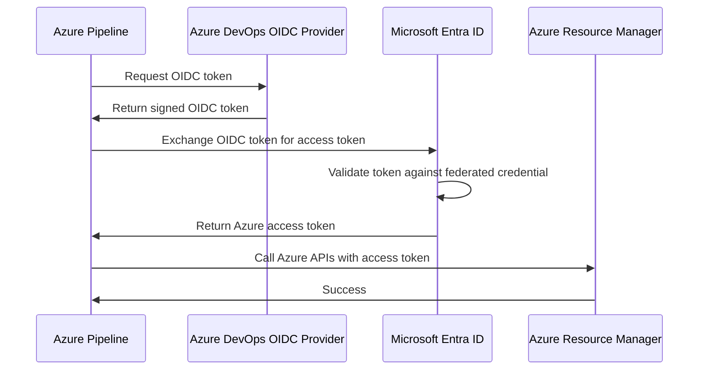

# How to Set Up Azure Pipelines OIDC Auth to Eliminate Stored Service Principal

Author: [nawazdhandala](https://www.github.com/nawazdhandala)

Tags: Azure Pipelines, OIDC, Workload Identity Federation, Security, Service Principal, Authentication, Zero Trust

Description: Learn how to configure Azure Pipelines with OIDC workload identity federation to authenticate to Azure without storing any secrets or certificates.

---

Every Azure Pipelines service connection has traditionally required a stored secret - a service principal client secret or certificate that the pipeline uses to authenticate to Azure. These secrets have expiration dates, need rotation, can be leaked, and represent a persistent credential that attackers can exploit. Workload identity federation using OIDC (OpenID Connect) eliminates this problem entirely by replacing stored secrets with short-lived tokens that are generated on the fly.

With OIDC, your pipeline does not store any Azure credentials. Instead, Azure DevOps issues a short-lived token that proves the service connection's identity, and Microsoft Entra ID trusts that token based on a pre-configured federation. No secrets to rotate, no credentials to leak, no expiration dates to manage.

## How OIDC Federation Works

The flow is straightforward. When a pipeline job needs to authenticate to Azure, it requests a token from Azure DevOps through the service connection. Azure DevOps issues an OIDC token that contains claims identifying the service connection. The pipeline presents this token to Microsoft Entra ID. Microsoft Entra ID verifies the token against the federated credential configuration and, if it matches, issues an Azure access token. The pipeline uses that access token to manage Azure resources.


```mermaid
sequenceDiagram
    participant P as Azure Pipeline
    participant ADO as Azure DevOps OIDC Provider
    participant AAD as Microsoft Entra ID
    participant ARM as Azure Resource Manager

    P->>ADO: Request OIDC token
    ADO->>P: Return signed OIDC token
    P->>AAD: Exchange OIDC token for access token
    AAD->>AAD: Validate token against federated credential
    AAD->>P: Return Azure access token
    P->>ARM: Call Azure APIs with access token
    ARM->>P: Success
```

The key security improvement is that no long-lived credential exists anywhere. The OIDC token lives for minutes, the Azure access token lives for about an hour, and neither is stored persistently.

## Prerequisites

Before setting up OIDC federation, you need:

- An Azure subscription with permissions to create service principals and federated credentials
- An Azure DevOps organization and project
- Permissions to create service connections in Azure DevOps
- Azure CLI installed locally (for the setup steps)
- The Azure DevOps CLI extension if you use the CLI service connection example

## Step 1: Create the Service Principal

Create a Microsoft Entra application and service principal that your pipeline will authenticate as. The `--create-password false` option ensures this identity is created without a client secret.

```bash
APP_NAME="azure-pipelines-oidc"
APP_ID=$(az ad sp create-for-rbac \
  --name "$APP_NAME" \
  --create-password false \
  --query appId \
  --output tsv)
echo "Application ID: $APP_ID"

# Get the service principal object ID for role assignment
SP_OBJECT_ID=$(az ad sp show --id "$APP_ID" --query id --output tsv)
echo "Service Principal Object ID: $SP_OBJECT_ID"

# Assign the service principal a role on your subscription
# Use the minimum required role (e.g., Contributor for deployments)
SUBSCRIPTION_ID=$(az account show --query id --output tsv)
az role assignment create \
  --assignee-object-id "$SP_OBJECT_ID" \
  --assignee-principal-type ServicePrincipal \
  --role "Contributor" \
  --scope "/subscriptions/$SUBSCRIPTION_ID"

echo "Service principal created and assigned Contributor role"
```

## Step 2: Create the Service Connection in Azure DevOps

Now create the service connection in Azure DevOps that uses workload identity federation instead of a stored secret. Azure DevOps generates the issuer and subject values for the service connection, and you use those values when you create the federated credential.

Navigate to Project Settings, then Service connections, then "New service connection." Select "Azure Resource Manager," select "App registration or managed identity (manual)," and then select the workload identity federation credential option.

Fill in the fields:

```text
Service connection name: Azure-OIDC-Connection
Subscription ID: your-subscription-id
Subscription name: Your Subscription Name
Application (client) ID: the APP_ID from step 1
Directory (tenant) ID: your-microsoft-entra-tenant-id
```

Copy the generated Issuer and Subject identifier values, then save the service connection as a draft. You will finish saving it after the federated credential exists.

You can also create the service connection using the Azure DevOps CLI.

```bash
# Get your Azure DevOps organization and project details
ADO_ORG="your-organization"
ADO_PROJECT="your-project"
SERVICE_CONNECTION_NAME="Azure-OIDC-Connection"
SUBSCRIPTION_NAME="My Subscription"
TENANT_ID=$(az account show --query tenantId --output tsv)
ADO_PROJECT_ID=$(az devops project show \
  --organization "https://dev.azure.com/$ADO_ORG" \
  --project "$ADO_PROJECT" \
  --query id \
  --output tsv)

# The service-endpoint create command expects a JSON file.
cat > service-connection.json <<EOF
{
  "data": {
    "subscriptionId": "$SUBSCRIPTION_ID",
    "subscriptionName": "$SUBSCRIPTION_NAME",
    "environment": "AzureCloud",
    "scopeLevel": "Subscription",
    "creationMode": "Manual"
  },
  "name": "$SERVICE_CONNECTION_NAME",
  "type": "AzureRM",
  "url": "https://management.azure.com/",
  "authorization": {
    "parameters": {
      "tenantid": "$TENANT_ID",
      "serviceprincipalid": "$APP_ID"
    },
    "scheme": "WorkloadIdentityFederation"
  },
  "isShared": false,
  "isReady": true,
  "serviceEndpointProjectReferences": [
    {
      "projectReference": {
        "id": "$ADO_PROJECT_ID",
        "name": "$ADO_PROJECT"
      },
      "name": "$SERVICE_CONNECTION_NAME"
    }
  ]
}
EOF

SERVICE_CONNECTION_ID=$(az devops service-endpoint create \
  --service-endpoint-configuration ./service-connection.json \
  --organization "https://dev.azure.com/$ADO_ORG" \
  --project "$ADO_PROJECT" \
  --query id \
  --output tsv)

ISSUER=$(az devops service-endpoint show \
  --id "$SERVICE_CONNECTION_ID" \
  --organization "https://dev.azure.com/$ADO_ORG" \
  --project "$ADO_PROJECT" \
  --query authorization.parameters.workloadIdentityFederationIssuer \
  --output tsv)

SUBJECT=$(az devops service-endpoint show \
  --id "$SERVICE_CONNECTION_ID" \
  --organization "https://dev.azure.com/$ADO_ORG" \
  --project "$ADO_PROJECT" \
  --query authorization.parameters.workloadIdentityFederationSubject \
  --output tsv)

echo "Issuer: $ISSUER"
echo "Subject: $SUBJECT"
```

## Step 3: Configure the Federated Credential

This is the critical step. You create a federated credential on the Microsoft Entra application that tells Microsoft Entra ID to trust tokens that match the issuer and subject generated for your Azure DevOps service connection.

```bash
# If you used the portal, paste the Issuer and Subject identifier values
# from the draft service connection before running this command:
# ISSUER="<issuer-from-service-connection>"
# SUBJECT="<subject-identifier-from-service-connection>"

# Create the federated credential
az ad app federated-credential create \
  --id "$APP_ID" \
  --parameters '{
    "name": "azure-pipelines-federation",
    "issuer": "'$ISSUER'",
    "subject": "'$SUBJECT'",
    "description": "Federation for Azure Pipelines OIDC",
    "audiences": ["api://AzureADTokenExchange"]
  }'

echo "Federated credential created"
echo "Issuer: $ISSUER"
echo "Subject: $SUBJECT"
```

The `subject` claim is what locks the credential to a specific service connection. Only pipeline runs authorized to use that service connection can use this credential. If you used the portal flow, return to the draft service connection and select "Verify and save."

## Step 4: Use the Service Connection in Your Pipeline

Using the OIDC service connection in your pipeline is identical to using a traditional service connection. The authentication happens transparently.

```yaml
# azure-pipelines.yml - Pipeline using OIDC authentication
trigger:
  branches:
    include:
      - main

pool:
  vmImage: 'ubuntu-latest'

steps:
  # Azure CLI tasks automatically use the service connection
  - task: AzureCLI@2
    displayName: 'Deploy infrastructure'
    inputs:
      azureSubscription: 'Azure-OIDC-Connection'
      scriptType: 'bash'
      scriptLocation: 'inlineScript'
      inlineScript: |
        # Verify authentication works
        echo "Authenticated as:"
        az account show --query "{Name:name, Subscription:id}" --output table

        # Deploy resources - no secrets involved
        az deployment group create \
          --resource-group "my-rg" \
          --template-file main.bicep \
          --parameters environment=production

  # ARM template deployments also work
  - task: AzureResourceManagerTemplateDeployment@3
    displayName: 'Deploy ARM template'
    inputs:
      azureResourceManagerConnection: 'Azure-OIDC-Connection'
      subscriptionId: '$(subscriptionId)'
      resourceGroupName: 'my-rg'
      location: 'eastus'
      templateLocation: 'Linked artifact'
      csmFile: 'main.bicep'
```

## Converting Existing Service Connections

If you have existing service connections using secrets, you can convert them to use workload identity federation. Azure DevOps provides a conversion tool in the service connection settings.

Navigate to the service connection, click the three-dot menu, and look for "Convert to Workload Identity Federation." This option creates the federated credential automatically and updates the service connection. If the conversion used an automatically created service connection, Azure DevOps lets you revert the conversion for seven days.

```bash
# After conversion, verify the federated credential exists on the app
az ad app federated-credential list --id "$APP_ID" --output table
```

## Scoping Federated Credentials

For tighter security, create separate service connections for different deployment scopes, such as development and production. Each service connection gets its own federated credential subject, and you can control which pipelines are authorized to use each service connection.

```bash
# Federated credential for a separate production service connection
# Use the issuer and subject generated by that service connection.
PROD_ISSUER="<production-service-connection-issuer>"
PROD_SUBJECT="<production-service-connection-subject>"

az ad app federated-credential create \
  --id "$APP_ID" \
  --parameters '{
    "name": "production-service-connection",
    "issuer": "'$PROD_ISSUER'",
    "subject": "'$PROD_SUBJECT'",
    "audiences": ["api://AzureADTokenExchange"]
  }'

# You can have multiple federated credentials on the same app
# Each maps to a different service connection with different scopes
```

## Troubleshooting

The most common issue is a mismatch between the subject claim in the federated credential and the actual subject in the OIDC token. The subject must exactly match the value generated for the service connection. Current Azure Resource Manager workload identity service connections can use generated Microsoft Entra issuer and subject values, while older examples often show the Azure DevOps issuer and `sc://<org>/<project>/<service-connection-name>` subject format.

If authentication fails, enable system diagnostics in your pipeline (`system.debug: true`) and look for OIDC-related log entries. The logs will show the exact subject claim being used.

```yaml
# Enable debug logging to troubleshoot OIDC issues
variables:
  system.debug: true
```

Another common issue is the audience claim. Microsoft Entra ID expects `api://AzureADTokenExchange` as the audience. If you see audience mismatch errors, verify the federated credential configuration.

## Security Benefits

The security improvement from OIDC federation is substantial. There are no secrets to rotate, so you eliminate an entire category of operational overhead. There are no credentials to leak, so compromising a pipeline configuration file does not give attackers persistent access. Each token is short-lived (minutes) and issued during pipeline execution, so even if intercepted, the window of exploitation is tiny. The federated credential can be scoped to specific service connections, projects, and organizations, implementing the principle of least privilege.

OIDC workload identity federation is the future of pipeline authentication in Azure. It eliminates the weakest link in most CI/CD security setups - the stored credential - and replaces it with a trustworthy, auditable, automatically managed authentication flow. If you are still using service principal secrets in your pipelines, migrating to OIDC should be near the top of your security backlog.
