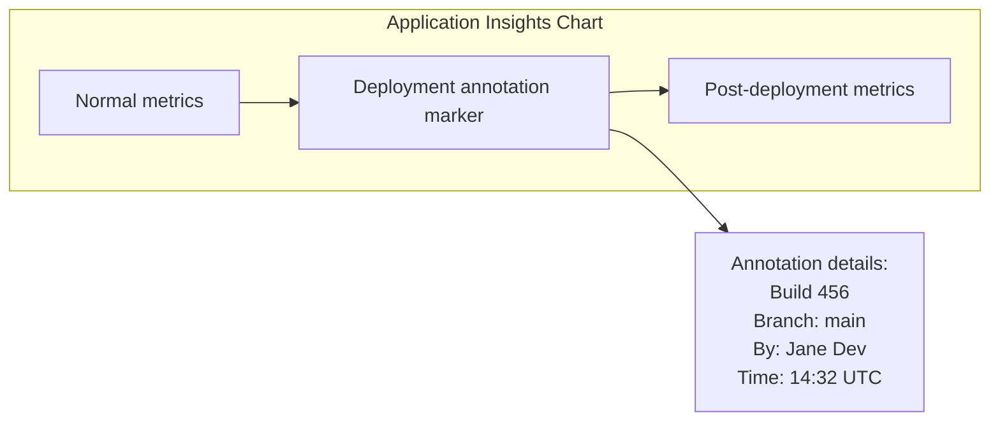

# How to Set Up Azure Pipelines Release Annotations in Azure Monitor Application Insights

Author: [nawazdhandala](https://www.github.com/nawazdhandala)

Tags: Azure Pipelines, Application Insights, Release Annotations, Azure Monitor, CI/CD, DevOps, Monitoring

Description: Learn how to configure release annotations in Azure Monitor Application Insights from Azure Pipelines to correlate deployments with performance and error metrics.

---

When you are looking at a performance chart in Application Insights and see a sudden spike in errors or a drop in response time, the first question is always "did someone deploy something?" Release annotations answer this question instantly. They are vertical markers on your Application Insights charts that show exactly when a deployment happened, what version was deployed, and who triggered it.

Without annotations, correlating deployments with metric changes requires switching between your monitoring dashboard and your release pipeline, comparing timestamps manually. With annotations, the information is right there on the chart. In this post, I will walk through setting up release annotations from Azure Pipelines, customizing them with useful metadata, and using them effectively for incident investigation.

## What Release Annotations Look Like

Release annotations appear as small icons on the timeline of Application Insights charts. When you hover over one, you see:

- The release name or build number
- The deployment timestamp
- Who triggered the deployment
- A link back to the pipeline run
- Any custom properties you added

On any Application Insights chart - response time, failure rate, server requests, custom metrics - annotations provide immediate context. If you see a spike, you can instantly check whether it coincides with a deployment.



## Method 1: Using the Application Insights Release Annotation Task

The simplest way to create release annotations is with the built-in Azure DevOps task. This works in both YAML and classic pipelines.

First, make sure you have the Application Insights resource and know its resource ID. Then add the task to your pipeline:

```yaml
# Pipeline that deploys and creates a release annotation
trigger:
  - main

pool:
  vmImage: 'ubuntu-latest'

variables:
  appInsightsResourceId: '/subscriptions/SUB_ID/resourceGroups/prod-rg/providers/Microsoft.Insights/components/myapp-insights'

stages:
  - stage: Build
    jobs:
      - job: BuildJob
        steps:
          - script: |
              npm ci
              npm run build
            displayName: 'Build application'

  - stage: Deploy
    dependsOn: Build
    jobs:
      - deployment: DeployProd
        environment: 'production'
        strategy:
          runOnce:
            deploy:
              steps:
                # Deploy your application
                - script: echo "Deploying to production..."
                  displayName: 'Deploy application'

                # Create a release annotation after successful deployment
                - task: AzureCLI@2
                  displayName: 'Create release annotation'
                  inputs:
                    azureSubscription: 'azure-service-connection'
                    scriptType: 'bash'
                    scriptLocation: 'inlineScript'
                    inlineScript: |
                      # Create the annotation using the Application Insights API
                      ANNOTATION_PROPERTIES=$(cat <<EOF
                      {
                        "Id": "$(Build.BuildId)",
                        "AnnotationName": "Release $(Build.BuildNumber)",
                        "EventTime": "$(date -u +%Y-%m-%dT%H:%M:%S.000Z)",
                        "Category": "Deployment",
                        "Properties": "{\"ReleaseName\":\"$(Build.BuildNumber)\",\"ReleaseUrl\":\"$(System.CollectionUri)$(System.TeamProject)/_build/results?buildId=$(Build.BuildId)\",\"Branch\":\"$(Build.SourceBranchName)\",\"TriggeredBy\":\"$(Build.RequestedFor)\"}"
                      }
                      EOF
                      )

                      az rest --method put \
                        --uri "$(appInsightsResourceId)/Annotations?api-version=2015-05-01" \
                        --body "$ANNOTATION_PROPERTIES"
```

## Method 2: Using the REST API Directly

For more control, call the Application Insights REST API directly. This approach works from any scripting language:

```python
import requests
import json
from datetime import datetime

def create_release_annotation(app_insights_id, api_key, build_info):
    """
    Create a release annotation in Application Insights.

    Args:
        app_insights_id: The Application Insights instrumentation key or app ID
        api_key: An Application Insights API key with write access
        build_info: Dictionary with build details
    """

    # Application Insights annotations endpoint
    url = f"https://aigs1.aisvc.visualstudio.com/applications/{app_insights_id}/Annotations"

    headers = {
        "X-AIAPIKEY": api_key,
        "Content-Type": "application/json"
    }

    # Build the annotation payload
    annotation = {
        "Id": build_info["build_id"],
        "AnnotationName": f"Release {build_info['build_number']}",
        "EventTime": datetime.utcnow().strftime("%Y-%m-%dT%H:%M:%S.000Z"),
        "Category": "Deployment",
        "Properties": json.dumps({
            "ReleaseName": build_info["build_number"],
            "ReleaseUrl": build_info["build_url"],
            "Branch": build_info["branch"],
            "TriggeredBy": build_info["triggered_by"],
            "Environment": build_info.get("environment", "production"),
            "CommitId": build_info.get("commit_sha", "")
        })
    }

    response = requests.put(url, headers=headers, json=[annotation])

    if response.status_code == 200:
        print(f"Release annotation created: {build_info['build_number']}")
    else:
        print(f"Failed to create annotation: {response.status_code} - {response.text}")

    return response
```

## Method 3: Using Azure CLI with az monitor app-insights

The Azure CLI provides a more straightforward way to create annotations:

```bash
#!/bin/bash
# create-annotation.sh - Create a release annotation via Azure CLI

# Variables from the pipeline
BUILD_NUMBER="${BUILD_BUILDNUMBER}"
BUILD_URL="${SYSTEM_COLLECTIONURI}${SYSTEM_TEAMPROJECT}/_build/results?buildId=${BUILD_BUILDID}"
BRANCH="${BUILD_SOURCEBRANCHNAME}"
TRIGGERED_BY="${BUILD_REQUESTEDFOR}"
APP_INSIGHTS_NAME="myapp-insights"
RESOURCE_GROUP="prod-rg"

# Create the annotation
az monitor app-insights component create-annotation \
  --app "$APP_INSIGHTS_NAME" \
  --resource-group "$RESOURCE_GROUP" \
  --annotation-name "Release $BUILD_NUMBER" \
  --category "Deployment" \
  --properties "{
    \"ReleaseName\": \"$BUILD_NUMBER\",
    \"ReleaseUrl\": \"$BUILD_URL\",
    \"Branch\": \"$BRANCH\",
    \"TriggeredBy\": \"$TRIGGERED_BY\"
  }"

echo "Annotation created for release $BUILD_NUMBER"
```

Use this script in your pipeline:

```yaml
steps:
  - task: AzureCLI@2
    displayName: 'Create release annotation'
    inputs:
      azureSubscription: 'azure-connection'
      scriptType: 'bash'
      scriptLocation: 'scriptPath'
      scriptPath: 'scripts/create-annotation.sh'
    condition: succeeded()  # Only create annotation if deployment succeeded
```

## Adding Custom Properties

The real value of annotations comes from the metadata you attach. Here are useful properties to include:

```yaml
steps:
  - task: AzureCLI@2
    displayName: 'Create detailed release annotation'
    inputs:
      azureSubscription: 'azure-connection'
      scriptType: 'bash'
      scriptLocation: 'inlineScript'
      inlineScript: |
        # Gather useful information for the annotation
        COMMIT_MSG=$(git log -1 --pretty=format:"%s" 2>/dev/null || echo "N/A")
        COMMIT_SHA=$(git rev-parse --short HEAD 2>/dev/null || echo "N/A")
        CHANGED_FILES=$(git diff --name-only HEAD~1 2>/dev/null | wc -l || echo "N/A")

        # Build a rich properties object
        PROPERTIES=$(jq -n \
          --arg release "$(Build.BuildNumber)" \
          --arg url "$(System.CollectionUri)$(System.TeamProject)/_build/results?buildId=$(Build.BuildId)" \
          --arg branch "$(Build.SourceBranchName)" \
          --arg by "$(Build.RequestedFor)" \
          --arg env "production" \
          --arg commit "$COMMIT_SHA" \
          --arg msg "$COMMIT_MSG" \
          --arg files "$CHANGED_FILES" \
          '{
            ReleaseName: $release,
            ReleaseUrl: $url,
            Branch: $branch,
            TriggeredBy: $by,
            Environment: $env,
            CommitId: $commit,
            CommitMessage: $msg,
            ChangedFileCount: $files
          }')

        az monitor app-insights component create-annotation \
          --app "myapp-insights" \
          --resource-group "prod-rg" \
          --annotation-name "Release $(Build.BuildNumber)" \
          --category "Deployment" \
          --properties "$PROPERTIES"
```

## Viewing Annotations in Application Insights

After annotations are created, view them in the Azure portal:

1. Open your Application Insights resource
2. Go to any chart (e.g., Performance, Failures, or a custom chart)
3. Look for the small annotation icons on the timeline
4. Click an icon to see the annotation details

You can also filter annotations:

- In the chart toolbar, click the annotation filter to show/hide annotations
- Filter by category (Deployment, Incident, etc.)
- Filter by date range

## Annotations for Multiple Environments

If you deploy to multiple environments, create annotations that include the environment name so you can distinguish them:

```yaml
parameters:
  - name: environment
    type: string
    values:
      - staging
      - production

stages:
  - stage: Deploy
    jobs:
      - deployment: Deploy
        environment: ${{ parameters.environment }}
        strategy:
          runOnce:
            deploy:
              steps:
                - script: echo "Deploying to ${{ parameters.environment }}"
                  displayName: 'Deploy'

                - task: AzureCLI@2
                  displayName: 'Create annotation for ${{ parameters.environment }}'
                  inputs:
                    azureSubscription: 'azure-connection'
                    scriptType: 'bash'
                    scriptLocation: 'inlineScript'
                    inlineScript: |
                      az monitor app-insights component create-annotation \
                        --app "myapp-insights" \
                        --resource-group "prod-rg" \
                        --annotation-name "${{ parameters.environment }} - $(Build.BuildNumber)" \
                        --category "Deployment" \
                        --properties "{\"Environment\":\"${{ parameters.environment }}\",\"Release\":\"$(Build.BuildNumber)\"}"
```

## Using Annotations for Incident Investigation

When an incident occurs, annotations become investigation tools. Here is the workflow:

1. Alert fires for increased error rate
2. Open Application Insights and go to the Failures view
3. Look at the timeline - do you see a deployment annotation just before the spike?
4. Click the annotation to see what was deployed
5. Click the release URL to go directly to the pipeline run
6. Review the changes in that deployment

This workflow cuts investigation time dramatically. Instead of asking "did anyone deploy anything recently?" in Slack, the annotation gives you the answer immediately, along with a direct link to the deployment details.

## Creating Annotations for Rollbacks

When you roll back a deployment, create an annotation for that too:

```yaml
# Rollback step with its own annotation
- task: AzureCLI@2
  displayName: 'Create rollback annotation'
  inputs:
    azureSubscription: 'azure-connection'
    scriptType: 'bash'
    scriptLocation: 'inlineScript'
    inlineScript: |
      az monitor app-insights component create-annotation \
        --app "myapp-insights" \
        --resource-group "prod-rg" \
        --annotation-name "ROLLBACK - $(Build.BuildNumber)" \
        --category "Deployment" \
        --properties "{\"Type\":\"Rollback\",\"RolledBackFrom\":\"$(Build.BuildNumber)\",\"Reason\":\"Elevated error rate detected\"}"
  condition: failed()  # Only create rollback annotation if deployment failed
```

## Querying Annotations Programmatically

You can retrieve annotations through the API for reporting or automated analysis:

```bash
# List recent annotations for an Application Insights resource
az monitor app-insights component show-annotations \
  --app "myapp-insights" \
  --resource-group "prod-rg" \
  --output table

# Query annotations within a specific time range
START_DATE=$(date -u -d "7 days ago" +%Y-%m-%dT%H:%M:%SZ)
END_DATE=$(date -u +%Y-%m-%dT%H:%M:%SZ)

az rest --method get \
  --uri "/subscriptions/SUB_ID/resourceGroups/prod-rg/providers/Microsoft.Insights/components/myapp-insights/Annotations?api-version=2015-05-01&start=$START_DATE&end=$END_DATE"
```

## Best Practices

**Always include a link back to the pipeline run.** This is the most useful property in an annotation - one click takes you from the monitoring chart to the deployment details.

**Create annotations after successful deployment, not before.** An annotation should mean "this version is now running in this environment." Creating one before deployment succeeds can be misleading during investigation.

**Include the commit hash.** When you need to know exactly what code is running, the commit hash in the annotation lets you trace back to the specific source code state.

**Use consistent naming.** Stick to a pattern like "Release 2026.02.16.1" or "Build 456" so annotations are easy to read on busy charts.

**Clean up old annotations if needed.** If you deploy many times per day, annotations can clutter the chart. Use the API to delete old annotations or configure the chart to show only recent ones.

## Wrapping Up

Release annotations are a small addition to your pipeline that provides outsized value during incident investigation and everyday monitoring. They bridge the gap between your deployment pipeline and your monitoring dashboard, answering the fundamental question "what changed?" with a single glance at a chart. Add the annotation step to your deployment pipelines, include useful metadata, and your on-call engineers will thank you the next time they need to figure out why the error rate just spiked.
