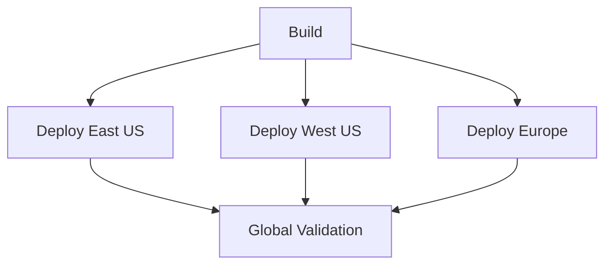

# How to Set Up Azure Pipelines Stage Dependencies and Conditions for Complex Workflow Orchestration

Author: [nawazdhandala](https://www.github.com/nawazdhandala)

Tags: Azure Pipelines, Stage Dependencies, Conditions, CI/CD, Workflow Orchestration, YAML Pipelines, DevOps

Description: Learn how to configure stage dependencies, custom conditions, and complex workflow patterns in Azure Pipelines for sophisticated multi-stage deployment orchestration.

---

Simple pipelines flow linearly: build, test, deploy. But real-world deployment workflows are rarely that simple. You might need to deploy to multiple regions in parallel, run a canary deployment before full rollout, skip staging if it is a hotfix, or roll back automatically if smoke tests fail. Azure Pipelines handles all of these patterns through stage dependencies and conditions.

Stage dependencies control the order of execution, while conditions control whether a stage runs at all. Together, they let you build arbitrarily complex deployment workflows that respond to the context of each specific run.

## Basic Stage Dependencies

By default, stages run sequentially in the order they appear in the YAML file. The `dependsOn` property lets you change this.

```yaml
# Linear pipeline - each stage waits for the previous one
stages:
  - stage: Build
    jobs:
      - job: BuildApp
        steps:
          - script: echo "Building..."

  - stage: Test
    dependsOn: Build  # Explicit dependency (same as default)
    jobs:
      - job: RunTests
        steps:
          - script: echo "Testing..."

  - stage: Deploy
    dependsOn: Test
    jobs:
      - job: DeployApp
        steps:
          - script: echo "Deploying..."
```

## Parallel Stage Execution

When stages do not depend on each other, they can run in parallel. This is common for deploying to multiple environments simultaneously.

```yaml
# Parallel deployment to multiple regions after a single build
stages:
  - stage: Build
    jobs:
      - job: BuildApp
        pool:
          vmImage: 'ubuntu-latest'
        steps:
          - script: echo "Building application..."
          - task: PublishBuildArtifacts@1
            inputs:
              pathToPublish: '$(Build.ArtifactStagingDirectory)'
              artifactName: 'app'

  # These three stages run in parallel - they all depend only on Build
  - stage: DeployEastUS
    dependsOn: Build
    jobs:
      - deployment: DeployEast
        environment: 'production-eastus'
        strategy:
          runOnce:
            deploy:
              steps:
                - script: echo "Deploying to East US..."

  - stage: DeployWestUS
    dependsOn: Build
    jobs:
      - deployment: DeployWest
        environment: 'production-westus'
        strategy:
          runOnce:
            deploy:
              steps:
                - script: echo "Deploying to West US..."

  - stage: DeployEurope
    dependsOn: Build
    jobs:
      - deployment: DeployEU
        environment: 'production-westeurope'
        strategy:
          runOnce:
            deploy:
              steps:
                - script: echo "Deploying to West Europe..."

  # Validation stage runs after all regions are deployed
  - stage: GlobalValidation
    dependsOn:
      - DeployEastUS
      - DeployWestUS
      - DeployEurope
    jobs:
      - job: ValidateAll
        steps:
          - script: echo "Running global validation across all regions..."
```

This creates a diamond-shaped workflow where the build fans out to three parallel deployments, then converges back for global validation.



## Stage Conditions

Conditions determine whether a stage runs based on runtime context. The most common use is controlling deployment stages based on the source branch.

```yaml
stages:
  - stage: Build
    jobs:
      - job: BuildApp
        steps:
          - script: echo "Building..."

  - stage: DeployDev
    dependsOn: Build
    # Deploy to dev on any branch
    condition: succeeded()
    jobs:
      - job: Deploy
        steps:
          - script: echo "Deploying to dev..."

  - stage: DeployStaging
    dependsOn: DeployDev
    # Only deploy to staging from main or release branches
    condition: and(succeeded(), or(eq(variables['Build.SourceBranch'], 'refs/heads/main'), startsWith(variables['Build.SourceBranch'], 'refs/heads/release/')))
    jobs:
      - job: Deploy
        steps:
          - script: echo "Deploying to staging..."

  - stage: DeployProduction
    dependsOn: DeployStaging
    # Only deploy to production from main branch
    condition: and(succeeded(), eq(variables['Build.SourceBranch'], 'refs/heads/main'))
    jobs:
      - job: Deploy
        steps:
          - script: echo "Deploying to production..."
```

## Accessing Outputs from Previous Stages

Stages can pass data to dependent stages through output variables. This is useful for passing computed values like version numbers, artifact paths, or deployment URLs.

```yaml
stages:
  - stage: Build
    jobs:
      - job: BuildApp
        steps:
          - script: |
              # Compute a version number
              VERSION="1.0.$(Build.BuildId)"
              echo "##vso[task.setvariable variable=appVersion;isOutput=true]$VERSION"
              echo "Building version: $VERSION"
            name: setVersion
            displayName: 'Set version number'

  - stage: Deploy
    dependsOn: Build
    variables:
      # Reference the output variable from the Build stage
      # Format: stageDependencies.<StageName>.<JobName>.outputs['<StepName>.<VariableName>']
      deployVersion: $[ stageDependencies.Build.BuildApp.outputs['setVersion.appVersion'] ]
    jobs:
      - job: DeployApp
        steps:
          - script: |
              echo "Deploying version: $(deployVersion)"
            displayName: 'Deploy with version'
```

## Conditional Logic Based on Previous Stage Results

You can run stages conditionally based on whether previous stages succeeded or failed. This is the foundation for rollback patterns.

```yaml
stages:
  - stage: Build
    jobs:
      - job: BuildApp
        steps:
          - script: echo "Building..."

  - stage: DeployCanary
    dependsOn: Build
    jobs:
      - deployment: CanaryDeploy
        environment: 'production-canary'
        strategy:
          runOnce:
            deploy:
              steps:
                - script: echo "Deploying canary..."

  - stage: SmokeTests
    dependsOn: DeployCanary
    jobs:
      - job: RunSmoke
        steps:
          - script: |
              echo "Running smoke tests against canary..."
              # Simulate a test - in real life this would be actual tests
              exit 0

  # Full rollout only if smoke tests pass
  - stage: FullRollout
    dependsOn: SmokeTests
    condition: succeeded()
    jobs:
      - deployment: FullDeploy
        environment: 'production'
        strategy:
          runOnce:
            deploy:
              steps:
                - script: echo "Rolling out to all instances..."

  # Rollback if smoke tests fail
  - stage: Rollback
    dependsOn: SmokeTests
    condition: failed()
    jobs:
      - deployment: RollbackCanary
        environment: 'production-canary'
        strategy:
          runOnce:
            deploy:
              steps:
                - script: echo "Rolling back canary deployment..."
```

## Complex Condition Expressions

Azure Pipelines supports a rich expression language for conditions. Here are some useful patterns.

```yaml
stages:
  - stage: ConditionalStage
    # Run only for scheduled builds on main branch
    condition: and(
      eq(variables['Build.Reason'], 'Schedule'),
      eq(variables['Build.SourceBranch'], 'refs/heads/main')
    )
    jobs:
      - job: ScheduledTask
        steps:
          - script: echo "Running scheduled task..."

  - stage: HotfixDeploy
    dependsOn: Build
    # Skip staging for hotfix branches - deploy directly to production
    condition: and(
      succeeded(),
      startsWith(variables['Build.SourceBranch'], 'refs/heads/hotfix/')
    )
    jobs:
      - job: Deploy
        steps:
          - script: echo "Hotfix - deploying directly..."

  - stage: AlwaysNotify
    dependsOn:
      - Build
      - Deploy
    # Run regardless of whether previous stages succeeded or failed
    condition: always()
    jobs:
      - job: Notify
        steps:
          - script: |
              echo "Build completed. Sending notification..."
```

## Skipping Stages with Parameters

Pipeline parameters let users choose which stages to run at queue time.

```yaml
# Allow users to select which environments to deploy to
parameters:
  - name: deployEnvironments
    type: object
    default:
      - dev
      - staging
      - production
    values:
      - dev
      - staging
      - production

  - name: skipTests
    type: boolean
    default: false

stages:
  - stage: Build
    jobs:
      - job: BuildApp
        steps:
          - script: echo "Building..."

  - stage: Test
    dependsOn: Build
    condition: and(succeeded(), eq('${{ parameters.skipTests }}', 'false'))
    jobs:
      - job: RunTests
        steps:
          - script: echo "Running tests..."

  - stage: DeployDev
    dependsOn: Test
    condition: and(succeeded(), containsValue('${{ parameters.deployEnvironments }}', 'dev'))
    jobs:
      - job: Deploy
        steps:
          - script: echo "Deploying to dev..."

  - stage: DeployStaging
    dependsOn: DeployDev
    condition: and(succeeded(), containsValue('${{ parameters.deployEnvironments }}', 'staging'))
    jobs:
      - job: Deploy
        steps:
          - script: echo "Deploying to staging..."

  - stage: DeployProduction
    dependsOn: DeployStaging
    condition: and(succeeded(), containsValue('${{ parameters.deployEnvironments }}', 'production'))
    jobs:
      - job: Deploy
        steps:
          - script: echo "Deploying to production..."
```

## The Empty dependsOn Pattern

To make a stage run with no dependencies (in parallel with the first stage), set `dependsOn` to an empty list.

```yaml
stages:
  - stage: BuildApp
    jobs:
      - job: Build
        steps:
          - script: echo "Building app..."

  - stage: RunSecurityScan
    dependsOn: []  # Run in parallel with BuildApp, no dependencies
    jobs:
      - job: SecurityScan
        steps:
          - script: echo "Running security scan..."

  - stage: Deploy
    dependsOn:
      - BuildApp
      - RunSecurityScan  # Wait for both to complete
    jobs:
      - job: DeployApp
        steps:
          - script: echo "Deploying..."
```

## Debugging Stage Conditions

When a stage does not run and you are not sure why, check the pipeline run summary. Each skipped stage shows a reason. Common surprises include conditions that evaluate to false because of string casing differences in branch names, or stages that are skipped because a dependency was skipped (not failed, but skipped).

Add a diagnostic step to your pipeline to print the variables that conditions depend on.

```yaml
stages:
  - stage: DiagnosticInfo
    dependsOn: []
    jobs:
      - job: PrintContext
        steps:
          - script: |
              echo "Build.Reason: $(Build.Reason)"
              echo "Build.SourceBranch: $(Build.SourceBranch)"
              echo "Build.SourceBranchName: $(Build.SourceBranchName)"
              echo "Build.Repository.Name: $(Build.Repository.Name)"
              echo "System.PullRequest.TargetBranch: $(System.PullRequest.TargetBranch)"
            displayName: 'Print diagnostic variables'
```

Stage dependencies and conditions give you the building blocks for any deployment workflow you can imagine. Start simple, add complexity as your needs grow, and always test your conditions in a non-production pipeline first. A misconfigured condition that accidentally deploys to production is the kind of mistake you only want to make in a sandbox.
