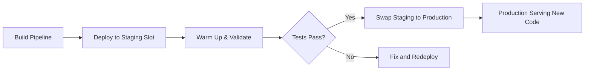

# How to Set Up Azure Pipelines to Deploy Azure Functions with Staging Slots and Swap Deployment

Author: [nawazdhandala](https://www.github.com/nawazdhandala)

Tags: Azure Pipelines, Azure Functions, Deployment Slots, Staging, Swap Deployment, CI/CD, Serverless

Description: Learn how to configure Azure Pipelines to deploy Azure Functions to staging slots and use swap deployment for zero-downtime production releases.

---

Deploying directly to production is a recipe for downtime. Even with thorough testing in your pipeline, there is always a risk that the new code behaves differently in the production environment. Azure Functions deployment slots let you deploy to a staging slot first, verify everything works, and then swap it into production with zero downtime. If something goes wrong after the swap, you can swap back instantly.

This approach, commonly called blue-green deployment, separates deployment from release. Your new code is deployed and warmed up in the staging slot while the production slot continues serving traffic. The swap operation simply changes which slot receives traffic, making the cutover nearly instantaneous.

## Understanding Deployment Slots

A deployment slot is a live instance of your Function App with its own hostname, configuration, and application code. The production slot is the default one that handles all traffic. Staging slots are additional instances you create for testing and pre-production validation.

Key properties of deployment slots:

- Each slot has its own URL (e.g., `myfunction-staging.azurewebsites.net`)
- Slots can have different application settings (connection strings, feature flags)
- Some settings "stick" to the slot (slot settings) while others travel with the code during swaps
- Slots share the same App Service Plan, so there is no additional compute cost (but they do use resources from the plan)



## Creating a Staging Slot

Before setting up the pipeline, create a staging slot for your Function App.

```bash
# Create a staging deployment slot for the Function App
az functionapp deployment slot create \
  --name "my-function-app" \
  --resource-group "my-rg" \
  --slot "staging"

# Verify the slot was created
az functionapp deployment slot list \
  --name "my-function-app" \
  --resource-group "my-rg" \
  --output table
```

## Configuring Slot-Specific Settings

Some settings should be different between staging and production. For example, you might want staging to connect to a test database while production connects to the real one. Mark these as "slot settings" so they stay with the slot during swaps.

```bash
# Set a connection string on the staging slot
az functionapp config appsettings set \
  --name "my-function-app" \
  --resource-group "my-rg" \
  --slot "staging" \
  --settings "DatabaseConnection=Server=test-db.database.windows.net;..."

# Mark settings as slot-specific (they stay with the slot, not the code)
az functionapp config appsettings set \
  --name "my-function-app" \
  --resource-group "my-rg" \
  --slot "staging" \
  --slot-settings "DatabaseConnection=Server=test-db.database.windows.net;..."

# Set the ASPNETCORE_ENVIRONMENT to Staging for the staging slot
az functionapp config appsettings set \
  --name "my-function-app" \
  --resource-group "my-rg" \
  --slot "staging" \
  --slot-settings "ASPNETCORE_ENVIRONMENT=Staging"
```

## Basic Pipeline: Deploy and Swap

Here is a straightforward pipeline that builds the Function App, deploys to the staging slot, runs validation, and then swaps to production.

```yaml
# azure-pipelines.yml - Deploy Azure Function with slot swap

trigger:
  branches:
    include:
      - main

pool:
  vmImage: 'ubuntu-latest'

variables:
  functionAppName: 'my-function-app'
  resourceGroupName: 'my-rg'
  azureSubscription: 'Azure-Production-Connection'

stages:
  # Stage 1: Build the Function App
  - stage: Build
    displayName: 'Build Function App'
    jobs:
      - job: BuildJob
        steps:
          - task: DotNetCoreCLI@2
            displayName: 'Restore dependencies'
            inputs:
              command: 'restore'
              projects: '**/*.csproj'

          - task: DotNetCoreCLI@2
            displayName: 'Build project'
            inputs:
              command: 'build'
              projects: '**/*.csproj'
              arguments: '--configuration Release --output $(Build.ArtifactStagingDirectory)'

          - task: DotNetCoreCLI@2
            displayName: 'Run unit tests'
            inputs:
              command: 'test'
              projects: '**/*Tests.csproj'
              arguments: '--configuration Release'

          - task: ArchiveFiles@2
            displayName: 'Create deployment package'
            inputs:
              rootFolderOrFile: '$(Build.ArtifactStagingDirectory)'
              includeRootFolder: false
              archiveFile: '$(Build.ArtifactStagingDirectory)/function-app.zip'

          - task: PublishBuildArtifacts@1
            displayName: 'Publish artifact'
            inputs:
              pathToPublish: '$(Build.ArtifactStagingDirectory)/function-app.zip'
              artifactName: 'function-package'

  # Stage 2: Deploy to staging slot
  - stage: DeployStaging
    displayName: 'Deploy to Staging Slot'
    dependsOn: Build
    jobs:
      - deployment: DeployStagingSlot
        environment: 'staging'
        strategy:
          runOnce:
            deploy:
              steps:
                - task: DownloadBuildArtifacts@1
                  inputs:
                    artifactName: 'function-package'

                - task: AzureFunctionApp@2
                  displayName: 'Deploy to staging slot'
                  inputs:
                    azureSubscription: $(azureSubscription)
                    appType: 'functionApp'
                    appName: $(functionAppName)
                    deployToSlotOrASE: true
                    resourceGroupName: $(resourceGroupName)
                    slotName: 'staging'
                    package: '$(Pipeline.Workspace)/function-package/function-app.zip'

  # Stage 3: Validate staging deployment
  - stage: ValidateStaging
    displayName: 'Validate Staging'
    dependsOn: DeployStaging
    jobs:
      - job: SmokeTests
        steps:
          # Wait for the staging slot to warm up
          - script: |
              echo "Waiting for staging slot to warm up..."
              sleep 30

              # Hit the health check endpoint on the staging slot
              STATUS=$(curl -s -o /dev/null -w "%{http_code}" \
                "https://$(functionAppName)-staging.azurewebsites.net/api/health")

              echo "Health check status: $STATUS"

              if [ "$STATUS" != "200" ]; then
                echo "##vso[task.logissue type=error]Staging health check failed with status $STATUS"
                exit 1
              fi

              echo "Staging slot is healthy"
            displayName: 'Run smoke tests on staging'

  # Stage 4: Swap staging to production
  - stage: SwapToProduction
    displayName: 'Swap to Production'
    dependsOn: ValidateStaging
    jobs:
      - deployment: SwapSlots
        environment: 'production'
        strategy:
          runOnce:
            deploy:
              steps:
                - task: AzureAppServiceManage@0
                  displayName: 'Swap staging to production'
                  inputs:
                    azureSubscription: $(azureSubscription)
                    action: 'Swap Slots'
                    webAppName: $(functionAppName)
                    resourceGroupName: $(resourceGroupName)
                    sourceSlot: 'staging'
```

## Adding Auto-Rollback

If production starts throwing errors after the swap, you want to swap back automatically. Add a post-swap validation stage that triggers a rollback on failure.

```yaml
  # Stage 5: Post-swap production validation
  - stage: PostSwapValidation
    displayName: 'Production Validation'
    dependsOn: SwapToProduction
    jobs:
      - job: ProductionSmokeTest
        steps:
          - script: |
              echo "Validating production after swap..."
              sleep 15

              # Run multiple health checks with retries
              FAILURES=0
              for i in $(seq 1 5); do
                STATUS=$(curl -s -o /dev/null -w "%{http_code}" \
                  "https://$(functionAppName).azurewebsites.net/api/health")
                if [ "$STATUS" != "200" ]; then
                  FAILURES=$((FAILURES + 1))
                  echo "Check $i failed with status $STATUS"
                else
                  echo "Check $i passed"
                fi
                sleep 5
              done

              if [ "$FAILURES" -gt 2 ]; then
                echo "##vso[task.logissue type=error]Too many failures after swap: $FAILURES/5"
                exit 1
              fi
            displayName: 'Validate production endpoints'

  # Stage 6: Rollback if validation fails
  - stage: Rollback
    displayName: 'Rollback (if needed)'
    dependsOn: PostSwapValidation
    condition: failed()
    jobs:
      - deployment: RollbackSwap
        environment: 'production'
        strategy:
          runOnce:
            deploy:
              steps:
                - task: AzureAppServiceManage@0
                  displayName: 'Swap back to previous version'
                  inputs:
                    azureSubscription: $(azureSubscription)
                    action: 'Swap Slots'
                    webAppName: $(functionAppName)
                    resourceGroupName: $(resourceGroupName)
                    sourceSlot: 'staging'

                - script: |
                    echo "##vso[task.logissue type=warning]Production rollback executed!"
                    echo "The previous version has been restored."
                    echo "The failing version is now in the staging slot for investigation."
                  displayName: 'Rollback notification'
```

## Warming Up the Staging Slot

Cold starts are a known issue with Azure Functions, especially on Consumption plans. Before swapping, make sure the staging slot is warmed up.

```yaml
# Add warm-up requests before validation
- script: |
    echo "Warming up staging slot..."
    STAGING_URL="https://$(functionAppName)-staging.azurewebsites.net"

    # Hit each function endpoint to trigger initialization
    ENDPOINTS=("api/health" "api/users" "api/orders")

    for endpoint in "${ENDPOINTS[@]}"; do
      echo "Warming up: $STAGING_URL/$endpoint"
      curl -s -o /dev/null -w "  Status: %{http_code}, Time: %{time_total}s\n" \
        "$STAGING_URL/$endpoint"
    done

    echo "Warm-up complete"
  displayName: 'Warm up staging slot'
```

## Node.js and Python Function Deployments

The pattern works the same for non-.NET function apps. Here is the build stage for a Node.js function.

```yaml
# Build stage for a Node.js Azure Function
- stage: Build
  jobs:
    - job: BuildNode
      pool:
        vmImage: 'ubuntu-latest'
      steps:
        - task: NodeTool@0
          inputs:
            versionSpec: '18.x'

        - script: |
            npm ci
            npm run build
            npm prune --production
          displayName: 'Install and build'

        - task: ArchiveFiles@2
          displayName: 'Package function app'
          inputs:
            rootFolderOrFile: '$(System.DefaultWorkingDirectory)'
            includeRootFolder: false
            archiveFile: '$(Build.ArtifactStagingDirectory)/function-app.zip'

        - task: PublishBuildArtifacts@1
          inputs:
            pathToPublish: '$(Build.ArtifactStagingDirectory)/function-app.zip'
            artifactName: 'function-package'
```

## Traffic Routing for Canary Testing

Instead of a binary swap, you can route a percentage of traffic to the staging slot for canary testing.

```bash
# Route 10% of production traffic to the staging slot
az functionapp traffic-routing set \
  --name "my-function-app" \
  --resource-group "my-rg" \
  --distribution staging=10

# After validation, increase to 50%
az functionapp traffic-routing set \
  --name "my-function-app" \
  --resource-group "my-rg" \
  --distribution staging=50

# If everything looks good, do the full swap
az functionapp deployment slot swap \
  --name "my-function-app" \
  --resource-group "my-rg" \
  --slot "staging"

# Or reset traffic routing if there is a problem
az functionapp traffic-routing clear \
  --name "my-function-app" \
  --resource-group "my-rg"
```

Deployment slots turn Azure Functions deployments from a risky operation into a safe, reversible one. The staging slot gives you a production-identical environment to validate against, the swap operation ensures zero downtime, and the ability to swap back provides an instant rollback mechanism. For any Function App that serves production traffic, slot-based deployment should be the default approach.
