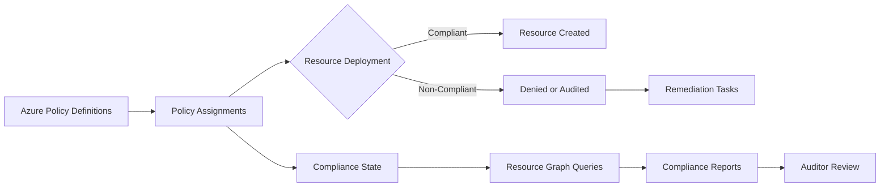

# How to Set Up Azure Policy for Financial Services Regulatory Compliance Auditing

Author: [nawazdhandala](https://www.github.com/nawazdhandala)

Tags: Azure Policy, Financial Services, Regulatory Compliance, Auditing, Azure Governance, Cloud Security, Fintech

Description: Learn how to configure Azure Policy for financial services regulatory compliance auditing including SOX, PCI DSS, and GDPR frameworks.

---

Financial services organizations face a unique challenge when migrating to the cloud. Regulators expect strict controls, detailed audit trails, and proof that sensitive data is handled properly. Azure Policy gives you a way to enforce those rules directly in your cloud environment so you catch violations before they turn into costly findings.

In this guide, I will walk through setting up Azure Policy to meet common financial services regulatory requirements. We will cover built-in compliance initiatives, custom policy definitions, remediation tasks, and reporting.

## Why Azure Policy Matters for Financial Services

Banks, insurance companies, and investment firms are subject to regulations like SOX (Sarbanes-Oxley), PCI DSS (Payment Card Industry Data Security Standard), GDPR, and various local financial authority mandates. These regulations share common themes: data encryption, access control, audit logging, and data residency.

Azure Policy works at the Azure Resource Manager layer. Every time someone creates or modifies a resource, Policy evaluates it against your rules. If a resource violates a policy, Azure can deny the deployment, flag it for review, or automatically remediate it.

This is a lot more reliable than periodic manual audits. You get continuous compliance checking that runs 24/7.

## Step 1 - Assign Built-In Compliance Initiatives

Azure ships with several built-in regulatory compliance initiatives tailored to financial services. These map controls from specific frameworks to Azure Policy definitions.

Navigate to the Azure Portal, open Policy, and go to Definitions. Filter by type "Initiative" and search for the regulatory standard you need. Common ones include:

- CIS Microsoft Azure Foundations Benchmark
- PCI DSS 3.2.1
- SOC 2 Type II
- NIST SP 800-53 Rev 5
- ISO 27001:2013

To assign an initiative using the Azure CLI, run the following command. This assigns the PCI DSS initiative to your subscription scope.

```bash
# Assign the PCI DSS 3.2.1 built-in initiative to the target subscription
az policy assignment create \
  --name "pci-dss-audit" \
  --display-name "PCI DSS 3.2.1 Compliance Audit" \
  --policy-set-definition "496eeda9-8f2f-4d5e-8dfd-204f0a92ed41" \
  --scope "/subscriptions/<your-subscription-id>" \
  --enforcement-mode Default
```

The enforcement mode "Default" means policies with deny effects will actually block non-compliant deployments. If you want to start in audit-only mode to see what would fail without blocking anything, set it to "DoNotEnforce."

## Step 2 - Create Custom Policies for Financial Regulations

Built-in initiatives cover a lot of ground, but financial regulators often have specific requirements that need custom policies. For example, you might need to ensure all storage accounts use customer-managed keys, or that certain resource types are only deployed in approved regions.

Here is a custom policy definition that ensures all SQL databases have Transparent Data Encryption (TDE) enabled. This is a common requirement for protecting data at rest.

```json
{
  "mode": "Indexed",
  "policyRule": {
    "if": {
      "allOf": [
        {
          "field": "type",
          "equals": "Microsoft.Sql/servers/databases"
        },
        {
          "field": "Microsoft.Sql/servers/databases/transparentDataEncryption.status",
          "notEquals": "Enabled"
        }
      ]
    },
    "then": {
      "effect": "audit"
    }
  },
  "parameters": {}
}
```

You can deploy this custom definition with the CLI.

```bash
# Create a custom policy definition for SQL TDE enforcement
az policy definition create \
  --name "require-sql-tde" \
  --display-name "Require TDE on SQL Databases" \
  --description "Audits SQL databases that do not have Transparent Data Encryption enabled" \
  --rules ./tde-policy-rule.json \
  --mode Indexed
```

## Step 3 - Enforce Data Residency Requirements

Many financial regulators require that customer data stays within specific geographic boundaries. You can enforce this with an allowed-locations policy. The following restricts all resource deployments to US East and US West regions.

```bash
# Assign the built-in allowed locations policy
az policy assignment create \
  --name "allowed-locations-finance" \
  --display-name "Restrict to US Regions Only" \
  --policy "e56962a6-4747-49cd-b67b-bf8b01975c4c" \
  --params '{"listOfAllowedLocations": {"value": ["eastus", "westus", "eastus2", "westus2"]}}' \
  --scope "/subscriptions/<your-subscription-id>"
```

This is a deny policy, meaning any attempt to deploy resources outside these regions will be blocked outright. That is exactly what you want for data residency requirements.

## Step 4 - Configure Diagnostic Settings for Audit Trails

Regulators want evidence that you are monitoring your environment. Azure Policy can enforce that diagnostic settings are turned on for all supported resources, sending logs to a central Log Analytics workspace.

```bash
# Assign a policy that requires diagnostic settings on Key Vaults
az policy assignment create \
  --name "diag-settings-keyvault" \
  --display-name "Require Diagnostic Settings on Key Vaults" \
  --policy "cf820ca0-f99e-4f3e-84fb-66e913812d21" \
  --params "{\"logAnalyticsWorkspaceId\": {\"value\": \"/subscriptions/<sub-id>/resourceGroups/<rg>/providers/Microsoft.OperationalInsights/workspaces/<workspace>\"}}" \
  --scope "/subscriptions/<your-subscription-id>" \
  --identity-scope "/subscriptions/<your-subscription-id>" \
  --location "eastus" \
  --mi-system-assigned
```

Notice the `--mi-system-assigned` flag. Policies that create or modify resources (DeployIfNotExists effect) need a managed identity to perform those actions.

## Step 5 - Set Up Remediation Tasks

Some policies audit existing resources that were deployed before the policy existed. Remediation tasks fix those pre-existing violations. For example, if you have storage accounts without encryption that predate your policy, a remediation task will enable encryption on them.

```bash
# Create a remediation task for non-compliant resources
az policy remediation create \
  --name "remediate-storage-encryption" \
  --policy-assignment "storage-encryption-policy" \
  --resource-group "finance-prod-rg"
```

Always test remediation in a non-production environment first. Some remediations can cause brief service interruptions, like restarting a database to enable TDE.

## Step 6 - Build Compliance Reports

Azure Policy's compliance dashboard gives you a real-time view of your compliance posture. But for audit purposes, you often need exportable reports.

You can query compliance state using the Azure Resource Graph.

```bash
# Query non-compliant resources across all policy assignments
az graph query -q "
  PolicyResources
  | where type == 'microsoft.policyinsights/policystates'
  | where properties.complianceState == 'NonCompliant'
  | project
      resourceId = properties.resourceId,
      policyAssignment = properties.policyAssignmentName,
      policyDefinition = properties.policyDefinitionName,
      timestamp = properties.timestamp
  | order by timestamp desc
"
```

For automated reporting, set up a Logic App that queries the compliance state on a schedule and sends the results to a SharePoint document library or an email distribution list. Auditors love having timestamped compliance snapshots they can review.

## Step 7 - Implement Exemptions When Needed

Sometimes you have a legitimate reason to exempt a specific resource from a policy. Maybe a legacy system cannot be upgraded to meet a requirement, and you have a compensating control in place. Azure Policy exemptions let you document these exceptions.

```bash
# Create a policy exemption with an expiration date
az policy exemption create \
  --name "legacy-db-tde-exemption" \
  --policy-assignment "require-sql-tde-assignment" \
  --exemption-category "Mitigated" \
  --scope "/subscriptions/<sub-id>/resourceGroups/legacy-rg/providers/Microsoft.Sql/servers/legacy-server" \
  --description "Legacy database with compensating network controls. Scheduled for decommission by Q3 2026." \
  --expires-on "2026-09-30T00:00:00Z"
```

The key here is the expiration date. Regulators want to see that exemptions are temporary and tracked. Using the "Mitigated" category means you have a compensating control documented elsewhere.

## Architecture Overview

Here is how the compliance auditing pipeline fits together.



## Best Practices for Financial Services

First, start in audit mode before switching to deny. This lets you understand the impact of a policy without breaking existing workflows.

Second, use management groups to apply policies across multiple subscriptions. Most financial institutions have separate subscriptions for production, staging, and development. Applying policies at the management group level ensures consistent governance.

Third, version your policy definitions in source control. Treat them like infrastructure as code. When an auditor asks why a policy was changed, you can point to the Git history.

Fourth, review compliance state weekly at minimum. Set up alerts for new non-compliant resources so your team can respond quickly.

Fifth, keep your exemptions list clean. Review exemptions quarterly and remove any that have expired or are no longer needed.

## Wrapping Up

Azure Policy is one of the most practical tools for maintaining regulatory compliance in financial services environments. It shifts compliance from a periodic manual exercise to a continuous automated process. You still need human oversight and judgment, but the heavy lifting of checking every resource against every control happens automatically.

Start with the built-in regulatory initiatives, layer on custom policies for your specific requirements, and build out the reporting pipeline. Your auditors will thank you, and your compliance posture will be far stronger than anything you could achieve with manual reviews alone.
