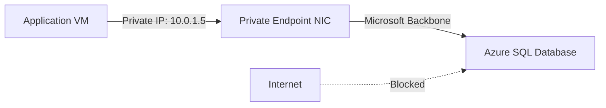

# How to Set Up Azure Private Link for Azure SQL Database to Eliminate Public Internet Exposure

Author: [nawazdhandala](https://www.github.com/nawazdhandala)

Tags: Azure Private Link, Azure SQL, Private Endpoint, Network Security, Database Security, VNet, Azure

Description: Step-by-step guide to configuring Azure Private Link for Azure SQL Database so your database traffic stays on the Microsoft backbone network.

---

By default, Azure SQL Database is accessible through a public endpoint with a fully qualified domain name like `yourserver.database.windows.net`. Even with firewall rules and Azure AD authentication, the fact that the endpoint is on the public internet makes security teams uncomfortable. Vulnerability scanners flag it, compliance audits question it, and attack surface analysis tools highlight it as a risk.

Azure Private Link solves this by giving your SQL Database a private IP address inside your virtual network. Traffic between your applications and the database never leaves the Microsoft backbone network. The public endpoint can be disabled entirely, removing it from the internet-facing attack surface.

This guide walks through the full setup, including the private endpoint, DNS configuration, and disabling public access.

## How Private Link Works

When you create a private endpoint for Azure SQL Database, Azure provisions a network interface in your chosen subnet and assigns it a private IP address. A mapping is created between this private IP and the SQL Database's public FQDN. When your application resolves `yourserver.database.windows.net`, it gets the private IP instead of the public one, and the connection routes through the VNet.



The key benefit is that the SQL Database becomes unreachable from the internet. Even if an attacker knows the server name, DNS resolution from outside your VNet returns the private IP, which is not routable from the internet.

## Prerequisites

Before starting, make sure you have:

- An Azure SQL Database server with at least one database
- A virtual network with a subnet that has at least one available IP address
- The subnet must not have a service endpoint for `Microsoft.Sql` enabled (Private Link and service endpoints should not be used together for the same service)
- Contributor permissions on both the VNet and the SQL server

## Step 1: Create the Private Endpoint

Start by creating the private endpoint in the same region as your SQL Database.

```bash
# Create a private endpoint for Azure SQL Database
az network private-endpoint create \
  --name sql-private-endpoint \
  --resource-group myResourceGroup \
  --vnet-name myVNet \
  --subnet app-subnet \
  --private-connection-resource-id "/subscriptions/YOUR_SUB/resourceGroups/myResourceGroup/providers/Microsoft.Sql/servers/myserver" \
  --group-id sqlServer \
  --connection-name sql-private-connection \
  --location eastus
```

The `--group-id sqlServer` specifies that this private endpoint is for the SQL Server resource (which includes all databases on that server). Each SQL Server only needs one private endpoint, regardless of how many databases it hosts.

Verify the endpoint was created and is in the `Approved` state.

```bash
# Check the private endpoint connection status
az network private-endpoint show \
  --name sql-private-endpoint \
  --resource-group myResourceGroup \
  --query '{name: name, provisioningState: provisioningState, ip: customDnsConfigs[0].ipAddresses[0]}' \
  --output json
```

The output should show a private IP address from your subnet's address range.

## Step 2: Configure Private DNS Zone

DNS is the trickiest part of Private Link setup. For your applications to resolve `yourserver.database.windows.net` to the private IP, you need a Private DNS Zone linked to your VNet.

```bash
# Create a Private DNS Zone for Azure SQL Database
az network private-dns zone create \
  --resource-group myResourceGroup \
  --name "privatelink.database.windows.net"

# Link the DNS zone to your VNet so VMs in the VNet use it for resolution
az network private-dns link vnet create \
  --resource-group myResourceGroup \
  --zone-name "privatelink.database.windows.net" \
  --name sql-dns-link \
  --virtual-network myVNet \
  --registration-enabled false
```

Now create a DNS zone group on the private endpoint. This automatically manages the DNS records for you - when the private endpoint's IP changes, the DNS record updates automatically.

```bash
# Create a DNS zone group to auto-manage DNS records
az network private-endpoint dns-zone-group create \
  --resource-group myResourceGroup \
  --endpoint-name sql-private-endpoint \
  --name sql-dns-zone-group \
  --private-dns-zone "privatelink.database.windows.net" \
  --zone-name sql
```

Verify that the DNS record was created correctly.

```bash
# List DNS records in the private DNS zone
az network private-dns record-set a list \
  --resource-group myResourceGroup \
  --zone-name "privatelink.database.windows.net" \
  --output table
```

You should see an A record for `myserver` pointing to the private IP address.

## Step 3: Test Connectivity from a VM in the VNet

SSH or RDP into a VM that is in the same VNet (or a peered VNet) and test DNS resolution.

```bash
# Test DNS resolution from a VM inside the VNet
nslookup myserver.database.windows.net
```

The response should show the private IP address from your subnet, not the public IP. If you still see the public IP, the DNS zone link might not have propagated yet (give it a few minutes) or your VM might be using a custom DNS server that does not forward to Azure DNS.

Test the actual database connection.

```bash
# Test connectivity to SQL Database on the private endpoint
# Install sqlcmd if not already available
sqlcmd -S myserver.database.windows.net -d myDatabase -U myadmin -P 'YourPassword' -Q "SELECT @@VERSION"
```

If the connection succeeds, traffic is flowing through the private endpoint.

## Step 4: Disable Public Network Access

Once you have confirmed that the private endpoint works, disable the public endpoint to eliminate internet exposure entirely.

```bash
# Disable public network access on the SQL Server
az sql server update \
  --resource-group myResourceGroup \
  --name myserver \
  --public-network-access Disabled
```

After this change, any attempt to connect to the SQL Database from outside your VNet will fail, even with the correct credentials and firewall rules. The only way in is through the private endpoint.

If you want to keep public access as a fallback during migration, you can leave it enabled and rely on the SQL Server firewall rules to restrict which public IPs can connect. But for maximum security, disabling it completely is the right move.

## Step 5: Handle On-Premises Connectivity

If you have applications running on-premises that need to access the SQL Database through the private endpoint, you need to set up DNS forwarding so on-premises DNS queries for `*.database.windows.net` resolve to the private IP.

There are several approaches:

**Option 1: Conditional DNS forwarder**

Configure your on-premises DNS server to forward queries for `privatelink.database.windows.net` to the Azure DNS resolver at 168.63.129.16 (accessible through a VPN or ExpressRoute connection).

**Option 2: Azure DNS Private Resolver**

Deploy an Azure DNS Private Resolver in your VNet and configure an inbound endpoint. Point your on-premises DNS servers to this endpoint for Azure-hosted zone queries.

```bash
# Create a DNS Private Resolver (requires a dedicated subnet)
az dns-resolver create \
  --resource-group myResourceGroup \
  --name myDnsResolver \
  --location eastus \
  --id "/subscriptions/YOUR_SUB/resourceGroups/myResourceGroup/providers/Microsoft.Network/virtualNetworks/myVNet"

# Create an inbound endpoint for on-premises queries
az dns-resolver inbound-endpoint create \
  --resource-group myResourceGroup \
  --dns-resolver-name myDnsResolver \
  --name inbound-endpoint \
  --location eastus \
  --ip-configurations '[{"private-ip-allocation-method":"Dynamic","id":"/subscriptions/YOUR_SUB/resourceGroups/myResourceGroup/providers/Microsoft.Network/virtualNetworks/myVNet/subnets/dns-resolver-subnet"}]'
```

## Step 6: Configure Application Connection Strings

Your application connection strings do not need to change. The same FQDN (`myserver.database.windows.net`) is used regardless of whether the connection goes through the public or private endpoint. The DNS resolution handles the routing transparently.

However, there are a few settings to check:

```
# Connection string for Azure SQL with Private Link
# No changes needed from the standard connection string
Server=tcp:myserver.database.windows.net,1433;Initial Catalog=myDatabase;Encrypt=True;TrustServerCertificate=False;Connection Timeout=30;Authentication=Active Directory Default;
```

Make sure `Encrypt=True` is set. Even though traffic stays on the Microsoft backbone, encryption in transit is still a best practice and is required for compliance with most frameworks.

## Step 7: Monitor Private Endpoint Health

Set up monitoring to catch connectivity issues early.

```bash
# Create a metric alert for private endpoint connection failures
az monitor metrics alert create \
  --name "sql-private-endpoint-failures" \
  --resource-group myResourceGroup \
  --scopes "/subscriptions/YOUR_SUB/resourceGroups/myResourceGroup/providers/Microsoft.Sql/servers/myserver" \
  --condition "avg connection_failed > 0" \
  --window-size 5m \
  --evaluation-frequency 1m \
  --action "/subscriptions/YOUR_SUB/resourceGroups/myResourceGroup/providers/microsoft.insights/actionGroups/ops-team"
```

Also enable Azure SQL Database auditing to track which connections are coming through the private endpoint versus the public endpoint (if you left public access enabled).

## Terraform Configuration

For teams using Infrastructure as Code, here is the complete Terraform configuration for a Private Link setup.

```hcl
# Private endpoint for Azure SQL Database
resource "azurerm_private_endpoint" "sql" {
  name                = "sql-private-endpoint"
  location            = azurerm_resource_group.main.location
  resource_group_name = azurerm_resource_group.main.name
  subnet_id           = azurerm_subnet.app.id

  private_service_connection {
    name                           = "sql-private-connection"
    private_connection_resource_id = azurerm_mssql_server.main.id
    subresource_names              = ["sqlServer"]
    is_manual_connection           = false
  }

  # Auto-create DNS records in the private DNS zone
  private_dns_zone_group {
    name                 = "sql-dns-zone-group"
    private_dns_zone_ids = [azurerm_private_dns_zone.sql.id]
  }
}

# Private DNS zone for SQL Database
resource "azurerm_private_dns_zone" "sql" {
  name                = "privatelink.database.windows.net"
  resource_group_name = azurerm_resource_group.main.name
}

# Link the DNS zone to the VNet
resource "azurerm_private_dns_zone_virtual_network_link" "sql" {
  name                  = "sql-dns-link"
  resource_group_name   = azurerm_resource_group.main.name
  private_dns_zone_name = azurerm_private_dns_zone.sql.name
  virtual_network_id    = azurerm_virtual_network.main.id
}

# Disable public access on the SQL Server
resource "azurerm_mssql_server" "main" {
  # ... other configuration ...
  public_network_access_enabled = false
}
```

## Common Pitfalls

**DNS resolution returns public IP**: This usually means the Private DNS Zone is not linked to the VNet, or the VM is using a custom DNS server that bypasses Azure DNS. Check the zone link and DNS settings on the VM.

**Connection timeout after disabling public access**: If you disabled public access before verifying the private endpoint works, you will lock yourself out. Always test the private endpoint connectivity first.

**Peered VNet cannot resolve private DNS**: Private DNS Zone links must be created for each VNet that needs access. If VNet B is peered with VNet A but does not have its own link to the DNS zone, resolution will fail.

## Wrapping Up

Azure Private Link for SQL Database is one of the most impactful security improvements you can make to your database layer. It removes the public endpoint from the internet, keeps all traffic on the Microsoft backbone, and works transparently with existing connection strings. The setup involves creating a private endpoint, configuring DNS, testing connectivity, and disabling public access. Once in place, your SQL Database is genuinely unreachable from the internet, which is exactly what your security team wants to hear.
