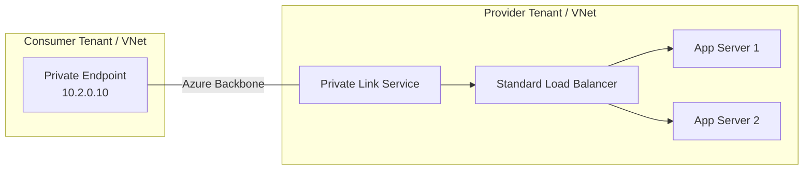

# How to Set Up Azure Private Link Service for Exposing Internal Applications to Other Tenants

Author: [nawazdhandala](https://www.github.com/nawazdhandala)

Tags: Azure, Private Link, Private Link Service, Multi-Tenant, Network Security, Load Balancer, PaaS

Description: A step-by-step guide to creating an Azure Private Link Service that exposes internal applications to consumers in other Azure tenants through private endpoints.

---

Azure Private Link Service lets you expose an application running behind a Standard Load Balancer to consumers in other Azure tenants - without any public internet exposure. The consumer creates a private endpoint in their own VNet, and traffic flows through the Azure backbone over a private connection. The consumer sees a private IP address in their network, and your application stays completely internal.

This is the pattern used by Azure PaaS services themselves (like Storage and SQL), and you can use it for your own applications. It is particularly useful for SaaS providers, shared services teams, and any scenario where you need to give external parties private network access to your service.

## How Private Link Service Works

The architecture involves two sides:

**Provider side (you):** You deploy your application behind a Standard Load Balancer. You create a Private Link Service resource that fronts the load balancer. You control who can connect through an approval workflow.

**Consumer side (them):** The consumer creates a private endpoint in their VNet that connects to your Private Link Service. They get a private IP address that routes to your application.



The connection is one-way. The consumer can reach your application, but you cannot initiate connections to the consumer's network. This is a security feature.

## Prerequisites

- A Standard Load Balancer (Basic LB is not supported)
- At least one backend pool member (VM, VMSS, etc.)
- A dedicated subnet for the Private Link Service NAT IPs
- Network Contributor role on the provider VNet

## Step 1: Prepare the Load Balancer

If you already have a Standard Load Balancer with your application behind it, skip to the next step. If not, set one up:

```bash
# Create a Standard Load Balancer
az network lb create \
  --name myAppLoadBalancer \
  --resource-group myResourceGroup \
  --sku Standard \
  --frontend-ip-name myFrontend \
  --backend-pool-name myBackendPool \
  --vnet-name myProviderVNet \
  --subnet myAppSubnet

# Create a health probe
az network lb probe create \
  --lb-name myAppLoadBalancer \
  --resource-group myResourceGroup \
  --name myHealthProbe \
  --protocol tcp \
  --port 443

# Create a load balancing rule
az network lb rule create \
  --lb-name myAppLoadBalancer \
  --resource-group myResourceGroup \
  --name myLBRule \
  --frontend-ip myFrontend \
  --backend-pool-name myBackendPool \
  --probe-name myHealthProbe \
  --protocol tcp \
  --frontend-port 443 \
  --backend-port 443
```

## Step 2: Create a Subnet for Private Link Service NAT

The Private Link Service needs a dedicated subnet for its NAT (Network Address Translation) IP addresses. These IPs are used to translate the consumer's private endpoint IP to an IP that your load balancer can receive.

```bash
# Create a dedicated subnet for Private Link Service
# Disable network policies on this subnet (required for PLS)
az network vnet subnet create \
  --name plsNatSubnet \
  --vnet-name myProviderVNet \
  --resource-group myResourceGroup \
  --address-prefixes 10.0.3.0/24 \
  --disable-private-link-service-network-policies true
```

The `--disable-private-link-service-network-policies` flag is important. Without it, the Private Link Service cannot be created in the subnet because NSG and UDR policies would interfere with the NAT process.

## Step 3: Create the Private Link Service

Now create the Private Link Service resource, pointing to the load balancer's frontend IP:

```bash
# Create the Private Link Service
az network private-link-service create \
  --name myPrivateLinkService \
  --resource-group myResourceGroup \
  --vnet-name myProviderVNet \
  --subnet plsNatSubnet \
  --lb-name myAppLoadBalancer \
  --lb-frontend-ip-configs myFrontend \
  --location eastus

# Get the Private Link Service's alias (consumers use this to connect)
az network private-link-service show \
  --name myPrivateLinkService \
  --resource-group myResourceGroup \
  --query "alias" --output tsv
```

The alias looks something like `myPrivateLinkService.{guid}.eastus.azure.privatelinkservice`. This is what you share with consumers so they can create their private endpoint connection.

## Step 4: Configure Access Control

By default, anyone with the alias can request a connection. You should restrict this. There are two approaches:

**Auto-approval for specific subscriptions:**

```bash
# Allow specific subscription IDs to auto-connect
az network private-link-service update \
  --name myPrivateLinkService \
  --resource-group myResourceGroup \
  --auto-approval "subscription-id-1 subscription-id-2"
```

**Visibility restrictions:**

```bash
# Only allow specific subscriptions to even see the service
az network private-link-service update \
  --name myPrivateLinkService \
  --resource-group myResourceGroup \
  --visibility "subscription-id-1 subscription-id-2"
```

For most scenarios, you want manual approval for unknown consumers and auto-approval for trusted partners:

```bash
# Configure visibility to all subscriptions but require manual approval
# except for trusted partner subscriptions
az network private-link-service update \
  --name myPrivateLinkService \
  --resource-group myResourceGroup \
  --visibility "*" \
  --auto-approval "trusted-partner-subscription-id"
```

## Step 5: Consumer Creates a Private Endpoint

On the consumer side, they create a private endpoint pointing to your Private Link Service. They can do this using the alias or the resource ID (if they have Reader access to your subscription).

```bash
# Consumer side: Create a private endpoint using the PLS alias
az network private-endpoint create \
  --name pe-to-provider-app \
  --resource-group consumerResourceGroup \
  --vnet-name consumerVNet \
  --subnet consumerSubnet \
  --private-connection-resource-id "/subscriptions/provider-sub/resourceGroups/provider-rg/providers/Microsoft.Network/privateLinkServices/myPrivateLinkService" \
  --connection-name "connection-to-contoso-app" \
  --request-message "Fabrikam requesting access to Contoso shared service"

# Or using the alias (no cross-subscription access needed)
az network private-endpoint create \
  --name pe-to-provider-app \
  --resource-group consumerResourceGroup \
  --vnet-name consumerVNet \
  --subnet consumerSubnet \
  --manual-request \
  --private-connection-resource-id "myPrivateLinkService.{guid}.eastus.azure.privatelinkservice" \
  --connection-name "connection-to-contoso-app" \
  --request-message "Fabrikam requesting access"
```

## Step 6: Approve the Connection

If the consumer's subscription is not in the auto-approval list, you need to manually approve the connection:

```bash
# List pending connection requests
az network private-link-service show \
  --name myPrivateLinkService \
  --resource-group myResourceGroup \
  --query "privateEndpointConnections[?properties.privateLinkServiceConnectionState.status=='Pending']" \
  --output table

# Approve a specific connection
az network private-link-service connection update \
  --name "connection-name-from-list" \
  --service-name myPrivateLinkService \
  --resource-group myResourceGroup \
  --connection-status Approved \
  --description "Approved for partner Fabrikam - ticket INFRA-1234"
```

After approval, the consumer's private endpoint becomes active and they can reach your application through the private IP address.

## Step 7: Configure DNS on the Consumer Side

The consumer needs to configure DNS so their applications can resolve a friendly name to the private endpoint IP. Since there is no standard private DNS zone for custom Private Link Services (unlike PaaS services), the consumer sets up DNS manually:

```bash
# Consumer side: Create a private DNS zone
az network private-dns zone create \
  --name "app.contoso.internal" \
  --resource-group consumerResourceGroup

# Link the DNS zone to the consumer VNet
az network private-dns link vnet create \
  --name "contoso-app-dns-link" \
  --resource-group consumerResourceGroup \
  --zone-name "app.contoso.internal" \
  --virtual-network consumerVNet \
  --registration-enabled false

# Get the private endpoint's IP address
PE_IP=$(az network private-endpoint show \
  --name pe-to-provider-app \
  --resource-group consumerResourceGroup \
  --query "customDnsConfigurations[0].ipAddresses[0]" --output tsv)

# Create an A record pointing to the private endpoint IP
az network private-dns record-set a add-record \
  --zone-name "app.contoso.internal" \
  --resource-group consumerResourceGroup \
  --record-set-name "api" \
  --ipv4-address $PE_IP
```

Now applications in the consumer VNet can reach the provider's application at `api.app.contoso.internal`.

## Monitoring Connections

Keep track of who is connected to your Private Link Service:

```bash
# List all connections to your Private Link Service
az network private-link-service show \
  --name myPrivateLinkService \
  --resource-group myResourceGroup \
  --query "privateEndpointConnections[].{Name:name, Status:properties.privateLinkServiceConnectionState.status, Description:properties.privateLinkServiceConnectionState.description}" \
  --output table
```

You can also reject or remove connections at any time:

```bash
# Reject a connection (if you decide to revoke access)
az network private-link-service connection update \
  --name "connection-name" \
  --service-name myPrivateLinkService \
  --resource-group myResourceGroup \
  --connection-status Rejected \
  --description "Access revoked per security review 2026-02"
```

## Scaling with Multiple NAT IPs

If you expect many consumer connections, you may need multiple NAT IP addresses. Each NAT IP supports up to 64,000 connections.

```bash
# Add additional NAT IPs to the Private Link Service
az network private-link-service update \
  --name myPrivateLinkService \
  --resource-group myResourceGroup \
  --ip-configs '[
    {"name": "natIp1", "privateIpAllocationMethod": "Dynamic", "subnet": {"id": "/subscriptions/.../subnets/plsNatSubnet"}, "primary": true},
    {"name": "natIp2", "privateIpAllocationMethod": "Dynamic", "subnet": {"id": "/subscriptions/.../subnets/plsNatSubnet"}, "primary": false}
  ]'
```

## Seeing the Consumer's Real IP (Proxy Protocol)

By default, your application sees the NAT IP as the source, not the consumer's actual private IP. If you need to see the consumer's IP (for logging or access control), enable the Proxy Protocol v2 on the Private Link Service:

```bash
# Enable Proxy Protocol v2
az network private-link-service update \
  --name myPrivateLinkService \
  --resource-group myResourceGroup \
  --enable-proxy-protocol true
```

Your application or load balancer must support Proxy Protocol v2 to parse the header. HAProxy, Nginx, and several other reverse proxies support it.

## Best Practices

- Always use manual approval for connections from unknown parties. Auto-approval is only for trusted, verified subscriptions.
- Include a description with every approval or rejection for audit purposes.
- Monitor connection counts and plan NAT IP capacity before you run out.
- Use a separate subnet for the PLS NAT IPs. Do not share it with application workloads.
- Document the alias and share it through a secure channel (not public documentation).
- Periodically review connections and remove any that are no longer needed.

## Summary

Azure Private Link Service lets you expose your internal applications to consumers in other tenants through private, backbone-only connections. Create a Standard Load Balancer, front it with a Private Link Service, control access through visibility and approval settings, and share the alias with your consumers. The result is a private, secure connection between tenants without any public internet exposure - the same pattern Azure uses for its own PaaS services.
