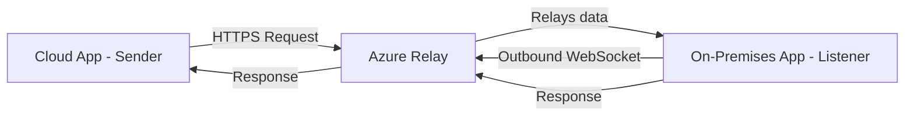

# How to Set Up Azure Relay Hybrid Connections for On-Premises Connectivity

Author: [nawazdhandala](https://www.github.com/nawazdhandala)

Tags: Azure, Relay, Hybrid Connections, On-Premises, Networking, Cloud, Connectivity

Description: Set up Azure Relay Hybrid Connections to securely connect your cloud applications to on-premises services without opening firewall ports.

---

Connecting cloud applications to on-premises systems is a problem that almost every enterprise faces. You have services running behind a corporate firewall that your cloud applications need to reach, but opening inbound firewall ports is a security concern. Azure Relay Hybrid Connections solves this by creating an outbound connection from your on-premises network to Azure, and then relaying traffic through that connection. No inbound ports, no VPN, no complex networking setup.

In this post, I will walk through setting up Azure Relay Hybrid Connections from scratch, including creating the relay namespace, writing both the listener (on-premises) and the sender (cloud), and handling common scenarios.

## How Hybrid Connections Work

The concept is straightforward. Your on-premises application opens an outbound WebSocket connection to Azure Relay. Your cloud application sends requests to Azure Relay. The relay service bridges the two connections, passing data between them.



The on-premises listener connects outward to Azure. This means:
- No inbound firewall ports need to be opened.
- The connection uses standard HTTPS (port 443), which is almost always allowed through firewalls.
- Traffic is encrypted in transit.
- Authentication uses Shared Access Signatures (SAS) or Azure AD.

## Step 1: Create the Relay Namespace and Hybrid Connection

```bash
# Create a resource group
az group create --name rg-relay-demo --location eastus

# Create a Relay namespace
az relay namespace create \
  --name my-relay-ns \
  --resource-group rg-relay-demo \
  --location eastus

# Create a Hybrid Connection within the namespace
az relay hyco create \
  --name my-hybrid-connection \
  --namespace-name my-relay-ns \
  --resource-group rg-relay-demo \
  --requires-client-authorization true
```

Now retrieve the connection strings. You need two: one for the listener (with Listen permission) and one for the sender (with Send permission).

```bash
# Create an authorization rule for the listener
az relay hyco authorization-rule create \
  --name listener-rule \
  --hybrid-connection-name my-hybrid-connection \
  --namespace-name my-relay-ns \
  --resource-group rg-relay-demo \
  --rights Listen

# Create an authorization rule for the sender
az relay hyco authorization-rule create \
  --name sender-rule \
  --hybrid-connection-name my-hybrid-connection \
  --namespace-name my-relay-ns \
  --resource-group rg-relay-demo \
  --rights Send

# Get the listener connection string
az relay hyco authorization-rule keys list \
  --name listener-rule \
  --hybrid-connection-name my-hybrid-connection \
  --namespace-name my-relay-ns \
  --resource-group rg-relay-demo \
  --query primaryConnectionString -o tsv

# Get the sender connection string
az relay hyco authorization-rule keys list \
  --name sender-rule \
  --hybrid-connection-name my-hybrid-connection \
  --namespace-name my-relay-ns \
  --resource-group rg-relay-demo \
  --query primaryConnectionString -o tsv
```

## Step 2: Build the On-Premises Listener

The listener runs on your on-premises server and maintains an outbound connection to Azure Relay. When a sender sends a request, the relay forwards it to the listener.

```javascript
// listener.js - On-premises Hybrid Connection listener
const { RelayedServer } = require('hyco-https');

const connectionString = process.env.RELAY_LISTENER_CONNECTION_STRING;
const hybridConnectionName = 'my-hybrid-connection';

// Parse the connection string to extract the namespace and key
function parseConnectionString(cs) {
  const parts = {};
  cs.split(';').forEach(part => {
    const [key, ...valueParts] = part.split('=');
    parts[key] = valueParts.join('=');
  });
  return parts;
}

const config = parseConnectionString(connectionString);
const ns = config['Endpoint'].replace('sb://', '').replace('/', '');
const keyName = config['SharedAccessKeyName'];
const key = config['SharedAccessKey'];

// Create the relayed HTTP server
const server = RelayedServer.createRelayedServer(
  {
    server: ns,
    path: hybridConnectionName,
    token: () => {
      // Generate a SAS token for authentication
      return RelayedServer.createRelayToken(
        `https://${ns}/${hybridConnectionName}`,
        keyName,
        key
      );
    }
  },
  (req, res) => {
    // Handle incoming requests just like a regular HTTP server
    console.log(`Received ${req.method} request for ${req.url}`);

    // Read the request body
    let body = '';
    req.on('data', chunk => { body += chunk; });
    req.on('end', () => {
      // Process the request
      console.log('Request body:', body);

      // You can call internal services here
      // For example, query a local database or call an internal API

      // Send a response back through the relay
      res.writeHead(200, { 'Content-Type': 'application/json' });
      res.end(JSON.stringify({
        message: 'Processed by on-premises server',
        timestamp: new Date().toISOString(),
        receivedData: body ? JSON.parse(body) : null
      }));
    });
  }
);

server.listen(() => {
  console.log('Hybrid Connection listener is running');
  console.log(`Listening on: ${ns}/${hybridConnectionName}`);
});

// Handle listener errors
server.on('error', (err) => {
  console.error('Listener error:', err);
});
```

## Step 3: Build the Cloud Sender

The sender is your cloud application that needs to reach the on-premises service. It sends HTTP requests to the Azure Relay endpoint.

```javascript
// sender.js - Cloud application that sends requests through the relay
const https = require('https');
const crypto = require('crypto');

const namespace = 'my-relay-ns.servicebus.windows.net';
const hybridConnectionName = 'my-hybrid-connection';
const keyName = 'sender-rule';
const key = process.env.RELAY_SENDER_KEY;

// Generate a SAS token for the sender
function createSasToken(uri, keyName, key, expiry) {
  const encoded = encodeURIComponent(uri);
  const ttl = Math.round(Date.now() / 1000) + (expiry || 3600);
  const signature = crypto
    .createHmac('sha256', key)
    .update(`${encoded}\n${ttl}`)
    .digest('base64');

  return `SharedAccessSignature sr=${encoded}&sig=${encodeURIComponent(signature)}&se=${ttl}&skn=${keyName}`;
}

// Send a request through the Hybrid Connection
async function sendRequest(method, path, data) {
  const uri = `https://${namespace}/${hybridConnectionName}${path}`;
  const token = createSasToken(uri, keyName, key);

  return new Promise((resolve, reject) => {
    const body = data ? JSON.stringify(data) : '';

    const options = {
      hostname: namespace,
      path: `/${hybridConnectionName}${path}`,
      method: method,
      headers: {
        'ServiceBusAuthorization': token,
        'Content-Type': 'application/json',
        'Content-Length': Buffer.byteLength(body)
      }
    };

    const req = https.request(options, (res) => {
      let responseBody = '';
      res.on('data', chunk => { responseBody += chunk; });
      res.on('end', () => {
        resolve({
          statusCode: res.statusCode,
          headers: res.headers,
          body: responseBody ? JSON.parse(responseBody) : null
        });
      });
    });

    req.on('error', reject);

    if (body) {
      req.write(body);
    }
    req.end();
  });
}

// Use it to reach on-premises services
async function main() {
  const result = await sendRequest('POST', '/api/data', {
    query: 'SELECT * FROM internal_table',
    limit: 10
  });

  console.log('Response from on-premises:', result);
}

main().catch(console.error);
```

## Step 4: Handle Reconnection

The outbound WebSocket connection from the listener can drop due to network issues, Azure maintenance, or other transient problems. Build in automatic reconnection.

```javascript
// resilient-listener.js - Listener with automatic reconnection
function startListener() {
  const server = RelayedServer.createRelayedServer(
    { /* config */ },
    requestHandler
  );

  server.listen(() => {
    console.log('Listener connected');
  });

  server.on('error', (err) => {
    console.error('Listener error:', err.message);
    // Reconnect after a delay
    setTimeout(() => {
      console.log('Attempting to reconnect...');
      startListener();
    }, 5000);
  });

  server.on('close', () => {
    console.log('Listener connection closed');
    setTimeout(() => {
      console.log('Reconnecting...');
      startListener();
    }, 5000);
  });
}

startListener();
```

## WebSocket Mode

In addition to the HTTP request/response model, Hybrid Connections support raw WebSocket connections for bidirectional communication.

```javascript
// websocket-listener.js - WebSocket-based Hybrid Connection listener
const { HybridConnectionsWebSocketServer } = require('hyco-ws');

const wss = new HybridConnectionsWebSocketServer({
  server: namespace,
  path: hybridConnectionName,
  token: tokenProvider
});

wss.on('connection', (ws) => {
  console.log('New WebSocket client connected through relay');

  ws.on('message', (message) => {
    console.log('Received:', message.toString());

    // Echo back or process the message
    ws.send(JSON.stringify({
      echo: message.toString(),
      processedAt: new Date().toISOString()
    }));
  });

  ws.on('close', () => {
    console.log('Client disconnected');
  });
});

wss.on('error', (err) => {
  console.error('WebSocket server error:', err);
});
```

## Performance Considerations

Hybrid Connections adds latency because traffic passes through the Azure relay. Here is what to expect:

- Each request adds roughly 10-50ms of latency for the relay hop, depending on the geographic distance between your on-premises network and the Azure region.
- Throughput is limited by the relay plan. The Standard plan supports up to 25 hybrid connections per namespace.
- For high-throughput scenarios, batch your requests rather than sending many small requests.

To minimize latency, choose an Azure region that is geographically close to your on-premises data center.

## Wrapping Up

Azure Relay Hybrid Connections provides a clean solution for connecting cloud applications to on-premises services without the complexity of VPNs or the security risk of opening firewall ports. The listener opens an outbound connection to Azure, the sender sends requests to the relay, and the service bridges the two. Set up is straightforward, and the HTTP request/response model means your cloud application interacts with on-premises services just like it would with any other HTTP API. For scenarios where you need secure, low-friction connectivity to services behind a firewall, Hybrid Connections is hard to beat.
