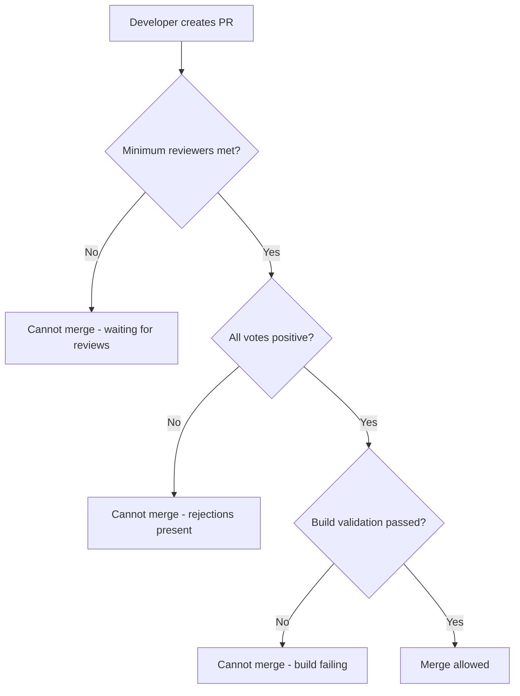

# How to Set Up Azure Repos Branch Protection Rules to Prevent Force Pushes to Main

Author: [nawazdhandala](https://www.github.com/nawazdhandala)

Tags: Azure Repos, Branch Protection, Git, Azure DevOps, Code Review, Security, CI/CD

Description: Configure branch policies in Azure Repos to protect your main branch from force pushes, require code reviews, and enforce build validation.

---

Your main branch is the foundation of your release pipeline. One accidental force push can rewrite history, break builds, and cause hours of cleanup. Azure Repos provides branch policies that prevent this kind of damage by enforcing rules around who can push, how changes get merged, and what checks must pass before code lands on protected branches.

This guide walks through setting up branch protection rules in Azure Repos, from basic force push prevention to a complete policy configuration that includes required reviewers, build validation, and status checks.

## Understanding Branch Policies in Azure Repos

Azure Repos uses a "branch policies" system rather than the "branch protection rules" terminology you might know from GitHub. The concepts are similar, but the implementation and configuration options differ.

When you enable any policy on a branch, Azure Repos automatically:

- Blocks direct pushes to the branch (including force pushes)
- Requires all changes to go through pull requests
- Enforces whatever specific policies you configure

This is a key point. In Azure Repos, you do not need a separate setting to block force pushes. Simply enabling any branch policy on a branch blocks direct pushes entirely.

## Step 1: Navigate to Branch Policies

Open your Azure DevOps project and go to Repos, then Branches. Find your main branch in the list, click the three dots menu on the right, and select "Branch policies."

You can also get there through Project Settings, then Repositories, then select your repo, then the Policies tab.

## Step 2: Enable Minimum Number of Reviewers

The first policy to enable is the minimum reviewer requirement. This ensures that at least one other person reviews every change before it merges.

Configuration options:

- **Minimum number of reviewers**: Set this to at least 1. For critical projects, 2 is better.
- **Allow requestors to approve their own changes**: Turn this off. Self-approval defeats the purpose of code review.
- **Prohibit the most recent pusher from approving their own changes**: Turn this on. This prevents someone from pushing a last-minute change and then approving it themselves.
- **Allow completion even if some reviewers vote "wait" or "reject"**: Keep this off for the main branch.
- **Reset code reviewer votes when there are new changes**: Turn this on. If someone pushes new commits to a PR after it has been approved, the approval should be re-evaluated.



## Step 3: Configure Build Validation

Build validation runs your CI pipeline on every PR targeting the protected branch. The PR cannot be completed until the build passes.

Click "Add build policy" and configure:

```
Build pipeline: Select your CI pipeline
Trigger: Automatic
Policy requirement: Required
Build expiration: 12 hours (or never, depending on your needs)
Display name: CI Build Validation
```

Here is what this looks like in a pipeline YAML that is designed to work as a build validation policy:

```yaml
# azure-pipelines-validation.yml
# This pipeline runs as a build validation policy on PRs to main
trigger: none  # Do not trigger on direct pushes

pr:
  branches:
    include:
      - main

pool:
  vmImage: 'ubuntu-latest'

steps:
  # Restore dependencies
  - task: DotNetCoreCLI@2
    inputs:
      command: 'restore'
      projects: '**/*.csproj'
    displayName: 'Restore packages'

  # Build the solution
  - task: DotNetCoreCLI@2
    inputs:
      command: 'build'
      arguments: '--no-restore --configuration Release'
    displayName: 'Build'

  # Run tests
  - task: DotNetCoreCLI@2
    inputs:
      command: 'test'
      arguments: '--no-build --configuration Release'
    displayName: 'Run tests'
```

## Step 4: Require Linked Work Items

If your team uses Azure Boards, you can require that every PR has at least one linked work item. This creates traceability between your code changes and the work that motivated them.

Enable "Check for linked work items" and set it to "Required."

## Step 5: Enforce Comment Resolution

This policy prevents PR completion when there are unresolved comments. Reviewers often leave comments that need to be addressed before merging, and this ensures those comments do not get ignored.

Set "Check for comment resolution" to "Required."

## Step 6: Limit Merge Types

Azure Repos supports several merge strategies:

- **Merge (no fast forward)**: Creates a merge commit. Good for preserving branch history.
- **Squash merge**: Combines all PR commits into a single commit. Keeps main branch history clean.
- **Rebase and fast-forward**: Replays commits on top of main. Linear history, no merge commits.
- **Rebase with merge commit**: Rebases first, then creates a merge commit.

For most teams, I recommend allowing only squash merge on the main branch. This keeps the commit history clean and makes reverts straightforward.

Under "Limit merge types," check only "Squash merge" and uncheck the rest.

## Step 7: Add Automatic Reviewers

For certain file paths, you might want specific people to automatically be added as reviewers. For example, changes to infrastructure code should always be reviewed by the platform team.

Click "Add automatic reviewers" and configure:

```
Reviewer: Platform Team (group) or specific users
Path filter: /infra/*
Policy requirement: Required
Minimum number of reviewers: 1
```

You can add multiple automatic reviewer policies for different paths:

- `/infra/*` - Platform team
- `/src/api/auth/*` - Security team
- `/*.csproj` or `/package.json` - Tech lead (for dependency changes)

## Configuring Permissions Beyond Policies

Branch policies cover the PR workflow, but you should also set repository-level permissions to lock things down further.

Go to Project Settings, then Repositories, then select your repo, then Security.

For the main branch specifically:

```
Contributors group:
  - Force push (rewrite history, delete branches): Deny
  - Bypass policies when completing pull requests: Not set (or Deny)
  - Bypass policies when pushing: Deny

Project Administrators:
  - Bypass policies when completing pull requests: Allow (for emergencies)
```

The "Bypass policies when pushing" permission is particularly dangerous. If someone has this permission, they can push directly to the protected branch, bypassing all policies. Only grant this in extreme cases.

## Using the Azure CLI to Configure Policies

If you prefer scripting your branch policies (which I recommend for consistency across repositories), you can use the Azure CLI:

```bash
# Enable minimum reviewer policy on the main branch
az repos policy approver-count create \
  --branch "main" \
  --repository-id "your-repo-id" \
  --project "your-project" \
  --organization "https://dev.azure.com/your-org" \
  --minimum-approver-count 2 \
  --creator-vote-counts false \
  --allow-downvotes false \
  --reset-on-source-push true \
  --blocking true \
  --enabled true

# Enable build validation policy
az repos policy build create \
  --branch "main" \
  --repository-id "your-repo-id" \
  --project "your-project" \
  --organization "https://dev.azure.com/your-org" \
  --build-definition-id 42 \
  --queue-on-source-update-only true \
  --manual-queue-only false \
  --display-name "CI Build Validation" \
  --valid-duration 720 \
  --blocking true \
  --enabled true

# Enable comment resolution requirement
az repos policy comment-required create \
  --branch "main" \
  --repository-id "your-repo-id" \
  --project "your-project" \
  --organization "https://dev.azure.com/your-org" \
  --blocking true \
  --enabled true
```

## Handling Emergency Fixes

Even with strict policies, you need an escape hatch for emergencies. Here is how to handle it without weakening your policies:

1. Grant "Bypass policies when completing pull requests" to a specific security group (e.g., "Emergency Responders").
2. Keep this group small - only senior engineers or on-call leads.
3. When someone uses the bypass, it is logged in the audit log. Review these regularly.
4. Never grant "Bypass policies when pushing" - even in emergencies, use a PR.

## Verifying Your Policies Work

After setting everything up, test it:

```bash
# Try to force push to main - this should fail
git push --force origin main
# Expected: remote rejected (TF402455: Pushes to this branch are not permitted)

# Try to push directly to main - this should also fail
git push origin main
# Expected: remote rejected
```

If either of these succeeds, check your policies and permissions. The most common issue is that the user has the "Bypass policies when pushing" permission set to "Allow."

## Wrapping Up

Branch protection in Azure Repos is not just about blocking force pushes. It is about establishing a workflow where every change to your main branch is reviewed, tested, and traceable. Start with the basics - minimum reviewers and build validation - and add more policies as your team matures. The CLI commands make it easy to apply consistent policies across multiple repositories, so once you have a good set of policies for one repo, you can script the same setup everywhere.
