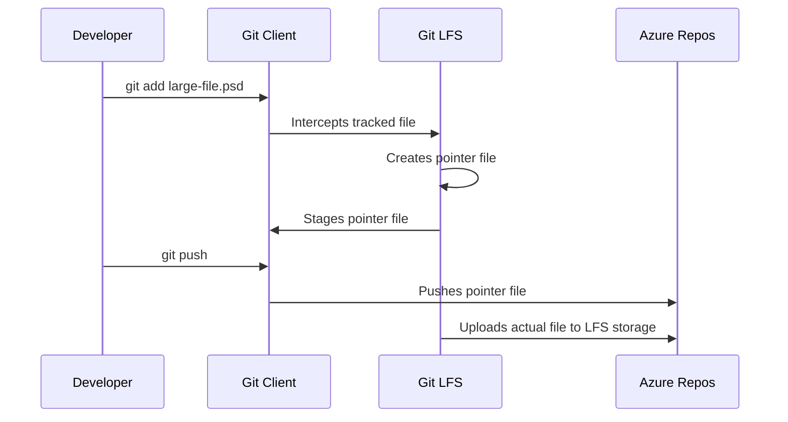

# How to Set Up Azure Repos Git LFS for Managing Large Binary Files in Repositories

Author: [nawazdhandala](https://www.github.com/nawazdhandala)

Tags: Azure Repos, Git LFS, Version Control, DevOps, Binary Files, Azure DevOps, Git

Description: A practical guide to configuring Git Large File Storage in Azure Repos for efficiently managing large binary files like images, models, and build artifacts.

---

Git was designed for tracking text files - source code, configuration, documentation. It works brilliantly for those. But throw large binary files into a Git repository and things go sideways fast. Every version of every binary gets stored in the repository history, clones take forever, and your repository size balloons to gigabytes. Game assets, machine learning models, design files, compiled binaries - these all cause problems in standard Git.

Git Large File Storage (LFS) solves this by replacing large files in your repository with small pointer files while storing the actual file content on a separate server. Azure Repos has built-in support for Git LFS, and setting it up is straightforward. Let me walk through the whole process.

## How Git LFS Works

When you track a file with Git LFS, here is what happens behind the scenes:

1. You tell Git LFS which file patterns to track (e.g., `*.psd`, `*.zip`, `*.bin`)
2. When you commit a tracked file, Git LFS replaces the file content with a small pointer file (about 130 bytes)
3. The actual file content gets uploaded to the LFS server (in this case, Azure Repos)
4. When someone clones or pulls, Git LFS downloads the actual file content for the current checkout

The pointer file looks like this:

```
version https://git-lfs.github.com/spec/v1
oid sha256:4d7a214614ab2935c943f9e0ff69d22eadbb8f32b1258daaa5e2ca24d17e2393
size 12345678
```

This means your repository stays small. Clones are fast because Git only downloads the pointer files initially. The actual large files are fetched on demand.



## Installing Git LFS

Git LFS is a separate extension that needs to be installed on each developer's machine. Here is how to install it on different platforms:

```bash
# macOS (using Homebrew)
brew install git-lfs

# Ubuntu/Debian
sudo apt-get install git-lfs

# Windows (using Chocolatey)
choco install git-lfs

# After installation, initialize Git LFS for your user account
# This only needs to be done once per machine
git lfs install
```

The `git lfs install` command sets up the necessary Git hooks in your global Git configuration. You only need to run it once.

## Setting Up Git LFS in Your Repository

Navigate to your repository and start tracking file patterns:

```bash
# Clone your Azure Repos repository
git clone https://dev.azure.com/myorg/myproject/_git/my-repo
cd my-repo

# Track specific file types with Git LFS
# Each command adds an entry to .gitattributes
git lfs track "*.psd"          # Photoshop files
git lfs track "*.png"          # Large images
git lfs track "*.zip"          # Archives
git lfs track "*.dll"          # Compiled libraries
git lfs track "*.so"           # Shared objects
git lfs track "*.bin"          # Binary data
git lfs track "*.model"        # ML model files
git lfs track "*.mp4"          # Video files
git lfs track "assets/**"      # Everything in the assets directory

# The .gitattributes file tracks what Git LFS manages
# Always commit this file so other developers get the same LFS configuration
git add .gitattributes
git commit -m "Configure Git LFS tracking for binary files"
git push
```

Let's look at what the `.gitattributes` file contains after these commands:

```
*.psd filter=lfs diff=lfs merge=lfs -text
*.png filter=lfs diff=lfs merge=lfs -text
*.zip filter=lfs diff=lfs merge=lfs -text
*.dll filter=lfs diff=lfs merge=lfs -text
*.so filter=lfs diff=lfs merge=lfs -text
*.bin filter=lfs diff=lfs merge=lfs -text
*.model filter=lfs diff=lfs merge=lfs -text
*.mp4 filter=lfs diff=lfs merge=lfs -text
assets/** filter=lfs diff=lfs merge=lfs -text
```

## Adding Large Files

Once tracking is configured, you add and commit files normally. Git LFS intercepts the operations transparently:

```bash
# Add a large binary file - Git LFS handles it automatically
cp ~/design-assets/hero-banner.psd .
git add hero-banner.psd
git commit -m "Add hero banner design file"

# Verify the file is being tracked by LFS (not stored directly in Git)
git lfs ls-files
# Output: 4d7a21461 * hero-banner.psd

# Push to Azure Repos - LFS uploads the file to LFS storage
git push
```

## Azure Repos LFS Configuration

Azure Repos supports Git LFS out of the box. There is no special server-side configuration needed. However, there are a few things to be aware of:

**Storage limits**: Azure DevOps provides 1 GB of free LFS storage per organization, with additional storage available through the Azure DevOps pricing plans. You can check your usage in Organization Settings under Billing.

**Authentication**: Git LFS uses the same authentication as your Git operations. If you are using credential helpers or SSH keys with Azure Repos, LFS will work with the same credentials.

**Bandwidth**: LFS files are downloaded over HTTPS. Large files and frequent downloads can add up, so be mindful of bandwidth usage in CI/CD pipelines.

## Working with LFS in Azure Pipelines

When your pipeline clones a repository with LFS files, you need to make sure LFS content is fetched. The checkout step in Azure Pipelines has built-in LFS support:

```yaml
# Azure Pipeline that handles Git LFS files during checkout
trigger:
  - main

pool:
  vmImage: 'ubuntu-latest'

steps:
  # Enable LFS during checkout to download actual file content
  - checkout: self
    lfs: true        # This tells the agent to fetch LFS files
    fetchDepth: 1    # Shallow clone for faster checkout

  # Now LFS files are available as regular files
  - script: |
      ls -la *.psd
      echo "LFS files are ready for processing"
    displayName: 'Verify LFS files'
```

If you do not need the actual LFS file content in your pipeline (for example, if you are only building source code), you can skip LFS fetch to speed up the checkout:

```yaml
steps:
  # Skip LFS fetch when you don't need binary files
  - checkout: self
    lfs: false
```

## Migrating Existing Files to LFS

If you already have large binary files committed directly in your repository, you can migrate them to LFS. This rewrites history, so coordinate with your team:

```bash
# First, check which files are consuming the most space
git rev-list --objects --all | \
  git cat-file --batch-check='%(objecttype) %(objectname) %(objectsize) %(rest)' | \
  sort -k3 -n -r | head -20

# Migrate existing tracked files to LFS
# This rewrites Git history to replace file content with LFS pointers
git lfs migrate import --include="*.psd,*.png,*.zip" --everything

# Force push the rewritten history
# WARNING: All team members will need to re-clone after this
git push --force
```

The `--everything` flag processes all branches and tags. After migration, the repository size will be dramatically smaller because the binary content has been moved to LFS storage.

## Useful Git LFS Commands

Here are the commands you will use regularly when working with LFS:

```bash
# List all files currently tracked by LFS
git lfs ls-files

# Show which patterns are being tracked
git lfs track

# Check LFS storage usage information
git lfs env

# Fetch LFS objects without checking out files (useful for pre-fetching)
git lfs fetch --all

# Pull LFS files for the current branch only
git lfs pull

# Prune old LFS files that are no longer referenced
# This frees up local disk space
git lfs prune

# Check the status of LFS files (pending uploads, etc.)
git lfs status

# Untrack a file pattern (stop managing with LFS going forward)
git lfs untrack "*.png"
```

## File Locking for Binary Files

Unlike text files, binary files cannot be merged. If two people edit the same PSD file, one person's changes will be lost. Git LFS supports file locking to prevent this:

```bash
# Lock a file before editing it
# This tells other developers that you are working on this file
git lfs lock "designs/hero-banner.psd"

# List all currently locked files in the repository
git lfs locks

# Unlock the file when you are done editing
git lfs unlock "designs/hero-banner.psd"

# Force unlock someone else's lock (requires appropriate permissions)
git lfs unlock "designs/hero-banner.psd" --force
```

You can also configure your repository to require locks for certain file types by adding the `lockable` attribute:

```
# .gitattributes - Make PSD files lockable
*.psd filter=lfs diff=lfs merge=lfs -text lockable
```

## Best Practices

**Track patterns, not individual files.** Use wildcard patterns in `.gitattributes` so new files of the same type are automatically tracked by LFS.

**Set up LFS before adding large files.** It is much easier to configure tracking first than to migrate files after the fact.

**Use shallow clones in CI/CD.** Set `fetchDepth: 1` in your pipeline checkout to avoid downloading LFS content for every commit in history.

**Prune regularly.** Run `git lfs prune` periodically to clean up old LFS objects from your local cache.

**Communicate before migrating.** If you need to run `git lfs migrate import`, coordinate with your team. History rewrites require everyone to re-clone.

**Monitor storage usage.** Keep an eye on your LFS storage consumption in Azure DevOps billing. Large teams with lots of binary assets can burn through storage quickly.

## Wrapping Up

Git LFS is the right tool when your repository needs to contain large binary files alongside source code. Azure Repos handles the server side automatically, and the client-side setup is a one-time task. The key is to plan your LFS tracking patterns early, commit the `.gitattributes` file, and make sure your pipeline is configured to fetch (or skip) LFS content as needed. With LFS in place, your repository stays lean and fast while still version-controlling those unavoidable large files.
