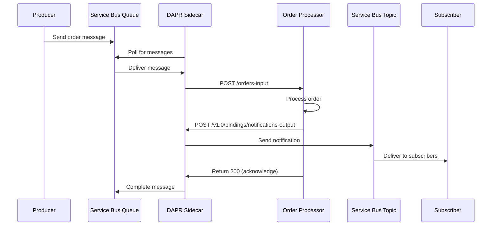

# How to Set Up Azure Service Bus Integration with AKS Pods Using DAPR Bindings

Author: [nawazdhandala](https://www.github.com/nawazdhandala)

Tags: AKS, Azure Service Bus, DAPR, Kubernetes, Messaging, Event-Driven, Microservices

Description: Complete guide to integrating Azure Service Bus with AKS pods using DAPR input and output bindings for event-driven architectures.

---

Connecting your Kubernetes services to Azure Service Bus usually means pulling in an SDK, managing connection strings, handling retries, and writing boilerplate for message serialization. DAPR bindings simplify this dramatically. With a DAPR binding component, your application just makes HTTP calls to receive messages from or send messages to Service Bus. No SDK, no connection string management in your code, and DAPR handles all the retry logic and error handling. In this post, I will walk through setting up both input bindings (receiving messages) and output bindings (sending messages) with Azure Service Bus on AKS.

## Input Bindings vs Output Bindings

DAPR bindings come in two flavors:

**Input bindings** trigger your application when an event occurs. For Service Bus, this means DAPR reads messages from a queue or topic subscription and sends them to your app via an HTTP POST request. Your app just needs to expose an endpoint.

**Output bindings** let your application send messages to Service Bus by making an HTTP POST to the DAPR sidecar. DAPR handles the connection, authentication, and delivery.

You can use both at the same time. For example, a service could receive orders from an input binding and publish notifications through an output binding.

## Prerequisites

You need an AKS cluster with DAPR installed, an Azure Service Bus namespace with a queue and/or topic, and a way to authenticate. I will use workload identity for authentication in this guide, but you can also use connection strings.

If you do not have DAPR installed yet, install it with Helm.

```bash
# Install DAPR on AKS
helm repo add dapr https://dapr.github.io/helm-charts/
helm repo update
helm install dapr dapr/dapr --namespace dapr-system --create-namespace --wait
```

## Step 1: Create Azure Service Bus Resources

Set up a Service Bus namespace with a queue for direct messaging and a topic for pub/sub messaging.

```bash
# Create a Service Bus namespace
az servicebus namespace create \
  --resource-group myResourceGroup \
  --name myservicebus \
  --location eastus \
  --sku Standard

# Create a queue for order processing
az servicebus queue create \
  --resource-group myResourceGroup \
  --namespace-name myservicebus \
  --name orders

# Create a topic for notifications
az servicebus topic create \
  --resource-group myResourceGroup \
  --namespace-name myservicebus \
  --name notifications

# Create a subscription for the notification topic
az servicebus topic subscription create \
  --resource-group myResourceGroup \
  --namespace-name myservicebus \
  --topic-name notifications \
  --name email-sub
```

## Step 2: Store the Connection String

For simplicity, I will start with a connection string stored in a Kubernetes secret. In production, use workload identity instead (covered in Step 7).

```bash
# Get the connection string
CONNECTION_STRING=$(az servicebus namespace authorization-rule keys list \
  --resource-group myResourceGroup \
  --namespace-name myservicebus \
  --name RootManageSharedAccessKey \
  --query primaryConnectionString -o tsv)

# Create a Kubernetes secret
kubectl create secret generic servicebus-secret \
  --from-literal=connectionString="$CONNECTION_STRING"
```

## Step 3: Create the Input Binding Component

This component configures DAPR to receive messages from the orders queue and deliver them to your application.

```yaml
# input-binding.yaml
# DAPR input binding - reads messages from Service Bus queue
apiVersion: dapr.io/v1alpha1
kind: Component
metadata:
  name: orders-input
  namespace: default
spec:
  type: bindings.azure.servicebusqueues
  version: v1
  metadata:
    # Connection string from the Kubernetes secret
    - name: connectionString
      secretKeyRef:
        name: servicebus-secret
        key: connectionString
    # The queue to read from
    - name: queueName
      value: "orders"
    # Maximum number of concurrent messages to process
    - name: maxConcurrentHandlers
      value: "10"
    # Maximum number of active messages to prefetch
    - name: prefetchCount
      value: "5"
    # How long to wait for a message before timing out
    - name: timeoutInSec
      value: "60"
    # Maximum number of delivery attempts before dead-lettering
    - name: maxDeliveryCount
      value: "5"
```

Apply it.

```bash
kubectl apply -f input-binding.yaml
```

## Step 4: Create the Output Binding Component

This component lets your application send messages to the notifications topic.

```yaml
# output-binding.yaml
# DAPR output binding - sends messages to Service Bus topic
apiVersion: dapr.io/v1alpha1
kind: Component
metadata:
  name: notifications-output
  namespace: default
spec:
  type: bindings.azure.servicebustopics
  version: v1
  metadata:
    - name: connectionString
      secretKeyRef:
        name: servicebus-secret
        key: connectionString
    # The topic to send messages to
    - name: topicName
      value: "notifications"
```

Apply it.

```bash
kubectl apply -f output-binding.yaml
```

## Step 5: Build the Application

Now build the application that uses these bindings. Here is a Node.js service that processes orders from the input binding and sends notifications through the output binding.

```javascript
// app.js
// Order processing service using DAPR bindings
const express = require('express');
const axios = require('axios');

const app = express();
app.use(express.json());

const DAPR_PORT = process.env.DAPR_HTTP_PORT || '3500';

// INPUT BINDING: DAPR calls this endpoint when a message arrives
// The endpoint name must match the binding component name
app.post('/orders-input', async (req, res) => {
  const order = req.body;
  console.log('Received order:', order);

  try {
    // Process the order (your business logic here)
    const result = await processOrder(order);

    // Send a notification through the output binding
    await sendNotification({
      orderId: order.id,
      status: 'processed',
      message: `Order ${order.id} has been processed successfully`
    });

    // Return 200 to acknowledge the message
    // DAPR will complete the message in Service Bus
    res.status(200).send();
  } catch (error) {
    console.error('Failed to process order:', error);
    // Return 500 to signal failure
    // DAPR will abandon the message for retry
    res.status(500).send();
  }
});

// OUTPUT BINDING: Send a message through DAPR
async function sendNotification(notification) {
  // POST to the DAPR sidecar's binding endpoint
  await axios.post(
    `http://localhost:${DAPR_PORT}/v1.0/bindings/notifications-output`,
    {
      // The message payload
      data: notification,
      // Binding-specific metadata
      metadata: {
        // Set a custom property on the Service Bus message
        'MessageId': notification.orderId,
        'ContentType': 'application/json'
      },
      // The operation to perform
      operation: 'create'
    }
  );
  console.log('Notification sent for order:', notification.orderId);
}

async function processOrder(order) {
  // Your order processing logic
  console.log(`Processing order ${order.id}: ${order.items} items`);
  return { success: true };
}

// Health check endpoint
app.get('/health', (req, res) => res.status(200).send('OK'));

app.listen(3000, () => {
  console.log('Order service listening on port 3000');
});
```

## Step 6: Deploy to AKS

Deploy the application with DAPR sidecar injection enabled.

```yaml
# deployment.yaml
# Order processing service with DAPR sidecar
apiVersion: apps/v1
kind: Deployment
metadata:
  name: order-processor
  namespace: default
spec:
  replicas: 3
  selector:
    matchLabels:
      app: order-processor
  template:
    metadata:
      labels:
        app: order-processor
      annotations:
        # Enable DAPR sidecar
        dapr.io/enabled: "true"
        dapr.io/app-id: "order-processor"
        dapr.io/app-port: "3000"
        dapr.io/app-protocol: "http"
    spec:
      containers:
        - name: order-processor
          image: myregistry.azurecr.io/order-processor:v1
          ports:
            - containerPort: 3000
          resources:
            requests:
              cpu: 100m
              memory: 128Mi
```

Apply the deployment.

```bash
kubectl apply -f deployment.yaml
```

## The Message Flow

Here is how messages flow through the system.



## Step 7: Use Workload Identity Instead of Connection Strings

For production, replace the connection string with workload identity authentication.

```yaml
# input-binding-wi.yaml
# DAPR binding using workload identity instead of connection strings
apiVersion: dapr.io/v1alpha1
kind: Component
metadata:
  name: orders-input
  namespace: default
spec:
  type: bindings.azure.servicebusqueues
  version: v1
  metadata:
    # Use the namespace name instead of connection string
    - name: namespaceName
      value: "myservicebus.servicebus.windows.net"
    - name: queueName
      value: "orders"
    # Tell DAPR to use Azure AD authentication
    - name: azureClientId
      value: "<managed-identity-client-id>"
    - name: maxConcurrentHandlers
      value: "10"
```

Make sure the managed identity has the Azure Service Bus Data Receiver role for input bindings and Azure Service Bus Data Sender role for output bindings.

## Step 8: Test the Integration

Send a test message to the Service Bus queue and verify your application processes it.

```bash
# Send a test message using Azure CLI
az servicebus queue send \
  --resource-group myResourceGroup \
  --namespace-name myservicebus \
  --name orders \
  --body '{"id": "test-001", "items": 3, "total": 59.99}'

# Check the application logs
kubectl logs -l app=order-processor -c order-processor --tail=20

# Check DAPR sidecar logs for binding activity
kubectl logs -l app=order-processor -c daprd --tail=20
```

## Error Handling and Dead Letters

When your application returns a non-200 status code, DAPR will abandon the message, making it available for retry. After the maximum delivery count is exceeded, Service Bus moves the message to the dead-letter queue.

Monitor the dead-letter queue for failed messages.

```bash
# Check dead-letter queue message count
az servicebus queue show \
  --resource-group myResourceGroup \
  --namespace-name myservicebus \
  --name orders \
  --query "countDetails.deadLetterMessageCount" -o tsv
```

## Production Tips

**Scale consumers with KEDA.** Instead of running a fixed number of replicas, use KEDA to scale based on the Service Bus queue length. When the queue is empty, scale to zero. When messages arrive, scale up.

**Set appropriate prefetch counts.** A higher prefetch count improves throughput but increases memory usage and can cause message lock expiration if processing is slow. Start with 5-10 and tune based on your processing speed.

**Monitor message age.** Track how long messages sit in the queue before being processed. If the average age is increasing, you need more consumers.

DAPR bindings make Azure Service Bus integration clean and simple. Your application code focuses entirely on business logic while DAPR handles all the messaging infrastructure concerns.
