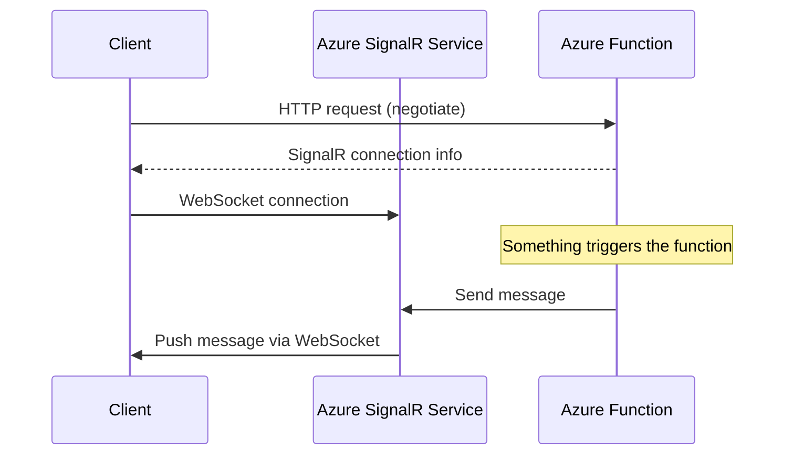

# How to Set Up Azure SignalR Service in Serverless Mode with Azure Functions

Author: [nawazdhandala](https://www.github.com/nawazdhandala)

Tags: Azure, SignalR, Serverless, Azure Functions, Real-Time, WebSockets

Description: A hands-on guide to setting up Azure SignalR Service in serverless mode with Azure Functions for real-time messaging without managing servers.

---

Azure SignalR Service in serverless mode is one of the cleanest ways to add real-time capabilities to an application without running a persistent server. Instead of hosting an ASP.NET Core app that maintains WebSocket connections, you let Azure SignalR Service handle all the connections while Azure Functions handle the business logic. When something happens (a database change, a timer, an HTTP request), your function sends a message through SignalR, and all connected clients receive it instantly.

In this post, I will walk through the complete setup: creating the SignalR Service, writing Azure Functions with SignalR bindings, connecting clients, and handling the patterns you will need in production.

## Architecture Overview

In serverless mode, the architecture has three components:

1. **Clients** (browsers, mobile apps): Connect to Azure SignalR Service directly via WebSockets
2. **Azure SignalR Service**: Manages all WebSocket connections, handles message routing
3. **Azure Functions**: Handle business logic and send messages through SignalR

The flow for sending a message looks like this:



The key insight is that the Azure Function does not maintain any persistent connections. It just sends messages to SignalR Service, which handles delivery to the right clients.

## Step 1: Create the Azure SignalR Service

In the Azure Portal, search for "SignalR Service" and create a new instance:

- **Resource name**: Choose a unique name
- **Region**: Same region as your Azure Functions
- **Pricing tier**: Free (20 connections, good for development) or Standard (for production)
- **Service mode**: Serverless

The service mode is critical. "Default" mode expects an ASP.NET Core hub server. "Serverless" mode works with Azure Functions. You can change the mode after creation, but connected clients will be disconnected.

After creation, go to "Keys" and copy the connection string. You will need it for your Azure Functions configuration.

## Step 2: Create the Azure Functions Project

Create a new Azure Functions project. I will use JavaScript/TypeScript, but C# and Python work too.

```bash
# Create a new Azure Functions project
func init signalr-demo --typescript
cd signalr-demo

# Install the SignalR extension
func extensions install --package Microsoft.Azure.WebJobs.Extensions.SignalRService --version 1.13.0
```

Add the SignalR connection string to your `local.settings.json`:

```json
{
    "IsEncrypted": false,
    "Values": {
        "AzureWebJobsStorage": "UseDevelopmentStorage=true",
        "FUNCTIONS_WORKER_RUNTIME": "node",
        "AzureSignalRConnectionString": "Endpoint=https://your-signalr.service.signalr.net;AccessKey=your-key;Version=1.0;"
    }
}
```

## Step 3: Create the Negotiate Function

Every SignalR client needs to call a "negotiate" endpoint to get connection information. This is an HTTP-triggered function that returns the SignalR Service URL and an access token.

Create a file `src/functions/negotiate.ts`:

```typescript
// Negotiate function: returns SignalR connection info to clients
// The SignalR input binding generates the connection details automatically
import { app, HttpRequest, HttpResponseInit, input, InvocationContext } from "@azure/functions";

const signalRInput = input.generic({
    type: "signalRConnectionInfo",
    name: "connectionInfo",
    hubName: "notifications",
    // Optionally bind the user ID from a header or query parameter
    // userId: "{headers.x-ms-client-principal-id}"
});

app.http("negotiate", {
    methods: ["POST"],
    authLevel: "anonymous",
    extraInputs: [signalRInput],
    handler: async (request: HttpRequest, context: InvocationContext): Promise<HttpResponseInit> => {
        const connectionInfo = context.extraInputs.get(signalRInput);
        return {
            jsonBody: connectionInfo
        };
    }
});
```

The `signalRConnectionInfo` input binding does the heavy lifting. It generates a JWT token scoped to the specified hub and returns the SignalR Service URL. The client uses this information to establish a WebSocket connection.

## Step 4: Create a Function That Sends Messages

Now create a function that sends messages to connected clients. This can be triggered by anything - HTTP, timer, queue, Event Grid, Cosmos DB change feed, etc.

Here is an HTTP-triggered example that broadcasts a message to all connected clients:

```typescript
// Broadcast function: sends a message to all connected clients
// The SignalR output binding handles the message delivery
import { app, HttpRequest, HttpResponseInit, output, InvocationContext } from "@azure/functions";

const signalROutput = output.generic({
    type: "signalR",
    name: "signalRMessages",
    hubName: "notifications"
});

app.http("broadcast", {
    methods: ["POST"],
    authLevel: "anonymous",
    extraOutputs: [signalROutput],
    handler: async (request: HttpRequest, context: InvocationContext): Promise<HttpResponseInit> => {
        const body = await request.json() as any;

        // Send to all connected clients
        context.extraOutputs.set(signalROutput, [{
            target: "newNotification",
            arguments: [body.message]
        }]);

        return {
            status: 200,
            jsonBody: { sent: true }
        };
    }
});
```

And a timer-triggered example that sends periodic updates:

```typescript
// Timer function: sends periodic status updates every 5 minutes
import { app, output, InvocationContext, Timer } from "@azure/functions";

const signalROutput = output.generic({
    type: "signalR",
    name: "signalRMessages",
    hubName: "notifications"
});

app.timer("statusUpdate", {
    schedule: "0 */5 * * * *",
    extraOutputs: [signalROutput],
    handler: async (myTimer: Timer, context: InvocationContext) => {
        // Fetch current system status (from a database, monitoring service, etc.)
        const status = {
            timestamp: new Date().toISOString(),
            servicesHealthy: true,
            activeUsers: Math.floor(Math.random() * 1000)
        };

        context.extraOutputs.set(signalROutput, [{
            target: "statusUpdate",
            arguments: [status]
        }]);

        context.log("Status update sent to all clients");
    }
});
```

## Step 5: Connect the Client

On the client side, use the SignalR JavaScript client library:

```html
<!-- Include the SignalR client library -->
<script src="https://cdn.jsdelivr.net/npm/@microsoft/signalr/dist/browser/signalr.min.js"></script>
```

```javascript
// Connect to Azure SignalR Service through the negotiate endpoint
// The client automatically calls /api/negotiate to get connection details
const connection = new signalR.HubConnectionBuilder()
    .withUrl("/api")  // Points to your Functions app URL
    .withAutomaticReconnect()
    .configureLogging(signalR.LogLevel.Information)
    .build();

// Handle incoming messages
connection.on("newNotification", (message) => {
    console.log("Received notification:", message);
    // Update your UI here
    const notificationDiv = document.getElementById("notifications");
    notificationDiv.innerHTML += `<p>${message}</p>`;
});

connection.on("statusUpdate", (status) => {
    console.log("Status update:", status);
    document.getElementById("status").textContent =
        `Active users: ${status.activeUsers} | Last updated: ${status.timestamp}`;
});

// Start the connection
connection.start()
    .then(() => console.log("Connected to SignalR"))
    .catch(err => console.error("Connection failed:", err));

// Handle disconnection
connection.onclose(() => {
    console.log("Disconnected from SignalR");
});
```

The client calls your negotiate function to get the SignalR Service URL and token, then connects directly to SignalR Service via WebSocket. Your Azure Functions are not involved in the persistent connection at all.

## Sending to Specific Users

To send messages to specific users rather than broadcasting, include a user ID in the negotiate function and target that user in your output:

```typescript
// Send a message to a specific user by their user ID
context.extraOutputs.set(signalROutput, [{
    target: "personalNotification",
    userId: "user123",
    arguments: ["You have a new order!"]
}]);
```

The user ID must match the one used during negotiation. In the negotiate function, set the `userId` property on the SignalR connection info input binding.

## Sending to Groups

Groups let you segment your connected clients:

```typescript
// Add a user to a group
context.extraOutputs.set(signalROutput, [{
    actionName: "add",
    userId: "user123",
    groupName: "premium-users"
}]);

// Send a message to all users in a group
context.extraOutputs.set(signalROutput, [{
    target: "groupMessage",
    groupName: "premium-users",
    arguments: ["Exclusive content available!"]
}]);
```

## Error Handling and Reconnection

In production, connections will drop. The `withAutomaticReconnect()` method on the client handles most cases, but you should also handle the scenario where reconnection fails:

```javascript
// Handle reconnection events
connection.onreconnecting((error) => {
    console.warn("Reconnecting...", error);
    // Show a "reconnecting" indicator in the UI
});

connection.onreconnected((connectionId) => {
    console.log("Reconnected with ID:", connectionId);
    // Re-subscribe to any groups or refresh data
});

connection.onclose((error) => {
    console.error("Connection closed permanently:", error);
    // Show an error state and offer a manual reconnect button
});
```

## Scaling Considerations

Azure SignalR Service handles connection scaling automatically. The Standard tier supports up to 1,000 concurrent connections per unit, and you can add units for more capacity.

Azure Functions in the Consumption plan scale automatically based on trigger volume. However, there is a cold start penalty. For latency-sensitive real-time scenarios, consider the Premium or Dedicated plan for your Functions app.

## Summary

Azure SignalR Service in serverless mode with Azure Functions gives you real-time messaging without any persistent infrastructure to manage. The negotiate function provides connection info, SignalR Service manages the WebSocket connections, and your functions send messages through output bindings. This architecture scales from zero to thousands of connections automatically and you only pay for what you use. Start with the negotiate and broadcast pattern, then add user-targeted and group messaging as your application grows.
