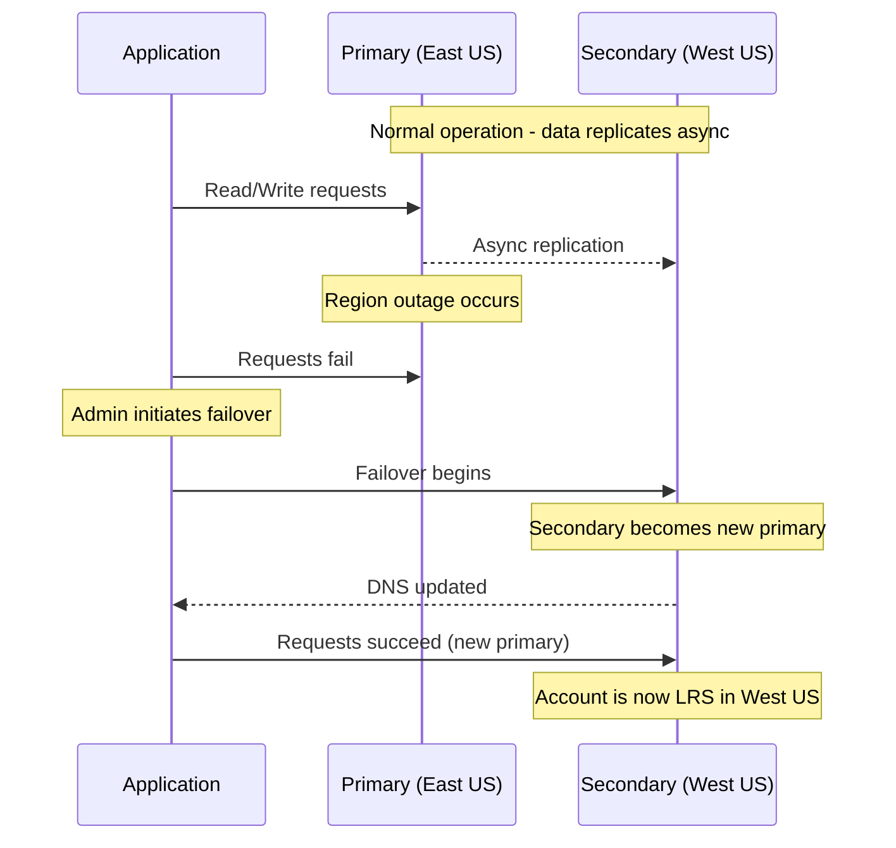

# How to Set Up Azure Storage Account Failover for Disaster Recovery

Author: [nawazdhandala](https://www.github.com/nawazdhandala)

Tags: Azure, Storage Account, Disaster Recovery, Failover, Geo-Replication, GRS, Business Continuity

Description: Learn how to configure and initiate Azure Storage account failover for disaster recovery using geo-redundant storage replication.

---

When an Azure region goes down, your storage account goes with it - unless you have planned for it. Azure Storage provides geo-redundant replication that copies your data to a secondary region hundreds of miles away. If the primary region becomes unavailable, you can fail over to the secondary region and continue operations.

This guide covers how to set up geo-redundant storage, initiate failover, and understand the trade-offs involved.

## Understanding Geo-Redundancy Options

Azure Storage offers several redundancy options. For disaster recovery with failover capability, you need one of the geo-redundant options:

| Redundancy | Copies | Regions | Failover Support |
|-----------|--------|---------|-----------------|
| LRS | 3 | 1 | No |
| ZRS | 3 | 1 (3 zones) | No |
| GRS | 6 | 2 | Yes |
| GZRS | 6 | 2 (3 zones primary) | Yes |
| RA-GRS | 6 | 2 | Yes + read access |
| RA-GZRS | 6 | 2 (3 zones primary) | Yes + read access |

GRS replicates data to a paired region (for example, East US pairs with West US). GZRS adds zone redundancy in the primary region. The "RA" prefix means read-access, allowing you to read from the secondary region without initiating a failover.

For most production workloads, RA-GZRS provides the best protection: zone redundancy in the primary region, geo-replication to the secondary, and read access to the secondary for applications that can tolerate stale data.

## Step 1: Create a Geo-Redundant Storage Account

If you are creating a new storage account, specify geo-redundant replication from the start:

```bash
# Create a storage account with RA-GZRS redundancy
az storage account create \
  --name stdrprod2026 \
  --resource-group rg-dr \
  --location eastus2 \
  --sku Standard_RAGZRS \
  --kind StorageV2 \
  --min-tls-version TLS1_2 \
  --allow-blob-public-access false
```

If you have an existing storage account, you can change its redundancy level. Note that changing from LRS to GRS requires the data to be fully replicated, which can take time:

```bash
# Change an existing account from LRS to GRS
az storage account update \
  --name stexisting2026 \
  --resource-group rg-app \
  --sku Standard_GRS
```

## Step 2: Verify Replication Status

After setting up geo-replication, check the replication status to ensure data is syncing:

```bash
# Check geo-replication status
az storage account show \
  --name stdrprod2026 \
  --resource-group rg-dr \
  --query "{primaryLocation:primaryLocation, secondaryLocation:secondaryLocation, statusOfSecondary:statusOfSecondary, lastSyncTime:geoReplicationStats.lastSyncTime}" \
  --output json
```

The key field here is `lastSyncTime`. This tells you the last time data was successfully replicated to the secondary region. Any data written after this timestamp has not yet been replicated and would be lost in a failover.

This is your Recovery Point Objective (RPO). Azure targets an RPO of less than 15 minutes for geo-replication, but it is not guaranteed.

## Step 3: Understand What Happens During Failover

When you initiate a failover, several things happen:

1. The secondary region becomes the new primary
2. DNS records for your storage account are updated to point to the new primary
3. The storage account SKU changes from GRS to LRS (geo-replication is removed)
4. Data written after the last sync time is lost

The following diagram shows the failover process:



After failover, your storage account is running in the secondary region as LRS. You should then set up geo-replication again to protect against future outages:

```bash
# After failover, restore geo-redundancy
az storage account update \
  --name stdrprod2026 \
  --resource-group rg-dr \
  --sku Standard_GRS
```

## Step 4: Initiate a Planned Failover (Testing)

Azure supports customer-managed failover, which you can initiate manually. This is how you test your DR plan:

```bash
# Initiate storage account failover
# WARNING: This has real impact - data after last sync is lost
az storage account failover \
  --name stdrprod2026 \
  --resource-group rg-dr \
  --no-wait
```

The `--no-wait` flag makes the command return immediately. Failover can take up to an hour.

Monitor the failover progress:

```bash
# Check failover status
az storage account show \
  --name stdrprod2026 \
  --resource-group rg-dr \
  --query "{provisioningState:provisioningState, primaryLocation:primaryLocation, failoverInProgress:failoverInProgress}" \
  --output json
```

## Step 5: Design Your Application for Failover

Your application needs to handle failover gracefully. Here are the key design patterns:

**Retry logic with circuit breaker**: When the primary region is down, requests will fail. Your application should retry with exponential backoff and eventually switch to the secondary endpoint (if using RA-GRS/RA-GZRS).

Here is a Python example using the Azure SDK's built-in retry with secondary endpoint:

```python
from azure.storage.blob import BlobServiceClient
from azure.core.pipeline.policies import RetryPolicy

# Configure retry policy to use secondary endpoint
# The SDK automatically retries on the secondary for RA-GRS accounts
retry_policy = RetryPolicy(
    retry_total=5,
    retry_backoff_factor=1,
    retry_mode="exponential",
    retry_on_status_codes=[500, 502, 503, 504]
)

# Connect with retry policy
blob_service = BlobServiceClient(
    account_url="https://stdrprod2026.blob.core.windows.net",
    credential=credential,
    retry_policy=retry_policy
)

# For RA-GRS, you can also read directly from secondary
# Secondary URL format: https://stdrprod2026-secondary.blob.core.windows.net
secondary_service = BlobServiceClient(
    account_url="https://stdrprod2026-secondary.blob.core.windows.net",
    credential=credential
)
```

**Handle stale reads from secondary**: Data on the secondary may be up to 15 minutes behind. Your application should handle this - for example, by displaying a banner to users that they are reading from a replica.

**DNS propagation**: After failover, DNS updates may take a few minutes to propagate. Applications using connection strings that reference the account name will automatically use the new primary after DNS updates.

## Step 6: Automate Failover Decisions

For automated failover, you can use Azure Monitor alerts combined with an Azure Function or Logic App.

The basic logic is:

1. Monitor the storage account's availability metric
2. If availability drops below a threshold for a sustained period, trigger an alert
3. The alert runs an automation runbook that checks replication lag
4. If the lag is acceptable, initiate failover

Here is a simplified Azure Function that checks availability and initiates failover:

```python
import azure.functions as func
from azure.mgmt.storage import StorageManagementClient
from azure.identity import DefaultAzureCredential

def main(req: func.HttpRequest) -> func.HttpResponse:
    """Evaluate and potentially initiate storage failover"""

    credential = DefaultAzureCredential()
    storage_client = StorageManagementClient(credential, subscription_id)

    # Get the storage account status
    account = storage_client.storage_accounts.get_properties(
        "rg-dr", "stdrprod2026",
        expand="geoReplicationStats"
    )

    # Check if secondary is available
    geo_stats = account.geo_replication_stats
    if geo_stats.status != "Live":
        return func.HttpResponse("Secondary is not available for failover", status_code=400)

    # Check replication lag
    last_sync = geo_stats.last_sync_time
    # Only proceed if lag is less than 15 minutes
    # (to minimize data loss)

    # Initiate failover
    storage_client.storage_accounts.begin_failover(
        "rg-dr", "stdrprod2026"
    )

    return func.HttpResponse("Failover initiated", status_code=200)
```

## Step 7: Post-Failover Checklist

After a failover completes, run through this checklist:

1. Verify data integrity in the new primary
2. Update any hardcoded endpoint URLs if applicable
3. Re-enable geo-replication to a new secondary region
4. Test read and write operations from all connected applications
5. Check that CDN endpoints, SAS tokens, and access policies still work
6. Update your DR runbook with lessons learned
7. Monitor the new primary for performance issues during the stabilization period

## Cost Implications

Geo-redundant storage costs roughly twice as much as locally redundant storage because you are maintaining two copies of your data. For RA-GRS/RA-GZRS, there is an additional small charge for reads from the secondary endpoint.

However, this is typically money well spent for production data. The cost of downtime and data loss almost always exceeds the incremental cost of geo-replication.

| SKU | Cost multiplier vs LRS | Failover capability |
|-----|----------------------|-------------------|
| LRS | 1x | None |
| GRS | ~2x | Manual failover |
| RA-GRS | ~2.1x | Manual failover + secondary reads |
| GZRS | ~2.2x | Manual failover + zone protection |
| RA-GZRS | ~2.3x | Full DR capability |

## Wrapping Up

Azure Storage account failover provides a solid disaster recovery mechanism for your data. The key is to understand the trade-offs: failover is not instant, there will be some data loss (up to 15 minutes of writes), and the account drops to LRS until you reconfigure geo-replication. Design your applications to handle these scenarios, test failover regularly, and automate the decision-making process where possible. With proper planning, a regional storage outage becomes a manageable event rather than a crisis.
